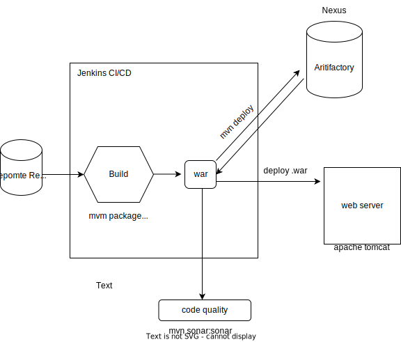

## SONATYPE 

- Sonatype Nexus is a repository manager used for managing software components. 
- It provides a centralized repository to store and manage binary components, such as libraries and dependencies, used in the development of software projects. 
- it helps organizations manage and organize their artifacts, ensuring that they are easily accessible, versioned, and can be retrieved when needed.

### Artifact Repository/Artifactory:
An Artifact Repository Manager is a software tool that helps manage and organize the storage and retrieval of software artifacts. It serves as a centralized location where developers can store, share, and manage software components such as libraries, frameworks, binaries, and other build artifacts.  
Key features of an Artifact Repository Manager include:

    1. Artifact Storage     : It provides a repository to store software artifacts in a structured manner. This can include libraries, binaries, documentation, container images, and other components needed for software development and deployment.
    2. Dependency Management: It helps manage dependencies between software components. Developers can define and retrieve dependencies from the repository, ensuring consistent and reliable access to required components.
    3. Version Control      : An Artifact Repository Manager maintains versioning information for artifacts, allowing developers to retrieve specific versions of components and track changes over time.
    4. Access Control       : It provides authentication and authorization mechanisms to control access to artifacts. This ensures that only authorized individuals or systems can retrieve and publish artifacts.
    5. Proxying and Caching : Artifact Repository Managers can act as a proxy server for external repositories, reducing external dependencies and improving build speed by caching artifacts locally.

- Public Artifact Repositories are Maven, JCenter , Ivy ..etc
- Private Artifact Repositories are Nexus, JFrog, Apache Archiva ..etc

#### Where it is used ?
- If Organizations wants to share libraries (like JAR files) among multiple developers for a project development, then Nexus is used. 
- Once applications are developed in build process CI/CD tools like Jenkins stores build outputs (JAR/WAR) inside Nexus Artifact Repository. 

there are 2 types of repositories in Nexus
1. snapshot
2. release

- "snapshot" and "release" repositories are commonly used to differentiate between different types of artifacts and their lifecycle stages.  
Here's an explanation of snapshot and release repositories:

#### Snapshot Repository:
- A snapshot repository is used to store artifacts that are under active development and subject to frequent changes.
- Snapshots are versions of artifacts that are still in-progress, not yet considered stable or finalized.
- Snapshot artifacts typically have version numbers with a suffix like "-SNAPSHOT" to indicate their status.
- Developers often publish and consume snapshot artifacts during the development and testing phases of a project.
- this repositories are usually used for fast iteration and collaboration among developers.
- eg : MTicketApp-1.2-**SNAPSHOT**.war , MTicketApp-1.3-**SNAPSHOT**.war , MTicketApp-1.4-**SNAPSHOT**.war
#### Release Repository:
- A release repository is used to store stable and finalized versions of artifacts.
- Release artifacts are considered to be in a production-ready state and are intended for use in deployed applications or projects.
- Release artifacts typically have version numbers without the "-SNAPSHOT" suffix.
- Release repositories are usually used for long-term storage, ensuring the stability and availability of dependencies for production environments.
- eg MTicketApp-1.4-**RELEASE**.war

### Why to maintain two repository types?
- **Dependency Management**: By keeping snapshot and release artifacts separate, developers can ensure that their projects only consume stable and tested versions of dependencies when in production. Snapshots can be used during development and testing to take advantage of the latest changes and bug fixes.
- **Caching and Performance**: Separating snapshot and release repositories allows for different caching and update strategies. Snapshots may have shorter cache durations and more frequent updates, while releases can be cached for longer periods to reduce external network dependencies and improve build performance.
- **Promoting Stability** : Requiring a deliberate promotion process from snapshot to release helps enforce quality control and ensures that only stable and approved versions are used in production environments.

