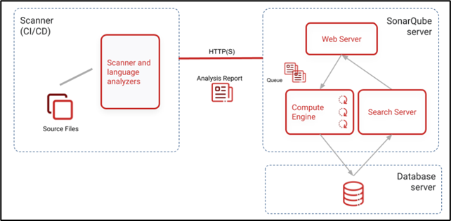

# SonarQube

- SonarQube is an open-source platform used for continuous code quality management. 
- It provides a set of powerful tools and features to analyze, measure, and monitor the quality of source code. 
- SonarQube helps developers and development teams to identify and address issues related to code quality, code duplication, security vulnerabilities, and adherence to coding standards.

### Key features of SonarQube:
#### 1.	Code Quality Analysis
SonarQube performs static code analysis to identify bugs, code smells, and vulnerabilities. It analyzes various programming languages such as Java, C/C++, C#, JavaScript, Python, and more.
#### 2.	Code Metrics and Statistics:
SonarQube collects and presents metrics and statistics related to code quality, including code complexity, code duplication, test coverage, and maintainability.
#### 3.	Continuous Inspection
SonarQube integrates with development tools and build systems, allowing it to perform code analysis automatically during the development process. It provides feedback to developers in real-time, helping them identify and fix issues early on.
#### 4.	Security Vulnerability Detection
SonarQube includes security plugins that can identify and report common security vulnerabilities in the code, such as SQL injections, cross-site scripting (XSS), and insecure cryptographic algorithms.
#### 5.	Customizable Quality Profiles
SonarQube allows you to define and customize quality profiles to enforce coding standards and best practices specific to your project or organization.
#### 6.	Integration with CI/CD Pipelines
SonarQube integrates seamlessly with continuous integration and continuous delivery (CI/CD) pipelines. It can be incorporated into build processes to automatically analyze code and provide quality reports as part of the build pipeline.
#### 7.	Issue Tracking and Management
SonarQube provides a dashboard and issue tracker to manage identified code issues. It allows developers and teams to prioritize, assign, and track the progress of fixing code quality issues.
By utilizing SonarQube, development teams can maintain high code quality standards, improve software reliability, reduce technical debt, and enhance overall maintainability of their codebase.

### Code Coverage & Code Review:
- Code Coverage: How many lines of source code is tested by unit test cases
Note: Industry standard Code Coverage is 80 %
- Code Review: Checking Coding Conventions / Standards

note:

    - the code review report is generated in html format / pdf format 
    - It is a web based tool and it supports 25+ Programming Languages
    - It will support multi OS platform.
    - It will support multiple databases (MySQL, Oracle, SQL Server, PostGres SQL...).
    - It supports multiple browsers.

#### CodeQuality / Standard Code:

- How Quality standards are decided?  
Inside Sonarqube, Developer creates rules to validate code.

- What is Code Coverage / Test Coverage?  
In Developer code certain benchmark (ex: 80%) must be tested
   by developer using Test Framework (JUnit + Mockito..etc)

#### Functions of sonarqube
- Duplicate Code: Check full code and provide duplicates to developer to modify
- Coding Standards: Applies All rules set and provides a detailed report
- Unit Tests: Executes JUnit Test cases written by developers.
- Code Coverage: Display how much percent of code is tested.
- Complex Code: Reads existed code, shows better way of writing it.
- Commented Code: Validates comments written in code
- Potential Bugs: Checks how many bugs exist in application.

### Sonarqube Architecture

SonarQube follows a client-server architecture, where the SonarQube server acts as the central component responsible for code analysis and reporting, and the clients or analysis tools interact with the server to submit code for analysis and retrieve analysis results. Here is an overview of the SonarQube architecture:
1.	SonarQube Server:
The SonarQube server is the core component of the architecture. It is responsible for coordinating the code analysis process, storing analysis results, managing plugins, and serving the web-based user interface. The server communicates with the underlying database and provides REST APIs for clients to interact with.

2.	Analysis Clients:
Analysis clients are tools or plugins that interact with the SonarQube server to submit code for analysis. They perform the code analysis locally or within the build environment and send the analysis data to the SonarQube server. Some common analysis clients include SonarScanner (official command-line tool), build system plugins (e.g., Maven, Gradle), and integrated development environment (IDE) plugins (e.g., SonarLint).

3.	SonarQube Database:
SonarQube utilizes a relational database to store the analysis results and configuration data. By default, it uses an embedded database (H2) for evaluation or small setups, but for production environments, it is recommended to use an external database such as PostgreSQL, MySQL, or Oracle.

4.	Web Interface and Reporting:
The SonarQube server provides a web-based user interface that allows users to view analysis results, metrics, and reports. It offers dashboards, project overviews, code issue listings, trend charts, and other visualizations to help users understand and improve code quality.

- Summary : 
    - is a client server arch
    - client is sonar scanner
    - server is sonarqube server
    - communicates with https protocol
    - scanner takes the code , talks to the server for the rules , validates and the gives the results
    - the sonar scanner is installed on the same machine where the code is present and the sonarqube server is installed in another machine
    - if we are using jenkins,then we only need to install the plugin "sonar scanner" which will handle the scanner activities and it can connect to sonar server machine as well
    - if you hant to run sonar scanner in the loal/developer machine , we use SonarLint plugin for intellij/eclipse
    - basically scanner is a s/w that will connect to sonarqube server to validate the code with the rules and provides the result
    - the db server is used to store the analysis, results , reports of the scanning
    - this db is connected to the sonarqube

