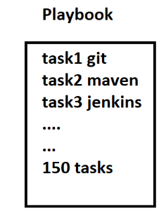
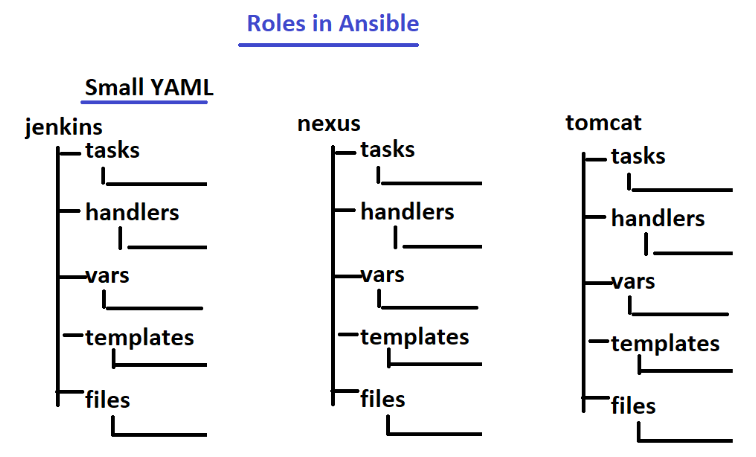

# Tags
Tags are labels that you can assign to tasks, making it possible to selectively run or skip specific tasks when executing a playbook. 

Tags are useful when you want to focus on specific parts of your playbook during development, testing, or maintenance.

Here's how you can use tags in your playbook:

- Assigning Tags to Tasks
    ```yaml
    ---
    - name: Example Playbook with Tags
    hosts: localhost
    tasks:
        - name: Task 1
        debug:
            msg: "This is task 1"
        tags:
            - debug_output

        - name: Task 2
        debug:
            msg: "This is task 2"
    ```
    In this example, "Task 1" has been assigned the tag debug_output.

- commands
    ```bash
    # list all tags
    ansible-playbook your_playbook.yml --list-tags

    # Running Tasks with Specific Tags
    ansible-playbook your_playbook.yml --tags debug_output

    # selecting multiple tags
    ansible-playbook your_playbook.yml --tags "tag1,tag2"

    #Excluding Tasks with Specific Tags
    ansible-playbook your_playbook.yml --skip-tags debug_output

    # To debug and see which tags are being applied during playbook execution
    ansible-playbook your_playbook.yml --tags "tag" -v
    ```

# Handlers & Notify
- Handlers are special tasks that are only executed when notified by other tasks. They are typically used to perform actions such as restarting a service or reloading a configuration file when a change requires it.
- The notify keyword is used within a task to specify which handler should be triggered if that task makes changes. When a task specifies notify: Some Handler, it means that if the task result changes, the associated handler (Some Handler in this case) will be triggered.

Example
```yaml
---
- name: install and start httpd
  hosts: all
  become: true

  tasks:
    - name: install httpd
      yum:
        name: httpd
        state: present
      notify: start httpd service

  handlers:
    - name: start httpd service
      service:
        name: httpd
        state: started
```
Explaination

 - Notify Keyword:

    The notify: start httpd service line indicates that if the task "install httpd" makes any changes (e.g., installs the httpd package), it should notify the handler named "start httpd service."
- Handlers Section:

    The handlers section defines a handler named "start httpd service."
    This handler uses the service module to start the httpd service (name: httpd, state: started).

- How It Works:

    When the task "install httpd" makes changes (installs the httpd package), it triggers the handler "start httpd service" because of the notify keyword.
    At the end of the playbook, Ansible checks for any pending handlers and runs them. In this case, it starts the httpd service.

- Usage Scenario:

    This playbook is useful when you want to ensure that the Apache HTTP server (httpd) is installed and started on all hosts. If the package installation task makes changes, it triggers the handler to start the service.

Note:
Handlers are a way to link tasks and actions that should be taken in response to changes during playbook execution.
Using handlers with notify helps organize and control the order of tasks, especially when one task depends on the result of another.

Another example
```yaml
---
- name: httpd setup
  hosts: all
  become: true

  tasks:
    - name: install httpd
      yum:
        name: httpd
        state: present
      notify: start httpd
    - name: copy index.html
      copy:
        src: index.html
        dest: /var/www/html/index.html
      notify: restart httpd
  handlers:
    - name: start httpd
      service:
        name: httpd
        state: started
    - name: restart httpd
      service:
        name: httpd
        state: restarted
```
- When Handlers Are Run:
    - Notification Occurs: A task in the playbook notifies a specific handler using the notify keyword.
    Example: notify: restart httpd
    - Task Makes Changes: The notifying task must make changes to the system during playbook execution.
    Changes can include installing packages, modifying configuration files, etc.
    - End of Playbook Execution: Handlers are executed at the end of the playbook run, after all tasks have been processed.
    - Task Resulting in Changes Exits Successfully: The task notifying the handler should exit successfully. If the task fails, the handler is not executed.

- When Handlers Are Not Run:
    - No Notification: If no task notifies a handler, the handler is not executed.
    - Tasks Do Not Make Changes: If tasks do not make any changes during playbook execution, even if they are notified, handlers associated with them are not executed.
    - Tasks Notify Handlers, but Changes Do Not Occur: If a task notifies a handler, but the task itself does not result in any changes, the handler is not executed.
    - Tasks Fail to Complete Successfully: If a task notifying a handler fails to complete successfully, the associated handler is not executed.


# Ansible Template Modlue

Templates refer to a mechanism for dynamically generating configuration files or scripts based on Jinja2 templates. Templates allow you to create dynamic content by combining static text with variables, expressions, and control structures. This is particularly useful when you need to generate configuration files that depend on the specific configuration of the target hosts.

  - template module takes a soure template file , applies variable substitutions and logic , then generated a rendered output file 
  - mostly used for configuration files

Here's an overview of how templates work in Ansible:

1. Jinja2 Templating Engine:

    Ansible uses the Jinja2 templating engine to process templates. Jinja2 allows you to embed variables, expressions, and control structures within templates.
    Variables are enclosed in double curly braces ```'{{ ... }}'```, and expressions or control structures are enclosed in curly braces with percentage signs ```''```.

2. Template Files:

    Template files have an extension of .j2 to indicate that they are Jinja2 templates.
    These files can contain a mix of static content and Jinja2 templating constructs.

3. Dynamic Content Generation:

    When Ansible processes a template, it replaces Jinja2 expressions and variables with actual values based on the context and the variables provided.

4. Example Template:

    Here's a simple example of an Apache configuration template (apache.conf.j2):
    ```xml
    Listen {{ apache_port }}

    <VirtualHost *:{{ apache_port }}>
        ServerName {{ server_name }}
        DocumentRoot {{ document_root }}

        ErrorLog {{ log_directory }}/error.log
        CustomLog {{ log_directory }}/access.log combined
    </VirtualHost>
    ```
    In this template, variables like {{ apache_port }}, {{ server_name }}, {{ document_root }}, etc., will be replaced with actual values when the template is processed.

5. Using Templates in Ansible Playbooks:

    Ansible tasks that involve template processing typically use the template module.

    ```yaml
    ---
    - name: Deploy Apache Configuration
      template:
        src: apache.conf.j2
        dest: /etc/httpd/conf.d/apache.conf
      vars:
        apache_port: 80
        server_name: example.com
        document_root: /var/www/html
        log_directory: /var/log/httpd
    ```
    In this example, the template module is used to deploy the apache.conf.j2 template to the destination path /etc/httpd/conf.d/apache.conf. Variables like apache_port, server_name, etc., are provided to fill in the template placeholders.


Templates in Ansible are a powerful way to create flexible and dynamic configuration files, making it easier to manage diverse infrastructure environments with varying requirements. The use of Jinja2 templating allows for conditional logic, loops, and other constructs, enabling complex configurations to be generated based on the needs of your infrastructure.

Example:
```bash
# httpd.conf.j2
hello {{ user_name }}
version is {{ version_name }}
author is {{ author_name }}
```

```yaml
---
- name: copy file usig template modlue
  hosts: all
  vars:
    user_name: ashwin      #
    version_name: 1.0      # vars and value which were mentioned in .j2 file need to be added here
    author_name: falcon646 # 
  tasks:
    - name: copy yemplate with data
      template: 
        src: /home/ec2-user/httpd.conf.j2
        dest: /opt/httpd/httpd.conf
```

- the template module supports multiple other attributes related to file managenment , eg given below
```yaml
  tasks:
    - name: Copy Nginx Configuration Template
      template:
        src: templates/nginx.conf.j2
        dest: /etc/nginx/sites-available/default
        backup: yes
        attributes: +x
        follow: yes
        force: yes
        group: nginx
        mode: 0644
        owner: root
        selevel: s0
        serole: object_r
        setype: httpd_sys_content_t
        seuser: system_u
        unsafe_writes: no
```


# Anisble Roles
when we are writing anible playbooks it is not a good approach to write all the taks, vars , templates , handlers etc in a single playbook , since it can get quite cluttered and difficult to manage eg. task1: install maven , task2: instak java , task3: install jenkins etc



A better approcah is to seperate non related task into their onw playbook and further seperate their vars, template , handlers etc into different yaml files. These seperated Playbooks are called as Role



### Roles 
Roles are a way to organize playbooks and associated files in a structured manner, promoting code reuse and modularity. Roles provide a higher-level abstraction for organizing and structuring your Ansible content. A role typically includes tasks, handlers, variables, and other files needed for a specific purpose.

Here's a breakdown of the components within an Ansible role:

1. Role Directory Structure:

    Each role is structured within a directory that follows a specific hierarchy. Common directories within a role include:
    - defaults : Contains default variables for the role.
    - files : Contains static files that need to be copied to the target hosts.
    - handlers : Contains handlers, which are tasks triggered by other tasks.
    - meta : Contains role metadata, including dependencies.
    - tasks : Contains the main tasks that the role performs.
    - templates : Contains Jinja2 templates used by tasks.
    - vars : Contains variables specific to the role.

2. Role Tasks:

    The ```tasks/main.yml``` file typically includes the main set of tasks that the role performs. This file is automatically included when the role is used in a playbook.

3. Role Variables:

    Default variables for a role are defined in the ```defaults/main.yml``` file. These variables can be overridden in playbooks.
    
4. Role Handlers:

    The handlers/main.yml file contains handlers, which are tasks that are triggered by other tasks. Handlers are defined to restart services or perform other actions in response to changes.

5. Role Templates:

    If your role involves generating configuration files dynamically, you might have a templates/ directory containing Jinja2 templates.

6. Role Dependencies:

    Dependencies on other roles are specified in the meta/main.yml file. This file lists the roles that need to be present for the current role to work correctly.

- Example Role Structure:
```plaintext
my_role/
├── defaults
│   └── main.yml
├── files
│   └── some_file.txt
├── handlers
│   └── main.yml
├── meta
│   └── main.yml
├── tasks
│   └── main.yml
├── templates
│   └── template_file.j2
├── vars
│   └── main.yml
```

Example Role Usage in a Playbook:
```yaml
---
- name: Playbook with Ansible Role
  hosts: target_servers
  roles:
    - my_role
```
This simple playbook includes the my_role role, and Ansible automatically looks for the role in the default roles directory.

Running the Playbook: ```ansible-playbook my_playbook.yml```

Roles are especially useful for breaking down complex automation tasks into modular and reusable components. They encourage best practices in playbook organization, make your code more maintainable, and facilitate collaboration among team members. Additionally, roles can be shared with the community through Ansible Galaxy, allowing others to easily reuse and contribute to your automation code.


