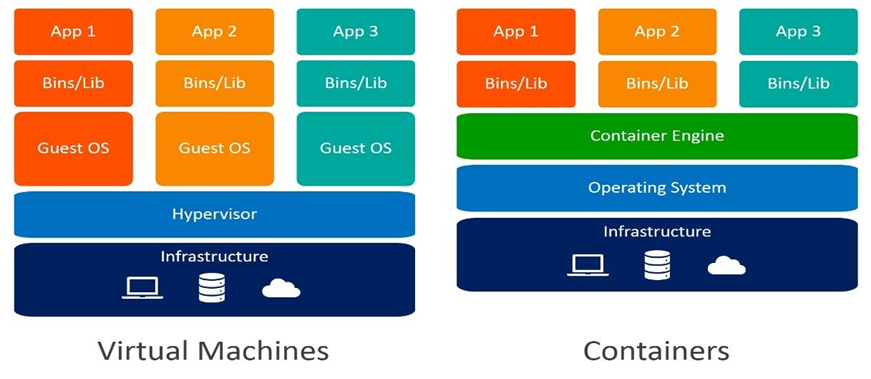
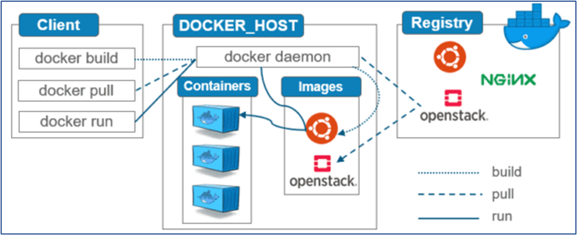

## Virtualization
Virtualization is the process of sharing hardware resources across several virtually isolated and mutually independent systems. It is achieved by using a hypervisor which acts as a bridge between the Operating System of each of the virtual machines and the underlying hardware.
Applications in virtual environments run on a host operating system on top of the hypervisor.

## Containerization
Containerization refers to the process of creating virtually isolated instances of applications along with the required dependencies called containers. The containers so created are independent of the underlying operating system and are portable from one OS to the other. A container engine acts as a bridge between the containers and the underlying OS.



Here are some key reasons why containerization became necessary and gained widespread adoption:

 - Consistent Environments:
Traditional software development faced challenges with inconsistent environments between development, testing, and production. Containerization allows developers to package applications and their dependencies together, ensuring consistency across different environments.

- Isolation and Dependency Management:
Containers provide process and file system isolation, allowing applications to run independently of the host system. This isolation ensures that dependencies and libraries needed by an application are contained within the container, reducing conflicts and compatibility issues.

- Portability:
Containers encapsulate applications and their dependencies, making them highly portable. A containerized application can run consistently on any system that supports the container runtime, eliminating the "it works on my machine" problem.

- Resource Efficiency:
Containers share the host operating system's kernel, making them more lightweight compared to traditional virtual machines. This results in faster startup times and efficient utilization of system resources.

- Microservices Architecture:
Containerization aligns well with microservices architecture, where applications are broken down into small, independent services. Each microservice can be packaged as a container, allowing for easier development, deployment, and scaling of individual components.

- DevOps Practices:
Containerization plays a crucial role in DevOps practices by facilitating collaboration between development and operations teams. Containers enable consistent deployment artifacts, making it easier to automate deployment pipelines and achieve continuous integration/continuous deployment (CI/CD).

- Scaling and Orchestration:
Containers provide a scalable and manageable unit for deploying applications. Orchestration tools, such as Kubernetes, leverage containerization to automate the deployment, scaling, and management of containerized applications in a cluster.

- Rapid Deployment and Rollbacks:
Containers can be started or stopped quickly, enabling rapid deployment and updates. If issues arise, rolling back to a previous version is straightforward due to the versioning capabilities of container images.

- Efficient Resource Utilization:
Containers allow for efficient utilization of hardware resources by sharing the underlying kernel. This efficiency is particularly valuable in cloud environments, where resources need to be allocated and released dynamically.

- Security Isolation:
Containers provide a level of isolation between applications, enhancing security. While not foolproof, containerization helps contain potential security breaches within the boundaries of a container.

# Docker
Docker is a platform that provides virtual containers on which an application can be deployed independent of the underlying OS of the server. Further the container can be created from a replica called docker image which contains all the dependencies and can run on any OS that has docker engine, with similar results.

 - Docker containers run on Docker Engine which needs to be installed on the underlying Host operating system.
- Docker containers with the desired configuration can be stored as an image called Docker Image and stored in a centralized registry. 
 - The images can be downloaded from the registry on any different server with another host operating system running docker engine. 
 - Multiple docker containers can be created on the destination server with the same desired configuration.

## Docker container
Containers are lightweight, standalone units containing all the code and libraries needed to run an application. Unlike a virtual machine, a Docker container runs directly on the host operating system. This means it shares the host operating system kernel with other containers.

Docker containers are designed to be moved around easily between different environments without changing the application or its dependencies.

## Docker engine
The Docker engine is the core of the Docker platform. It manages containers, including their creation, running and shipping and the entire lifecycle. When you install Docker, the Docker engine gets installed as well. This engine is the primary client-server technology that manages containers using all Dockers services and components.

The Docker engine consists of 3 fundamental components, including the Docker daemon, Docker API and Docker client.

1. ### Docker daemon (dockerd)
    Docker daemon is a fundamental Docker component. It is a background process that listens to requests from the Docker client and manages the creation and running of Docker containers. The Docker daemon can be considered as the engine that powers the Docker environment. This allows developers to run, build and manage containerized applications.

    [Docker daemon (dockerd) listens for Docker API requests and manages Docker objects such as images, containers, networks, and volumes. A daemon can also communicate with other daemons to manage Docker services.]

    The Docker daemon pulls Docker images from registries and manages the resources needed to run Docker containers. Docker daemon functions include:

    - Image management: The Docker daemon manages images, including pulling and caching images for fast and efficient container creation.
    - Volume management: Persisting data in containers is possible due to the Docker daemon. It enables the creation and management of volumes, which ensures data is saved when containers are deleted.
    -   Network management: The Docker daemon manages communication between containers and the outside world. It manages container network interfaces, ensuring they are isolated from each other and the host machine.
    -   Container management: The Docker daemon manages the starting, stopping and deleting containers.

2. ### Docker API
    The Docker API is a programmatic interface that communicates with the Docker daemon. With the Docker API, you can tell the Docker daemon to perform tasks like starting, stopping and deleting containers or downloading or uploading Docker images. Docker API makes networks and volumes possible and manages user permissions and access.

    All Docker daemon tasks are possible due to the Docker API. Without the Docker API, communicating with the Docker daemon programmatically wouldn't be possible.

3. ### Docker Client
    This is the primary mode of communicating with the Docker daemon. The Docker client is a command line interface (CLI) developers use to interact with the Docker daemon from their computers. When a user uses a command such as a docker run, the Docker client sends this request to the Docker daemon.
    basically the docker commands that we are are done with help of client

    With the Docker client, developers can manage Docker containers, images, networks, and volumes from the command line. Below are the key features of the Docker client:

    - Command line interface: The Docker client provides developers a command line interface to execute Docker commands.
    - Integration with development tools: With the Docker client, it is possible to manage Docker containers from popular development environments, including Visual Studio Code and IntelliJ IDEA.

- Note: Although the Docker API and Docker client may seem similar, as they are tools you can use to interact with the Docker daemon, they differ in a few ways. The Docker client sends requests to the Docker daemon via a Unix socket or a network interface, while the Docker API exposes a RESTful HTTP interface over a network.



## Request Flow:
1. User Interaction:

    The user interacts with Docker through the client, issuing commands or using a Docker-specific API.

2. Docker Client:

    The Docker client translates user commands into Docker API requests.

3. REST API Request:

    The Docker client sends HTTP requests to the Docker daemon's REST API endpoint, typically running on localhost:2375 or a UNIX socket (/var/run/docker.sock).

4. Docker Daemon:

    The Docker daemon receives the API request and processes it. The daemon handles tasks such as building images, starting containers, creating networks, and managing storage.

## Docker Object:
When you use Docker, you are creating and using images, containers, networks, volumes, plugins, and other objects. This section is a brief overview of some of those objects.
1. ### Images
    An image is a read-only template with instructions for creating a Docker container. Often, an image is based on another image, with some additional customization. For example, you may build an image which is based on the ubuntu image, but install the Apache web server and your application, as well as the configuration details needed to make your application run.
    - You might create your own images, or you might only use those created by others and published in a registry. 
    - To build your own image, you create a Dockerfile with a simple syntax for defining the steps needed to create the image and run it.  
    - Images are composed of layers, each representing a set of filesystem changes. Each instruction in a Dockerfile creates a layer in the image. Layers are stacked on top of each other.
Docker uses a union file system, such as OverlayFS, to efficiently manage and share these layers.
    - When you change the Dockerfile and rebuild the image, only those layers which have changed are rebuilt. 
    - This is part of what makes images so lightweight, small, and fast, when compared to other virtualization technologies.
2. ### Containers
    A container is a runnable instance of an image. You can create, start, stop, move, or delete a container using the Docker API or CLI. You can connect a container to one or more networks, attach storage to it, or even create a new image based on its current state.
    -   Docker container is runtime instance of our application. 
    -    When we run Docker Image, it will create Docker Container. 
    -   Inside Container our application and application dependencies will be available.
3. ### Volumes 
    Docker volumes are used to persist and share data between containers and the host machine. They provide a way to store and manage persistent data separately from the container lifecycle. Volumes can be mounted into containers at specific paths.

4. ### Network
    Docker networks enable communication between containers and the outside world. They provide isolated network environments for containers and allow containers to communicate with each other using IP addresses or container names. Docker supports various network drivers for different use cases.

    - Default Bridge Network:
        
        By default, Docker creates a bridge network that allows containers to communicate with each other using internal IP addresses.

    - User-Defined Networks:

        Users can create custom networks to connect containers. This allows for more complex networking setups and enables communication between containers across different hosts.

# Docker Registry:
A Docker registry stores Docker images. Docker Hub is a public registry that anyone can use, and Docker is configured to look for images on Docker Hub by default. You can even run your own private registry.
When you use the docker pull or docker run commands, the required images are pulled from your configured registry. When you use the docker push command, your image is pushed to your configured registry.

Default Docker registry : https://hub.docker.com.

Other Docker Registries are: AWS ECR,  Google GCR, Microsoft ACR, Harbor ..etc


# Docker Setup
for amazon linux 2023
```bash
# update repo
sudo yum update -y
# install docker
sudo yum install docker -y 
# enable and start docker service
sudo systemctl enable docker
sudo systemctl start docker

# add current user to docker group to run docker commands withou sudo
sudo usermod -aG docker $USER
# exist and restart the terminal.
$ exit

# verify docker
docker info
docker -version
```
## Docker commands
```bash
# Display local images 
docker images
# Download  image.
docker pull <image-name / image-id>
# Run docker image.
docker run <image-name / image-id>
# Delete docker image.
docker rmi <image-name / image-id>
# Display all running docker containers.
docker ps 	
# Display all running and stopped containers.
docker ps -a
# Delete docker container.
docker rm <container-id>
# Delete docker image forcefully.
docker rmi  -f <image-id>
# Stop Docker container.
docker stop <container-id>
# start a stoped container
docker start <container-id>
# see logs of a running container
docker logs <container-id>
# acess the shell inside a container
docker exec -it <container-id> /bin/bash
# Delete all stopped containers and unused images and unused networks.
docker system prune -a
```

## Docker run command
```bash
# run container from image
docker run <image_name>
# the --name option is used to assign a specific name to the container.
docker run --name my_container <image_name>
# -d option runs the container in detached mode, which means it runs in the background.
# The terminal is returned to the user immediately after starting the container.
docker run -d <image_name>
# the -p option is used to map a port from the host to a port inside the container
# In this example, port 8080 on the host is mapped to port 80 inside the container
docker run -p [HOST_PORT]:[CONTAINER_PORT] [IMAGE]
docker run -p 8080:80 <image_name>
# The -e option sets environment variables inside the container
docker run -e MYSQL_ROOT_PASSWORD=my-secret-pw <image_name>
# The -v option mounts a volume from the host to the container
docker run -v /host/path:/container/path <image_name>
#  run a specific command inside the container by providing it as an argument to docker run
docker run <image_name> 'ls -l'
# The -it options provide an interactive terminal inside the container.
docker run -it <image_name> /bin/bash
# Use options like --cpu-shares and --memory to limit CPU and memory resources allocated to the container
docker run --cpu-shares=256 --memory=512m <image_name>
# The --rm option removes the container automatically after it exits
docker run --rm <image_name>
# 
docker run --name webapp -d -p 8080:80 <image_name
```

## Advanced Docker Commands
```bash
# export/save an image to a tar archive
docker save -o image.tar <image_name>
# inspect thr tar file
tar -tvf image.tar
# load an docker image from a tar file
docker load -i image.tar

# list only ids of all images
docker images -q
# remove all images present in local    
docker rmi $(docker images -q)
```

## Advanced Docker run
```bash
# Use --cpus to limit the container to a specific number of CPUs.
# Use --memory to set the maximum memory allowed for the container.
docker run --cpus=2 --memory=1g <image_name>

# The --network=host option uses the host network stack, sharing the network namespace with the host.
# Useful for scenarios where the container needs to access services running on the host directly.
docker run --network=host <image_name>

# The -P option automatically maps all exposed ports in the container to random ports on the host
docker run -P <image_name>

# The --user option sets the user or UID for the process running inside the container.
docker run --user 1001 <image_name>

# The --env-file option reads environment variables from a file and sets them in the container.
docker run --env-file=myenvfile.env <image_name>

#The -w option sets the working directory inside the container 
# Useful for specifying where the command should be executed.
docker run -w /app <image_name>

#The --volumes-from option allows a container to use volumes from another container.
# Useful for sharing data between containers.
docker run --volumes-from=source_container <image_name>


#The --read-only option mounts the container's root filesystem as read-only.
# Enhances security by preventing processes inside the container from writing to the filesystem.
docker run --read-only <image_name>

# The --label option adds metadata labels to the container.
docker run --label mylabel=value <image_name>
```

# Dockerfile
A Dockerfile is a text file that contains a set of instructions used to build a Docker image. Docker images are the building blocks of containers, providing a lightweight and portable way to package and distribute applications.

It provides a way to automate the process of creating a Docker container image, specifying the base image, adding application code, defining runtime settings, and more. Dockerfiles follow a simple syntax and are typically named "Dockerfile" with no file extension.
- In Dockerfile we will use DSL (Domain Specific Language) keywords
- Docker engine will process Dockerfile instructions from top to bottom.


