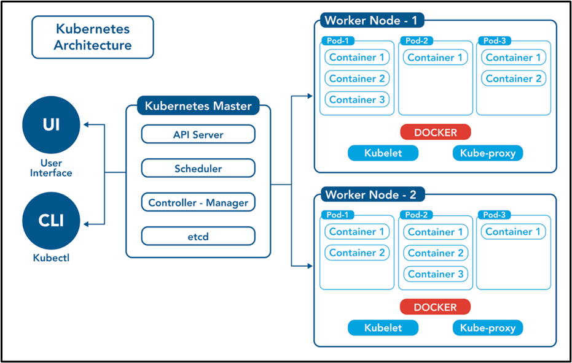

## Microservices
Microservices is software architecture approach where a complex application is built as a collection of smaller, independent services. Each service is designed to perform a specific business function and can be developed, deployed, and scaled independently. DevOps is a set of practices that aims to automate and streamline the processes of software development and IT operations, fostering collaboration and communication between development and operations teams.

When applying microservices in a DevOps environment, several key principles come into play:

- Decentralized Development and Deployment: Microservices enable teams to work on and deploy individual services independently. This allows for faster development cycles and the ability to release updates without affecting the entire application.

- Continuous Integration and Continuous Deployment (CI/CD): DevOps practices often involve implementing CI/CD pipelines to automate the building, testing, and deployment of software. With microservices, CI/CD can be more granular, focusing on specific services rather than the entire monolithic application.

- Scalability: Microservices architecture allows for scaling specific services based on demand. This is crucial for applications with varying workloads, as teams can allocate resources where they are needed most.

- Isolation and Fault Tolerance: Microservices are isolated from each other, both in terms of development and runtime. If one service fails, it doesn't necessarily bring down the entire application. This isolation improves fault tolerance and makes it easier to identify and address issues.

- Automation and Orchestration: DevOps emphasizes automation, and in the context of microservices, this extends to the orchestration of services. Tools like container orchestration platforms (e.g., Kubernetes) are commonly used to automate the deployment, scaling, and management of microservices.

- Monitoring and Logging: DevOps practices include robust monitoring and logging. In a microservices architecture, monitoring is crucial to gain insights into the performance of individual services, detect issues, and ensure the overall health of the application.

## Container Runtime

A container runtime is a software component responsible for running and managing containers on a host system. Containers are lightweight, portable, and encapsulated environments that package applications and their dependencies. The container runtime facilitates the creation, execution, and management of these containers. There are several container runtimes available, with Docker being one of the most well-known. Here are some key container runtimes:

- Docker (containerd): Docker is a widely used platform for developing, shipping, and running applications in containers. It includes a container runtime called containerd, which is responsible for the actual execution of containers. Containerd manages the complete container lifecycle, handling tasks like image distribution, container execution, and supervision.

- rkt (pronounced "rocket"): rkt is a container runtime developed by CoreOS. It focuses on simplicity, security, and composability. rkt supports the App Container (appc) specification and emphasizes a pluggable architecture. While it has gained attention, Docker remains more prevalent in the container ecosystem.

- containerd: As mentioned earlier, containerd is not just the runtime used by Docker, but it is also a standalone container runtime that can be used independently. It is designed to be lightweight and efficient, providing core container runtime functionality.

- CRI-O: CRI-O is a lightweight container runtime specifically designed for Kubernetes. It implements the Kubernetes Container Runtime Interface (CRI), allowing Kubernetes to use CRI-O as its container runtime. CRI-O focuses on simplicity, security, and interoperability with other container runtimes.

- Podman: Podman is a container management tool that can be used as a drop-in replacement for Docker. It provides a daemonless, daemon-free experience, allowing users to run containers without a central daemon process. Podman uses the Container Runtime Library (runc) for executing containers.

- runc: runc is not a standalone container runtime but rather a command-line tool for spawning and running containers according to the Open Container Initiative (OCI) specification. It is used by container runtimes like containerd, Docker, and others to start and manage containers.

- OpenShift's cri-o: cri-o is an implementation of the Kubernetes CRI (Container Runtime Interface) that is optimized for OpenShift, Red Hat's enterprise Kubernetes platform. It focuses on being lightweight and modular.

## Container Orchestraction

Container orchestration is the automated management, deployment, scaling, and operation of containerized applications. Containers are lightweight, portable units that package the application and its dependencies together.

Container orchestration automates the deployment of containerized applications, reducing manual effort and ensuring consistency across different environments. It streamlines the process of releasing software, making it faster and less error-prone.

# Kubernetes 
Kubernetes is an open source container orchestration engine for automating deployment, scaling, and management of containerized applications. The open source project is hosted by the Cloud Native Computing Foundation (CNCF).
It provides a scalable and resilient framework for automating the deployment, scaling, and management of applications across clusters of servers.

History of K8s
- In the early 2000s, Google started developing a system called Borg to manage their internal containerized applications. 
- Borg enabled Google to run applications at scale, providing features such as automatic scaling, service discovery, and fault tolerance.
- In 2014, Google open-sourced a version of Borg called Kubernetes.
- Kubernetes was donated to the Cloud Native Computing Foundation (CNCF), a neutral home for open-source cloud-native projects, in July 2015.
- Kubernetes 1.8 added significant enhancements for storage, security, and networking. Key features included the stable release of the stateful sets API, expanded support for volume plugins, and improvements in security policies.
- Check URL: https://kubernetes.io/releases/ for more release details.

Features of Kubernetes

- Container Orchestration: Kubernetes automates the deployment, scaling, and operation of application containers. It enables the management of containerized workloads and services, abstracting away the underlying infrastructure.

- Automated Scaling: Kubernetes allows for automatic scaling of applications based on demand. It can scale the number of containers up or down dynamically, ensuring optimal resource utilization and responsiveness to changing workloads.

- Service Discovery and Load Balancing: Kubernetes provides mechanisms for service discovery, allowing containers to find and communicate with each other. It also includes built-in load balancing to distribute network traffic across multiple containers, ensuring even workload distribution.

- Rolling Updates and Rollbacks: Kubernetes supports rolling updates, enabling applications to be updated without downtime. If issues arise during an update, it facilitates rollbacks to a previous version, minimizing disruptions.

- Declarative Configuration: Kubernetes uses declarative configuration files (YAML or JSON) to define the desired state of applications and their components. The platform continuously works to reconcile the current state with the declared state, ensuring the desired configuration is maintained.

- Resource Management: Kubernetes manages the allocation of resources such as CPU and memory to containers, helping to optimize performance and prevent resource conflicts. It supports the definition of resource limits and requests for containers.

- Self-Healing: Kubernetes monitors the health of containers and applications. If a container or node fails, it can automatically reschedule containers to healthy nodes, ensuring the overall availability of the application.

- Multi-Cloud and Hybrid Cloud Support: Kubernetes is designed to be platform-agnostic and can run on various cloud providers or on-premises infrastructure. This makes it suitable for multi-cloud and hybrid cloud environments.

- Extensibility: Kubernetes is highly extensible and allows users to integrate custom functionalities through the use of plugins and extensions. This extensibility enables the integration of additional features and services.

- Community and Ecosystem: Kubernetes has a large and active community, contributing to its ongoing development and support. It has a vibrant ecosystem of tools, extensions, and third-party integrations.

## Kubernetes Architecture

The architecture of Kubernetes is designed to provide a scalable, resilient, and extensible platform for containerized applications. Kubernetes follows a master-worker architecture, with a set of control plane components on the master node and worker nodes hosting containers.

### Master Node
Master node is a central component of the cluster that plays a crucial role in managing and controlling the overall state of the system. The Master node hosts various control plane components and services that coordinate the activities of the worker nodes and ensure that the cluster operates according to the desired state. Here are the key components hosted on the Master node:

1. API Server:

    - The central management component that exposes the Kubernetes API.
    - Acts as the entry point for all administrative tasks and communication within the cluster.
    - Authenticates and authorizes API requests, serving as the front-end for the Kubernetes control plane.

2. etcd:
    - A distributed key-value store that stores the configuration data and state of the cluster.
    - Provides a consistent and reliable storage solution for Kubernetes, ensuring that cluster components can read and write information consistently.

3. Controller Manager:
    - Watches the state of the cluster through the API server and makes decisions to bring the actual state in line with the desired state.
    - Manages various controllers responsible for different aspects, such as replication controllers, endpoints, and service accounts.
    - Ensures that the declared state of resources matches the observed state.

4. Scheduler:
    - Assigns nodes to newly created Pods based on resource requirements, policies, and constraints.
    - Determines the optimal node for a Pod to run on, considering factors such as resource availability and user-defined preferences.
    - Makes scheduling decisions to distribute workloads across the cluster.

5. Cloud Controller Manager (optional):
    - Integrates with cloud provider-specific APIs to manage resources, such as virtual machines and load balancers.
    - Provides cloud-specific functionality if the cluster is running on a cloud infrastructure.
    - Manages resources in the cloud environment that are part of the Kubernetes cluster.

The Master node is critical to the coordination and management of the entire Kubernetes cluster. It receives requests from users, schedules workloads to worker nodes, monitors the state of the cluster, and ensures that the declared state matches the observed state. The separation of the control plane components on the Master node from the worker nodes allows for scalability, fault tolerance, and ease of management in larger deployments. In a highly available configuration, multiple Master nodes can be set up for redundancy and reliability.

### Worker Nodes
Worker nodes, also known as minion nodes or compute nodes, are the machines that run containerized applications in the form of Pods. Worker nodes are responsible for hosting and executing the containers that make up the applications deployed on the Kubernetes cluster. Each worker node is part of the larger cluster and contributes its resources to the pool available for running containers. 

Here are the key components found on worker nodes:

6. Kubelet:

    - The Kubelet is an agent that runs on each worker node.
    - It communicates with the Kubernetes master node to receive instructions and ensures that containers are running in Pods as expected.
    - Monitors the state of containers, performs health checks, and reports back to the master node.

7. Kube Proxy:

    - Kube Proxy is another agent running on each worker node.
    - It maintains network rules on nodes to enable communication between Pods and external entities and also enables servive discovery.
    - Facilitates network communication, handles routing  and load balancing for Pods.

8. Container Runtime:

    - The container runtime, such as Docker, containerd, or another runtime, is responsible for running containers.
    - It pulls container images, creates containers, and manages their lifecycle as instructed by the Kubelet.

Worker nodes receive instructions from the Kubernetes master node, execute those instructions by starting and managing containers, and report back to the master node about the status of the containers and overall node health. The Kubelet ensures that the containers specified in the Pods are running and healthy.

Here's a high-level overview of the communication flow:

- The Kubernetes master node decides which worker node should run a specific Pod based on scheduling decisions made by the Scheduler.

- The master node communicates with the Kubelet on the chosen worker node to instruct it to start the containers specified in the Pod.

- The Kubelet interacts with the container runtime to start and manage the containers.

- Kube Proxy maintains network rules on the worker node to facilitate communication between Pods and external entities.

- Containers within the same Pod can communicate using localhost, and inter-node communication is facilitated by networking solutions like overlay networks.

### 1. api-Server

The API server is a central component of the control plane that exposes the Kubernetes API and serves as the primary entry point for managing and interacting with the cluster. It acts as the front-end for the control plane, receiving and handling requests from various Kubernetes components, users, and external tools.

Key features and responsibilities of the API server include:

- API Endpoint:
    - The API server provides an HTTP(S) endpoint that clients use to interact with the Kubernetes cluster. The endpoint is typically accessed at the URL `https://<kube-apiserver-host>:<port>`.
- Authentication and Authorization:
    - The API server handles authentication and authorization of requests. It verifies the identity of clients making requests and checks whether they have the necessary permissions to perform the requested actions.
- Validation and Admission Control:
    - The API server performs validation of resource configurations to ensure they conform to Kubernetes API schemas.
    - Admission control plugins allow custom policies and checks to be enforced before persisting objects in the cluster.
- RESTful Interface:
    - The API server follows a RESTful architecture, and resources in the Kubernetes cluster are represented as RESTful objects (such as Pods, Services, and Deployments).
    - CRUD (Create, Read, Update, Delete) operations are performed on these resources using HTTP methods (GET, POST, PUT, DELETE).
- State Management:
    - The API server interacts with the distributed key-value store, typically etcd, to persistently store and retrieve the current state of the cluster.
    - It maintains information about nodes, pods, services, deployments, and other resources.
- Resource Endpoints:
    - The API server exposes various resource endpoints, each corresponding to a specific type of Kubernetes resource. For example, there are endpoints for Pods, Services, ConfigMaps, etc.
- Watch Mechanism:
    - The API server supports a watch mechanism that allows clients to subscribe to changes in resources. Clients, such as controllers and users, can receive real-time notifications when resources are added, modified, or deleted.
- Extension Mechanisms:
    - The API server supports extension mechanisms, allowing custom resources and controllers to be added to the Kubernetes API.
    - Custom Resource Definitions (CRDs) enable the definition of custom resource types, extending the API with user-defined specifications.
- Secure Communication:
    - The API server supports secure communication using Transport Layer Security (TLS). Clients communicate with the API server over encrypted connections to ensure data confidentiality and integrity.
- Integration with Other Control Plane Components:
    - The API server collaborates with other control plane components, such as the Scheduler, Controller Manager, and etcd, to maintain the desired state of the cluster.

Overall, the API server plays a crucial role in enabling communication between users, administrators, and various Kubernetes components. It acts as the central control point for managing and coordinating the state of the cluster through a well-defined and extensible API.

### 2. scheduler

The Scheduler is a key component of the control plane responsible for making decisions about where to deploy Pods based on the defined constraints, resource requirements, and policies. Its primary function is to assign worker nodes to newly created Pods, determining which nodes in the cluster should run the Pods.

Key characteristics and responsibilities of the Scheduler include:

- Node Selection:
    - The Scheduler decides which worker node (or nodes) should run a specific Pod.
    - It takes into account factors such as resource requirements, constraints, and affinity/anti-affinity rules specified by the user.

- Optimal Resource Allocation:
    - The Scheduler aims to evenly distribute Pods across the available nodes, taking into consideration the resources (CPU, memory) required by the Pods.
    - It helps in achieving optimal resource allocation and load balancing within the cluster.
- Policy Enforcement:
    - The Scheduler enforces policies and rules specified by the user or defined by default settings.
    - Policies may include constraints on node resources, anti-affinity rules to avoid co-locating certain Pods, and affinity rules to prefer co-location.
- Pluggable Architecture:
    - Kubernetes has a pluggable architecture for the Scheduler, allowing users to implement custom scheduling algorithms or policies.
    - Custom schedulers can be deployed to meet specific requirements or integrate with external systems.
- Decentralized Design:
    - While the Scheduler is a centralized component, it operates in a decentralized manner by allowing each worker node to independently apply scheduling decisions.
    - The Scheduler only determines the initial placement of Pods; once scheduled, Pods are managed by the Kubelet on their respective nodes.
- Pod Priority and Preemption:
    - The Scheduler supports priority and preemption mechanisms. Pods can be assigned priority levels, and the Scheduler tries to prioritize higher-priority Pods during scheduling.
    - Preemption allows the Scheduler to evict lower-priority Pods from nodes to make room for higher-priority Pods.
- Scalability and Extensibility:
    - The Scheduler is designed to scale horizontally, allowing multiple instances of the Scheduler to distribute the scheduling workload.
    - The extensibility of the Scheduler allows users to implement custom logic or integrate third-party schedulers.
- Integration with API Server:
    - The Scheduler interacts with the Kubernetes API server to watch for newly created Pods and receive information about the desired state of the cluster.
    - It continually monitors the API server for Pod creation events and schedules Pods accordingly.

The overall goal of the Scheduler is to ensure efficient resource utilization, balance the load across nodes, and respect user-defined policies while scheduling Pods within the Kubernetes cluster. Its decisions contribute to the overall health, performance, and reliability of the cluster.

### 3. controller-manager
The Controller Manager is a component of the control plane responsible for managing various controllers that regulate the state of the cluster and control the lifecycle of different Kubernetes resources. Each controller within the Controller Manager is responsible for maintaining the desired state of specific resources, reacting to changes, and ensuring that the actual state converges toward the desired state.

Key responsibilities and characteristics of the Controller Manager include:

- Controller Components:
    - The Controller Manager hosts multiple controllers, each dedicated to a specific type of resource or set of resources in the cluster.
    - Examples of controllers include the Replication Controller, StatefulSet Controller, Deployment Controller, Service Controller, and more.

- Desired State vs. Actual State:
    - Controllers continuously observe the state of resources in the cluster by interacting with the Kubernetes API server.
    - They ensure that the actual state of resources (e.g., the number of running Pods) matches the desired state specified by the user or defined in the resource configuration.

- Reconciliation Loop:
    - Controllers operate in a reconciliation loop, where they constantly compare the actual state of resources with the desired state.
    - If there are discrepancies, controllers take actions to bring the actual state in line with the desired state.

- Scaling and Self-Healing:
    - Certain controllers, like the Replication Controller and Deployment Controller, are responsible for ensuring that a specified number of replicas (Pods) are running.
    - Controllers handle scaling operations, such as creating or deleting replicas, to meet the desired number specified by the user.

- Rolling Updates:
    - Controllers, especially those managing deployment-type resources, implement rolling updates to smoothly transition from one version of an application to another.
    - This is achieved by gradually replacing old replicas with new ones, ensuring minimal disruption.

- Custom Resource Definitions (CRDs):
    - The Controller Manager supports Custom Resource Definitions (CRDs), allowing users to define custom resources with associated controllers.
    - Users can extend the functionality of the Controller Manager by creating custom controllers to manage custom resources.

- Integration with etcd:
    - Controllers interact with the distributed key-value store, typically etcd, to store and retrieve information about the state of resources in the cluster.
    - etcd serves as a persistent storage backend for the control plane components.

- Watch Mechanism:
    - Controllers use the watch mechanism provided by the Kubernetes API server to be notified of changes to resources in real-time.
    - This allows controllers to respond promptly to changes and take corrective actions.

Examples of controllers managed by the Controller Manager include the Replication Controller for ensuring the desired number of replicas, the Deployment Controller for managing rolling updates and rollbacks, the StatefulSet Controller for stateful applications, and various other resource-specific controllers.

Overall, the Controller Manager plays a crucial role in maintaining the stability, scalability, and desired state of a Kubernetes cluster by overseeing the behavior of controllers that manage different types of resources.

### 4. etcd
etcd is a distributed key-value store that serves as a highly reliable and consistent storage solution for the configuration data and state of the entire cluster. It is a critical component of the Kubernetes control plane, and its primary role is to store and manage the state of the cluster, including configuration information, metadata, and the current state of objects.

Key features and characteristics of etcd in Kubernetes include:

- Consistency and Reliability:

    - etcd ensures strong consistency, meaning that all nodes in the cluster see the same data at the same time.
    - It is designed to be highly available and fault-tolerant, allowing the cluster to recover from node failures or network partitions.

- Distributed System:

    - etcd operates as a distributed system, with multiple instances (nodes) forming a cluster.
    - The distributed nature of etcd allows it to provide fault tolerance and resilience against failures.

- Watch and Notification Mechanism:

    - etcd supports a watch mechanism that allows clients (including Kubernetes components) to be notified when changes occur to specific keys in the key-value store.
    - This watch mechanism is used by various components in Kubernetes to observe changes in the cluster state.

- Configuration Data Storage:

    - etcd stores configuration data for various components of the Kubernetes control plane, including information about nodes, pods, services, and other resources.
    - It stores the desired state of the cluster and updates this information as changes occur.

- API Access:
    - Kubernetes components, such as the API server, controller manager, and scheduler, interact with etcd through its API.
    - The API server, in particular, uses etcd to persistently store and retrieve data about the state of the cluster.

- Cluster Membership:
    - etcd maintains information about the membership of the etcd cluster, keeping track of healthy and available nodes.
    - The distributed consensus algorithm used by etcd helps ensure that all nodes agree on the state of the data.
- Secure Communication:
    - etcd supports secure communication through Transport Layer Security (TLS).
    - This ensures that data transmitted between etcd nodes and clients, including Kubernetes components, is encrypted and secure.

During the operation of a Kubernetes cluster, components of the control plane, such as the API server, write and read data to and from etcd to maintain and retrieve the current state of the cluster. The reliability and consistency provided by etcd are crucial for the overall stability and resilience of a Kubernetes cluster.

### 5. kubelet
Kubelet is an agent that runs on each worker node in the cluster. Its primary responsibility is to ensure that containers are running in a Pod as expected. The Kubelet interacts with the Kubernetes master node and the container runtime to manage and monitor containers on a node.

Key characteristics and responsibilities of the Kubelet include:

- Pod Lifecycle Management:
    - The Kubelet is responsible for managing the lifecycle of Pods on a node. It starts, stops, and monitors containers based on the Pod specifications received from the Kubernetes API server.
- Container Runtime Interaction:
    - The Kubelet interacts with the container runtime (such as Docker, containerd, or another supported runtime) to start and manage containers.
    - It communicates with the container runtime's API to pull container images, create containers, and respond to container lifecycle events.
- Node Registration:
    - During node startup, the Kubelet registers the node with the Kubernetes master node, providing information about the node's capacity and available resources.

- Pod Specification Enforcement:
    - The Kubelet ensures that the containers within a Pod are running according to the specifications defined in the Pod manifest.
    - If a container fails or is terminated, the Kubelet takes corrective actions to restart the container or the entire Pod.
- Health Checks:
    - The Kubelet performs health checks on containers by executing periodic probes (liveness and readiness probes) defined in the Pod specification.
    - If a container fails a health check, the Kubelet takes appropriate actions, such as restarting the container.
- Resource Management:
    - The Kubelet monitors the resource usage of containers and enforces resource constraints specified in the Pod manifest (e.g., CPU and memory limits).
    - It reports resource usage metrics to the Kubernetes master for monitoring and scaling decisions.
- Volume Management:
    - The Kubelet manages the volume mounts specified in the Pod manifest. It ensures that the required volumes are mounted into the containers and that data is persisted as needed.
- Kubelet API Server:
    - The Kubelet exposes an API server on each node, known as the Kubelet API.
    - The Kubelet API allows the Kubernetes API server to communicate with the Kubelet to query the node's status, get container logs, and perform other management tasks.
- Pod Networking:
    - The Kubelet works with the container runtime to set up networking for containers within a Pod.
    - It configures the network namespace, enabling communication between containers within the same Pod.
- Node Status Updates:
    - The Kubelet sends periodic updates about the node's status to the Kubernetes master, providing information about available resources, capacity, and conditions.

The Kubelet plays a crucial role in translating the desired state of Pods, as specified in the Pod manifests, into the actual running state on the worker nodes. It is a fundamental component for the reliable execution and management of containerized workloads in a Kubernetes cluster.

### 6. kube-proxy
Kube Proxy is a network proxy that runs on each worker node. Its primary function is to maintain network rules on nodes to enable communication between Pods and external entities. Kube Proxy facilitates network communication and load balancing for services in a Kubernetes cluster.

Key characteristics and responsibilities of Kube Proxy include:

- Service Exposure:
    - Kube Proxy enables the exposure of services to the external world. It manages the network rules necessary for routing external traffic to the appropriate Pods behind a service.
- Load Balancing:
    - For services with multiple Pods (replicas), Kube Proxy performs load balancing, distributing incoming traffic among the available Pods.
    - Load balancing helps distribute workloads evenly and improves the availability and reliability of services.
- Pod-to-Pod Communication:
    - Kube Proxy sets up network rules to facilitate communication between Pods within the same cluster. Pods can communicate with each other using service names and the cluster's internal DNS.
- iptables Rules:
    - By default, Kube Proxy uses iptables rules to implement the necessary network rules on each node.
    - iptables rules are configured to redirect traffic to the appropriate destination Pod based on service selectors.
- Service Discovery:
    - Kube Proxy contributes to service discovery by allowing other Pods in the cluster to discover and communicate with services using the service's DNS name.
- Session Affinity:
    - Kube Proxy supports session affinity, also known as sticky sessions. This ensures that requests from a client are directed to the same Pod over the course of the session.
- NodePort Service Type:
    - For services of type NodePort, Kube Proxy configures network rules to expose the service on a static port on each worker node.
    - This allows external traffic to reach the service on the specified NodePort.
- Endpoint Slices:
    - Starting from Kubernetes version 1.19, Kube Proxy uses a feature called Endpoint Slices to improve scalability and efficiency in managing endpoints for services.
- Network Modes:
    - Kube Proxy operates in different network modes, including userspace, iptables, and IPVS (IP Virtual Server).
    - The choice of network mode depends on the configuration and requirements of the cluster.
- Integration with Service APIs:
    - Kube Proxy interacts with the Kubernetes API server to watch for changes in service configurations. It dynamically updates iptables rules based on changes in service definitions.

Kube Proxy is an essential component in the networking layer of a Kubernetes cluster. It abstracts the complexities of networking and load balancing, providing a seamless and consistent communication environment for Pods and services within the cluster. The specific mode and features of Kube Proxy can be configured based on the networking requirements of the cluster.

## kubectl
kubectl is a command-line tool used to interact with and manage Kubernetes clusters. It serves as the primary interface for administrators, developers, and users to communicate with a Kubernetes cluster. With kubectl, you can perform a wide range of operations, including deploying applications, inspecting and managing cluster resources, and troubleshooting.

## Comminication workflow in Kubernetes Cluster

In Kubernetes, communication primarily occurs from worker nodes to the master node. The master node is responsible for managing and controlling the overall state of the cluster, while the worker nodes (also known as minion nodes) are responsible for running containerized workloads.

Here's a brief overview of how communication flows in a typical Kubernetes cluster:

- Worker Nodes to Master Node:

    - Heartbeats and Status Updates: Worker nodes regularly send heartbeats and status updates to the master node. This helps the master node monitor the health and availability of the worker nodes.
    
    - Container Runtime Interaction: When a user or a higher-level controller (e.g., Deployment, StatefulSet) requests the deployment of a containerized application, the master node communicates with the appropriate worker node to schedule the deployment. The worker node then interacts with the container runtime (e.g., Docker, containerd) to start and manage containers.

- Master Node to Worker Nodes:

    - Scheduling Decisions: The master node makes decisions about where to schedule containers based on resource availability, constraints, and user-defined policies. It communicates with the worker nodes to instruct them to start and manage containers.

    - Control Plane Components: The master node hosts various control plane components, including the API server, controller manager, scheduler, and etcd (the distributed key-value store). These components collaborate to manage the state of the cluster and make decisions about workload placement, scaling, and health.

- Inter-Node Communication:

    - Pod Networking: Pods on different worker nodes may need to communicate with each other. In this case, Kubernetes sets up networking solutions to allow inter-pod communication, typically through an overlay network. However, direct communication between worker nodes is typically limited to the networking layer, and most cluster-level communication is orchestrated by the master node.
- User Communication:

    -   kubectl and API Server: Users interact with the Kubernetes cluster using the kubectl command-line tool or through the Kubernetes API server. The API server, which is part of the master node, handles user requests, validates them, and communicates with other components to fulfill those requests.

In summary, while the master node takes on a coordinating role and makes decisions about cluster state, it relies on communication from the worker nodes to carry out those decisions and manage containerized workloads. The master node acts as the central control point for the Kubernetes cluster.

### Why does Kubernetes need container runtime ?

Kubernetes needs a container runtime engine to manage the lifecycle of containers within a cluster. A container runtime is responsible for the low-level tasks associated with containers, such as starting and stopping container processes, managing container resources, and ensuring isolation between containers. Kubernetes, as a container orchestration platform, relies on a container runtime to execute and manage containers on individual nodes within a cluster. 

Here are some reasons why Kubernetes needs a container runtime engine

- Container Lifecycle Management:  A container runtime is responsible for the actual execution and management of container processes, including starting, stopping, and monitoring their status.

- Resource Isolation: Containers share the host system's kernel but are isolated from each other. The container runtime enforces this isolation, ensuring that each container has its own filesystem, network namespace, and process space.

- Networking: The container runtime is responsible for setting up and managing the network namespace for each container, as well as facilitating networking features such as port mapping and inter-container communication.

- Image Management: Container runtimes handle the pulling, storing, and management of container images. Kubernetes relies on the container runtime to fetch the necessary container images from container registries and distribute them across nodes in the cluster.

- Security: Container runtimes enforce security features such as user and group permissions, capabilities, and AppArmor or SELinux profiles

- Interfacing with the Kernel: The container runtime interfaces with the host operating system's kernel to create and manage containers. It uses technologies such as cgroups (control groups) and namespaces to provide resource isolation and process separation.

- Container Lifecycle Hooks: Kubernetes relies on container runtimes to execute lifecycle hooks for containers. These hooks allow users to specify actions that should be taken at specific points in a container's lifecycle, such as pre-start and post-stop actions.

- Runtime Pluggability: Kubernetes supports multiple container runtimes, allowing users to choose the runtime that best fits their requirements. Popular container runtimes compatible with Kubernetes include Docker, containerd, CRI-O, and others. The Container Runtime Interface (CRI) is a standard interface between Kubernetes and container runtimes.

### What is a Kubernetes Pod ?

In Kubernetes, a pod is the smallest and simplest unit in the deployment model. It is the basic building block for running and deploying applications. A pod represents a single instance of a running process in a cluster and can encapsulate one or more containers that are tightly coupled and share the same network namespace, IPC namespace, and other resources.

Key characteristics of pods in Kubernetes:

- Atomic Unit: A pod is an atomic unit of deployment. It represents a single instance of a running process or application. Containers within the same pod are scheduled together on the same node and share the same lifecycle.

- Co-Located Containers: Although a pod can have multiple containers, they are co-located and share the same network namespace. This means they can communicate with each other using localhost and share the same IP address.

- Shared Storage and Volumes: Containers within a pod can share storage volumes. This enables them to easily exchange data and share persistent storage. Volumes are mounted into each container's filesystem.

- Single IP Address: A pod is assigned a single IP address within the cluster, and all containers within the pod share that IP address. Containers in the same pod can communicate with each other using localhost.

- Shared Process Namespace: Containers within a pod share the same process namespace. This allows them to communicate using inter-process communication (IPC) mechanisms if needed.

- Resource Sharing: Containers in a pod share the same resources, such as CPU and memory limits. They are scheduled together and are subject to the same resource constraints.

### Why was a pod needed in K8 when it already had container and container runtime ?
The introduction of the pod concept in Kubernetes serves several purposes, even though Kubernetes can interact directly with container runtimes. The need for pods arises from the desire to address challenges and provide additional abstractions that simplify the deployment and management of containerized applications. Here are some reasons why pods are essential, even when Kubernetes interacts with container runtimes:

- Suppot various container runtime: if there a a need to change the continaer runtime in future , then k8 would be affected since pod will be the abrstarction over containers

- Grouping Containers: Containers within a pod are tightly coupled and share the same network namespace. This grouping facilitates the deployment of multiple containers that need to work closely together. It's common for applications to consist of multiple components or sidecar containers that need to communicate with each other.

- Networking Abstraction: Pods provide a level of abstraction for networking. Containers within a pod can communicate using localhost, simplifying network configurations. This abstraction allows for more straightforward communication between containers in the same pod, regardless of the underlying networking specifics of the container runtime.

- Single IP Address: Containers within a pod share the same IP address, making communication between them more straightforward. Kubernetes handles the networking aspects, ensuring that external traffic is properly routed to the correct container within the pod.

- Resource Sharing: Containers within a pod share certain resources, such as storage volumes and environment variables. This sharing enables easy data exchange and collaboration between containers. For example, shared volumes allow containers within a pod to read and write to the same storage location.

- Scheduling and Co-location: Pods serve as the basic unit for scheduling in Kubernetes. Containers within a pod are always scheduled together and run on the same node. This co-location ensures that containers sharing the same pod are close to each other in terms of network latency and performance.

- Init Containers: Pods can include init containers that run before the main application containers start. Init containers are useful for tasks such as setting up configurations, performing pre-processing, or waiting for specific conditions to be met before the main application containers are launched.

- Consistent Scaling: When scaling applications, Kubernetes scales the entire pod rather than individual containers. This ensures that all containers within a pod are scaled together, maintaining the application's integrity and consistency.

- Abstraction for Controllers: Higher-level controllers in Kubernetes, such as Deployments and StatefulSets, operate on the pod abstraction. These controllers manage the lifecycle of pods, including creating, updating, and scaling them. Pods act as the target for scaling operations and rolling updates.

In summary, while container runtimes handle the execution of containers, pods provide a higher-level abstraction that simplifies the management of closely related containers within the Kubernetes ecosystem. They offer a consistent and convenient way to group, schedule, and manage containers that need to work together in a cohesive unit.

### what are cAdvisor in worker nodes ?

cAdvisor (Container Advisor) is a daemon that runs on each worker node and collects, aggregates, processes, and exports information about running containers.
It provides insights into resource usage, performance metrics, and container-specific information.