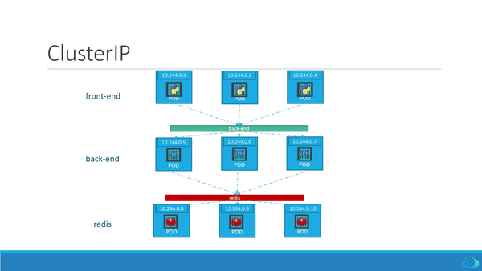
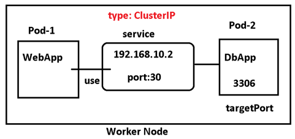
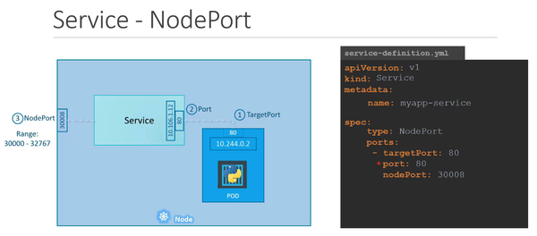
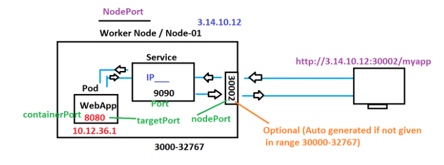
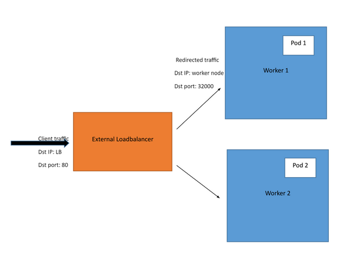
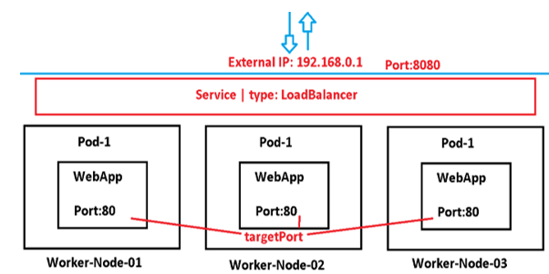

## Service
Service is a fundamental abstraction that plays a crucial role in enabling communication and connectivity among different components of an application. Services provide a stable and abstracted way to expose and access functionalities within a dynamic and distributed environment.

One of the key challenges in a Kubernetes environment is the ephemeral nature of Pods. As Pods come and go, relying on their individual IP addresses for communication becomes impractical. Services address this challenge by providing a stable, abstracted endpoint. This is achieved through the use of label selectors, which allow Services to dynamically discover and route traffic to the appropriate Pods based on their labels.

At its core, a Service acts as a virtual load balancer and a network endpoint, allowing a set of Pods to be treated as a single entity. The primary purpose of Services is to ensure consistent and reliable communication between components, despite the dynamic nature of the underlying infrastructure, where Pods may be created, terminated, or rescheduled at any time.


### How Services Work ?
- Service Definition:

    To create a Service, you define its configuration in a YAML file. This includes specifying a label selector to identify the Pods that the Service should route traffic to and the ports through which the Service is accessible.
    ```yaml
    apiVersion: v1
    kind: Service
    metadata:
      name: my-service
    spec:
      selector:
        app: my-app
      ports:
        - protocol: TCP
          port: 80
          targetPort: 8080
    ```
    In this example, the Service named "my-service" selects Pods with the label app: my-app and exposes port 80 on the Service, which is routed to port 8080 on the selected Pods.

- Service Discovery:

    Once the Service is created, it maintains a stable DNS name and IP address within the cluster. Other components within the cluster can discover the Service using this DNS name or IP.

- Label Selectors:

    Services use label selectors to dynamically discover and select Pods that belong to the Service. The labels specified in the Service configuration must match the labels applied to the Pods.

- Endpoints:

    The Service controller continuously monitors the cluster for Pods that match the label selector. It maintains a set of endpoints, representing the IPs and ports of the selected Pods.

- Load Balancing:

    For Services with multiple Pods (replica sets), the Service provides load balancing by distributing incoming traffic across these endpoints. This ensures even utilization and high availability.

- Stable IP/Port:

    Each Service has a stable IP address (ClusterIP) or an external IP (NodePort, LoadBalancer) that serves as a consistent entry point for communication. This stable endpoint shields clients from the dynamic changes happening within the cluster.

- Service Types:

    Different Service types serve various use cases. ClusterIP provides internal cluster communication, NodePort exposes the Service on each node's IP, LoadBalancer integrates with external load balancers, and ExternalName maps the Service to an external DNS name.

- External Communication:

    For Services with external access (NodePort, LoadBalancer), the Service's external IP or DNS name is used for communication from outside the cluster. The external load balancer distributes traffic to the cluster's nodes, and from there, it's directed to the Service and its Pods.


### Structure of a Service Yaml

Like all other kuberntes resources yaml , the Service yaml also contains 4 important sections ie apiVersion , kind , metadata and spec:

```yaml
apiVersion: v1
kind: Service # Kind should be Service
metadata:
  ...
spec:
  ...
```
The Spec section defined the specification for the Service resource. It includes information about how the service should function, which Pods it should target, and the ports it should use

- selector: This field is used to specify a set of labels that the service will use to identify which Pods it should target. The service will route traffic to Pods that have labels matching the selector. 
    - NOTE : the selctor section in Service yaml does not have the key `matchLables` unlike Deployment/ReplicaSet
    - That is becuase the selector field in the Service is essentially acting as a filter to identify the target Pods
- ports: This field defines an array of ports that the service will use. Each port specification includes:
    - protocol: Specifies the protocol used for the port (e.g., TCP, UDP).
    - port: Specifies the port number exposed by the service within the cluster. This is the port that other components within the cluster will use to communicate with the service.
    - targetPort: Specifies the port to which traffic should be forwarded in the selected Pods. This is the port on which the Pods are listening.
- type: Specifies the type of service. Common service types include:
    - ClusterIP: Exposes the service on a cluster-internal IP address, and it is accessible only within the cluster.
    - NodePort: Exposes the service on each node's IP at a static port. It allows external access to the service.
    - LoadBalancer: Exposes the service externally using a cloud provider's load balancer.
    - ExternalName: Maps the service to an external DNS name.
- additional fields can be added based on the service type (e.g., nodePort for NodePort service, loadBalancerIP for LoadBalancer service).

```yaml
apiVersion: v1
kind: Service
metadata:
  name: your-service-name
  labels:
    app: your-app-label
spec:
  selector:
    app: your-app-label
    # Add more labels as needed
  ports:
    - protocol: TCP
      port: 80  # Port exposed by the service within the cluster
      targetPort: 8080  # Port to which the service will route traffic to in the Pods
  type: ClusterIP  # Specify the type of service (ClusterIP/NodePort/LoadBalancer/ExternalName)
  # Add additional fields as needed, depending on the type of service
```
## Types of Service

In Kubernetes, there are several types of services, each catering to specific use cases and providing different ways to expose and access applications within a cluster. Let's delve into the details of each service type:

1. ClusterIP:

    ClusterIP Services are used for communication between Pods within the same Kubernetes cluster.

    The Service gets exposed on a static IP that's unique within the cluster. When you make a request to that IP, the Service takes care of redirecting traffic to one of the Pods it's associated with. And if there's more than one Pod, the Service will automatically balance the traffic, so no single Pod gets bogged down by too many requests.

    Note that ClusterIP Services are meant for Pod-to-Pod communication only. They aren't accessible from outside the cluster.
    
    

    

    In the image above, the green bar titled "back-end" represents a ClusterIP Service. It sits in front of all the Pods labeled "back-end" and redirects incoming traffic to one of them.

    - Use Case: Internal communication between Pods within the same cluster.
    - How It Works: 
        - Pods communicate with the service using the stable ClusterIP.
        - Load balancing distributes traffic among the selected Pods.
        ```yaml
        apiVersion: v1
        kind: Service
        metadata:
          name: my-service
        spec:
          selector:
            app: my-app
          ports:
            - protocol: TCP
              port: 80 # Specifies the network port that the Service should expose
              targetPort: 8080 # Specifies the port that the pod associated with this service listens on
          type: ClusterIP
        ```
2. NodePort:

    The NodePort Service is useful when you need to expose your application to external clients. This means all traffic that is coming from outside of the cluster.

    When you create a NodePort Service, Kubernetes opens a port (in the range of 30000 and 32767) on all of its worker nodes. Note that the same port number is used across all of them. All traffic incoming to the worker node's IP address, and that specific port, is redirected to a Pod linked with that Service.

    


    Keep in mind that a NodePort Service doesn't do any kind of load balancing across multiple nodes. All the incoming traffic goes straight to the node that the external client is connected to. This can result in some nodes getting hit hard with traffic while others are barely used.

    
- Use Case:
    - External access to the service from outside the cluster.
- How It Works:
    - Assigns a static port on each node, making the service accessible externally.
    - The service can be accessed using any node's IP and the assigned port.
    
        ```yaml
        apiVersion: v1
        kind: Service
        metadata:
         name: my-service
        spec:
          selector:
            app: my-app
          ports:
            - protocol: TCP
              port: 80
              targetPort: 8080
              nodePort: 32000 # specifying the nodeport (optional)
          type: NodePort
        ```
- Note : node port in always between the range 3000-32767 (if not given manually)
-  use the public IP address of any node in the cluster along with this nodeport number to access the service externally

3. LoadBalancer:

    A LoadBalancer Service is another way you can expose your application to external clients. However, it only works when you're using Kubernetes on a cloud platform that supports this Service type.

    The LoadBalancer Service detects the cloud computing platform on which the cluster is running and creates an appropriate load balancer in the cloud provider’s infrastructure. The load balancer will have its own unique, publicly accessible IP address. For example, if the cluster is running on Amazon Web Services (AWS), the Service will create an Elastic Load Balancer (ELB) to distribute incoming traffic across multiple nodes in the cluster.

    

    


    For example, say you have a web application running on a Kubernetes cluster and exposed using the LoadBalancer Service. External users can access the application by visiting the external IP address of the load balancer in their web browser. The load balancer will then forward their request to a node. If another user connects, their connection will be forwarded to a different node. This way, traffic gets distributed evenly, across multiple nodes, so that none gets overloaded with too many requests. Finally, the connection gets forwarded from node to Pod through a Service that sits in front of them. Each user will then get the response in their web browser. But users won't hit the same node, because of our LoadBalancer. So our worker nodes will have an easier time responding to requests.

- Use Case:
    - External access with automatic provisioning of a cloud load balancer.
- How It Works:
    - Cloud provider provisions a load balancer that distributes external traffic to the service.
    - Provides external IP for accessing the service.
        ```yaml
        apiVersion: v1
        kind: Service
        metadata:
          name: nginx-load-balancer
        spec:
          selector:
            app: app-nginx
          ports:
            - protocol: TCP
              port: 80
              targetPort: 80
          type: LoadBalancer
        ```

        This LoadBalancer Service will be named "nginx-load-balancer". The traffic it receives on port: 80 will be sent to one of the Pods labeled run: app-nginx, on targetPort: 80 of those Pods.

4. ExternalName:

    An ExternalName Service in Kubernetes is useful when you have a service that is running outside your Kubernetes cluster, such as a database, and you want to access it from within your cluster.

    For example, let's say you have an app in a Pod that needs to access an external database running at the domain name "db-prod.example.com". For this database, you can create an ExternalName Service named, say, "db-prod". Then, when the app wants to connect to the database, it will send a request to the local name "db-prod". Next, Kubernetes will look up the ExternalName Service for "db-prod" and see that it has an external name of "db-prod.example.com". Kubernetes will then use DNS to resolve the external name to an IP address and route the request to the appropriate external service outside the Kubernetes cluster. This process happens automatically and seamlessly. The app doesn’t need to be aware of the details of the external service.

    Note: DNS lookup is like looking up a phone number in a directory. When you type in a website address or domain name, your computer sends a request to a special directory called a DNS server to find the IP address of the server hosting that website. This helps your computer connect to the website you want to visit.


    One of the key benefits of ExternalName Service in Kubernetes is that it helps you keep the details of your external service separate from your application. Instead of hard-coding IP addresses or domain names, you can give these services a nickname using an ExternalName Service. If the service provider moves to a new IP address or gets a new domain name, you can simply update the ExternalName Service definition to point to the new location. Kubernetes will handle the DNS resolution of the new address so that the application can continue to access the external service using the same local name. No modifications are required in the application code. This makes managing your external services much easier as you don't have to update the application code each time the external service changes.

- Purpose: 
    - Maps the service to an external DNS name.
- Use Case:
    - Seamless integration with external services by providing a DNS alias.
- How It Works:
    - Acts as a DNS alias for the specified external DNS name.
    - Redirects requests to the external service.
    ```yaml
    apiVersion: v1
    kind: Service
    metadata:
    name: db-prod
    spec:
    type: ExternalName
    externalName: db-prod.example.com 
    ```

    - Note that an ExternalName Service does not have a selector, as it does not map to any Pods.
    - externalName: This field specifies the location at which that external service can be reached at, in this case, "db-prod.example.com".

    In this example, we’re creating an ExternalName Service called "db-prod" that maps to a database running at the domain name "db-prod.example.com". Once this Service is created, our application can simply use the Service name "db-prod" to access this database running outside the Kubernetes cluster.

These service types provide flexibility in how applications are exposed and accessed within a Kubernetes cluster. The choice of service type depends on the specific requirements of the application, whether it's internal communication, external access, or integration with external services. The ability to choose the appropriate service type contributes to the versatility and scalability of applications in a Kubernetes 

### Service Commands
```bash
# create a new service from yaml file
kubectl create -f my-service.yml

# modify a service yaml and apply the changes
$ kubectl apply -f my-service.yml

# list servicea
kubectl get services
kubectl get svc

# describe services.
kubectl describe svc <service-name>

# edit service directly
kubectl edit svc <service-name>

# delete a Service by name.
kubectl delete service <service-name>

# create a service for a deployment on the fly
kubectl expose deployment your-deployment-name --type=ClusterIP --name=your-service-name

# get service endpoints
kubectl get endpoints your-service-name

# EXPOSE URL (in case of minikube) 
minikube service <service-name> --url
curl http://URL
```

### Services Examples

- Create a pod using below YAML file.

```yaml
apiVersion: v1
kind: Pod
metadata:
  name: my-pod
  labels:
    title: my-pod
    type: web-app
spec:
  containers:
  - name: my-pod
    image: javabyraghu/maven-web-app
    ports:
     - containerPort: 8080
```

1. NodePort
- Create a nodeport service using below YAML file.
```yaml
apiVersion: v1
kind: Service
metadata:
  name: my-service
  labels:
    app: my-service
    type: backend-app
spec:
  type: NodePort
  ports:
   - targetPort: 8080
     port: 8080
     nodePort: 30002
  selector:
    title: my-pod
    type: web-app
```
- create service using `kubectl apply`

2. ClusterIP

```yaml
apiVersion: v1
kind: Service
metadata:
  name: my-service
  labels:
    app: my-service
    type: backend-app
spec:
  type: ClusterIP
  ports:
   - targetPort: 8080
     port: 8080
  selector:
    title: my-pod
    type: web-app
```

3. LoadBalancer
```yaml
apiVersion: v1
kind: Service
metadata:
  name: my-service
spec:
  type: LoadBalancer
  selector:
    app: my-app
  ports:
    - port: 80
      targetPort: 8080
```