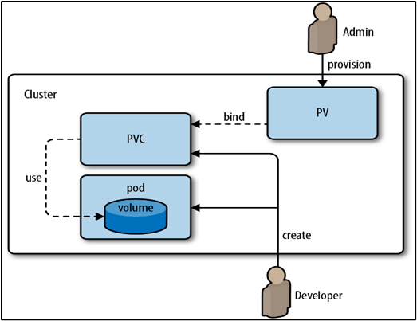

### Volumes 
Containers are ephemeral; they are only built to run as long as the processes they host are active. A container is initiated to perform a specific task and then discarded as soon as it is done. The data processed by the container is also destroyed as soon as it exits. Docker attaches volumes to containers to persist data generated by their Read/Write layers. Any data processed by the container is stored in these volumes and is available when the container exits.

The ephemeral nature of containers also brings challenges for critical applications running on Kubernetes. This is because when a container crashes, the Kubelet service may restart it, but it comes back up with a clean slate. Multiple containers running in one Pod may also need to share files. Pods themselves are transient, meaning they terminate as soon as the containers running inside them terminate. Kubernetes volumes create persistent storage for capturing cluster data. Volumes outlive containers and Pods, preserving cluster data even when Pods terminate. Attaching a volume to a Pod ensures that cluster data persists even in the event of Pod failure.


# Persistent Volumes (PV) and Persistent Volume Claims (PVC)

Persistent Volumes and Persistent Volume Claims are used for managing storage resources in a cluster. They help decouple the storage configuration from the Pod, providing a way to manage and share storage resources more flexibly

## Persistent Volume (PV):
A Persistent Volume (PV) is a representation of a physical storage resource in the cluster. It abstracts the underlying storage implementation and provides a way to manage and consume storage in a platform-independent manner. It could be a physical disk on a node, a network storage device, or any other form of storage. PVs are provisioned by administrators and are considered as a cluster resource.

Key characteristics of PVs include:

- Static Provisioning:

    PVs are statically provisioned by administrators. They are created in advance and made available for users to claim.

- Global Cluster Resource:

    PVs are considered global cluster resources, available for consumption by any Pod in the cluster.

- Storage Classes:

    PVs can be associated with Storage Classes, which define the provisioner and other parameters for dynamically provisioning storage.

- Access Modes:

    PVs have access modes that define how the storage can be accessed by Pods (e.g., ReadWriteOnce, ReadOnlyMany, ReadWriteMany).

- Persistent Volume Reclaim Policy: 

    PVs have reclaim policies that define what happens to the storage when the PV is released. Common policies include Retain (the PV is not deleted, and the administrator must manually reclaim the storage) , Delete (the storage is automatically deleted when the PV is released) and Recycle (the data is deleted byt volume is not).

- Storage class: 

    An optional parameter that defines the provisioner and parameters for dynamically provisioning PVs.

```yaml
apiVersion: v1
kind: PersistentVolume
metadata:
  name: my-pv
spec:
  capacity:
    storage: 5Gi
  volumeMode: Filesystem
  accessModes:
    - ReadWriteOnce
  persistentVolumeReclaimPolicy: Retain
  storageClassName: slow
  mountOptions:
    - hard
    - nfsvers=4.1
  nfs:
    path: /exported/path
    server: nfs-server.example.com
```
In this example:

- my-pv is the name of the Persistent Volume.
- 5Gi is the storage capacity.
- ReadWriteOnce is the access mode.
- Retain is the reclaim policy.
- slow is the associated Storage Class.
- The PV is backed by an NFS server.


### Structure of a PV yaml
A PV yaml containers 2 sections apiVersion , kind , metadata & spec. The spec needs 3 neccessary attributes

```yaml
apiVersion: v1
kind: PersistantVolume
metadata: ...
spec:
  capacity: ...
  accessModes: ...
  persistentVolumeReclaimPolicy: ...
```

- Capacity: The capacity field specifies the amount of storage available in the Persistent Volume. It defines the total size of the volume. For example:
```yaml
capacity:
  storage: 1Gi
```
- Access Modes: The accessModes field specifies how the volume can be accessed by Pods. Common access modes include ReadWriteOnce, ReadOnlyMany, and ReadWriteMany. For example:
```yaml
accessModes:
  - ReadWriteOnce
```
- Volume Mode (Optional): The volumeMode field specifies the type of volume. It can be either Filesystem (default) or Block. For example:
```yaml
volumeMode: Filesystem
```
- Persistent Volume Reclaim Policy: The persistentVolumeReclaimPolicy field determines what happens to the storage when the PV is released. Common policies include Retain and Delete. For example:
```yaml
persistentVolumeReclaimPolicy: Retain
```
- Storage Class Name (Optional): The storageClassName field associates the PV with a particular StorageClass. If specified, this allows the PV to be dynamically provisioned based on the rules defined in the corresponding StorageClass. For example:
```yaml
storageClassName: slow
```
- Volume Source (e.g., HostPath, NFS, etc.): The hostPath, nfs, or other specific fields define the source of the volume. This section varies based on the type of volume source. For example, for a hostPath:
```yaml
hostPath:
  path: "/tmp/data"
```

## Persistent Volume Claim (PVC)
A Persistent Volume Claim (PVC) in Kubernetes is a request for storage by a user or application. It is a higher-level abstraction that allows developers or administrators to consume storage resources without having to worry about the details of the underlying storage infrastructure. A PVC consumes resources from a Persistent Volume (PV) in the cluster.

Here are the key details about Persistent Volume Claims (PVCs):

- Dynamic Provisioning:

    One of the key features of PVCs is dynamic provisioning. When a PVC is created, it can dynamically provision a PV based on the requirements specified in the claim, such as storage capacity, access mode, and storage class. This simplifies the process for users, as they don't necessarily need to pre-provision PVs.

- Namespaced Resource:

    PVCs are namespaced objects, meaning they are specific to a particular namespace within the Kubernetes cluster. This allows for isolation and organization of resources.

- Storage Request Specification:

    When creating a PVC, users specify the amount of storage needed, the access mode required (e.g., ReadWriteOnce, ReadOnlyMany, ReadWriteMany), and other parameters like storage class.

- Binding to Persistent Volumes:

    When a PVC is created, it is in a "Pending" state until a suitable PV is found and bound to it. The binding process matches the requirements specified in the PVC with available PVs in the cluster.

- Reference in Pods:

    Once a PV is bound to a PVC, the PVC can be referenced in the Pod's specification. The Pod uses the PVC to request and consume the storage resources associated with the PV.

```yaml
apiVersion: v1
kind: PersistentVolumeClaim
metadata:
  name: my-pvc
spec:
  accessModes:
    - ReadWriteOnce
  storageClassName: slow
  resources:
    requests:
      storage: 5Gi
```
In this example:

- my-pvc is the name of the Persistent Volume Claim.
- ReadWriteOnce is the access mode, indicating that the storage can be mounted as read-write by a single node.
- slow is the name of the Storage Class associated with the PVC.
- 5Gi is the requested storage capacity.

### Structure of a PVC yaml
A PVC yaml containers 2 sections apiVersion , kind , metadata & spec. The spec needs 2 neccessary attributes

```yaml
apiVersion: v1
kind: PersistantVolumeClaim
metadata: ...
spec:
  accessModes: ...
  resources:
    requests:
      storage: ...
```

```yaml
apiVersion: v1
kind: PersistentVolumeClaim
metadata:
  name: my-pvc
spec:

# Access Modes: The accessModes field indicates how the storage can be accessed by Pods using the PVC.
  accessModes:
    - ReadWriteOnce
# Storage Class Name (Optional): The storageClassName field associates the PVC with a specific StorageClass. If specified, the PVC will be dynamically provisioned based on the rules defined in the corresponding StorageClass
  storageClassName: slow
# Resource Requests: The resources.requests field specifies the amount of storage requested. It indicates the minimum amount of storage required for the PVC.
  resources:
    requests:
      storage: 1Gi
```
### How do Persistance Volume and Persistance Volume Claim Works

- The administrator creates a PV, which represents a physical storage resource in the cluster. The PV can be provisioned statically or dynamically.
- The user or developer creates a PVC to request storage for their application. The PVC specifies the desired storage capacity and access modes.
- When a PVC is created, the Kubernetes control plane looks for a matching PV based on the requested capacity, access modes, and storage class (if specified). If a matching PV is found, the PVC is bound to that PV.
- Once the PVC is bound to a PV, the user or developer can use the PVC in their application's deployment configuration.

    

### Simple PV and PVC Demo

- Step 1: Create a Persistent Volume (PV)
    
Create a file named pv.yaml with the following content:

```yaml
apiVersion: v1
kind: PersistentVolume
metadata:
  name: my-pv
spec:
  capacity:
    storage: 1Gi
  accessModes:
    - ReadWriteOnce
  persistentVolumeReclaimPolicy: Retain
  hostPath:
    path: "/tmp/data"
```

This example creates a PV named my-pv with a capacity of 1 gigabyte, access mode set to ReadWriteOnce (can be mounted by a single node at a time), and a hostPath as the storage source.

Apply the configuration using: `kubectl apply -f pv.yaml`

- Step 2: Create a Persistent Volume Claim (PVC)

Create a file named pvc.yaml with the following content:

```yaml
apiVersion: v1
kind: PersistentVolumeClaim
metadata:
  name: my-pvc
spec:
  accessModes:
    - ReadWriteOnce
  storageClassName: ""
  resources:
    requests:
      storage: 1Gi
```
This example creates a PVC named my-pvc requesting 1 gigabyte of storage with the ReadWriteOnce access mode.

Apply the configuration using: `kubectl apply -f pvc.yaml`

- Step 3: Verify and Use
Check the status of the PV and PVC:
```bash
kubectl get pv
kubectl get pvc
```
Now, let's create a Pod that uses the PVC. Create a file named pod.yaml:

```yaml
apiVersion: v1
kind: Pod
metadata:
  name: mypod
spec:
  containers:
  - name: mycontainer
    image: nginx
    volumeMounts:
    - name: my-volume
      mountPath: "/usr/share/nginx/html"
  volumes:
  - name: my-volume
    persistentVolumeClaim:
      claimName: my-pvc
```
Apply the configuration using: `kubectl apply -f pod.yaml`


This Pod uses the PVC named my-pvc, and the storage from the PV my-pv is mounted to the path /usr/share/nginx/html inside the container.

### Storage Classes
In Kubernetes, a StorageClass is an abstraction that defines the characteristics and parameters for dynamically provisioning storage resources. It allows administrators to define different classes of storage and enables users to request storage without needing to know the underlying details of the storage infrastructure.

Key features of StorageClass in Kubernetes include:

- Dynamic Provisioning:

    StorageClass facilitates dynamic provisioning, allowing PVs to be automatically created when Persistent Volume Claims (PVCs) are made, based on the specified class.

- Parameters:

    Administrators can define parameters within a StorageClass, such as the provisioner (the type of storage system), storage capacity, access modes, and any other vendor-specific or driver-specific settings.

- Multiple Storage Classes:

    Clusters can have multiple StorageClasses, each representing a different type or class of storage. This enables users to choose the appropriate class when making a PVC, based on their application's requirements.

- Storage Provisioners:

    A StorageClass specifies a provisioner, which is responsible for creating the actual PVs. Different provisioners support various storage systems, such as cloud-based storage, network-attached storage, or local disks.

- Default StorageClass:

    Clusters can have a default StorageClass that is used when a PVC does not specify a class. This is especially useful when users don't have a specific preference or need for a particular storage class.

Here's a simplified example of how a StorageClass might be defined:

```yaml
apiVersion: storage.k8s.io/v1
kind: StorageClass
metadata:
  name: slow
provisioner: example.com/slow-provisioner
parameters:
  type: slow
```
In this example:

- slow is the name of the StorageClass.
- example.com/slow-provisioner is the provisioner responsible for creating PVs.
- type: slow is a parameter specific to this StorageClass, possibly indicating the type or characteristics of the storage.
- When a user creates a PVC and specifies the storage class as slow, Kubernetes will use the parameters defined in the slow StorageClass to dynamically provision a PV that matches the user's requirements.

StorageClasses provide a powerful way to abstract and manage storage resources in a Kubernetes cluster, enabling a more flexible and dynamic approach to storage provisioning.

When using PVs as explored in the previouly, a physical storage disk has to be created on the Cloud every time a volume is created. This is known as static provisioning. Storage Classes offer dynamic storage provisioning. This is where a provisioner such as GCE Storage or AWS EBS is defined to automatically provision storage on the specific cloud service and attach it to Pods when they make a PVC.

A Storage Class object is crucial since administrators can use it to map the quality of storage to certain policies and tags, allowing them to create different ‘profiles’ for users requesting storage. Administrators create different storage classes by stating the name provisioned and other parameters in a YAML definition file. These parameters vary from one provisioner to another and may include mount options, reclaim policies, and volume expansion capability, among others. A typical manifest file for a Storage Class provisioning volumes using AWS EBS would look similar to:   

```yaml
apiVersion: storage.k8s.io/v1
kind: StorageClass
metadata:
  name: aws-standard
provisioner: kubernetes.io/aws-ebs
parameters:
  type: gp2
reclaimPolicy: Retain
allowVolumeExpansion: true
```

The Storage Class name is then specified in the PVCs manifest under the  specification, as shown: 
```yaml
spec:
  accessModes:
ReadOnlyOnce
  storageClassName: aws-standard
  resources:
     requests:
        storage: 500Mi
```

The Storage Class automatically creates the PV and any other associated storage as soon as it initiates, eliminating the need to create one for each PVC. Each time a user creates a PVC request, the Storage Class orders the provisioner to create a disk on Google Cloud that fulfills the request. There are plenty of Storage Classes from different providers, including  FlexVolume, CephFS, PortworxVolume, GCEPersistentDisk, and Cinder, among others. 


Some common storage class values that are often used:
1. `standard`: This is a commonly used storage class that represents the default or standard storage provisioned by the cluster. It usually provides balanced performance and can be used for general-purpose storage.
2. `gp2` (Amazon EBS): This storage class is specific to Amazon Elastic Block Store (EBS) volumes on AWS. It provides General Purpose SSD (gp2) volumes with a balance of price and performance.
3. `io1` (Amazon EBS): This storage class is also specific to Amazon EBS volumes on AWS. It provides provisioned IOPS (io1) volumes, which are designed for applications that require higher performance and predictable I/O.
4. `ssd` or `premium`: These storage class names are often used by cloud providers or storage vendors to represent solid-state drive (SSD) storage with higher performance characteristics.
5. `hdd` or `standard`: These storage class names are often used by cloud providers or storage vendors to represent hard disk drive (HDD) storage with lower performance characteristics but higher storage capacity.
6. `local`: This storage class is used to represent local storage attached directly to the worker nodes in your cluster. It can be useful for certain types of workloads that benefit from low-latency access to local storage.

### AccessModes :
1. `ReadWriteOnce` (RWO): This access mode allows the volume to be mounted as read-write by a single node (Pod) in the cluster. It is typically used for scenarios where the volume should be exclusively mounted and written to by a single node at a time.
2. `ReadOnlyMany` (ROX): This access mode allows the volume to be mounted as read-only by multiple nodes (Pods) simultaneously. It is useful for scenarios where multiple Pods need read-only access to the same data, such as for sharing configuration files or static content.
3. `ReadWriteMany` (RWX): This access mode allows the volume to be mounted as read-write by multiple nodes (Pods) simultaneously. It enables multiple Pods to read from and write to the same volume concurrently. However, not all storage solutions support this access mode. It's important to ensure that your storage provisioner supports RWX if you plan to use it.


## Commands

```bash
# List all Persistent Volumes
kubectl get persistentvolume
kubectl get pv
kubectl get pv -o wide
kubectl get pv -o json
kubectl get pv -o yaml

# Describe a specific Persistent Volume
kubectl describe pv <pv-name>
# Delete a Persistent Volume
kubectl delete pv <pv-name>

# List all Persistent Volume Claims
kubectl get pvc
# Describe a specific Persistent Volume Claim
kubectl describe pvc <pvc-name>
# Delete a Persistent Volume Claim
kubectl delete pvc <pvc-name>
# Create or Apply a PVC from a YAML file
kubectl apply -f my-pvc.yaml

# List all Storage Classes
kubectl get storageclass
# Describe a specific Storage Class
kubectl describe storageclass <storageclass-name>
# Delete a Storage Class
kubectl delete storageclass <storageclass-name>
# Create or Apply a Storage Class from a YAML file
kubectl apply -f my-storageclass.yaml

```

### Task 1 : Crete StorageClass , PV and PVC 
- Creta a pv that is mapped to the path /home/ec2-user/data on a amazon linux 2023 host 
- The PV should be provisioned by a storageclass that supports hostpath provisioning
- create a pvc to claim that pv

```yaml
apiVersion: storage.k8s.io/v1
kind: StorageClass
metadata:
  name: standard
provisioner: kubernetes.io/hostpath
```
```yaml
apiVersion: v1
kind: PersistentVolume
metadata:
  name: mysql-pv
spec:
  capacity:
    storage: 5Gi
  accessModes:
    - ReadWriteOnce
  persistentVolumeReclaimPolicy: Retain
  storageClassName: standard
  hostPath:
    path: /home/ec2-user/mysql/data
```
```yaml
apiVersion: v1
kind: PersistentVolumeClaim
metadata:
  name: mysql-pvc
spec:
  accessModes:
    - ReadWriteOnce
  resources:
    requests:
      storage: 5Gi
  storageClassName: standard
```
