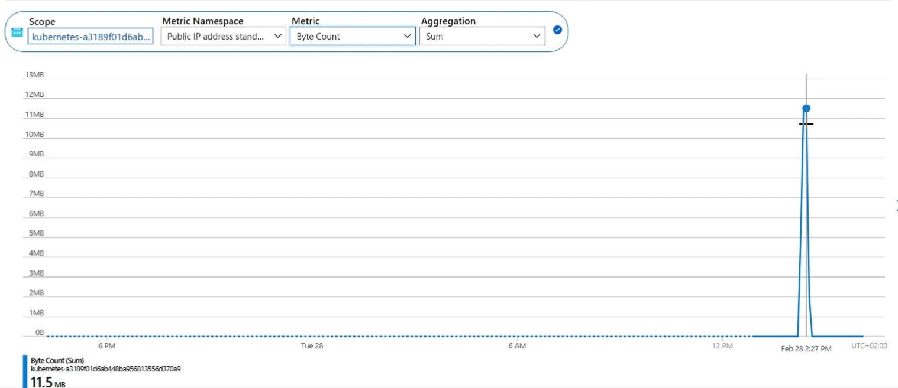
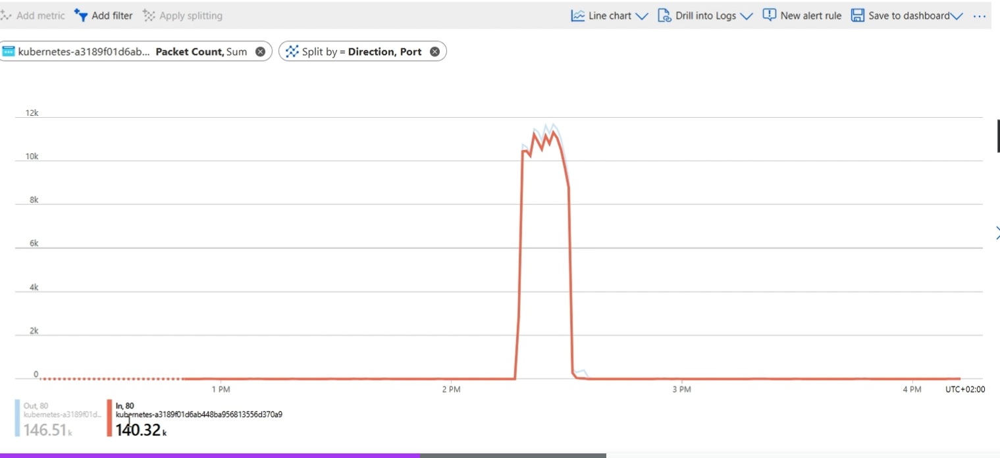

### Azure Activity Logs & Azure Moniter
- The Activity Logs feature in Azure provides visibility into all actions taken and modifications made within an Azure subscription, resource group, or resource.
- Activity Logs record administrative operations and events such as resource creation, deletion, and updating.
- These logs are stored and analyzed using Azure Monitor, which gathers data from various sources including Azure resources, apps, and infrastructures.
- **Availability** : Activity logs are available for the entire AKS cluster or for specific resources that are part of the cluster's infrastructure.
- **Retention and Costs**: Events from activity logs are retained in Azure for 90 days before being erased, regardless of volume.
    - There is no fee for storing these entries during the 90-day retention period.
    - For extended functionality, such as longer retention, users can set a diagnostic setting on the resource and route entries to another location.

**Uses of Activity Logs**
- Tracking resource changes
- Diagnosing problems
- Auditing compliance
- Performing trend analysis on usage and performance

**Azure Monitor with Activity Logs**
- Azure Monitor enables the creation of alerts, dashboards, and reports using information from activity logs.
- This provides insights into the security and functionality of the Azure environment.


### **Navigating the Activity Log**
**Accessing the Activity Log**
   - Open the Azure portal and navigate to the Activity Log blade.
   - Set the time range to the last two weeks and apply the filter.

**Viewing Events**
   - A variety of events are displayed, such as the cluster start operation etc.
   - The operation's details are displayed when you click on it. It includes summary , the opeartion details in JSON format and chage history.

**Examining Event Details**
   - Click on an event to view a summary and detailed JSON information about the operation and change history.
   - The change history shows details at the cluster level and node pool level.
   - Comparing configurations: Opening a specific event reveals the old and new configurations, highlighting changes (e.g., power state change from stopped to running).

**Exporting and Using Activity Logs**
1. **Export Options**
   - Activity logs can be exported using diagnostic settings.
   - Specify categories of activity logs to send to different destinations:
     - Log Analytics workspace
     - Storage account
     - Event Hub
     - Partner solutions

2. **Additional Features**
   - Download logs as CSV files.
   - Access insights options.
----
### Diagnose & Solve Problems and Ask Jenny in AKS
**Diagnose and Solve Problems Feature**
- **Purpose**: Helps users identify and troubleshoot issues within their AKS cluster.
- **Centralized Dashboard**: Provides a view of cluster health and performance, along with detailed insights at the cluster level, individual nodes, or containers.
- **Best Practices and Recommendations**: Offers actionable recommendations on fixing issues like misconfigured resources or bottlenecks, based on telemetry data.
- **Automatic Configuration**: Requires no user input and incurs no additional billing costs.

**Using the Diagnose and Solve Problems Blade**
1. **Accessing the Feature**
   - Navigate to the "Diagnose and Solve Problems" blade in the Azure portal.
   - The dashboard categorizes issues into sections like Known Issues, Availability and Performance, Connectivity Issues, Create/Upgrade/Delete/Scale, Identity and Security, Best Practices, and Node Health.

2. **Exploring Categories and Checks**
   - **Known Issues**: Displays observations like the use of B-series Burstable VMs, which are not recommended for production environments.
   - **Detailed Insights**: Provides guidance on why certain configurations (e.g., Burstable VMs) are not recommended and links to further resources.
   - **Connectivity Issues**: Shows the status of connectivity checks, ensuring there are no current issues.
   - **Best Practices**: Highlights recommendations, such as avoiding B-series VMs in production and offers a comprehensive summary and recommendations for non-production resources.

**Ask Jenny Feature**
- **Purpose**: Provides a conversational interface for users to ask natural language questions and receive answers and recommendations.
- **Functionality**: Uses AI and machine learning to provide personalized responses related to Azure services.
- **Usage**: Users can ask questions about their AKS cluster or other Azure services, and Jenny will provide relevant information and resources.
---
### **Azure Status and Resource Health**
**Azure Status** (https://azure.status.microsoft/en-in/status)
- Azure Status website provides real-time updates on the health of Azure services and regions.
- It offers information on service outages, planned maintenance, and other events impacting service availability.

**Features**
- Users can view the current status of Azure services.
- Notifications about service disruptions can be received via email or RSS feed.
- Transparency is ensured, helping users plan and manage their Azure workloads effectively.
- Root cause analysis is added for specific outages when available.

**Resource Health**
- Provides personalized information on the current and past health status of Azure resources.
- Proactively alerts users to issues affecting the operation, performance, or availability of resources.
- Offers specific and recommended actions for identified issues.

**Health Status Indicators**
   - **Available**: No known issues impacting the resource.
   - **Unavailable**: Issues detected that impact the resource.
   - **Unknown**: Health status cannot be obtained, likely because the resource is stopped.
   - **Degraded**: Resource is usable but has performance degradation.

**Accessing Resource Health**:
- Open the Azure portal and navigate to the Resource Health blade.
- Example screenshot provided in the presentation shows various health statuses.
----
### **Azure Advisor**
- Azure Advisor is a personalized cloud consultant that helps optimize Azure deployments by providing best practice recommendations.

**Purpose and Functionality**
- **Optimization Goals**: Enhances efficiency, performance, security, and reliability of Azure resources.
- **Recommendation Categories**: Focuses on reliability, security, performance, cost, and operational excellence.

**Using Azure Advisor in Azure Portal**
1. **Accessing Recommendations**
   - Navigate to the Azure portal and find the Advisor recommendations.
   - Refresh the recommendations to see the latest insights.

2. **Example Recommendations**
   - **Operational Excellence**: 
     - **Use Ephemeral Disks**: Recommendation provided for the cluster in use. 
     - **Actionable Steps**: Link to enable ephemeral disks on existing clusters.
     - Options to postpone or dismiss the recommendation.
   - **Global Search**: 
     - Search for "Advisor" to access Advisor Score at the subscription level.
     - View all recommendations across all resources in the subscription.
---
### **Azure Metrics Explorer**

- Metrics Explorer in Azure Monitor allows users to explore and analyze metrics data gathered from Azure resources.
- Users can create custom charts and dashboards, set alerts, and examine patterns over time.
- **User-Friendly Interface**: Simplifies monitoring the performance and health of Azure resources.
- **Default Availability**: Available by default for most Azure resources without specific configuration.


**Accessing Metrics Explorer in AKS**
- Various ways to open Metrics Explorer:
    - Directly from the Monitoring tab in AKS Overview page.
    - Through specific resource blades under the Monitoring section.

**Exploring Node Pool Metrics**
- Example: Node pool CPU usage.
   - Displayed metrics:
     - CPU percentage (average) for the last hour.
     - Adjusting time range to 4 hours shows more data.
   - Visualization: Split data by node pool name and node name to see individual node metrics.
   - Interpretation: Dotted lines indicate periods with no metrics due to the cluster being stopped.

**Selecting and Analyzing Metrics**
- Example: Cluster memory availability.
   - Metrics include: Total available memory in the cluster over 24 hours.
   - Additional metrics:
     - CPU usage percentage over 4 hours.
     - Adding metrics:
       - Overlay memory usage percentage with CPU usage.
       - Change aggregation from average to maximum.

**Customizing Visualizations**
- Various chart types available:
     - Line chart, bar chart, scatter chart.
     - Grid view for summaries.
- Customization options:
     - Add alerts, share, or add charts to a dashboard.

**Advanced Metrics Analysis**
- Example: Pod metrics by phase.
   - Splitting metrics:
     - Apply splitting by pod name and phase.
     - Visualize states like running or pending for each pod.
   - Display options:
     - Use different chart types to better visualize data.
     - Share or export metrics as needed.
---

### **Metrics Explorer for Infrastructure Resources**
- We can explore Metrics Explorer for resources in the infrastructure resource group of an Azure Kubernetes Service (AKS) cluster.

**Public IP Metrics**
- We conducted a stress test using Siege to generate traffic on the public ip .
    ```bash
    seige -d 1 c 60 -t http://<ip>:<port>
    ```

**Analyzing Public IP Metrics**
- Navigate to the public IP resource and select Metrics.
   - **Metrics to Monitor**:
     - **Byte Count**: Shows spikes in traffic during the stress test.
     
     - **Packet Count**: Also shows spikes correlating with the byte count.
   - **Splitting Metrics**: 
     - By value direction (inbound/outbound) and port.
     - Example: Port 80, corresponding to the application’s port.
     

**Analyzing VM Metrics**
-  Navigate to the VM resource and select Metrics.
   - **Metrics to Monitor**:
     - **Disk Read Bytes**: Shows data read from the disk.
     - **Time Range**: Set to 4 hours for detailed analysis.
     - Observation of a spike after the cluster starts, indicating applications being recreated on the node.
---
### **Container Insights in Azure Kubernetes Service (AKS)**
- Container Insights is a monitoring and troubleshooting solution provided by Azure Monitor for AKS and other azure resources
- **Data Collection and Analysis**: It collects, views, and analyzes container logs, metrics, and telemetry data from all containers in the AKS clusters.
- **Troubleshooting**: Allows users to drill down into container logs and performance metrics at node, controller, and container levels.
- **Health and Performance Monitoring**: Monitors the health and performance of Kubernetes infrastructure, including nodes, pods, and containers.

**Key Features**
- **Out-of-the-Box Dashboards**
   - Provides dashboards for key metrics such as container CPU and memory utilization.
   - Helps identify trends and potential issues before they impact workloads.
- **Integration with Azure Monitor** : Fully integrated with Azure Monitor for seamless monitoring and alerting.

#### **Enabling Container Insights**
- To enable Container Insights, use the **"monitoring"** add-on.It requires another Azure resource called **"Log Analytics workspace"**.

#### **Log Analytics Workspace**
- is a centralized area for gathering, storing, and analyzing log data from various sources.
- It provides advanced querying options and visualizations.
- Helps manage and track logs and analytics from Azure Resources.

#### **Azure Monitoring Agent (AMA)**
After enabling the monitoring add-on, the **"Azure Monitoring Agent (AMA)"** pods gets deployed in the cluster.It collects monitoring data from the guest operating system.

**Steps to Enable Container Insights**
1. **Create or Select a Log Analytics Workspace**: 
   - Ensure you have a Log Analytics workspace ready.
2. **Enable Monitoring Add-On**: 
   - Use the Azure portal or command line tools to enable the monitoring add-on for your AKS cluster.
3. **Deploy Azure Monitoring Agent**: 
   - The AMA will automatically be deployed in your cluster to start collecting data.

**Steps to Enable Container Insights**
- **While creating the cluster on the Portal**:
    - Under integrations enable container monitering
    - below that select "create a new workspace" -> provide name
    - Uncheck "enable recommended alerts" for now
    - review and create
---
### **Exploring Container Insights in AKS**
**Accessing Container Insights**
- Find the Insights tab under Monitoring in the Azure portal.
- Open the Insights tab to view various performance metrics.

#### **Cluster Metrics**:
**Node CPU Usage**:
- Graphs show CPU usage for nodes.
- High CPU usage will be observed if CPU-intensive test applications are running.
   - **Node Memory Usage**:
     - Shows total memory capacity and allocatable memory.
     - Charts display memory utilization including working set and resident memory.

**Memory Utilization**:
- **Memory Working Set**:
     - Total memory used by applications, including both resident and virtual memory (cache).
- **Memory Resident Set**:
     - Main memory accessible to applications, excludes cache.
     - Represents actual machine memory available to cluster nodes.
- **Virtual vs. Resident Memory**:
    - **Resident Memory**: Actual physical memory available to the cluster node.
    - **Virtual Memory**: Reserved hard disk space used by the operating system under memory pressure.
        - Data is shifted between memory and disk as needed to manage resources.
#### **Node & Other Metrics**:
**Node Metrics**
- Nodes are displayed with their respective limits and usage metrics.
- Each node's CPU and memory usage are monitored and compared against their limits.
- **Pod Analysis**:
  - Pods running on each node are listed, along with their CPU and memory usage.
  - Detailed breakdown of resource consumption helps identify resource-intensive pods.
**Controller Metrics**
- **Replica Sets and Daemon Sets**:
  - Detailed information about controller objects, including resource usage metrics.
  - Provides insights into the resource consumption of different controller types.

**Container Metrics**
  - Drill down into individual pods and containers to analyze resource usage.
  - Metrics include CPU usage, memory working set, and memory RSS.
- **Live Logs and Events**: Access real-time logs and events for troubleshooting and monitoring purposes.

**Customization and Insights**
- **Data Analysis**:
  - Ability to switch between CPU and memory metrics for deeper analysis.
  - Utilize features like minimum, maximum, and average to gain insights into resource utilization trends.
- **Resource Optimization**:
  - Identify resource-intensive pods and containers to optimize resource allocation.
  - Take proactive actions to prevent performance issues and ensure smooth cluster operation.


