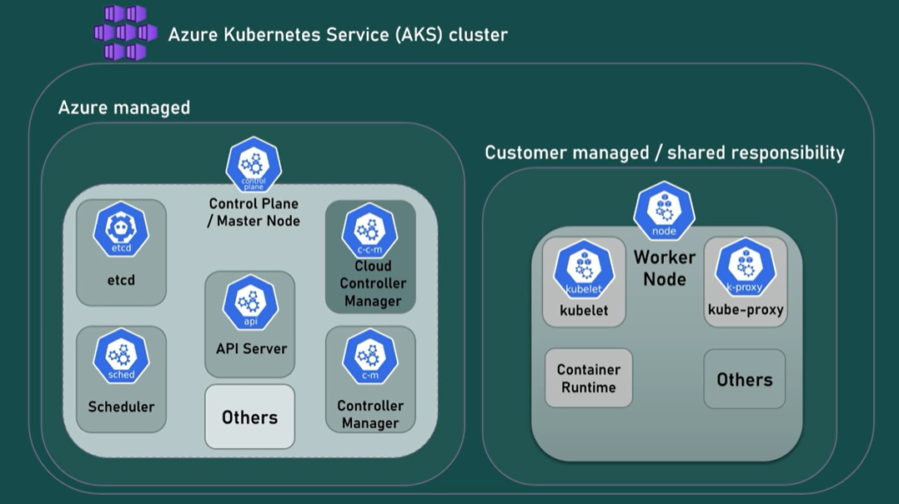
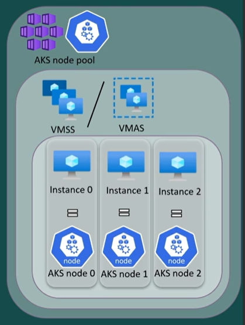
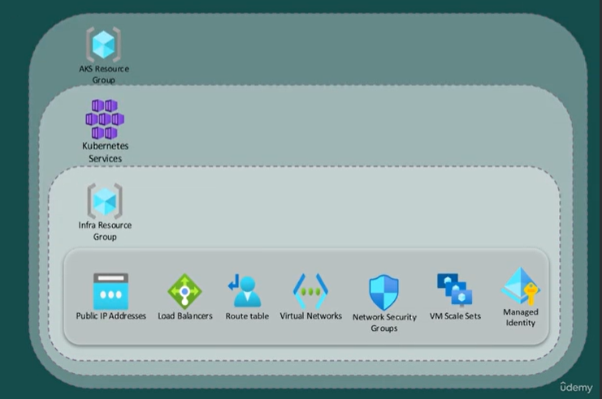

## Azure Kubernetes Service (AKS)

Azure Kubernetes Service (AKS) is a managed container orchestration service provided by Microsoft Azure. It simplifies the deployment, management, and scaling of containerized applications using Kubernetes, an open-source platform for automating the deployment, scaling, and management of containerized applications
Azure handles tasks such as provisioning, scaling, and upgrading the Kubernetes clusters, allowing developers to focus more on building and deploying their applications

- By shifting the operational burden to Azure,it makes it easier to install a managed Kubernetes cluster on Azure
- AKS enables automatic scaling of clusters based on demand, ensuring that applications are highly available and responsive.
- Simple and efficient way to deploy, manage, and operate Kubernetes
- Azure handles critical tasks and components like the control plane, health monitoring and maintenance so you can focus on deploying, developing, and maintaining your application
- AKS provides built-in security features such as network policies, role-based access control (RBAC), and integration with Azure Security Center to help protect containerized applications and data.

- Provides a lot of features and benefits like:
    - Quick creation
    - Manual and auto-scaling
    - Manual and auto-upgrade
    - Security
    - Monitoring
    - Ecosystem
    - ...

### Responsibility Models for AKS

- Azure Managed Responsibilities:

    Microsoft manages the underlying infrastructure and control plane components of AKS, including the management of physical servers, networking, storage, and the Kubernetes control plane.
    Microsoft ensures the availability, scalability, and security of the AKS service itself, including regular updates, patches, and monitoring of the AKS control plane.

- Customer Managed Responsibilities:

    Customers are responsible for securing their containerized applications, Kubernetes configurations, and data within AKS clusters.
    This includes securing the container images, configuring access controls (e.g., RBAC), implementing network policies, managing secrets and sensitive data, and ensuring compliance with regulatory requirements.
    Customers are also responsible for monitoring the health and performance of their applications running on AKS, as well as managing application-level scaling, updates, and backups.

- Shared Responsibilities:

    As with the broader Azure shared responsibility model, certain aspects of security are shared between Microsoft and customers.
    For example, Microsoft provides security features at the infrastructure and platform level, such as network isolation, encryption at rest, and built-in DDoS protection. However, customers are responsible for configuring network security groups, implementing encryption in transit, and securing their applications and data within AKS.
    


-------

# Azure AKS Pricing

## Azure Pricing
- Azure free accounts provides
    - $200 credit for the first 30 days
    - 12 months for free for some Azure products
    - Always free option for specific Azure products, including AKS (includes limitations)

## Azure AKS Costs
- no cost for management side
- control plane is hosted on azure and is free (for the Free Tier)
- AKS provides 3 tiers for use
    - Free tier	(Free)
    - Standard tier	(paid)
    - Premium tier (paid)
- the worker node/vms are chargeable and are charged as per the vm/node charges for all tiers
- You need yto pay for other Azure Resouces used in conjction like
    - associated storage
    - network resources consumed
    - azure monitering , log analytics workspace etc


## Types of AKS Pricing Tiers

`Free tier`	:
- Fetures : No Autoscaling , Smaller control plane limits
- When to use : You want to experiment with AKS at no extra cost
- Supported cluster types
- Pricing : Control Plane is Free ,  nodes: Only pay for what you use

`Standard tier`	
- Features : API Server Autoscaling , Larger control plane limits
- When to use : You're running production or mission-critical workloads and need high availability and reliability & you need a financially backed SLA
- Supported cluster types : Enterprise-grade or production workloads clusters with up to 5,000 nodes
- Pricing : Cluster: $0.10 per cluster per hour , nodes: Only pay for what you use

`Premium tier`
- Features : API Server Autoscaling , Larger control plane limits
- When to use
    - You're running production or mission-critical workloads and need high availability and reliability & You need a financially backed SLA.
    - All mission critical, at scale or production workloads requiring 2 years of support
- Supported cluster types : Enterprise-grade or production workloads clusters with up to 5,000 nodes
- Pricing : Cluster: $0.60 per cluster per hour , nodes: Only pay for what you use

------

## Creating a simple AKS Cluster

We can create AKS Cluster in 2 ways
- Azure CLI (install azure cli - https://learn.microsoft.com/en-us/cli/azure/install-azure-cli)
- Azure Portal

When we create a AKS cluster , it internally creates a new resource group called as `Managed Resource Group`. This resource group contains other resources that are required for proper functining of the aks cluster 

### Create a simple AKS Cluster using Azure CLI
0. Login to Azure CLI using `az login`
1. Create a resource group (https://learn.microsoft.com/en-us/cli/azure/group?view=azure-cli-latest#az-group-create)
    ```bash
    az group create -l <location> -n <resource-group-name>
    az group create -l eastus -n aks-rg
    ```
2. Create aks cluster (https://learn.microsoft.com/en-us/cli/azure/aks?view=azure-cli-latest#az-aks-create)
    ```bash
    az aks create -g <resource-group-name> -n <aks-cluster-name> --node-count <node-count> --generate-ssh-keys
    az aks create -g aks-rg -n aks-demo --node-count 2 --generate-ssh-keys

    # the --generate-ssh-keys is used to generate SSH public and private key files if missing. The keys will be stored in the ~/.ssh directory.
    # it is used to simplify the process of setting up SSH access to the AKS cluster nodes because you don't need to manually generate SSH key pairs and upload the public key to Azure. Azure handles this process automatically during cluster creation.
    ```

### Create a simple AKS Cluster using Azure Portal
1. Goto Azure Kubernets Service on the portal. Click + and select Create Kubernetes Cluster
2. Select/create the resource group
3. Fill the following options
    - Cluster preset configuration : Dev/Test
    - Availablity Zone : None
    - Pricing Tier : Free
    - Automatic Upgrade : disabled
    - Node Size : present from "Cluster preset configuration"
    - Scaler method : manual
    - Node Count : 3
    - skip node pools page
    - Authentication and Authorization : Local Accounts with Kubernetes RBAC
    - Network configuration : kubenet
    - Network policy : none
    - Azure Moniter : off
4. Skip Everything else . Review + Create

### Interacting with the AKS Cluster

To intercat with the kubernetes cluster , we need 2 components
- azure cli (installation - https://learn.microsoft.com/en-us/cli/azure/install-azure-cli)
- kubectl

kubectl can be installed in 2 ways
- using the `sudo az aks install-cli` command (https://learn.microsoft.com/en-us/cli/azure/aks?view=azure-cli-latest#az-aks-install-cli)
- official kubernetes (https://kubernetes.io/docs/tasks/tools/)

Or you can alos connect to te cluster using the `Azure Cloud Shell` , which by default comes with both azure cli and kubectl
- when you access the cloud shel for the first time , it requests a file storage area (Azure Storage) which acts as the home directorry for thr shell

Once the required components are selected , to interact with the cluster use below steps
- If using Azure CLI
    - Login to your azure account : `az login`
    - Set the cluster subscription : `az account set --subscription <subscription-id>`
    - Download cluster credentials : `az aks get-credentials --resource-group <rg-name> --name <aks-name> --overwrite-existing`
        - creds get stored at `C:\Users\<user-name>\.kube\config` or `~/.kube/config`
- If using Cloud Shell 
    - Set the cluster subscription : `az account set --subscription <subscription-id>`
    - Download cluster credentials : `az aks get-credentials --resource-group <rg-name> --name <aks-name> --overwrite-existing`
---

## Understanding CIDR

Azure Kubernetes Service (AKS) clusters are deployed within a virtual network (VNet) in Azure. This virtual network provides networking capabilities for the AKS cluster and its associated resources. Here's an overview of how the virtual network of an AKS cluster works:

1. **Default VNet Integration**:
   - When you create an AKS cluster, Azure automatically provisions a new virtual network (VNet) for the cluster if you don't specify an existing VNet. This VNet is created in the same resource group as the AKS cluster.

2. **Subnet Configuration**:
   - Within the VNet, AKS creates two subnets: one for the AKS cluster nodes and another for the Azure Firewall (if enabled). The subnet for the AKS cluster nodes is where the worker nodes of the AKS cluster are deployed. You can customize the subnet configuration during cluster creation or use the default settings.

3. **Networking Components**:
   - The virtual network for the AKS cluster includes various networking components such as network security groups (NSGs), route tables, and Azure Load Balancers.
   - Network security groups are applied to control inbound and outbound traffic to and from the AKS cluster nodes.
   - Route tables define the routing rules for network traffic within the virtual network.
   - Azure Load Balancers are used for load balancing traffic to the AKS cluster nodes.

4. **Security and Isolation**:
   - The virtual network of the AKS cluster provides network isolation and security boundaries for the cluster nodes, helping to protect against unauthorized access and network-based attacks.
   - By default, AKS clusters are deployed with network policies enabled, allowing you to define and enforce network traffic policies at the pod level within the cluster.


### **Pod CIDR Range**:
   - The pod CIDR range is a configurable parameter that you specify during AKS cluster creation. It defines the range of IP addresses that Kubernetes can assign to pods within the cluster.
   - Pod CIDR (Classless Inter-Domain Routing) range is a subnet within the virtual network (VNet) that you specify or create when deploying the AKS cluster. The pod CIDR range defines the IP address range that Kubernetes assigns to pods running within the AKS cluster.
   - The pod CIDR range must not overlap with any existing IP address ranges within the VNet, including other subnets and address spaces used by other resources within the Azure environment to avoid conflicts and routing issues.
   - Additionally, the pod CIDR range should not overlap with the address spaces of other VNets or on-premises networks that might be connected to the VNet through Azure Virtual Network Peering or VPN Gateway.
   - the rnage cannot be edited once created, so make sure it is large enough

You can cross check the Pod CIDR in the overview blade in aks and compare it with the output from `kubectl get pods -o wide` . If your network plugin is `kubenet` then you might see it , if it is `Azure CNI` you might not see the Pod CIDR in the overview blade

### **Service CIDR**
The Service CIDR range is used to allocate IP addresses for Kubernetes services. These services act as internal load balancers, enabling communication between pods and abstracting the underlying pod IP addresses.

- This address range should not be used in any outher n/w env that AKS uses or connects to eg on prem, vnet using express routes , site2site vpn connection

- This range cannot be changed after cluster creation

- **Separation from Pod CIDR**: The Service CIDR range and Pod CIDR range should not overlap to avoid conflicts between pod IPs and service IPs.

- **Default Range**: A default Service CIDR range is assigned if not specified explicitly during cluster creation.
 
- In this CIDR , there is a `DNS Service IP`. it is an IP address assigned to the Kubernetes DNS service within the cluster. This IP address is used by pods and other Kubernetes resources to resolve DNS queries for service discovery and communication.

    - it is used by pods within the Kubernetes cluster to resolve DNS queries for service discovery and communication.
    - Kubernetes assigns a unique IP address to the DNS service, which is used as the DNS resolver for all DNS queries originating from pods within the cluster. 
        ```bash
        kubectl get svc kube-dns -n kube-system
        kubectl describe endpoints kube-dns -n kube-systen | grep -i "Addresses"
        kubectl get pods -o wide -n kube-systen | grep -i "coredns"
        ```
    - Default IP: a default DNS service IP is assigned if not specified explicitly during cluster creation. The default DNS service IP typically falls within the Service CIDR range defined for the cluster.
    
-----
## Node Pools

Node pool is a grouping of nodes (virtual machines) within an AKS cluster that share the same configuration settings, such as VM size, OS image, and availability zones. Node pools provide flexibility and scalability in managing compute resources within an AKS cluster

- In AKS , we do not create VMSS or VMAS , but be create node pools. A node pool creation will result in provisioning of a VMSS or VMAS
- Node pools allow you to manage and scale the compute capacity of your AKS cluster independently by adding or removing nodes within specific pools.
- Each node pool can have its own configuration settings, such as VM size, OS image, and disk type, allowing you to optimize resources for different workloads or requirements.
- Managed Node Pools:
    - AKS supports managed node pools, which are fully managed by Azure. With managed node pools, Azure handles node provisioning, scaling, and maintenance tasks such as OS upgrades and security patches automatically.
- Node Scaling:
    - You can scale the number of nodes in a node pool dynamically based on workload requirements or resource utilization. AKS supports both manual and auto-scaling modes for node pools.
    - With auto-scaling, AKS automatically adjusts the number of nodes in a node pool based on metrics such as CPU utilization or pod scheduling requirements, ensuring efficient resource utilization and responsiveness to workload changes.


### Multiple Node Pools
- Multiple node pools allow you to run different types of workloads or applications within the same AKS cluster, each with its own set of resources and configurations.
- You can use multiple node pools to segregate workloads based on resource requirements, availability needs, or other factors, enabling better resource utilization and management.
- Each node pool operates independently within the same AKS cluster, allowing you to isolate workloads and allocate resources (such as CPU, memory, and GPU) based on workload requirements.
- Custom Configuration: You can specify different configurations for each node pool, including VM size, OS image, disk type, and availability zones, to optimize performance, cost, and availability for different workloads.

### Types of Node Pools

In Azure Kubernetes Service (AKS), there are two main types of node pools: system node pools and user node pools. Here's a breakdown of each:

`System Node Pools`:
- System node pools are created by default when you provision an AKS cluster.
- These node pools are managed by AKS and are responsible for running system components and critical infrastructure services required for the operation of the Kubernetes cluster itself.
- System node pools typically include components such as control plane nodes, Kubernetes system pods (e.g., kube-proxy, kube-dns, coredns), and other system-level services.
- You cannot directly modify or delete system node pools, as they are essential for the functioning of the AKS cluster.

`User Node Pools`:
- User node pools are additional node pools that you can create and manage within an AKS cluster for running your workloads.
- Unlike system node pools, user node pools are intended for running your applications, services, and workloads, rather than system-level components.
- User node pools provide flexibility in configuring VM sizes, availability zones, scaling options, and other settings based on your workload requirements.
- You can create multiple user node pools with different configurations to accommodate various types of workloads within the same AKS cluster.
--------------

## Connecting to AKS Nodes
- by default aks nodes do not have public ip so we cannot access them directly
- there are multiple ways to connect to the aks nodes , here we will discuss the official microsoft method (https://learn.microsoft.com/en-us/azure/aks/node-access) and using 3rd part tool known as `kubectl node shell`

### Access nodes using the Kubernetes API (Official Method)
This method requires usage of kubectl debug command

- `SSH using kubectl debug`
    To create an interactive shell connection, we use the `kubectl debug` command to run a privileged container on the node.

    ```bash
    # list your nodes , to get the node name
    kubectl get nodes -o wide

    # Use the kubectl debug command to start a privileged container on your node and connect to it.
    kubectl debug node/<node-name> -it --image=mcr.microsoft.com/cbl-mariner/busybox:2.0

    # You now have access to the node through a privileged container as a debugging pod.
    # Note : You can interact with the node session by running chroot /host from the privileged container.
    ```
    - When you're done with your node, enter the `exit` command to end the interactive shell session. 
    ```bash
    # delete the debugging pod used
    kubectl delete pod <pod-name
    ```
### Access nodes using kubectl-node-shell ([Repo Link](https://github.com/kvaps/kubectl-node-shell))
- intall the tool
    ```bash
    curl -LO https://github.com/kvaps/kubectl-node-shell/raw/master/kubectl-node_shell
    chmod +x ./kubectl-node_shell
    sudo mv ./kubectl-node_shell /usr/local/bin/kubectl-node_shell
    ```
- Usage
    ```bash
    # Get standard bash shell
    kubectl node-shell <node>

    # Execute custom command
    kubectl node-shell <node> -- echo 123
    ```
-----
## Worker node Components in AKS
- containerd and kubelet are installed as linux services
- below kubernetes deployments
    - coredns
    - coredns-autoscaler
    - konnectivity-agent
    - metric-server
- Below DeamonSets
    - azure-ip-masq-agent
    - cloud-node-manager
    - csi-azure-disk-node
    - csi-azurefile-node
    - kube-proxy

These components are installed by AKS and `we should not alter them`
- `addon.manager.kubernetes.io/mode:Reconcile` : is a label added to the above resources that are aks manager , to avoid misconfiguration/alateration/deletion 
- it is applicaable to all kubernetes resources associated with them above resources
- the label means, if if they are modified by user , the changes will be revered. If they are deleted , they are added back
-------------
## Kublet 
- installed as a linux service
- agent that runs on each node and cordinated with control plane to make k8 resources and node work properly
- kubelet logs can be pulled from nodes with command `journalctl -u kubelet -o cat`. Use falg `--no-pager` to see all the logs
- the kubelet config params are by default set by aks. AKS provides customatistion for some of them and for others we can use deamon set
- when you kubectl get nodes -o wide , the version you see is actually ther version of kubelet
- since it is a linux service , we can also use `systmectl status kubelet` to see the status of kubelet

### Check the Kubelet config for worker nodes
We use the `kube proxy` command
- it created a proxy server that runs on the local machine by default on port 8081 and forwards all request to the api server in the kubernetes cluster. This allows us to interact with the api-server as if we it running on our local machine
- Now in a new terminal run the command
```bash
curl -sSL "http://localhost:8081/api/v1/nodes/<node-name>/proxy/configz"
```
----
## Containerd
- installed as a linux service
- it is the default container runtime in aks now (replacing docker since kubernetes version 1.21)
- inside nodes , kubelet communicates directly with containerd using container runtime interface (CRI) plugin
- to troubleshoot pods, containers or container images inside nodes , tt is recommended to use `crictl CLI`
- you can see the container runtime when you run `kubectl get nodes -o wide`
- since it is a linux service , we can also use `systmectl status containerd` to see the status of kubelet
- crictl commands (run after you get a shell inside the node)
    ```bash
    # get the images present locally
    crictl images
    #  list running pods
    crictl pods
    # list container
    crictl ps   
    # see logs of containers
    crictl logs <id>
    ```
------
## azure-ip-masq-agent
- is a component used  to manage outbound connectivity and network address translation (NAT) for pods running within the cluster
- masquerading in the context of networking refers to a technique used to hide the true identity of a device on a network.
- acts as an IP masquerade agent and helps in configuring IP masquerade rules in the nodes.
- it is implmented as a daemonset
- when you see logs a masq-agent pod , you see that it is not masquerading ten the IP range of the pod. This is also reflected in iptables rules.
- When configuring IP masquerade rules, the agent uses the non masquerade property to specify a range of IP addresses that should not be masqueraded.
-----
## cloud-node-manager
- installed as a daemonset
- cloud-node-manager is a component of the life cycle controller, which in turn is part of the cloud-controller manager.
- cloud-node-manager works with the node lifecycle controller to
    - updating the nodes with the system's unique identifier from the cloud provider.
    - to annotate and label the nodes with cloud specific information. example os,role etc
    - gets the node's hostname and network address.
    ```bash
    kubectl describe node <node-name>
    # ProviderID: azure:///subscriptions/....

    # kubernetes.azure.com/os-sku=Ubuntu
    # kubernetes.azure.com/role=agent

    # Addresses:
    #   InternalIP: x.x.x.x
    #   Hostname: aks-nodepool-xxxxxx-vmss000xxx
    ```
----
## coredns
- The CoreDNS is a critical component responsible for providing DNS services within the Kubernetes cluste
- itserves as the DNS service provider within the cluster, enabling DNS-based service discovery and resolution for applications running in the cluster
- resolves domain names to IP addresses and perform other DNS activities
- it uses plugin , which give extra capabilities
- most commonly used plugins in coredns include Kubernetes plugin,forward plugin and log plugin
- Default behaviour is configured via the `coredns` configmap , and we should not modify it
- AKS provides the `coredns-custom` config map if we need to actallu costomise it .

### **Working**
- When a client requests to connect to a service, coredns looks up the service IP address and delivers it back to the client.
- This makes it possible for clients to connect to services using domain names rather than IP addresses
- it uses the Kubernetes plugin to respond to requests for records located inside the cluster, which is the purpose for which the Kubernetes plugin was designed.
- for requests outside the cluster , core dns uses the "forward plugin" whcih forwards the request to /etc/resolve.conf on each node
- The requests to the default DNS resolver listed in each Node's /etc/resolv.conf file.
- Usually the underlying infrastructure (azure , aws), provides a default DNS resolver. which is usually a DNS server (example Azure DNS/Custom DNS/public DNS server) 
- If the requested record is not found within the cluster. Core DNS will forward the request to the default DNS resolver, which will then attempt to resolve the request by checking its cache or forwarding the request to an upstream DNS server.
- If the default dns resolver is able to resolve the request, the response will be returned to coredns, which will in turn return the response to the original client.
- If the default dns resolver is unable to resolve the request, the response will indicate a failure and coredns will return the failure to the client
- This behavior ensures that the requests for records outside the cluster are handled by the appropriate DNS infrastructure and not by core DNS.

### coredns in action
- by default coredns does not log the sucessfull/failure resolution of request
- we can enable that using the coredns-custom configmap using below
```yaml
apiVersion: v1
kind: ConfigMap
metadata:
  name: coredns-custom
  namespace: kube-system
data:
  log.override: | # you may select any name here, but it must end with the .override file extension
        log
```
```bash
# Apply configuration changes
kubectl apply -f corednsms.yaml

# Force CoreDNS to reload the ConfigMap
kubectl -n kube-system rollout restart deployment coredns
```
- now we need to run a dnsutil pod through whcich we will be abel to send request to coredns for resolving dns queries
```bash
# create the dnsutils pod
kubectl run dnsutils --image registry.k8s.io/e2e-test-images/jessie-dnsutils:1.3 -- sleep infinity

# exec into the po
kubectl exec -it <po-name> -- /bin/bash

# setup the live coredns logs scroller
kubectl logs -f --namespace kube-system -l k8s-app=kube-dns

# nsloop some services or domain name etc
nslookup <service-name>
nslookup google.com
nslookup microsoft.com

# check the coredns logs to see the resolution messages
```
----
## coredns-autoscaler
- is a tool installed in aks as a deployment that automatically adjusts the number of coredns replicas
- its behaviour is controller by `coredns-autoscaler` configmap
- `kubectl describe cm coredns-autoscaler -n kube-system`
- The coredns-autoscaler ConfigMap currently supports two different ConfigMap key values: linear and ladder which correspond to two supported control modes. The linear controller yields a number of replicas in `[min,max]` range equivalent to `max( ceil( cores * 1/coresPerReplica ) , ceil( nodes * 1/nodesPerReplica ) )`. The ladder controller calculates the number of replicas by consulting two different step functions, one for core scaling and another for node scaling, yielding the max of the two replica values

----
## csi-azuredisk-node & csi-azurefile-node

- `CSI` : CSI stands for Container Storage Interface. It's a standard for exposing arbitrary block and file storage systems to containerized workloads on Kubernetes. CSI provides a standardized interface for storage providers to integrate their storage systems with Kubernetes, allowing for dynamic provisioning, attaching, and mounting of storage volumes to Kubernetes pods
- Before CSI, storage in Kubernetes was managed through in-tree volume plugins, which were tightly coupled with the Kubernetes core codebase. This tight coupling made it difficult to add new storage features and maintain the stability of the core Kubernetes code. CSI addresses these issues by decoupling storage management from the Kubernetes core and providing a standardized interface that allows third-party storage providers to develop and maintain their own storage drivers
- was adopted by aks to write/deploy/integrate plugins to expose new improved storage systems
- allows aks to avoid touching kubernetes code or wait for it release cycles
- they are implemented as Deamonsets to help provide presistance storageto containers and simplify storage management experience for aks users

Key features and benefits of CSI include:

- Standardization: CSI defines a standard interface for storage providers to integrate their storage systems with Kubernetes.
- Flexibility: CSI allows storage providers to implement custom storage features and capabilities specific to their storage systems, which enables support for a wide range of storage solutions, including block storage, file storage, distributed storage
- Modularity: CSI decouples storage management from the Kubernetes core, allowing storage plugins to be developed and deployed independently of the Kubernetes release cycle.
- Dynamic Provisioning: CSI enables dynamic provisioning of storage volumes in response to pod creation requests. Storage volumes can be automatically provisioned, attached to pods, and mounted as needed, simplifying storage management and improving resource utilization.

----
## konnectivity-agent
- it is a deployment running on the worker node
- it communicates with the `konnectivity-server` which is a container on the control plane/master node
- its goal is to create a tunnel of communication that allows the apiserver and kubelet to securely communicate via TLS enryption
- together with some other components , they were previosuly called as api-network-proxy
- it handles tasks like logs retrieval (kubectl logs), exec into pos (kubectl exec), port forwarding(kubectl port-forward) , etc
- if konnectivity-agent pods stop running then above commands will fail
- to test the above point out , conrdon the nodes where the konnectivity-agent pods are runnning and then try to run the commands
----
## kube-proxy
- installed as a daemonset
- is a network proxy that runs on each node
- responsible for maintaining n/w rules on nodes and handling n/w traffic to and from pods
- it configues the iptables rules on each node to forward the traffic to the pods exposed by the service

Overview of kube-proxy and its role in AKS:
- Network Proxy:
    - kube-proxy acts as a network proxy and load balancer within the AKS cluster.
    - It is responsible for forwarding traffic to the appropriate destination, whether it's a Kubernetes service or a pod running on one of the nodes in the cluster.
- Service Proxy:
    - For Kubernetes services, kube-proxy provides a virtual IP address and port that clients can use to access the service.
    - When a client sends traffic to the virtual IP address of a service, kube-proxy forwards the traffic to one of the backend pods associated with the service.
- Session Affinity:
    - kube-proxy supports session affinity (also known as sticky sessions) for Kubernetes services.
    - Session affinity ensures that requests from the same client are consistently routed to the same backend pod, which can be useful for stateful applications or scenarios that require client affinity.
- EndpointSlices:
    - kube-proxy in AKS uses EndpointSlices, a Kubernetes resource introduced in newer versions, to manage endpoint information for services.
    - EndpointSlices provide more efficient representation and management of service endpoints, especially in large clusters with many services and endpoints.
- High Availability:
    - kube-proxy is typically deployed as a DaemonSet in AKS, ensuring that it runs on every node in the cluster.
    - Running kube-proxy on every node provides high availability and fault tolerance for network proxying and load balancing within the cluster.
- checking kube-proxy in action
    ```bash
    # check if there is any rules for nginx
    iptables -n -t nat -L KUBE-SERVICES | grep -i nginx

    # create a new deployment ans create servoce for it
    kubectl create deploy nginx-kp --image nginx --replicas=1
    kubectl expose deploy nginx-kp --name nginx-kp-svc --port 80
    kubectl get svc

    # now we can see a chain for nginx
    iptables -n -t nat -L KUBE-SERVICES | grep -i nginx

    # also in kube-proxy logs we see  it adding new service and syncing iptable rules and reolading iptables
    kubectl logs --selector component=kube-proxy -n kube-system
    # if we scale the deployment we see that the new endpoints are added in the iptables as we al the logs
    kubectl scale deploy nginx-kp --replicas=3
    ```
----
## metric server
- installed as a deployment
- is a aggregator for resource useage like cpu memory etc of the cluster pods and nodes 
- fetches metrics from the kubelet and exposes them in the api server
- these metrics is used by hpa and vpa
- these metrics are also available to the `kubectl top node` & `kubectl top pod` command
- if these pods are stopped somehow , then the metrics wont be collected and kubctl top commands wont work

---

## Infrastructure components in AKS
- aks infrastrcture resrources gets created inside the infra/managed resource group

- the infra resource group is only used during the lifecycyle of the aks cluster and gets deleted when the cluster is deleted
- the resources inside the infra rg should not be modified directly , but only through the AKS api ie through the AKS dashboard and not on the specific resource level
- some resource can be created before creating the aks cluster , so they exist even after the cluster deletion example , vnet


-------
### Extras
- `az login`

    When you run `az login` on a Windows computer, several files and configurations are created or updated to facilitate authentication and subsequent Azure CLI operations. Here's a breakdown of the main files and configurations:

    **Azure Profile**: 
    - Location: `%USERPROFILE%\.azure`
    - The Azure CLI stores profile information, including your Azure account details, subscriptions, and tenant information, in this directory.
    - Files: 
        - `azureProfile.json`: Contains information about your Azure account, subscriptions, and tenants.

    **Access Tokens**:
    - Location: `%USERPROFILE%\.azure`
    - Access tokens obtained during authentication are cached locally to avoid repeated logins.
    - Files:
        - `accessTokens.json`: Stores the access tokens used for authentication.

    **Subscription Settings**:
    - Location: `%USERPROFILE%\.azure`
    - Azure CLI stores subscription-specific settings, such as the default subscription and its associated Azure Resource Manager (ARM) endpoint, in this directory.
    - Files:
        - `clouds.json`: Contains information about Azure cloud environments and endpoints.
        - `config`: Stores settings related to the Azure CLI, including the default subscription ID.

    **Authentication Tokens and Cache**:
    - Location: `%APPDATA%\az`
    - Azure CLI stores additional authentication tokens and cache files in this directory.
    - Files:
        - `tokenCache.dat`: Cache file containing authentication tokens.
        - `azureSession.json`: Stores information about the current Azure CLI session.

    **Command History** (Optional):
    - Location: `%USERPROFILE%\.azure`
    - The Azure CLI can optionally store command history for reference.
    - File:
        - `history`: Stores a history of executed Azure CLI commands.

    **Logging and Diagnostic Information** (Optional):
    - Location: `%APPDATA%\azure-cli`
    - Azure CLI can generate logs and diagnostic information for troubleshooting purposes.
    - Files:
        - `azure-cli.log`: Log file containing diagnostic information.
        - `azure-cli-debug.log`: Detailed debug log file.

    These files and configurations help the Azure CLI manage authentication, cache access tokens, store subscription settings, and maintain other necessary information for interacting with Azure services. The actual file paths may vary slightly depending on your Windows user profile and configuration.

- `az aks get-credentials --resource-group <rg-name> --name <aks-name> --overwrite-existing`

    When you run the az aks get-credentials command with the --overwrite-existing flag in Azure CLI, it retrieves the Kubernetes credentials for the specified Azure Kubernetes Service (AKS) cluster and configures kubectl (the Kubernetes command-line tool) to use those credentials. Here's what happens when you run this command:

    1. **Authentication** : The command authenticates with the Azure management API using your Azure credentials to retrieve the Kubernetes credentials for the specified AKS cluster.

    2. **Kubernetes Configuration**: It fetches the necessary information, such as the cluster endpoint, cluster certificate authority data, and authentication token, from Azure.

    3. **kubectl Configuration**: It updates the kubectl configuration file (typically located at ~/.kube/config) with the retrieved Kubernetes credentials. If the --overwrite-existing flag is provided, any existing configuration for the specified AKS cluster in the kubectl configuration file is overwritten.

    4. **Configuration Location**: The `kubectl` configuration file on Windows is typically located at `%USERPROFILE%\.kube\config`. This is the file that will be updated when you run the `az aks get-credentials` command. If the file doesn't exist, it will be created. eg `C:\Users\falcon646\.kube\config`

    5. **Usage**: Once the kubectl configuration is updated, you can use kubectl to interact with the AKS cluster as the authenticated user. You can run commands such as kubectl get pods, kubectl apply, kubectl exec, etc., to manage and operate your Kubernetes workloads on the AKS cluster. Make sure that `kubectl` is installed and accessible in your system's PATH.

    6. **Impact of `--overwrite-existing`** : By using the --overwrite-existing flag, you ensure that the kubectl configuration is updated even if there is already an existing configuration for the specified AKS cluster. This can be useful, for example, if you need to update the authentication credentials or if you want to ensure that the kubectl configuration is in sync with the latest changes to the AKS cluster configuration. However, be cautious when using this flag, as it will overwrite any existing kubectl configuration for the specified AKS cluster.
    Be cautious when using this flag to avoid unintentional changes to your `kubectl` configuration.

- `az aks create -g aks-rg -n aks-demo --node-count 2 --generate-ssh-keys`

    The arg `--generate-ssh-keys` generated the sshe keys to connect with the vms . SSH key files 'C:\Users\falcon646\.ssh\id_rsa' and 'C:\Users\falcon646\.ssh\id_rsa.pub' have been generated under ~/.ssh to allow SSH access to the VM. If using machines without permanent storage like Azure Cloud Shell without 
    an attached file share, back up your keys to a safe location


- `az aks install-cli`
    - Output
    ```
    The detected arch is intel64 family 6 model 142 stepping 9, genuineintel, would be treated as amd64, which may not match the actual situation due to translation and other reasons. If there is any problem, please download the appropriate binary by yourself.
    Downloading client to "C:\Users\falcon646\.azure-kubectl\kubectl.exe" from "https://storage.googleapis.com/kubernetes-release/release/v1.29.1/bin/windows/amd64/kubectl.exe"
    Please add "C:\Users\falcon646\.azure-kubectl" to your search PATH so the `kubectl.exe` can be found. 2 options: 
        1. Run "set PATH=%PATH%;C:\Users\falcon646\.azure-kubectl" or "$env:path += ';C:\Users\falcon646\.azure-kubectl'" for PowerShell. This is good for the current command session.
        2. Update system PATH environment variable by following "Control Panel->System->Advanced->Environment Variables", and re-open the command window. You only need to do it once
    The detected arch is intel64 family 6 model 142 stepping 9, genuineintel, would be treated as amd64, which may not match the actual situation due to translation and other reasons. If there is any problem, please download the appropriate binary by yourself.
    Downloading client to "C:\Users\FALCON~1\AppData\Local\Temp\tmpii5cag94\kubelogin.zip" from "https://github.com/Azure/kubelogin/releases/download/v0.1.0/kubelogin.zip"
    Please add "C:\Users\falcon646\.azure-kubelogin" to your search PATH so the `kubelogin.exe` can be found. 2 options: 
        1. Run "set PATH=%PATH%;C:\Users\falcon646\.azure-kubelogin" or "$env:path += 'C:\Users\falcon646\.azure-kubelogin'" for PowerShell. This is good for the current command session.
        2. Update system PATH environment variable by following "Control Panel->System->Advanced->Environment Variables", and re-open the command window. You only need to do it once
    ```
    The output indicates that the az aks install-cli command is downloading two different client binaries:

    - kubectl Binary: The first download is for the kubectl binary, which is the tol used for interacting with Kubernetes clusters. The binary is being downloaded from the official Kubernetes release repository (https://storage.googleapis.com/kubernetes-release/release/) for the Windows platform (bin/windows/amd64/kubectl.exe). The downloaded binary is saved to the directory C:\Users\falcon646\.azure-kubectl as kubectl.exe. Additionally, instructions are provided to add the directory C:\Users\falcon646\.azure-kubectl to your system's PATH environment variable so that the kubectl command can be executed from any location in the command prompt.

    - kubelogin Binary: The second download is for the kubelogin binary, which is a utility used for integrating with Azure Active Directory for Kubernetes cluster authentication. The binary is being downloaded from the GitHub release repository (https://github.com/Azure/kubelogin/releases/download/) for the Windows platform (kubelogin.zip). The downloaded ZIP file is temporarily saved to a temporary directory (C:\Users\FALCON~1\AppData\Local\Temp\tmpii5cag94\) and contains the kubelogin.exe executable. Similar to the kubectl binary, instructions are provided to add the directory C:\Users\falcon646\.azure-kubelogin to your system's PATH environment variable for ease of use.


    The `kubelogin` binary is a utility used for integrating Azure Active Directory (Azure AD) with Kubernetes clusters. It facilitates authentication to Kubernetes clusters using Azure AD credentials, allowing users to access Kubernetes resources securely.

    Here's why the kubelogin binary is needed and what it does:

    - Azure AD Integration: Many organizations use Azure AD as their identity provider for managing user identities and authentication. By integrating Azure AD with Kubernetes clusters, organizations can leverage their existing Azure AD infrastructure for user authentication to Kubernetes resources.

    - Single Sign-On (SSO): kubelogin enables single sign-on (SSO) to Kubernetes clusters using Azure AD credentials. Users can use their Azure AD username and password, or other forms of Azure AD authentication such as multi-factor authentication (MFA), to authenticate to Kubernetes clusters.

    - Security: kubelogin helps enhance security by centralizing authentication through Azure AD, which allows organizations to enforce security policies, access controls, and auditing mechanisms provided by Azure AD.

    - Access Control: By integrating Azure AD with Kubernetes clusters, administrators can define role-based access control (RBAC) policies based on Azure AD groups and users, providing granular control over who can access and perform operations on Kubernetes resources.

    - Convenience: Using Azure AD credentials for Kubernetes authentication provides a familiar and convenient authentication experience for users who are already accustomed to using Azure services and tools.

    In summary, the kubelogin binary is needed for securely authenticating users to Kubernetes clusters using Azure AD credentials, enabling single sign-on, enhancing security, enforcing access controls, and providing a convenient authentication experience for users.
```