# Index
1. [**Network Plugins:**](#network-plugin)
   - [Kubenet network plugin](#kubenet)
   - [Azure CNI network](#azure-cni)
   - [Azure CNI Overlay](#azure-cni-overlay)
   - [Comparison](#kubenet-vs-azure-cni-vs-azure-cni-overlay)
2. **Network Plugin Comparison:**
   - Network plugins comparison
3. **Integration with Virtual Networks (VNET):**
   - Bring your own VNET/subnet, NSG and Route Table in AKS
4. **Load Balancer Services:**
   - A deeper look into LoadBalancer Service in AKS
   - Kubernetes Internal Load Balancer
   - Use an Azure Private Link service to connect to an internal load balancer
5. **Network Security:**
   - Considerations when multiple NSGs are used
   - SNAT in Azure
   - Outbound types: Load Balancer, NAT Gateway, and UserDefined Routing (UDR)
6. **Advanced Networking Configurations:**
   - Create AKS with NAT Gateway
   - Create AKS with UDR and Azure Firewall
   - Learn how AKS works with HTTP Proxy
   - Install mitmproxy on a VM
   - Deploy an AKS cluster with HTTP Proxy
   - Explore, update, and troubleshoot AKS with HTTP Proxy
7. **Networking Features:**
   - Understand VNET Peering
---
# Network Plugin
a network plugin is a component responsible for managing networking capabilities within the Kubernetes cluster. It enables communication between different pods (containers) and external services, assigns IP addresses to pods, and handles network policies and routing.

The network plugin in AKS ensures:
- **IP Address Management**: It assigns unique IP addresses to each pod within the cluster, facilitating communication between pods and external services.
- **Network Isolation**: It ensures that pods are isolated from each other and from external networks to prevent unauthorized access and maintain security.
- **Routing and Traffic Management**: It manages network routes to ensure efficient and secure routing of traffic between pods and external services.
- **Load Balancing**: It may handle load balancing to distribute incoming traffic across multiple instances of a service or application for scalability and fault tolerance.
- **Network Policies**: It enforces network policies to control traffic flow between pods based on labels, selectors, and other criteria, thereby enhancing security within the cluster.

### Types of Network Plugins for AKS
[Comparison](https://inder-devops.medium.com/aks-networking-deep-dive-kubenet-vs-azure-cni-vs-azure-cni-overlay-a51709171ce9)
- **kubenet**: This is the default network plugin used in AKS clusters. It provides basic networking functionality using Linux bridge and IP tables. Kubenet is simple to set up and suitable for small-scale deployments or testing scenarios. However, it may not offer advanced networking features or performance optimizations compared to other plugins.

- **Azure CNI (Container Networking Interface)**: is a network plugin that integrates tightly with Azure networking infrastructure. It assigns Azure VNet IP addresses directly to pods, enabling better performance and tighter integration with other Azure services. Azure CNI is well-suited for production workloads requiring high performance, scalability, and advanced networking features.

- **Azure CNI with Overlay** : provides the benefits of both Azure CNI and overlay networking, including high performance, scalability, advanced networking features, and seamless pod-to-pod communication across nodes in the AKS cluster. It is suitable for scenarios where workload isolation, scalability, and performance are essential requirements.
---
# Kubenet
KubeNet provides networking capabilities crucial for the operation of Kubernetes clusters, including pod-to-pod communication and service discovery.
It enables seamless communication between pods across different nodes in the cluster.
- **Node IP Addresses:** Nodes in AKS are assigned IP addresses from the subnet, enabling communication with other nodes and devices in connected networks.
- **Pod IP Addresses:** Pods, on the other hand, are assigned IP addresses from a logical address space known as the Pod CIDR.
- **Intra-Node Communication:** Communication between pods on the same node is managed locally, using routing tables (for IP addresses) and ARP caches (for mac address).
- **Inter-Node Communication:** Pods on different nodes communicate through an Azure route table assigned at the subnet level.
- **Inter Network Coomunication:** For communication beyond the Azure VNet, NAT is performed, translating pod IPs into node IPs.

**Note:** 
- Assigning a route table to the subnet is mandatory in AKS when using a subnet.
- AKS automatically manages routes in the route table when nodes are added or removed.

### Case Study
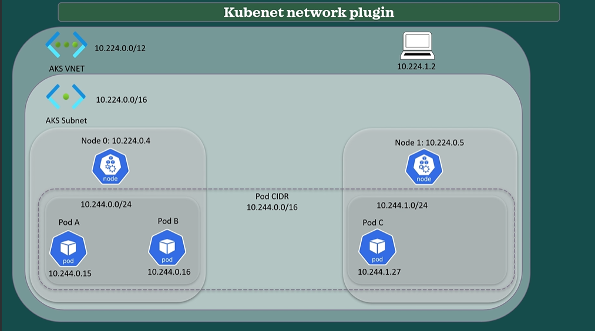
- Consider the archicture from the picture . We have a aks cluster , with AKS VNET with IP range `10.224.0.0/12`
- Part of the VNET range is taken by the AKS subnet which is `10.224.0.0/16`
- In our example we have two nodes with ip's from the AKS subnet.
Node 0 has the IP address `10.224.0.4` where as the Node 1  has `10.224.0.4`
- On top of the subnet we have the Pod CIDR, which is a logical address with range `10.244.0.0/16`.
- The Pod CIDR is futher broken into smaller segments and assigned to the nodes(for the pods inside the nodes),
- Pods inside the Node 0 gets the range `10.244.0.0/24` and the Pods in Node 1 get the range `10.244.1.0/24`.
- If we would add another node , it would receive `10.244.2.0/24`. and so on. The pods receive IP addresses from these ranges based on the node that guest scheduled on.
- pod A in Node 0 receives the IP address `10.244.0.15` whereas Pod B in Node 0 receives the IP address `10.244.0.16`. Pod C in node 1 recieves the IP `10.244.1.27`
- **IP's Allocation**
   - **AKS VNet**: IP range 10.224.0.0/12
   - **AKS Subnet**: 10.224.0.0/16
   - **Pod CIDR**: 10.244.0.0/16
   - **Node IP Allocation**:
      - Node 0 IP: 10.224.0.4
      - Node 1 IP: 10.224.0.5
   - **Pod CIDR Allocation**:
      - **Node 0 Pods**: `10.244.0.0/24` (aks-nodepool1-11743156-vmss000000)
      - **Node 1 Pods**: `10.244.1.0/24` (aks-pool2-13111960-vmss000000)
      - Subsequent Nodes: (e.g., Node 2: 10.244.2.0/24)

### **Pod Communication on Same Node**
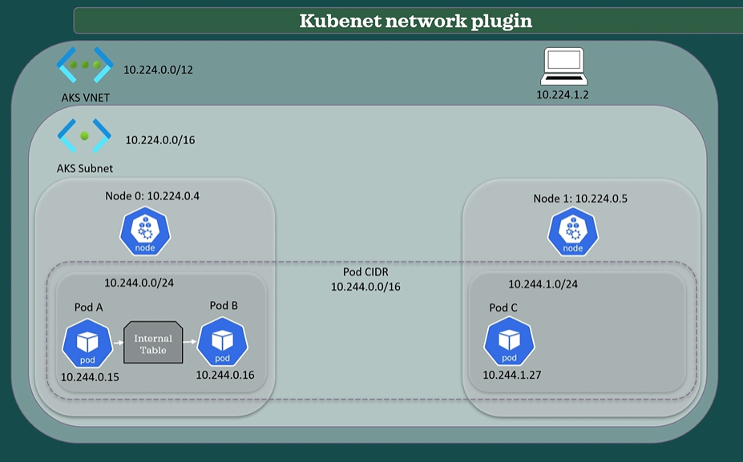

Now let's say Pod A wants to communicate with pod B which are on the same node.
- The node uses the `standard routing table` to determine the next hop for the packet because the destination IP is within the node's own pod range. 
- The kernel knows that the packet should be sent to the local network stack for processing. The local network stack uses the local ARP cache to determine the Mac address of the destination pod. (ARP stands for Address Resolution Protocol.)
- The ARP Cache maps the pod IP address to the MAC address of the network interface associated with the pod.
- Once the MAC address is resolved, the kernel forwards the packet to the network interface associated with the source port and the network interface transmits the packet to the destination network interface directly on the same node.
- So to summarize, he node uses the standard routing table and ARP to determine how to send traffic between pods within the same node.

Let's see this configuration within our cluster.
```bash
# get the nodes and their ip
kubectl get nodes -o wide

# note the ip's of the vms
NAME                                STATUS   ROLES   AGE   VERSION   INTERNAL-IP   EXTERNAL-IP   OS-IMAGE             KERNEL-VERSION      CONTAINER-RUNTIME
aks-nodepool1-11743156-vmss000000   Ready    agent   31m   v1.27.7   10.224.0.4    <none>        Ubuntu 22.04.3 LTS   5.15.0-1053-azure   containerd://1.7.5-1
aks-pool2-13111960-vmss000000       Ready    agent   20m   v1.27.7   10.224.0.5    <none>        Ubuntu 22.04.3 LTS   5.15.0-1053-azure   containerd://1.7.5-1
```
```bash
# get pods and their ip's of nodes
kubectl get pods -o wide | grep aks-nodepool1-11743156-vmss000000  

# check the ip addresses of the pods for aks-nodepool1-11743156-vmss000000 
nginx-deploy-846d6f46b7-6chl2                           1/1     Running     0          13m     10.244.0.14   aks-nodepool1-11743156-vmss000000   <none>           <none>
nginx-deploy-846d6f46b7-brfzg                           1/1     Running     0          13m     10.244.0.13   aks-nodepool1-11743156-vmss000000   <none>           <none>
nginx-deploy-846d6f46b7-j2sfj                           1/1     Running     0          13m     10.244.0.11   aks-nodepool1-11743156-vmss000000   <none>           <none>
nginx-deploy-846d6f46b7-qt67r                           1/1     Running     0          13m     10.244.0.12   aks-nodepool1-11743156-vmss000000   <none>           <none>
```
- from the output , we relalise that pods in node aks-nodepool1-11743156-vmss000000  are in the range `10.244.0.0/24`
```bash
# check the ip addresses of the pods for aks-pool2-13111960-vmss000000   
kubectl get pods -o wide | grep aks-pool2-13111960-vmss000000    
nginx-deploy-846d6f46b7-4dm97                           1/1     Running     0          15m     10.244.1.8    aks-pool2-13111960-vmss000000       <none>           <none>
nginx-deploy-846d6f46b7-dp6tl                           1/1     Running     0          15m     10.244.1.6    aks-pool2-13111960-vmss000000       <none>           <none>
nginx-deploy-846d6f46b7-qm6rw                           1/1     Running     0          15m     10.244.1.5    aks-pool2-13111960-vmss000000       <none>           <none>
nginx-deploy-846d6f46b7-snt2r                           1/1     Running     0          15m     10.244.1.7    aks-pool2-13111960-vmss000000       <none>           <none>
```
- from the output , we relalise that pods in node aks-pool2-13111960-vmss000000   are in the range `10.244.1.0/24`

- Now , accessing the node shell and running `ip route show` we see the node's internal routes.It displays the routing table, which includes entries added by kubenet for routing traffic between pods on the same node.
```bash
# aks-nodepool1-11743156-vmss000000 
/ # ip route show
default via 10.224.0.1 dev eth0  src 10.224.0.4  metric 100 
10.224.0.0/16 dev eth0 scope link  src 10.224.0.4  metric 100
10.224.0.1 dev eth0 scope link  src 10.224.0.4  metric 100
10.244.0.0/24 dev cbr0 scope link  src 10.244.0.1
168.63.129.16 via 10.224.0.1 dev eth0  src 10.224.0.4  metric 100
169.254.169.254 via 10.224.0.1 dev eth0  src 10.224.0.4  metric 100
```
- This line `10.244.0.0/24 dev cbr0 scope link  src 10.244.0.1` indicates that the traffic to `10.244.0.0/24` (the range assigned to this node) should be sent out via the `cbr` interface with a source IP of `10.244.0.1`. This is the network used by Kubenet to connect pods on the same node.

- If we run `arp -a"  , we see the ARP table. The output indicates the IP address and associated mac and interface.
```bash
# aks-nodepool1-11743156-vmss000000 
/ # arp -a
? (10.244.0.5) at 36:88:87:e8:f7:53 [ether]  on cbr0
? (10.244.0.8) at ca:b3:97:72:e1:ba [ether]  on cbr0
? (10.244.0.4) at 12:e5:86:2d:08:6f [ether]  on cbr0
? (10.244.0.15) at b6:a2:7c:ef:29:9e [ether]  on cbr0
? (10.244.0.7) at 12:47:9c:5a:76:03 [ether]  on cbr0
? (10.244.0.3) at 4e:ac:dd:aa:1a:04 [ether]  on cbr0
? (10.244.0.10) at 4a:1b:3a:13:4b:fb [ether]  on cbr0
? (10.244.0.6) at e6:08:61:26:ee:7e [ether]  on cbr0
? (10.244.0.2) at 46:ab:26:7f:e4:d5 [ether]  on cbr0
aks-pool2-13111960-vmss000000.internal.cloudapp.net (10.224.0.5) at 12:34:56:78:9a:bc [ether]  on eth0
? (10.244.0.9) at 8e:e4:75:47:c3:0f [ether]  on cbr0
? (10.224.0.1) at 12:34:56:78:9a:bc [ether]  on eth0
```
- When we analiyse the ip's present here , we see that all these ips are of the pods running on the aks-nodepool1-11743156-vmss000000 

- **DaemonSet Pods**
   - We also see that the ip address of some pods are not in the pod cidr range . they are in the range `10.224.x.x` , where as our pod cidr range is `10.244.x.x`
   - This is because these are pods associated with `daemonsets` that have specific privileges and `they have the IP address of the node they are running on`.
```bash
# grep pods with ip "10.224.x.x"
kubectl get pods -o wide -A | grep 10.224
#
kube-system   azure-ip-masq-agent-jldz9             1/1     Running   0          38m   10.224.0.5    aks-pool2-13111960-vmss000000       <none>           <none>
kube-system   azure-ip-masq-agent-zqxfm             1/1     Running   0          49m   10.224.0.4    aks-nodepool1-11743156-vmss000000   <none>           <none>
kube-system   cloud-node-manager-dj7zp              1/1     Running   0          49m   10.224.0.4    aks-nodepool1-11743156-vmss000000   <none>           <none>
kube-system   cloud-node-manager-j27w4              1/1     Running   0          38m   10.224.0.5    aks-pool2-13111960-vmss000000       <none>           <none>
kube-system   csi-azuredisk-node-xddth              3/3     Running   0          38m   10.224.0.5    aks-pool2-13111960-vmss000000       <none>           <none>
kube-system   csi-azuredisk-node-xwsqh              3/3     Running   0          49m   10.224.0.4    aks-nodepool1-11743156-vmss000000   <none>           <none>
kube-system   csi-azurefile-node-2nps6              3/3     Running   0          38m   10.224.0.5    aks-pool2-13111960-vmss000000       <none>           <none>
kube-system   csi-azurefile-node-vn2zg              3/3     Running   0          49m   10.224.0.4    aks-nodepool1-11743156-vmss000000   <none>           <none>
kube-system   kube-proxy-cvtcg                      1/1     Running   0          49m   10.224.0.4    aks-nodepool1-11743156-vmss000000   <none>           <none>
kube-system   kube-proxy-gmrvv                      1/1     Running   0          38m   10.224.0.5    aks-pool2-13111960-vmss000000       <none>           <none>
```

### **Communication between pods on Seperate Nodes**

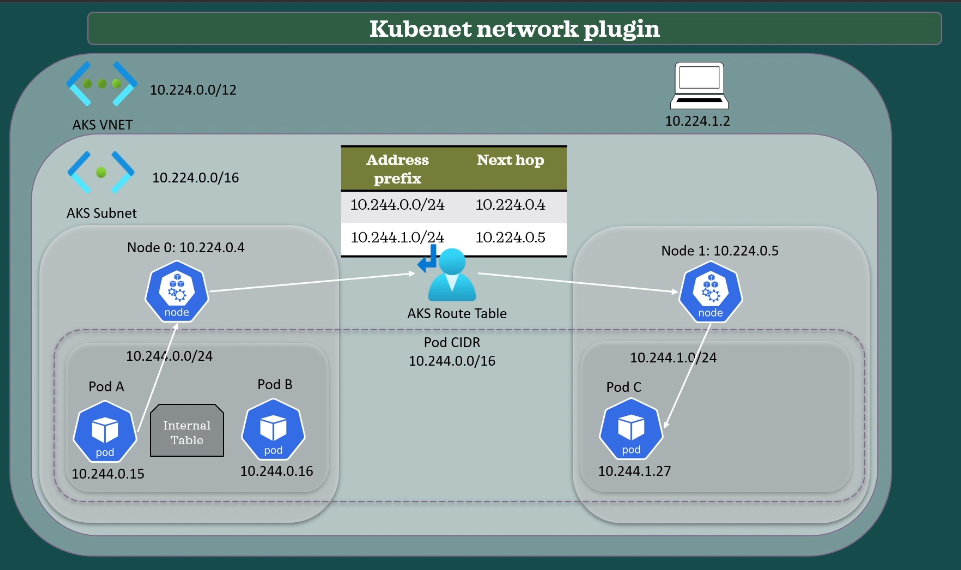
- Next scenario is how would Pod A reach Pod C if they are scheduled on different nodes.
- The request from Pod A would go to Node 0 and here the `Azure route table` comes into picture.
- User defined routing (UDR)  and IP forwarding are used to determine the continuation of the traffic flow because Pod C has IP from  `10.244.1.0/24` and as per the route table, the packet will be sent to `10.224.0.5`, which is the IP of the Node 1 where the pod C resides.
- Further node 1 will internally use standard routing table and ARP to route the packet to Pod C (same as discussed in intranode communication of pods).
- To access the route table of a subnet
   ```bash
   -> goto Infra Resource group 
   -> slect vmss 
   -> slect the vnet 
   -> goto subnet 
   -> select the route table associated with the subnet 

   # az command to retrive route table details
   az network route-table route list --resource-group <resource-group-name> --route-table-name <route-table-name>
   ```

### **Pod Communication with Devices on same VNET or outside VNET**
- The next scenario is how the Pod C connect to a device on the same vnet or outside vnet. For example, in a peered vnet or onprem connected via VPN.
   - `10.224.1.2` : Ip of a device on the Same VNET
   - `10.1.2.3`   : Ip of a device on the another VNET/onPrem Network

- When the Pod C sends a request,it will be sent to Node 1 where NAT will be performed and then Node 1 will reach `10.1.2.3`
- The `10.1.2.3` device will see Node1's IP as the source traffic. Mostly the same process happens when it needs to reach a device `10.224.1.2` from the same VNET

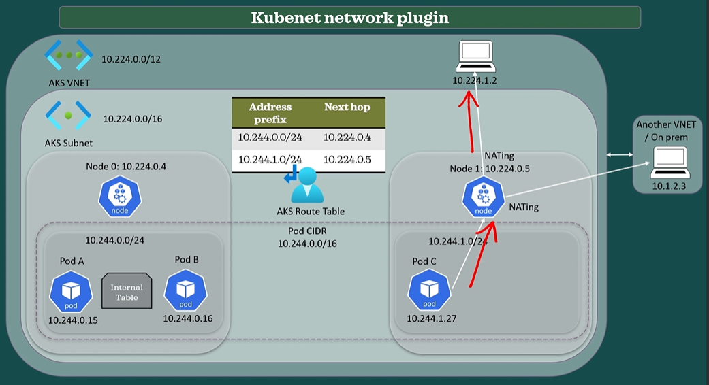

### When to Use Kubenet
- when you require few ips
- simplifying network management and avoiding conflicts with other resources.
- Kubenet doesn't require a large number of IP addresses, making it suitable for environments with limited address space
- Ideal for environments where most communication occurs within the cluster ie pod to pod, as it optimizes routing for internal traffic.

### Disadvantages of Kubenet
- Introduces minor latency due to additional network hops required for communication between pods on different nodes.
- Restricted by the Azure route table's maximum capacity of 400 routes, limiting the scalability of the cluster to 400 nodes.
- cannot with multiple Kubernetes clusters in the same subnet, restricting flexibility in cluster deployment and management.
- Doesn't support advanced features like Windows nodes, Azure Network Policy, or virtual nodes.

---
# [Azure CNI](https://learn.microsoft.com/en-us/azure/aks/concepts-network#azure-cni-advanced-networking) 
- Azure CNI (Container Networking Interface) is a networking plugin designed for Kubernetes clusters on Azure.
- aka Advanced networking plugin.
- It provides network isolation between pods & integrates with Azure VNETs for secure pod communication with other Azure resources.
- Optimized for high performance, ensuring low latency and high throughput.
- Dynamically manages IP address allocation for pods.
- Supports network policies for defining and enforcing network access control rules within the cluster.
- pod cidr doesnt exist

With Azure CNI there are 2 ways the of IP allocation 

**1. Traditional Allocation(default)**  

- in this method both nodes and pods get IP addresses from the subnet. 
- The ip's are pre-allocated and reserved for each node based on `maxPods` parameter.`maxPods` is used to specify the maximum number of pods that a node can host. (This is used for all aks cluster, irrespective of the networking plugin). 
- For example, if you set maxPods parameter to 30, each node will be allowed to host 30 pods. 
- Some pods like kube-proxy etc will have the same ip as the node's ips due to their privileges. 
- ie. 1 IP will be allocated for the node and the rest of IP'S will be available for the pods running on that node to accommodate 30 pods on that node.

**2. Dynamic Allocation of IP and Enhanced Subnet** 
- here the pods get IP's from a seperate dedicated pod subnet from the VNET. 
- while creating the cluster you need to pass the parameter `--pod-subnet`. 
- the Pods and Nodes have IP's from different subnet

### Communication between devices

- **Pod to Pod Communication** : will happen directly without any additional hop, irrespective of the fact if the pods are on the same node or not
- **Pod Communication with Devices on same VNET** : the device will see the Pod's IP as the source IP address
- **Pod Communication with Devices on outside the VNET** : the device will see node's IP (hosting the pod)  as the source address, but that can be changed by modifying the masquerade rules.

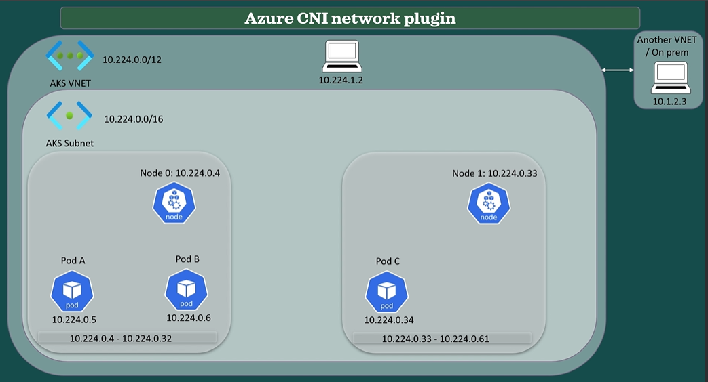

### Create AKS Cluster with Azure CNI network plugin
```
# specify an additional parameter `--network-plugin azure`
az aks create -g <rg-name> -n <aks-name> --network-plugin azure --node-count 2
```
[More Confuguration](https://learn.microsoft.com/en-us/azure/aks/configure-azure-cni?tabs=configure-networking-portal)
### Case Study

- **AKS VNET Range**   : 10.224.0.0/12
- **AKS Subnet Range** : 10.224.0.0/16
- **Node 0** : `10.224.0.4` to `10.224.0.32`
- **Node 1** : `10.224.0.33` to `10.224.0.61`
- Check the IP's allocated to the nodes
```bash
kubectl get nodes -o wide
# note the ip of the nodes
NAME                                STATUS   ROLES   AGE     VERSION   INTERNAL-IP   EXTERNAL-IP   OS-IMAGE             KERNEL-VERSION      CONTAINER-RUNTIME
aks-nodepool1-36884090-vmss000000   Ready    agent   9m43s   v1.27.7   10.224.0.4    <none>        Ubuntu 22.04.3 LTS   5.15.0-1053-azure   containerd://1.7.5-1
aks-nodepool1-36884090-vmss000001   Ready    agent   7m44s   v1.27.7   10.224.0.33   <none>        Ubuntu 22.04.3 LTS   5.15.0-1053-azure   containerd://1.7.5-1
```
- check the maxPods value from the nodePool overview on the Portal
- when we see the connected devices under the VNet from the Infra RG page , we can see that IP from 10.224.0.4 to 10.224.0.32 are for instance 0 where as IP's from 10.224.0.33 to 10.224.0.61 will be for instance 1.
- But there are only 28 ip's from 10.224.0.4 to 10.224.0.32, even through the maxpod on the node can be 30. This is because the maxPods params is for the number of pods and not the number of ips, since the pods associated with daemonsets also have the same ip as its nodes , hence they are counted in the number of pods but not in the number of ip's

### When to Choosing Azure CNI
- **minimal hops and lower latency** : since pods receive IPs from the subnet, enabling full virtual network connectivity and direct communication with connected networks using private IP addresses
- **No Need for User-Defined Routes:** Simplifies network management as there's no mandatory requirement for managing user-defined routes or assigning Azure route tables at the subnet level, unless for specific use cases.
- when the communication happens mostly with devices outside the cluster.
- when you need to have multiple clusters in the same subnet.
- CNI unlocks features like Windows nodes, Azure Network policy and virtual nodes.

### Disadvantages of Azure CNI

- **High IP Address Requirement:** Requires a significant number of IP addresses and careful IP address planning before cluster creation to avoid IP address exhaustion.

- **Buffer Node Requirement for Operations:** when you upgrade the Kubernetes version, an extra node is added during that operation, which will require one IP for itself and a few more for the pods based on the value of max pods parameter.

However, most of these Disadvantages are addressed by **Dynamic IP Allocation and Enhanced Subnets**

### **Dynamic IP Allocation and Enhanced Subnets**
- **Improved IP usage:** IP's are dynamically assigned to cluster pods compared to the traditional CNI method, which assigns static IP addresses to each node. This results in a cluster that uses its IP's more efficiently.
- **Flexibility & Scalability:** subnets for nodes and pods can be scaled separately.
- **Shared Pod Subnets:** Multiple nodepools of a cluster or multiple cluster deploying the same Vnet may share a single pod subnet.
- A node pool can also have its own pod subnet setup.
- **High Performance: ** due to shared pod subnets,  pods can directly communicate to other cluster pods and resources in the VNET since they are given VNET IP addresses.
- This approach allows extremely large cluster with no performance impact.

---
# [Azure CNI Overlay Network Plugin](https://learn.microsoft.com/en-us/azure/aks/azure-cni-overlay?tabs=kubectl)

- With Azure CNI Overlay, the cluster nodes are deployed into an Azure Virtual Network (VNet) subnet. Pods are assigned IP addresses from a private CIDR logically different from the VNet hosting the nodes. Pod and node traffic within the cluster use an Overlay network. Network Address Translation (NAT) uses the node's IP address to reach resources outside the cluster. 
- This solution saves a significant amount of VNet IP addresses and enables you to scale your cluster to large sizes. An extra advantage is that you can reuse the private CIDR in different AKS clusters, which extends the IP space available for containerized applications in Azure Kubernetes Service (AKS).

#### Traditional Azure CNI Plugin
  - Pods are assigned IP addresses either from the VNET address space or a reserved set of IPs on each node, or from a separate subnet dedicated to pods.
  - Requires meticulous IP address planning and may lead to address exhaustion, posing challenges in scaling the cluster and applications.

#### Azure CNI Overlay

- **IP Address Allocation and Networking Setup:**
  - Cluster nodes reside in an Azure virtual network (VNET) subnet, but pod IP addresses are allocated from a separate Pod CIDR, logically distinct from the VNET hosting the nodes.
  - Utilizes an overlay network for internal pod and node traffic within the cluster, with NATing performed using the node's IP address to access resources outside the cluster
  - Facilitates scalability to large cluster sizes while conserving a significant number of VNET IP addresses.
  - Pod CIDR is subdivided into smaller segments, with each node allocated a /24 address space, automatically adjusting when new nodes are added.

- **Routing and Connectivity:**
  - Establishes a separate routing domain for the pod CIDR space within the Azure networking stack, creating an overlay network for direct pod-to-pod communication.
  - Eliminates the need for traffic tunneling or specific route configurations on the cluster network, ensuring comparable connectivity performance to VMs in a VNET.

- **External Access:**
  - Pods cannot be directly accessed from endpoints outside the cluster, necessitating the use of Kubernetes load balancer services to expose pod applications on the VNET.
  - Publishing pods via load balancer services is considered a best practice regardless of the network plugin used, ensuring accessibility of pod applications.

#### Creating an Azure Overlay Cluster
- Pre-requisite : you need to register "AzureOverlayPreview"
```bash
# enable azureoverlaypreview
az feature show --namespace :Microsoft.ContaninerService" --name "AzureOverlayPreview"
```
To create an Azure overlay cluster, use the following parameters: `--network-plugin azure --network-plugin-mode overlay`
```bash
# create a aks cluster with azure cni overlay plugin
az aks create -n <aks-name> -g <rg-name>  --network-plugin azure --network-plugin-mode overlay --pod-cidr 192.168.0.0/16 --node-count 2

# If the pod CIDR isn't specified, then AKS assigns a default space: viz. 10.244.0.0/16.
```
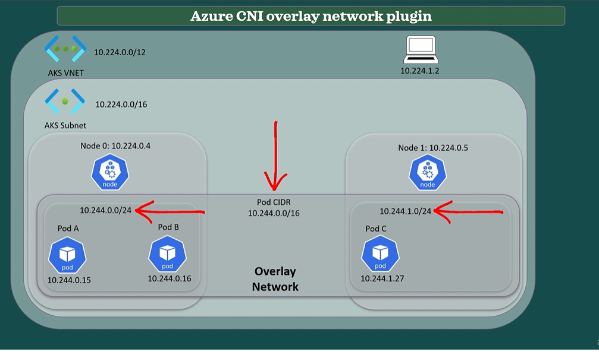
- As we can see, the pod CIDR is broken into pieces and assigned accordingly to each node.
- **Direct Communication:**
      - Pods can communicate directly over the overlay network, irrespective of whether they reside on the same node or different nodes within the cluster.
      - The overlay network facilitates seamless connectivity, allowing pods to exchange data efficiently without additional hops or configurations.
   - **Network Address Translation (NAT):**
      - When a pod needs to reach a device on the network, Network Address Translation (NAT) is performed at the level of the node hosting the pod.
      - The source address at the device level appears as the IP address of the node, enabling communication between pods and external devices.
   - **Accessing External Devices:**
      - Similarly, when a pod needs to reach a device outside the network, NATing is performed at the node level.
      - This process ensures that the source address of the pod appears as the IP address of the node, allowing seamless communication with external devices while preserving network security.
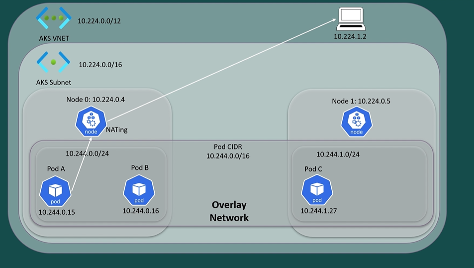


### When to choose Azure CNI Overlay 
  - Because pods have IPS from a private space, which is the pod CIDR, and it doesn't require many IP addresses from the vnet.
  - if the pod's communication is predominant within the cluster. It has less hops than Kubenet because pod to pod communication is in the Azure networking stack. Thus no UDR is required 
  - it supports up to 1000 nodes.

### Disadvantages
  - Latency  If a lot of communication is with resources outside the cluster bevause there is the extra hop and NATing at node level. in this case, traditional Azure CNI may be better.
  - It doesn't support features like Virtual Node and Windows Server 2019, but it supports Windows Server 2022 with Azure CNI Overlay.
  - You cannot have application gateway, ingress controller or logic.

---
# Kubenet vs Azure CNI vs Azure CNI Overlay
| Feature                                | Kubenet                                                                      | Azure CNI                                                                                      | Azure CNI Overlay                                                                       |
|----------------------------------------|------------------------------------------------------------------------------|------------------------------------------------------------------------------------------------|------------------------------------------------------------------------------------------|
| **Network Plugin Type**                | Basic networking plugin                                                      | Advanced networking plugin                                                                    | Advanced networking plugin (Overlay)                                                      |
| **Pod IP Allocation**                  | Pods receive IPs from a logical address space (Pod CIDR).                    | Pods receive IPs from the VNet subnet or a dedicated subnet.                                   | Pods receive IPs from a separate Pod CIDR, distinct from the VNet subnet.                   |
| **Node IP Allocation**                 | Nodes are assigned IPs from the subnet.                                      | Nodes are assigned IPs from the VNet subnet.                                                  | Nodes are assigned IPs from the VNet subnet.                                               |
| **Pod to Pod Communication**           | Direct communication within the same node using routing tables and ARP.     | Direct communication within the same node or across different nodes using routing tables.       | Direct communication within the same node or across different nodes using overlay network. |
| **Intra-Node Communication**           | Routed through Azure route table assigned at the subnet level.              | Routed through Azure route table assigned at the subnet level.                                 | handled within the overlay network.                             |
| **Inter Network Communication**        | NAT translation of pod IPs into node IPs for communication beyond Azure VNet.| NAT translation of pod IPs into node IPs for communication beyond Azure VNet.                    | NAT translation of pod IPs into node IPs for communication beyond Azure VNet.               |
| **Routing Complexity**                 | Basic routing within the cluster.                                            | Requires some routing configuration for external communication.                                 | Seamless routing within the overlay network.                                              |
| **IP Address Requirement**             | Minimal IP requirement, suitable for environments with limited address space.| Requires a significant number of IPs for scalability.                                           | Efficient IP usage with scalability.                                                      |
| **Latency**                            | Minimal, but introduces minor latency due to additional network hops.        | Low latency with high throughput.                                                              | Low latency within the overlay network.                                                   |
| **Compatibility**                      | Limited support for advanced features like Windows nodes and Azure Network Policy. | Supports Windows nodes, Azure Network Policy, and virtual nodes.                              | Supports Windows nodes, Azure Network Policy, and virtual nodes.                           |
| **Scaling Limitations**                | Limited scalability to 400 nodes due to Azure route table capacity.          | 1000/5000 - Scalable to larger clusters, but requires careful IP address planning.                         |  1000/5000 - Scalable to larger clusters, conserving IP addresses.                                      |
| **Flexibility**                        | Restricted in deploying multiple Kubernetes clusters in the same subnet.     | Provides flexibility in deploying multiple clusters in the same subnet.                        | Provides flexibility in deploying multiple clusters in the same subnet.                    |
| **Network Isolation**                  | Provides network isolation for pods and nodes.                               | Provides network isolation for pods and nodes.                                                 | Provides network isolation for pods and nodes.                                             |
| **Traffic Management**                 | Basic traffic management within the cluster.                                 | Supports network policies for defining and enforcing access control rules.                     | Basic traffic management within the overlay network.                                       |
| **Multiple Clusters in the same Subnet**                    | Not Supported                       | Supported                         | Supported.                     |
| **Recommended Use Cases**              | Environments with limited address space and internal communication.         | High-performance environments requiring advanced networking features.                          | Environments requiring efficient IP usage and scalability.                                  |
| **Disadvantages**                      | Limited scalability, restricted feature support, and routing complexity.    | High IP address requirement, scalability challenges, and potential latency.                   | Latency concerns and limited feature support.                                              |
---
# Bring your own VNET/subnet, NSG and Route Table in AKS

- if you don't create these resources , AKS will automatically provision them for us and manage them.
- If we create them on our own and bring them to the AKS cluster, they will be custom and we will be allowed for some customization.
- Please note that AKS will still manage them , for example, when using Kubernetes, AKS will automatically add and remove routes to facilitate the communication between pods running on different nodes but we will also be allowed to add other routes as long as we don't break aks's requirements.
- Another example is that when the NSG is not assigned on a custom subnet, we are not allowed to customize it but If you have our own subnet and NSG, we can customize the NSG accordingly.

### Creating Custom VNET subnet nsg and route tables and deploying AKs cluster to it
```
Step 1: create a rg "byo-rg"
Step 2: create a vnet
	- select rg : "byo-rg"
	- remove the eixsting address space and add the space 192.168.0.0/16
	- add subnet : 192.168.0.0/24
	- review and create
Step 3 : create NSG
	- select rg : "byo-rg"
	- give name. review and create
Step 4: Create route tables
	- select rg : "byo-rg"
	- select regions : same as other resources and rg
	- review and create
Step 5: Assign the nsg and route table at the subnet level
	- open sunet
	- select nsg
	- select rt
	- save
Step 6 : Create the AKS cluster
	 - az aks create -g <rg-name> -n <aks-name> --node-count 2 --vnet-subnet-id /subscriptions/<subs-id>/resourceGroups/<rg-name>/providers/Microsoft.Network/virtualNetworks/<nnet-name>/subnets/<subnet-name>
	 - az aks create -g byo-rg -n aks-demo --node-count 2 --vnet-subnet-id /subscriptions/8a58d831-ec06-4123-aecf-cdbf9b7297ee/resourceGroups/byo-rg/providers/Microsoft.Network/virtualNetworks/my-vnet-byob/subnets/my-subnet --network-plugin azure

Once the cluster is created , analyse the following
- check the available ips under subnet
- check connected devices
- check nsg and default rules
- check route table , there shouldnt be any routes since it is not kubenet
```

### Blocking IP's on Route Table
- connect to any one node on the als cluster
- run command `nslookup kubernetes.io` . we see the node was able to resolve the dns
- run command `nc -v  -w 2 kubernetes.io 443`. we see we are able tp connect sucessfully
- Now , lets block the ip that kubernetes.io resolves too on the route table
	- goto route table -> add rule -> select ip addr -> add ip of kubernete.io . append /32 to the ip addr -> select hop type as none
	- wait for a minute and then test nslookup and netcat commands again	


### Blocking IP's and Port on NSG
- connect to any one node on the als cluster
- run command `nslookup kubernetes.io" . we see the node was able to resolve the dns
- run command `nc -v  -w 2 kubernetes.io 443`. we see we are able tp connect sucessfully
- Now , lets block the ip and port that kubernetes.io listens on(443) , on the nsg
	- goto nsg -> add outbound rule ->  source : any , source port ranges: * , destination : ip addr -> add ip of kubernete.io -> select https -> action : deny -> add priority value (low for more precendence)
	- wait for a minute and then test nslookup and netcat commands again. if you run `nc -v  -w 2 kubernetes.io 80` , it will run coz we just blocked port 443 and not 80
---

# [Load Balancer Service(K8 Resource) in AKS](https://learn.microsoft.com/en-us/azure/aks/load-balancer-standard)

- A load balancer Service type offers an IP address that may be accessed from the outside.
The load balancer service type exposes the service via a load balancer that is specific to the cloud provider, in our case, its Azure, and typically provides a single static IP address.
- When we create the Kubernetes service type load balancer, Azure will automatically provision or update the Azure Load balancer and the Azure public IP. These are added under the infra resource group
- The Azure load balancer and the public IP resources which were provisioned by Azure should not be directly modified.
- Instead, we should configure the Kubernetes loadbalancer service and let azure and aks propagate the changes automatically at the Azure Loadbalancer and public IP level.
- Beside the Azure Loadbalancer and public IP , DNS are also configured accordingly to allow access to the service.

**The correct way to modify the Loadbalancer at AKS level**
- we should modify or add needed fields or attributes or add annotations in the YAML file of the k8 loadbalancer service
   - An annotation is a way to attach metadata to a resource such as a pod service or deployment.
   - Annotations are key value pairs that provide additional information about the resource which are not part of the resource definition itself.
   - Unlike labels, annotations are not used to identify or select resources, but rather to provide additional context and information, that can be accessed by other tools or components in the system.
- when you create a service of type LoadBlanacer , it automatically creates a a LB in infra resource group named "kubernets" and a public IP as well 
Let's go to our ECS cluster and do that.
	- A rule is added on the NSG , to allow inbound requests on the Public IP/LoadBalancer that was created

**Example 1 : Mapping DNS for the Public IP**
- you can add a dns name for the public Ip directly. it is under the configuration section on the Public IP. but as discussed, it is not an ideal way to directly modify in the azure level instead it should be done on the K8 loadbalancer yaml
- you can add annotations under metadata section for this. example to add the dns name we use the annotation `service.beta.kubernetes.io/azure-dns-label-name` 
```yaml
apiVersion: v1
kind: Service
metadata:
  name: appservice
  annotations:
    service.beta.kubernetes.io/azure-dns-label-name: dev.amq
spec:
  type: LoadBalancer
  selector:
    app: server
  ports:
    - name: httpserver
      protocol: TCP
      port: 80
      targetPort: 30102
    - name: httpsserver
      protocol: TCP
      appProtocol: HTTPS
      port: 443
      targetPort: 30104
```
   - once you apply/save this changes , you would be able to see the changes propogated on the azure portal. (under the configuration section on the Public IP)

**Example 2 : Restricting IP range from accessing the LB service**
- if you want to to allow inbound external traffic only from specific ip ranges to access the load balancer service , rather than adding rules on the nsg level , you can directly edit the loadbalancer service by adding the key `loadBalancerSourceRanges:`
```yaml
apiVersion: v1
kind: Service
metadata:
  name: azure-vote-front
spec:
  type: LoadBalancer
  ports:
  - port: 80
  selector:
    app: azure-vote-front
  loadBalancerSourceRanges:
  - 192.168.24.10/32
  - 192.160.0.0/16
 ``` 
 - you cannot add ip address as values , it has to be ip address ranges. so if you want to add a single ip address use /32 at the end
 - once the changes are propogated , you would be able to see the rules on the NSG

[More about Annotations](https://learn.microsoft.com/en-us/azure/aks/load-balancer-standard#customizations-via-kubernetes-annotations)
---
# Using NSG's at Subnet level and VM level together

- If you create your own vnet subnet and NSG(subnet level) , AKS will assign and manage an NSG at VMS network interface level.
- In this configuration, aks will automatically update its NSG, but not the custom one that we created.
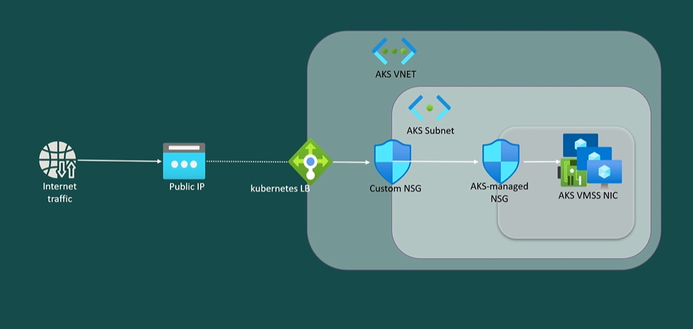
- As we can see within our diagram, if inbound traffic is initiated from the internet to a public IP part of the cluster, the traffic will be first filtered by the NSG at subnet level(managed by us) and then by the NSG managed by AKS(NIC level)

**Consider our aks cluster where we brought our own VNET**
- create Loadbalancer service type and try to access the pplication via browser. we see that we are not able to access our application
- when we inspect the nsg attached on te vmss , we see that there are 2 nsgs present there, one on the subnet level and one on the vm/nic level
- The rule to allow traffic to loadbalancer ip was automatically added on the nsg managed by AKS , but not on the NSG created by us
- This proves that AKS manages the NSG it created and we need to manage the one We created. 
- Add the same rules added by AKs on its NSG into our NSG to access the application
---
# Internal Load Balancer 
[Documentation](https://learn.microsoft.com/en-us/azure/aks/internal-lb?source=recommendations&tabs=set-service-annotations)

- Azure Kubernetes service allows you to create and operate an internal load balancer to internally control access to your applications
- using an internal load balancer, The K8 service type loadbalancer will have an IP from a subnet.
- The only applications or devices that can access the Kubernetes load balancer are those that can access the VNet, where the subnet for the internal load balancer resides.
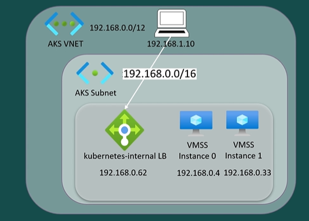
- the device in the same VNet will have direct access to the Kubernetes internal load balancer.
- An easy way for devices to connect from other vnets is to enable VNet Peering
- To create a Internal loadbalancer, you will need to use an annotation `service.beta.kubernetes.io/azure-load-balancer-internal: "true"`
- With that annotation, Azure will provision an Azure internal loadbalancer resource under Infra RG with the name "Kubernetes-internal"
- By default, it will be created in a subnet, but you can also specify another subnet using annotations
- You can also attach a private link and use a private endpoint with the internal load balancer.
- AKS identity needs write authorization at the AKS subnet level in order to properly provision the resources needed for the internal LB.
- You can access the Internal LB through any subnet in the same VNET , just add NSG rules at the subnet level to allow traffic to the Internal LB

**Create an internal load balancer**
```yaml
apiVersion: v1
kind: Service
metadata:
  name: internal-app
  annotations:
    service.beta.kubernetes.io/azure-load-balancer-internal: "true"
spec:
  type: LoadBalancer
  ports:
  - port: 80
  selector:
    app: internal-app
```
- The IP address of the internal load balancer is shown in the EXTERNAL-IP column of `kubectl get svc`. In this context, External refers to the external interface of the load balancer. It doesn't mean that it receives a public, external IP address. 
- This IP address is dynamically assigned from the same subnet as the AKS cluster.
- Check the Internal LB created under Infra Resource Group as well
- If you are using Custom/BYOB Vnet/subnet , when you describe this internalLB service , you'll see an error mentioning "authorisation failed"
   - That is because AKS doesn't have the needed authorization over the subnet used for AKS to create the resources
   - This is only the case when you BYO VNet , Subnets etc. because they were created by us and hence AKS does not have the authorisation to it by default

**Proving AKS access to create resources in Custom/BY Subnet**
- Navigate to the Sunet under the Vnet
- Select "Manage Users" from the top menu
- Add -> Add Role Assignment -> Seach and Select "Network Contributer" -> Next -> Select "Managed Identity" for Assign access to -> + Select Memebers -> In the pop up , select subscription -> Select "Kubernetes Service" in managed Indentity dropdown -> select your aks cluster identity -> Review and Assign

---
# Access the Internal LB using Azure Private Link
[Documentation](https://learn.microsoft.com/en-us/azure/aks/internal-lb?tabs=set-service-annotations#connect-azure-private-link-service-to-internal-load-balancer)

**Azure PrivateLink**
- Azure Privatelink service is a feature that enables you to access Azure hosted customer-owned/partner services over a private endpoint in your virtual network.
- This feature allows you to keep traffic between your virtual network and the services more private and inside the Azure Network backbone(& not via internet).
- Azure Privatelink service is used in scenarios where you need to access an Azure hosted service from your virtual network, but you don't want to expose the service to the public internet.
- This feature is also useful when you have overlapping IP address spaces between your virtual network and the service you want to access.
- In such cases, you can use the Azure Privatelink service to overcome the IP address space constraints, which utilmately results in virtual networks that can overlap.
- Vnet peering is not required for this setup.
- The Azure Privatelink service is frequently used in a consumer provider scenario.

**Producer-Consumer Senario**
- The consumer is the entity that wants to access a service privately without exposing it to the public internet.
- The provider is the entity that owns the service and wants to make it available to consumers privately.
- The azure Privatelink  allows the provider to enable their service for privatelink access, so that consumers can access it privately from their own virtual network.
- Consumers can create a private endpoint inside their virtual network and map it to the service.
- This way, the service is accessible through a private IP address in the consumer's virtual network, which eliminates data exposure to the public internet.

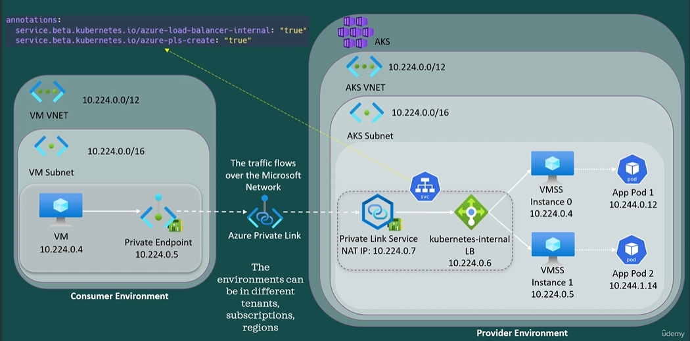

**Producer Environment** : is the AKS cluster which has a VNet subnet, some VMs instances attached to it. An application is running in multiple pods within the AKS cluster.

**Consumer Environment** : contains a virtual network, a subnet and a VM that we want to allow to access our application that is running in the AKS cluster.

*Note*
- *There is no networking connectivity between the consumer and provider environment*
- *The environments can be in different tenants, subscriptions or regions.*

**Producer Consumer Summary**
- Step 1: We create a Kubernetes service type internal load balancer with the `azure-load-balancer-internal` and `azure-pls-create annotations`. The `azure-pls-create` is used to provision the Azure PrivateLink Service along with a Network Interface Card(NIC) and a IP
- Step 2: Creare a `Private Endpoint" in the VNet f the Consumer application(ie the VM in our case) referencing the "PrivateLink Service in our AKS cluster". This "Private Endpoint" also has a IP
and we can also specify another annotation, the one that you can see on the screen.

Now , when the Consumer/VM connects to the IP address of the "Private endpoint" which in turn is linked to the "PrivateLink" service in the AKS , the traffic will flow all the way to the pods and it will consume the application that is running in the AKS cluster.
The traffic will flow over the Microsoft network and not the Internet

### `Setup`
- Step 1 : Create a AKS cluster with kubenet `az aks create -g aks-rg -n aks-demo --node-count 2 --generate-ssh-keys`
- Step 2 : Create a `Private Link` Service connection
   - Create a service manifest named internal-lb-pls.yaml with the service type LoadBalancer and the azure-load-balancer-internal and azure-pls-create annotations.
   - This create a internal LB and a Azure "PrivateLink Service"
   - The `Privatelink` service gets IP from the AKS subnet
      ```YAML
      apiVersion: v1
      kind: Service
      metadata:
      name: internal-app
      annotations:
         service.beta.kubernetes.io/azure-load-balancer-internal: "true"
         service.beta.kubernetes.io/azure-pls-create: "true"
      spec:
      type: LoadBalancer
      ports:
      - port: 80
      selector:
         app: internal-app
      ```
   - view the resources created
      ```bash
      # view the internal LB service created
      kubectl get service internal-app

      # View the details of the Private Link Service object 
      ## Create a variable for the node resource group
      AKS_MC_RG=$(az aks show -g myResourceGroup --name myAKSCluster --query nodeResourceGroup -o tsv)
      ## View the details of the Private Link Service object
      az network private-link-service list -g $AKS_MC_RG --query "[].{Name:name,Alias:alias}" -o table
      ```

- Step 3 : Create the consumer environment
   - Create resource group , VNet, Subnet , NSG for the consumer
      ```bash
      # create resource group for the consumer env
      az group create -n consumer-rg -l eastus

      # create vnet 
      az network vnet create --resource-group consumer-rg --name consumer-vnet --address-prefixes 10.224.0.0/12 --subnet-name consumer-subnet --subnet-prefixes 10.224.0.0/26
      # notice the address spcae for the consumer is excatly same as the aks cluster , this is to demonstaracte that ip's can overlap in this setup

      # create nsg
      az network nsg create --resource-group consumer-rg --name consumer-nsg
      ```
   - Add inbound rule to connect to the Consumer VM via SSH
      ```bash
      ## add nsg rule to allow our IP to connect via SSH to that consumer VM.
      export MY_IP=$(curl ifconfig.me)
      az network nsg rule create --resource-group consumer-rg --nsg-name consumer-nsg --name allow-ssh-my-ip --priority 100 --source-address-prefixes $MY_IP --destination-port-ranges 22 --access Allow
      ```
   - Attach the NSG to the subnet
      ```bash
      # associate the nsg with the subnet
      az network vnet subnet update --resource-group consumer-rg --vnet-name consumer-vnet --name consumer-subnet --network-security-group consumer-nsg
      ```
   - Create a VM that need to access the Application in the AKS cluster
      ```bash
      # create vm in the consumer subnet
      az vm create --resource-group consumer-rg --name consumer-vm --image Ubuntu2204 --authentication-type password --admin-username azureuser --vnet-name consumer-vnet --subnet consumer-subnet
      ```
   - Create a `Private Endpoint` service in the consumer resource group
      ```bash
      # get the Infra_RG name
      AKS_INFRA_RG=$(az aks show --resource-group <aks-rg-name> --name <aks-name> --query nodeResourceGroup -o tsv)
      # get the id of the `PrivateLink` Service 
      AKS_PLS_ID=$(az network private-link-service list -g $AKS_INFRA_RG --query "[].id" -o tsv)
      # create private endpoint
      az network private-endpoint create -g consumer-rg --name aks-pe --vnet-name consumer-vnet --subnet consumer-subnet --private-connection-resource-id $AKS_PLS_ID --connection-name connect-to-aks-svc
      ```

**`Validations`**
- Open the `Private Endpoint` on the portal and confirm that it is liked to the `Private Link` from the AKS cluster
- Connect to the VM from consumer-rg via SSH
- copy the Private IP address of the `Private Endpoint` from the NIC
- Send a request to the IP `curl <ip-addr>`
- If you get a response from the Kubernetes Application , it means that you were able to esablish a private connection from the consumer group to the Internal LoadBalancer service in the AKS 

---

# VNET Peering

Azure VNet Peering is a vital networking feature that facilitates the connection of multiple VNets via the Azure Backbone Network.
  - Unlike traditional networking methods, VNet peering enables seamless communication between resources in connected VNets without the need for a gateway or external internet access.
  - VNet peering serves as a versatile solution applicable to various scenarios, regardless of whether the virtual networks are within AKS or other Azure services.
  - It enables the establishment of connections between diverse multi-tier architectures and hybrid solutions, fostering collaboration and data exchange between resources.

- **Eliminating Gateway Dependency:**
  - One of the key advantages of VNet peering is its ability to function independently of gateways or any reliance on public internet access.
  - This autonomy simplifies network configurations and reduces dependencies, leading to more streamlined and efficient networking operations.

- **Seamless Communication Across VNets:**
  - Through VNet peering, resources within connected virtual networks can communicate seamlessly with each other, appearing as if they were part of the same network.
  - This seamless connectivity enhances collaboration and facilitates resource sharing across VNets, promoting synergy and efficiency in network operations.

- **Address Space Considerations:**
  - It's essential to ensure that the IP address spaces of the virtual networks intended for peering do not overlap.
  - Overlapping address spaces can cause peering processes to fail, as VNets must utilize distinct IP addresses to avoid conflicts and ensure smooth communication.

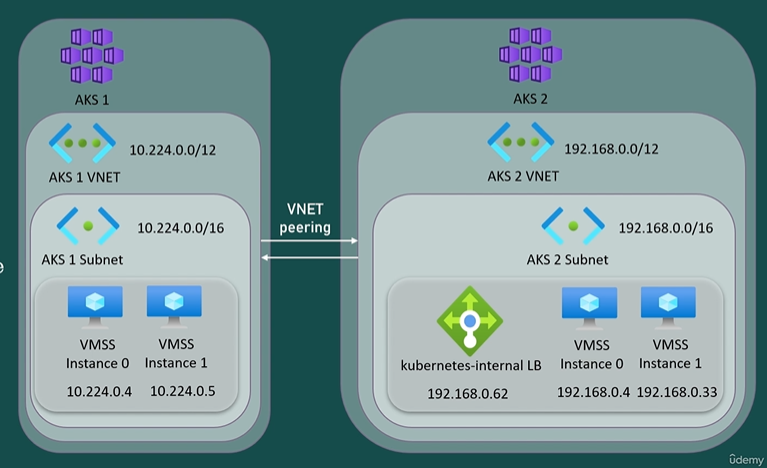


As shown in the diagram, we will configure Vnet peering between those AKs cluster VNETS , which will allow the connectivity between them, including nodes and pods in the cluster named AKS-demo to connect to the Kubernetes internal load balancer in my bio.
We will try to connect from our AKS cluster named AKS-demo to the AKS cluster named aks-internal with internal loadbalancer service.

- **Case 1: There is no VNet peering done between the Vnets of the 2 cluster**
   - copy the public ip address of our internal loadbalancer service in the aks-internal cluster .
   - On the local terminal, set the kubeconfig context to the AKS-demo cluster.
   - From hereh , try to connect to the internal loadbalancer service of aks-internal cluster from pod shell using curl 
      ```bash
      curl --connect-timeout 10 192.168.0.62
      ```
   - The connection timed-out

Now, let's enable peering between these two Vnet ans see the result.

- **Case 2: When the Vnets are peered**
   - Steps to peer 2 VNets
      - go to the portal. Go to my AKS cluster then Properties the, Infrastructure Resource Group, then Open the Vnet.
      - here we have Peerng option.
      - Click on add -> Give Peering name -> Select Traffic to remote VNet : Allow ->  Select Traffic forwarded from remote VNet : allow -> Vnet Gateway or Route Server : None -> Select the 2nd VNet -> Leave others to default -> Add
- Once you do this , it will Add peering for both Vnets , ie a Peering will be added to the other Vnet as well

Now try the curl <ip> again from the aks-demo cluster and see the results
---
# SNET in Azure

In Azure, SNAT (Source Network Address Translation) refers to the process of modifying the source IP address of outgoing traffic from virtual machines (VMs) or resources within a virtual network (VNet). SNAT is primarily used in scenarios where the VMs do not have public IP addresses assigned to them, or when they are behind a load balancer.
- External sources can be prevented from connecting directly to the back end instances
- Ports are used to generate unique identifiers used to maintain distinct flows. To establish an outbound connection, an ephemeral port is used to provide the destination with a port on which to communicate and maintain a distinct traffic flow. When these ephemeral ports are used for snat they are called as SNAT Ports 
- A SNAT port will be utilized by each connection to the same destination IP and destination port.
- A unique traffic flow from the backend instance or client to a server is maintained by this connection.
- The server receives a unique word through this process to address the traffic.
- Without this procedure, the client computer is unable to determine which flow a packet belongs to.
- The client will be unable to distinguish between one query result and another in the absence of different destination ports or the return traffic which represents the SNAT port used to establish the connection.
- When a port is idle with no packets being sent, the port will be released after a period that can be set between 4 and 120 minutes.
- By definition, every public IP address has 65,535 ports, but only about 64,000 are eligible for SNAT.
- Outbound connections can burst and leas to SNAT port exhaustion.
The possibility of nat port exhaustion increases in the absence of connection reuse.
- A connection pool is a cache of connections that are preserved so that they can be used again when necessary for future requests.

**Here's how SNAT works in Azure:**

1. **Outgoing Traffic**: When a virtual machine or resource within a VNet initiates an outgoing connection to the internet or external services, the source IP address of the packets is typically a private IP address assigned to the VM or resource.

2. **SNAT Pool**: Azure dynamically assigns a public IP address from a pool of available addresses to act as the source IP for outbound traffic. This public IP address is used to mask the private IP addresses of the VMs or resources.

3. **Translation**: Before the packets leave the Azure infrastructure, the source IP address of the packets is translated from the private IP address to the public IP address assigned by Azure.

4. **Outbound Connectivity**: With the translated source IP address, the packets are then routed to the destination over the internet or to the external service.

5. **Response Traffic**: When the external service or destination responds to the request, the response packets are sent back to the translated public IP address.

6. **Reverse Translation**: Azure's network infrastructure performs a reverse translation (DNAT - Destination Network Address Translation) to map the destination IP address of the response packets back to the private IP address of the originating VM or resource.

Certainly! Let's break down the explanation regarding SNAT (Source Network Address Translation) ports:

1. **Unique Identifiers**: Ports are used as unique identifiers to maintain distinct flows of traffic. When establishing an outbound connection, an ephemeral port is assigned to provide the destination with a port number for communication, ensuring each flow is distinct.

2. **SNAT Ports**: Ephemeral ports used for SNAT are referred to as SNAT ports. Each connection to the same destination IP and port utilizes a SNAT port to maintain a unique traffic flow.

3. **Maintaining Traffic Flow**: SNAT ports help maintain unique traffic flows between the backend instance or client and the server. This process ensures that each packet receives a unique word (port number) to address the traffic, enabling the client to distinguish between different flows.

4. **Packet Identification**: Without SNAT ports, the client would struggle to identify which flow a packet belongs to, leading to confusion in distinguishing between query results or return traffic.

5. **Port Release**: When a port remains idle without any packets being sent, it will be released after a configurable period, typically between 4 and 120 minutes.

6. **Port Availability**: While each public IP address theoretically has 65,535 ports, only around 64,000 are eligible for SNAT. This limitation can lead to SNAT port exhaustion, particularly during bursts of outbound connections.

7. **Connection Reuse**: The possibility of SNAT port exhaustion increases when connections are not reused efficiently. Connection reuse helps mitigate the risk of exhausting available SNAT ports.

8. **Connection Pool**: A connection pool is a cache of connections preserved for future requests, allowing them to be reused when necessary. This mechanism helps optimize resource utilization and prevents unnecessary creation of new connections.

In summary, SNAT ports play a crucial role in maintaining distinct traffic flows, ensuring proper packet identification, and managing port utilization in network address translation scenarios. Efficient management of SNAT ports is essential to avoid exhaustion and maintain reliable outbound connectivity.

---
# Outbound Types in AKS
There are following types in AKS
1. LoadBalancer
2. NAT Gateway
3. UserDefinedRouting (UDR)

### LoadBalancer
An Azure Load Balancer operates a transport layer, which is layer four of the OSI model and supports both inbound and outbound scenarios.

**Functionalities of AKS Public LoadBalancer**
-  **Expose applications via Kubernetes service type load balancer** (not dicussing here)
- **Provide outbound connectivity to nodes** : by translating the private IP address to a public IP address that is part of its outbound pool, it provides outbound connections to the cluster nodes inside the virtual network.
   - In simple words, it is used to allow AKS nodes to go to the Internet.
   - If you don't specify the outbound type for an AKs cluster load balancer is the default type.
   - Backend instances can have outbound connectivity to the internet via the front end IP of the public LB
   - The private IP address of the virtual machine is translated into LB's public IP address using SNAT
   - SNAT converts the backend IP address to the LB's  public IP address.
   - If there are too many connections SNAT port exhaustion can happen.
- Using LB type in AKS , SNAT ports will be allocated per node.
- Every IP address has 65,535 ports, but around 64,000 ports are eligible for SNAT
- You can configure multiple IPS for the Azure Load balancer by using parameter with `az aks`
   - `--load-balancer-managed-outbound-ip-count` (when yoy let aks create the IP's)
   - `--load-balancer-outbound-ips` (if you byo)
- By default, an AKS cluster has one public IP for outbound and 1024 ports allocated for each node.

### NAT Gateway
- A Nat gateway is assigned at subnet level 
- 1 Nat Gateway can be allocated to multiple subnets, but one subnet cannot use more than one NAT gateway
- The main advantage of using a NAT gateway as an outbound type is that it overcomes SNAT port exhaustion.
- The allocated number of ports per IP is the same, but the key difference here between Load Balancer and Nat Gateway is the port allocation 
- For the load balancer, Outbound ports are pre allocated for each node.
- For NAT Gateway, the ports are allocated ad hoc, providing a dynamic pool of nat ports consumable by all the virtual machines in its associated subnet or subnets
- In the load balancer scenario, If the client IP is not equally distributed to each node, some of the clients on busy nodes may fail to create new connections due to port exhaustion.
- If you deploy an AKS cluster with an outbound type NAT Gateway, the LBs responsibility to provide outbound connectivity for nodes will become NAT gateways responsibility.
- In this scenario, during cluster creation, the load balancer will not be created.
- However, if you deploy a Kubernetes service type load balancer, then the Azure Load balancer will get created and you will have both resources ie the Nat Gateway and the load balancer to manage.
- in AKS , you can let Azure provision your NAT gateway automatically by specifying `--outbound-type managedNATGateway` or you can bring your won Nat Gateway by specifying `--outbound-type userAssignedNATGateway --vnet-subnet-id`
- The idle timeout can be set with `--nat gateway-idle-timeout` parameter and the number of public Ip's with `--nat-gateway-managed-outbound-ip-count`
- After the cluster creation, you can also change the outbound type between load balancer, managed NAT Gateway or User defined NAT Gateway.

### Used Defined Route
- If user defined routing is enabled, AKS won't build up egress path automatically and you would required to configure the egress.
- Because explicit egress must be established when utilizing an architecture other than the standard load balancer, the AKS cluster must be deployed into an already existing virtual network with a subnet that has already been configured.
- As a result, this architecture demands explicitly routing egress traffic to an appliance such as a firewall gateway or proxy, or allowing network address translation to be performed via a public IP allocated to the standard load balancer 
- A general use case for UDR is to use an Azure firewall to control the outbound traffic.
- A general use case for UDR is to use an Azure firewall to control the outbound traffic.
- After the firewall is created, as we can see in our diagram, the route table is assigned at a subnet level with a route instructing the traffic to be sent to the Firewall's private IP, and then the Firewall's public IP will be used to reach the internet.
- However, there are specific requirements if you are using a firewall.
   - For example, you need to allow the access to access that Microsoft.com on Port 443 to pull images that are mandatory for the cluster functionality and provisioning such as DNS.
   - Luckily for us, a created an FQDN tag that represents a group of DNS associated with well known Microsoft services and includes everything we need for the application rules.
- The load balancer will be created only after creating a Kubernetes service type public load balancer
- with respect to Ethernet ports , the Azure Firewall provides 2496 ports per public IP address configured per backend virtual machine
scale set instance and up to 250 public IPS can be associated with the Azure Firewall.

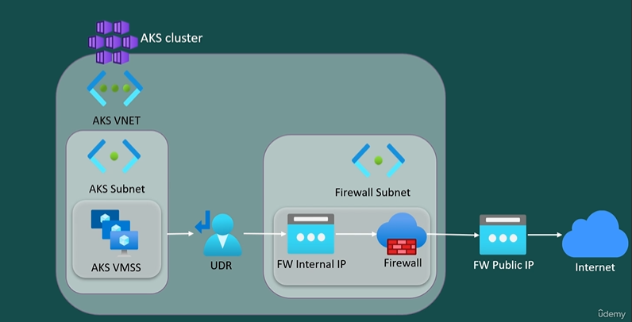
---
# Create a AKS cluster with NAT Gateway
[Docs](https://learn.microsoft.com/en-us/azure/aks/nat-gateway#code-try-0)

**With a Managed NAT Gateway**
- Create an AKS cluster with a new managed NAT gateway using the az aks create command with the `--outbound-type managedNATGateway`, `--nat-gateway-managed-outbound-ip-count`, and `--nat-gateway-idle-timeout` parameters. 
- If you want the NAT gateway to operate out of a specific availability zone, specify the zone using --zones. If no zone is specified when creating a managed NAT gateway, then NAT gateway is deployed to "no zone" by default. When NAT gateway is placed in no zone, Azure places the resource in a zone for you
- A managed NAT gateway resource can't be used across multiple availability zones.
```bash
  az aks create \
      --resource-group myResourceGroup \
      --name myNatCluster \
      --node-count 3 \
      --outbound-type managedNATGateway \
      --nat-gateway-managed-outbound-ip-count 2 \
      --nat-gateway-idle-timeout 4
```
- Update the outbound IP address or idle timeout using the az aks update command with the `--nat-gateway-managed-outbound-ip-count` or `--nat-gateway-idle-timeout` parameter.
```bash
az aks update \ 
    --resource-group myResourceGroup \
    --name myNatCluster\
    --nat-gateway-managed-outbound-ip-count 5
```
---


