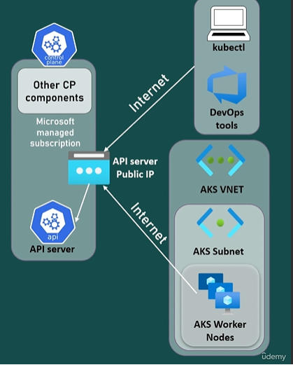
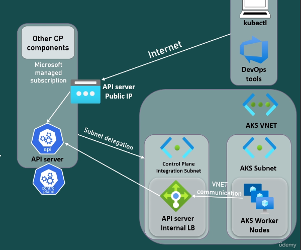
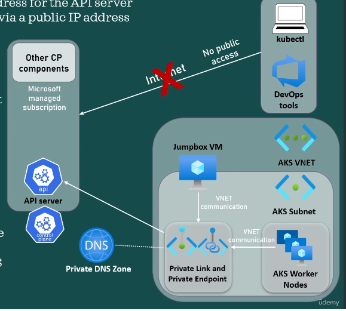
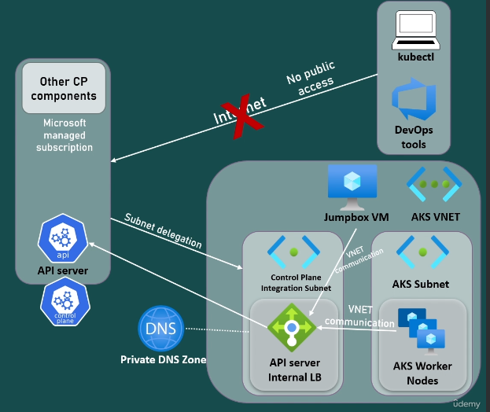

# Types of AKS Cluster

In terms of API server access, Kubernetes clusters can be categorized into three main types:

1. **Public Cluster**:
   - In a public cluster, the Kubernetes API server is accessible over the public internet.
   - Clients, such as developers, administrators, or automation tools, can interact with the Kubernetes API server from any location with internet connectivity.
   - Suitable for scenarios where widespread access to the Kubernetes API server is required, such as in development environments or when managing clusters from external locations.
   - Requires appropriate security measures, such as authentication, authorization, and network policies, to protect the API server from unauthorized access and potential security threats.

2. **Private Cluster**:
   - In a private cluster, the Kubernetes API server is not exposed to the public internet.
   - Access to the API server is restricted to clients within the same virtual network (VNet) or connected networks.
   - Offers enhanced security by reducing exposure to external threats and potential attacks from the public internet.
   - Suitable for production environments and enterprise applications that prioritize security and isolation.
   - May require additional networking configurations, such as Azure Private Link or VPN gateways, to establish secure connectivity with clients or applications.

3. **Hybrid Cluster**:
   - A hybrid cluster combines elements of both public and private clusters.
   - The Kubernetes API server may be accessible over the public internet for certain clients or applications, while other clients or workloads access the API server through private, secure connections.
   - Offers flexibility in terms of access control and network configuration, allowing organizations to tailor access policies based on their specific requirements.
   - Suitable for environments where a combination of public and private access to the Kubernetes API server is needed, such as multi-cloud deployments or hybrid cloud scenarios.

The choice between public, private, or hybrid clusters depends on factors such as security requirements, network topology, compliance regulations, and the nature of the workloads being deployed. Each type of cluster has its own advantages and considerations in terms of API server access and overall security posture.

**API Server access is needed by**
- kubectl :
    - we are able to run kubectl commands after we configure the kubeconfig file of the AKS cluster
- DevOps Tools : 
    - eg azure devops , argocd jenkins etc need access to the api server to deploy k8 objects or fetch data for visualisation or exposure
- AKS worker nodes :
    - components inside worker nodes need to communicate with api server. example kubelet for deployig pods etc

**1. Public AKS Cluster**
- Public AKS cluster have a public IP address which is matched to a public FQDN
- When you stop and start the cluster , the Public IP address changes but the FQDN does not.
- Anyone with the kubeconfig file can connect to the cluster ie the API server is accessible over the internet using its Public IP
- kubectl and devops tools connect via the Public internet
- The worker nodes also connet to the API server via the Public internet
- The access to the API Server can be restricted to specific ranges. You wont break the connection worker nodes and API server with this , unless the worker nodes were deployed with a public IP.


**2. Public AKS Cluster with API Server VNET Integreation**
- here too, the cluster has a public IP address which is matched to a public FQDN
- When you stop and start the cluster , the Public IP address changes but the FQDN does not.
- Anyone with the kubeconfig file can connect to the cluster ie the API server is accessible over the internet using its Public IP
- kubectl and devops tools connect to the API Server via the Public internet
- The access to the API Server can be restricted to specific ranges.
- However, worker nodes will connect privately without any private link or tunnel, and the traffic will stay inside the AKS VNet only.
    - This is becuase , the API Server is projected into a delegated subnet in AKS's VNet where the AKS cluster is deployed
    - The nodes are set up to use an internal load balancer IP that is placed behind the API server in the delegated subnet.
    - In contrast to non VNet integrated clusters, the worker nodes always connect without the use of DNS directly with the private IP address of the API server Internal LB.


**3. Private AKS Cluster**
- In a private AKS cluster, the API server doesn't have a public IP address.
- the worker nodes will still be placed behind the public IP address to allow them to connect to the internet. example to pull images from dockerhub or other repos 
- The API server can still have a public FQDN, but which will be resolved to a private IP address.
- The Public FQDN can be disabled while creater the cluster or after creating as well
- AKS also creates a private FQDN with help a private DNS zone.
- The API server and the worker nodes can connect to each other through the Azure "PrivateLink" service in the API server VNet and a "Private endpoint" that is exposed on the subnet of the cluster.
- To resolve the private IP address of the private endpoint for communication with the API server, the agent nodes will use the private DNS zones A record
- If you use a custom DNS server
    - Add 168.63.129.16 as the upstream DNS server in the custom DNS server
    - in this situation, the VNET containing the custom DNS server needs to be added as a VNet link in the private DNS zone.
- Only devices that have connectivity to the vnet can connect to the cluster to run kubectl commands  or to deploy Kubernetes objects etc
- Public access to the API server is totally disabled.
    - For example, you can have a jumbo VM in the cluster Vnet in a Vnet use Expressroute or VPN or a private endpoint connection.



**4. Private AKS Cluster with API Server VNET Integreation**
- is combination between the usual private cluster and the public cluster with API server Vnet integration
- A public FQDN can still be created pointing to the private IP of the API server.
- This can still be disabled during cluster creation or later.
- Public internet connectivity for the API server is totally disabled.
- Only devices that have connectivity with the vnet can connect to the API server.
- AKS also creates a private FQDN with help a private DNS zone.
- If you use a custom DNS server
    - Add 168.63.129.16 as the upstream DNS server in the custom DNS server
    - in this situation, the VNET containing the custom DNS server needs to be added as a VNet link in the private DNS zone.
- worker nodes connect to the API server privately using the API server internal load balancer which is part of a delegated subnet inside a VNET.



## Public AKS Cluster

- **Connecting to the Cluster:**
  - Use the `az aks get-credentials` command to fetch the Kubeconfig for the cluster.
    ```bash
    az aks get-credentials --resource-group <resource-group-name> --name <aks-cluster-name>
    ```
- **Interacting with the API Server:**
  - After obtaining the Kubeconfig, use `kubectl` commands to interact with the API server and retrieve details about the cluster's resources.
- **Public Accessibility:**
  - The API server is accessible via a public IP address and has a public Fully Qualified Domain Name (FQDN) as its address.
  - To verify the IP address associated with the API server's FQDN, perform an nslookup from your local machine:
    ```bash
    nslookup <api-server-address>
    ```
- **Kubernetes Service:**
  - In the cluster, there's a Kubernetes service named `Kubernetes` of type ClusterIP, created by default.
  - This service is used to interact with the API server.
  - When describing the service, you'll see that the endpoints registered in the service correspond to the IP address of the API server.
    ```bash
    kubectl describe service kubernetes
    ```

## Public AKS Cluster with API Server VNET Integreation
[Documentation](https://learn.microsoft.com/en-us/azure/aks/api-server-vnet-integration)

### Create an AKS cluster with API Server VNet Integration using managed VNet
#### Prerequisites:
1. **Azure CLI with AKS Preview Extension:**
   - Ensure you have the `aks-preview` extension version 0.5.97 or later installed.
     ```bash
     az extension add --name aks-preview
     az extension update --name aks-preview
     ```

2. **Register Feature Flag:**
   - Register the `EnableAPIServerVnetIntegrationPreview` feature flag.
        ```bash
        # Register the EnableAPIServerVnetIntegrationPreview feature flag using the az feature register command.
        az feature register --namespace "Microsoft.ContainerService" --name "EnableAPIServerVnetIntegrationPreview"

        # Verify the registration status using the az feature show command:
        az feature show --namespace "Microsoft.ContainerService" --name "EnableAPIServerVnetIntegrationPreview"
        
        # When the status reflects Registered, refresh the registration of the Microsoft.ContainerService resource provider using the az provider register command.
        az provider register --namespace Microsoft.ContainerService
        ```

#### Creating AKS Cluster with API Server VNet Integration:
- Use the `az aks create` command to create the AKS cluster with API Server VNet Integration.
  ```bash
  az aks create -n <cluster-name> -g <resource-group> -l <location> --network-plugin azure --enable-apiserver-vnet-integration --node-count 2
  ```

#### Cluster Configuration:
- Upon cluster creation, navigate to the Infrastructure Resource Group to observe additional resources.
  - An additional Load Balancer resource named `kube-api-server` will be present.
  - This Load Balancer has an associated IP address.
  - In the VNet resource, under subnets, an extra subnet named `aks-apiserver-subnet`is present , which will be delegated to `Microsoft.Container.Service/managedClusters`.
  - If you go to connected devices. At the bottom, we can see here kube-api-server LB and the IP that we saw earlier
  - Under overview, we can still see the public API server address. If we do an NS lookup, we can see the public IP address.

#### Connectivity:
- Public Access:
  - The API server is publicly accessible via its public IP address.
  - The public API server address can be verified using an nslookup.
  - We can connect to the cluster using the kubeconfig file and we will be able to run kubectl commands without any issue.

- Worker Nodes Connectivity:
   - the difference lies with the nodes, they connect to the API server using a private IP address which is the IP address `kube-api-server` load balancer that we saw earlier in the portal.
   - When we describe the `Kubernetes` ClusterIP service , we see that the IP address of the `kube-api-server` registered as the endpoint 
  - Worker nodes connect to the API server privately using VNet communication.
  - They use the IP address of the `kube-api-server` Load Balancer as the endpoint.

#### Conclusion:
- Public Access vs. Worker Node Connectivity:
  - Users and DevOps tools connect publicly using the API server's public IP.
  - Worker nodes connect privately using VNet communication and the IP address of the `kube-api-server` Load Balancer.

## API server authorized IP ranges

By default, everyone has network connectivity to the IP address of the API server for an public cluster and can run kubectl commands if they have the kube config file.

The `API server authorized IP ranges` feature will allow you to enable ranges that are allowed to connect to the API server
if the request will not come from one of that ranges then it will be blocked.
- In addition to the ranges,  the outbound public IP for the cluster standard load balancer is also enabled by default.
- When you enable API server authorized IP ranges. You can add 0.0.0.0/32 to allow only the public IP of the standard load balancer.
- At this moment, up to 200 ranges can be added.
- If you use nodes with public IPS, the node pools must use public IP prefixes which need to be added as authorized ranges.
- This feature is available only for public cluster, not for private cluster.

**To enable  Authorized IP ranges**
- Go to the aks cluster on the porta
- goto networking tab
- under securtity , check box for "set authorised ip ranges" and add your ip range
- apply


## Private AKS clusters

### **General Private AKS Cluster**
- Creating a general private aks cluster
    ```bash
    az aks create -n <private-cluster-name> -g <private-cluster-resource-group> --network-plugin azure --enable-private-cluster --node-count 2
    ```
- The FQDN/API Server address created can be resolved to its `Private IP address` using `nslookup <api-server-address>`. Note : we will get only the private IP as output
- Apart from the above FQDN , we also have a private FQDN , which is listed as the key `privateFQDN` in the JSON view
- You would not be able to resolve this `privateFQDN` to its IP
- The `privateFQDN` is formed using an `A` type entry in the `Private DNS Zone`(see below) and the name of the `Private DNS Zone`
- Under the Infra Resource Group , we have the following extra resources
    - Private DNS Zone : Contains a A record pointing to privateIP of FQDN/API Server. you can see a link to the Vnet of the AKS cluster under Virtual Network Links. It means that only those device that are part of that specific Vnet will be able to resolve the PrivateFQDN of the apiserver
    - Private Endpoint (named : `kube-apiserver`): This endpoint points to the network interface mentioned below
    - Network Interface: (named : `kube-apiserver.nic.xxxx`). This nic is part the subnet `aks-subnet`. This nic is listed under connected devices for the subnet. The IP if this nic is the same Private IP which we git when we resolved the API Server address
    

### **Private AKS Cluster with VNet Integration**
- Creating a private aks cluster with VNet Integration
    ```bash
    az aks create -n <private-cluster-name> -g <private-cluster-resource-group> --network-plugin azure --enable-private-cluster --enable-apiserver-vnet-integration --node-count 2 --node-count 2
    ```
- Very similar to General private cluster, this type of cluster too has a Public & Private FQDN and a Private DNS Zone
- Although , It does not have a Private Endpoint or Network Interface
- Instead this has a LoadBalancer named `kube-api-server` (simillar to public cluster with vnet integration)
  - This Load Balancer has an associated IP address.
  - In the VNet resource, under subnets, an extra subnet named `aks-apiserver-subnet`is present , which will be delegated to `Microsoft.Container.Service/managedClusters`.
  - If you go to connected devices. At the bottom, we can see here kube-api-server LB and the IP that we saw earlier
  - Under overview, we can still see the public API server address. If we do an NS lookup, we can see the public IP address.
### Disabling the Public FQDN

```bash
# Disable a public FQDN on a new AKS cluster using the --disable-public-fqdn flag.
az aks create -n <private-cluster-name> -g <private-cluster-resource-group> --load-balancer-sku standard --enable-private-cluster --enable-managed-identity --assign-identity <resourceID> --private-dns-zone <private-dns-zone-mode> --disable-public-fqdn

# Disable a public FQDN on an existing AKS cluster using the az aks update command with the --disable-public-fqdn flag.
az aks update -n <private-cluster-name> -g <private-cluster-resource-group> --disable-public-fqdn
Configure a private DNS zone
```

## Conneting to API server in Private AKS Clusters
- by default , our machine does not have network connectivity to the api server , so thats why even through we can get the kubeconfig file but we cannot run kubectl commands.
- There are multiple ways to connect to the private apiserver

### 1. Via JumpBox
To connect to the api server , we can create a Jumpbox VM that has network connectivity to the VNet of the AKS cluster. The simplest way to do it is to create a VM in the same Vnet.

- **Create a JumpBox to connet to the API Server**
    - Create a new Resource Group `jumpbox-rg`
    - In the same VNET as the AKS clsuter , create a new subnet name `jumpbox-subnet`
    - create a ubuntu vm in the rg created above , select the same region as aks , select the same vnet as aks , and select the subnet we created above.
    - Create a nsg in the same Resource group and region as the jumpbox. In the NSG , add a inbound rule to allow ssh access .
    - Attach this NSG to the `jumpbox-subnet`
    - ssh into the jumpbox
    - Now you will be able to resolve the privateFQDN from this jump box, ie you can connect to the apiserver from this jumpbox

- **Install az cli and kubectl to run kubectl commands**
    - Install az cli : `curl -sL https://aka.ms/InstallAzureCLIDeb | sudo bash`
    - Configure access to azure account : `az login`
    - Install kubectl : `az aks install-cli`
    - Get the kubeconfig file using the az aks get credentials command `az aks get-credentials --resource-group <rg-name> --name <aks-name> --overwrite-existing`
    - Run kubectl commands : `kubectl get nodes`
### 2. `az aks command invoke` Command
- is a command (like kubectl/helm) to comminicate with the cluster through the Azure API without directly connecting the the cluster
- The follow roles are required on the cluster to run the command
    - `Microsoft.ContainerService/managedClusters/runcommand/action`
    - `Microsoft.ContainerService/managedclusters/commandResults/read`
- When you run the command , it automatically creates a pod with the name `command-<ID>` in the `aks-command` namespace to access the cluster and retrieve the required information.
- Syntax : ` az aks command invoke --resource-group <rg-name> --name <cluster-name> --command "<commands>"`
- Example
  ```bash
  # get all pods
  az aks command invoke --resource-group <rg-name> --name <cluster-name> --command "kubectl get pods -A"
  ## multiple helm commands
  az aks command invoke --resource-group myResourceGroup --name myPrivateCluster --command "helm repo add bitnami https://charts.bitnami.com/bitnami && helm repo update && helm install my-release bitnami/nginx"
  ```
### 3. Running `kubectl` commands from worker nodes
- By default, worker nodes are already in the Vnet of the aks cluster, so they can communicate with the API server.
- The worker nodes already have the kubeconfig config file , which is located at `var/lib/kubelet/kubeconfig`
- So we can invoke a kubectl command by specifying the kubeconfig file inside one of the node 
    ```bash
    az vmss run-command invoke -g <infra/<infra-rg-name> -n <vmss-name> --command-id RunShellScript --instance-id <id or number> --query 'value[0].message' -ostv --scripts "kubectl get pods -A --kubeconfig var/lib/kubelet/kubeconfig"
    ```
