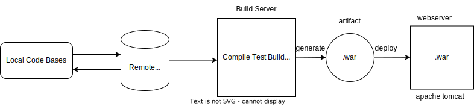

## Gradle
- Gradle is an open-source build automation tool that is widely used for building, testing, and deploying software projects. 
- It is designed to be flexible, highly customizable, and efficient. 
- Gradle builds upon the concepts of Apache Ant and Apache Maven but introduces a more expressive and concise syntax using the Groovy programming language.
- Gradle has strong support for Java, Groovy, and Kotlin, it can be extended and customized to build projects in various languages like C++, Android, Python, JavaScript, Scala, Go.etc..  <p>
- maven followins xml based configuration ie pom.xml
- gradle follows groovy based config ie build.gradle
    - supports multiple languages
    - is tasked based (easy configuration)

### Sample build.gradle file
```groovy
plugins {
    id 'java'
    id 'war'
}
java {
    sourceCompatibility = JavaVersion.VERSION_11
    targetCompatibility = JavaVersion.VERSION_11
}
repositories {
    jcenter()
}
dependencies {
    // Servlet API
    providedCompile 'javax.servlet:javax.servlet-api:4.0.1'

    // JSP API
    providedCompile 'javax.servlet.jsp:javax.servlet.jsp-api:2.3.3'
    providedCompile 'javax.servlet.jsp.jstl:javax.servlet.jsp.jstl-api:1.2.1'

    // JSP implementation (Tomcat)
    providedCompile 'org.apache.tomcat.embed:tomcat-embed-jasper:9.0.50'
}
war {
    archiveFileName = 'gradle-web-app.war'
}
```
### Syntax
```gradle
task1{
    // details
}
task2{
    // details
}
```

### Gradle Repository:
Gradle supports multiple types of repositories for resolving dependencies and accessing external artifacts.

    1. Maven Central: Gradle can easily resolve dependencies from the Maven Central Repository, which is a widely used repository for hosting open-source Java libraries.
    2. JCenter: JCenter is another popular repository for hosting Java libraries. Gradle has built-in support for resolving dependencies from JCenter.
    3. Ivy repositories: Gradle supports Ivy repositories, which are like Maven repositories but follow a different dependency resolution format. You can configure Gradle to resolve dependencies from Ivy repositories if needed.
    4. Local repositories: Gradle can use local directories as repositories. You can specify a local directory path in your build script or Gradle settings to resolve dependencies from a specific location on your machine.

Gradle can also work with various other repository types, including Artifactory, Nexus, Bintray, and more. 

### GRADLE terminilogy:

1. Project : In Gradle, a project represents the overall software project being built. 

2. Build Script : The build script is a Groovy or Kotlin script that defines how the project is built. It contains the configurations, tasks, and dependencies necessary for building and packaging the project. The build script is typically named build.gradle and is located in the project's root directory.

3. Task : A task represents a specific unit of work to be executed during the build process. It can perform actions such as compiling code, running tests, packaging artifacts, or deploying the application.

4. Dependency : A dependency represents a software component or library that is required by the project. Dependencies can be external libraries, frameworks, or other projects within the same build. 

5. Configuration : A configuration defines the settings and dependencies for a particular aspect of the project, such as the compile classpath, runtime classpath, or test classpath. Configurations determine what dependencies are included in each classpath and how they are resolved.

6. Plugin : A plugin is a reusable piece of functionality that extends Gradle's capabilities. Plugins can define tasks, configurations, conventions, and other build-related features. Gradle provides a rich ecosystem of plugins for various purposes, including Java, Android, web development, and more.

7. Repository : A repository is a location where Gradle looks for dependencies and other artifacts required by the project. Repositories can be local directories, remote servers, or online repositories like Maven Central or JCenter. Gradle resolves dependencies by fetching them from the specified repositories.

8. Gradle Wrapper : The Gradle Wrapper is a small script and a couple of configuration files that allow the project to be built with a specific version of Gradle. It ensures that everyone working on the project uses the same version of Gradle, eliminating the need for users to install Gradle separately.



### Gradle setup

```bash
#nstall updates to linux instance	
sudo yum update -y 
#Install openjdk-11	
sudo yum install java-11-openjdk -y 
#Check the java version	
java -version
#Install wget utility	
sudo yum install git wget tree nano -y
#Verify the git version	
git --version
#Download the latest version of Gradle [https://gradle.org/releases/]	
sudo wget https://services.gradle.org/distributions/gradle-8.1-bin.zip -P /tmp
#Extract the Gradle tar file to ‘/opt’	
sudo unzip /tmp/gradle-8.1-bin.zip -d /opt/
#Rename the extracted directory to ‘gradle’ in ‘/opt’ directory	
sudo mv /opt/gradle-8.1/ /opt/gradle
#Add the environment variables with correct value of GRADLE_HOME in ‘/etc/profile.d/gradle.sh’ file	
sudo vi /etc/profile.d/gradle.sh
    # add below lines
    export GRADLE_HOME=/opt/gradle
    export PATH=$PATH:$GRADLE_HOME/bin
#Change the permissions of ‘gradle.sh’ file to executable	
sudo chmod +x /etc/profile.d/gradle.sh
#Run the ‘gradle.sh’ file with source	
source /etc/profile.d/gradle.sh
#verify Gradle version.	
gradle -v
```

### Setup tomcat server
```bash
# download apache maven
sudo wget https://dlcdn.apache.org/tomcat/tomcat-9/v9.0.74/bin/apache-tomcat-9.0.74.tar.gz -P /tmp

# Extrat the contents of the tarball to ‘/opt’ directory	
sudo tar xvzf /tmp/apache-tomcat-9.0.74.tar.gz -C /opt

# Rename the extracted directory in ‘/opt’ to ‘tomcat’	
sudo mv /opt/apache-tomcat-9.0.74 /opt/tomcat

# Create user and group ‘tomcat and update ownnership of /opt/tomcat
sudo useradd tomcat
sudo chown -R tomcat:tomcat /opt/tomcat

# Make the binary files of tomcat as executable	
sudo sh -c 'chmod +x /opt/tomcat/bin/*.sh'

# Verify the JAVA_HOME environment variable to be added to ‘tomcat.service’ file	
readlink -f $(which java)
# copy /usr/lib/jvm/java-11-openjdk-11.0.18.0.10-1.el7_9.x86_64

#Add the below to ‘tomcat.service’ file with proper JAVA_HOME variable	
sudo vi /etc/systemd/system/tomcat.service
    [Unit]
    Description=Apache Tomcat Web Application Container
    After=network.target

    [Service]
    Type=oneshot
    RemainAfterExit=yes

    User=tomcat
    Group=tomcat

    Environment="JAVA_HOME=/usr/lib/jvm/java-11-openjdk-11.0.19.0.7-1.el9_1.x86_64/"
    Environment="JAVA_OPTS=-Djava.security.egd=file:///dev/urandom -Djava.awt.headless=true"
    Environment="CATALINA_BASE=/opt/tomcat"
    Environment="CATALINA_HOME=/opt/tomcat"
    Environment="CATALINA_PID=/opt/tomcat/temp/tomcat.pid"
    Environment="CATALINA_OPTS=-Xms512M -Xmx1024M -server -XX:+UseParallelGC"
    ExecStart=/opt/tomcat/bin/startup.sh
    ExecStop=/opt/tomcat/bin/shutdown.sh

    [Install]
    WantedBy=multi-user.target

#Reload the system daemon	
sudo systemctl daemon-reload

# Enable tomcat service to run at startup	
sudo systemctl enable tomcat

# Start the tomcat service	
sudo systemctl start tomcat

# below firewall commands should only be performed on bare metal servers not on the cloud servers
#Install firewalld if not already installed	
sudo yum install firewalld -y
#Enable firewalld to run at startup (good practice)	
sudo systemctl enable firewalld
# Start firewalld service	
sudo systemctl start firewalld
# Add an exception to port 8080 which is presently being used by tomcat application in this project	
sudo firewall-cmd --zone=public --permanent --add-port=8080/tcp
# Reload the firewall to apply the exception to port 8080	
sudo firewall-cmd --reload


# Edit the tomcat-users.xml file to add new roles ‘admin-gui’ and ‘manager-gui’ and user credentials for both the roles	
sudo vi /opt/tomcat/conf/tomcat-users.xml

# Add the following roles in the file:
    <role rolename="admin-gui"/>
    <role rolename="manager-gui"/>
    <user username="admin" password="admin" roles="admin-gui,manager-gui"/>

# Add your system IP into the allow rules for Manager and Host-manager pages of tomcat application	
sudo vi /opt/tomcat/webapps/manager/META-INF/context.xml
    # Add your system IP to the allow list (or .* at the end of Value)

sudo vi /opt/tomcat/webapps/host-manager/META-INF/context.xml
    # Add your system IP to the allow list (or .* at the end of Value)
    
# Restart tomcat service to apply the updated  changes 	
sudo systemctl restart tomcat
```

### build and deploy the application
- Clone the application <br>
```git clone https://github.com/javabyraghu/gradle-web-app.git```
- Switch into the application dir and Build the package using Gradle<br>
```gradle build```
- Verify if the ‘.war’ file is created in ‘./libs’ sub-directory of the application directory	<br>
```ls -l app/build/libs/```
- Copy the ‘.war’ file to ‘/opt/tomcat/webapps’ directory <br>
```sudo cp ./app/build/libs/<name>.war /opt/tomcat/webapps/```


