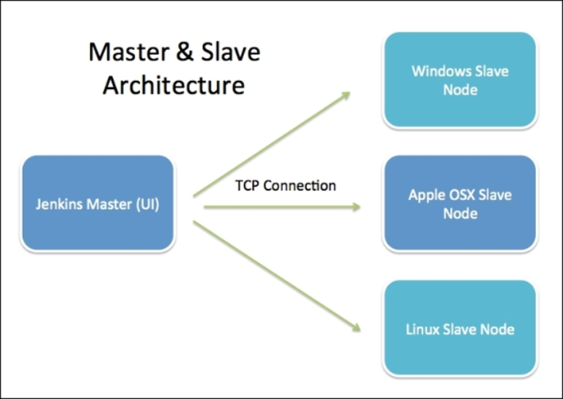

## Build Parameters:
Parameters are dynamic inputs given to Jenkin Jobs while building Tasks. 

eg. to build a specific branch only when running the jenkins hob , we can provide the name of the branch as build parameter to jenkins
Steps to add build parameters in jenkins:

        1. Create New Item
        2. Enter Item Name & Select Free Style Project
        3. Select "This Project is parameterized" in General Section
        4. Select Choice Parameter
        5. Name: Branch Name
        6. Choices: Enter every branch name in nextline
        7. Update Branches to Build: */${BranchName}

## User Management:
We cannot share administrative credentials to everyone in organization. So, Jenkins allows us to create multiple users as per our requirements.

Follow Below steps:

    Go to Manage Jenkins 
    Choose Manage Users 
    Click on Create Users
    Configure Global Security for Users
    Manage Roles & Assign Roles


## User Access Management:
By default, admin role will be available, and we can create custom role based on requirement

In Role we can configure what that Role assigned user can do in Jenkins
In Assign Roles we can add users to role.

    To Modify the Roles for Users
    Go to Global Security for Users
    Go to Authorization Tab
    Select Matrix Based Security and Add User then Select Roles
    Apply and Save

## Jenkins Archicture:
Jenkins follows Master-Slave architecture to manage distributed builds. In this architecture, slave and master communicate through TCP/IP protocol.
Jenkins architecture has two components:
1.	Jenkins Master
2.	Jenkins Node
 


#### 1. Jenkins Master

        The main server of Jenkins is the Jenkins Master. 
        It is a web dashboard and by default it runs on port 8080.
        With the help of Dashboard, we can configure the jobs/projects,but the build takes place in Nodes/Slave.
        One slave is configured by default. We can add more nodes using IP address, username, and password.

The server's job or master's job is to handle:
- Scheduling build jobs.
- Dispatching builds to the nodes/slaves for the actual execution.
- Monitor the nodes/slaves (possibly taking them online and offline as required).
- Recording and presenting the build results.
- A Master/Server instance of Jenkins can also execute build jobs directly.


#### 2. Jenkins Node: 

    Jenkins Node is used to execute the build jobs dispatched by the master. 
    We can configure a project to always run on a particular slave machine, 
    or particular type of slave machine, or simply let the Jenkins to pick the next available slave/node.


The Jenkins Master and Slave architecture offers several benefits:

- Scalability: With Jenkins Agents, you can distribute the workload across multiple machines, enabling parallel execution of build jobs and accommodating a higher number of concurrent builds.

- Specialized Environments: Jenkins Agents can be configured with specific software, libraries, or hardware configurations to handle specialized build or deployment tasks. For example, you might have Agents with different operating systems or specific tools installed.

- Security and Isolation: By using Jenkins Agents, you can control access and permissions, allowing different teams or users to have their own dedicated Agents. This provides security and isolation of build environments.

- Optimized Resource Usage: With Jenkins Agents, you can utilize resources efficiently by running builds on idle machines or on machines with spare capacity. This helps optimize resource usage and reduces build queue times.

#### Working with Jenkins Master Slave Architecture:
- Step-1: Create Jenkins Master node
- Step-2: Create Jenkins Slave/Agent/Node

        1. Create A EC2 instance
        2. Connect to EC2 using Mobaxterm
        3. Install Git client
        4. Install Java Software (JDK/JRE)
        5. Create one directory in /home/ec2-user (ex: slavenode ) [MUST]
- Step-3: Configure Slave Node on Jenkins dashboard

        1. Go to Manage Jenkins -> Go to Manage Nodes & Clouds
        2. Click on 'New Node' -> Enter Node Name -> Select Permanent Agent
        3. Enter Remote Root Directory (/home/ec2-user/slavenode )
        4. Enter Label name as “node-1”
        5. Select Launch Method as 'Launch Agent Via SSH'
        6. Give Host as 'Slave VM DNS URL' 
        7. Add Credentials (Select Kind as : SSH Username with private key )
        8. Enter Username as: ec2-user
        9. Select Private Key as paste the entire contents of the private key.
        10. Select Host Key Strategy as 'Manually Trusted Key Verification Strategy'
        11. Click on Apply and Save
- Step-4: Create Job using Jenkins Slave Machine

        1. Go to Jenkins Server and Create Jenkins Job
        2. Under Generation Section of Job creation process, select "Restrict Where This Project Can Run" and enter Slave Nodel Label name and finish job creation (node-1)
        3. Execute the Job using 'Build Now' option.
        4. Job will be executed on Slave Node (Go to Job Console Output and verify execution details)

-----------------------------------

## Jenkins Pipeline
It is a powerful tool for defining and managing continuous integration and delivery (CI/CD) pipelines. It allows you to script your build, test, and deployment processes in a declarative manner, providing flexibility, extensibility, and reusability. 

Jenkins Pipeline can be written in either Groovy (a scripting language for the Java platform) or in a more recent addition, called the Jenkins Declarative Pipeline syntax.

### Jenkins pipelines:
- **Scripted** : Groovy Based, Older pipeline, needs Groovy Coding Basics.
- **Declarative** : Recent Pipeline, Easy to configure, Works based on Jenkins DSL

  - Traditionally, Jenkins jobs were created using Jenkins UI called Free Style jobs. 
  - In Jenkins 2.0, Jenkins introduced a new way to create jobs using the technique called Pipeline as Code (PaC)
  - In pipeline as code technique, jobs are created using a script file that contains the steps to be executed by the job. 
  - In Jenkins, that scripted file is called Jenkinsfile.

[Domain Specifi Language (DSL) : 
A Programming technique to handle inputs/operations/controls
over a tools using script/coding standards.]

#### Example scripted pipeline
```groovy
node {
  stage('clone') {
	echo "From Git Cloning"
  }
  stage('Build') {
	echo "From Maven Build"
  }
  stage('Quality Check') {
	echo "From sonarqube"
  }
  stage('Artifactory') {
	echo "Upload to Nexus"
  }
  stage('ContainerDeploy') {
	echo "Deploying to Tomcat"
  }
}
```
#### Declarative Pipeline example:

```groovy
pipeline {
   agent any //  any/label-name/none
   stages {
   
	stage('clone') {
		steps {
			echo "From Git Cloning"
		}
	}
	stage('Build') {
		steps {
			echo "From Build"
		}
	}
	stage('Quality Check') {
		steps {
			echo "Quality checking"
		}
	}
	stage('Artifactory') {
		steps {
			echo "Upload to Nexus"
		}
	}
	stage('ContainerDeploy') {
		steps {
			echo "Deploying to Tomcat"
		}
	}
     }
}
```

- agent : indicates where to run Job
  - none [run in master]
  - label : node-1 [Run in Node-1 Agent]
  - any : Choose which ever is free.