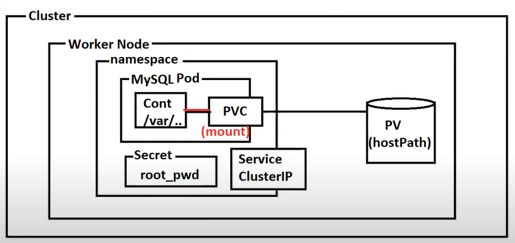

### Task 1 : Crete StorageClass , PV and PVC 
- Creta a pv that is mapped to the path /home/ec2-user/data on a amazon linux 2023 host 
- The PV should be provisioned by a storageclass that supports hostpath provisioning
- create a pvc to claim that pv

```yaml
apiVersion: storage.k8s.io/v1
kind: StorageClass
metadata:
  name: standard
provisioner: kubernetes.io/hostpath
```
```yaml
apiVersion: v1
kind: PersistentVolume
metadata:
  name: mysql-pv
spec:
  capacity:
    storage: 5Gi
  accessModes:
    - ReadWriteOnce
  persistentVolumeReclaimPolicy: Retain
  storageClassName: standard
  hostPath:
    path: /home/ec2-user/mysql/data
```
```yaml
apiVersion: v1
kind: PersistentVolumeClaim
metadata:
  name: mysql-pvc
spec:
  accessModes:
    - ReadWriteOnce
  resources:
    requests:
      storage: 5Gi
  storageClassName: standard
```
### Task 2 : Setup a SQL Aplication
- create a sql container that write data to the path /var/lib/mysql
- make sure the SQL has data persistance ie use the pvc to attache pv to it
- pass the root password to the sql conatiner as a secret
- the sql container should be listening on port 3036 ie create a service


```yaml
apiVersion: v1
kind: Secret
metadata:
  name: mysql-secret
type: Opaque
data:
  password: UmFnaHVAMTIzNA==
```

```yaml
apiVersion: apps/v1
kind: Deployment
metadata:
  name: mysql-deployment
spec:
  replicas: 1
  selector:
    matchLabels:
      app: mysql
  template:
    metadata:
      labels:
        app: mysql
    spec:
      containers:
        - name: mysql
          image: mysql:latest
          env:
            - name: MYSQL_ROOT_PASSWORD
              valueFrom:
                secretKeyRef:
                  name: mysql-secret
                  key: password
          ports:
            - containerPort: 3306
          volumeMounts:
            - name: mysql-persistent-storage
              mountPath: /var/lib/mysql
      volumes:
        - name: mysql-persistent-storage
          persistentVolumeClaim:
            claimName: mysql-pvc

```

```yaml
apiVersion: v1
kind: Service
metadata:
  name: mysql-service
spec:
  selector:
    app: mysql
  ports:
    - protocol: TCP
      port: 3306
      targetPort: 3306
```


