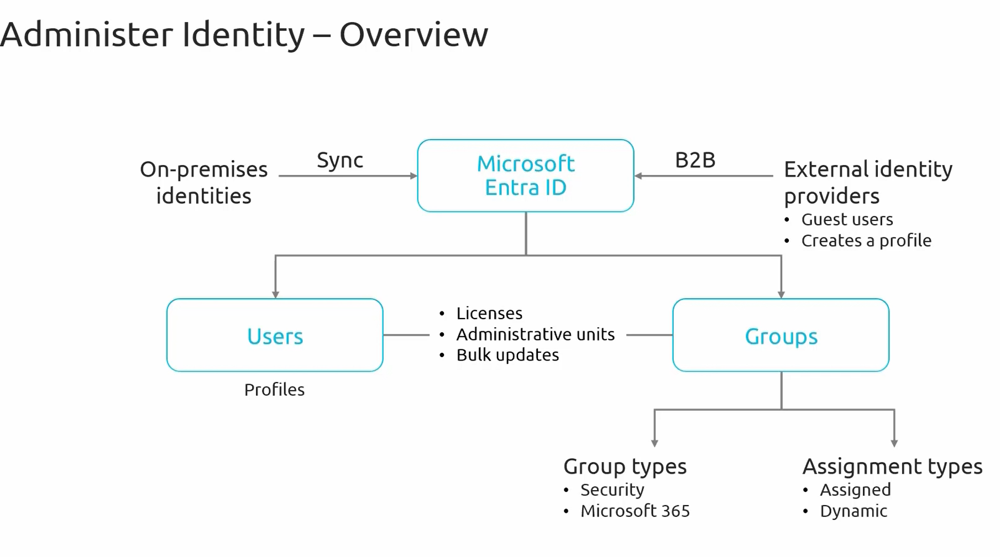

### **Administering Identity**  

Administering identity is a crucial aspect of managing Azure resources, as it involves managing user identities, permission groups, devices, and access within a cloud environment. This ensures that the right individuals have the appropriate access to technology resources.  

### **Learning Objectives**  

This module focuses on two key objectives:  

1. **Configuring Microsoft Entra ID**  
   - This section covers the setup and management of `Microsoft Entra ID`, which serves as the cornerstone of user, group, and application identity management in Azure.  
   - **Introduction to Microsoft Entra ID**: Formerly known as Azure Active Directory (Azure AD), this module provides foundational knowledge about Microsoft Entra ID and its role in Azure identity services.  
   - **Key Concepts**: A deep dive into identity types, authentication methods, and access management that define Microsoft Entra ID.  
   - **Microsoft Entra ID Editions**: Understanding the different editions and levels of service available to determine the best fit for an organization's needs.  
   - **Configuring Device Identities**: Exploring methods to configure device identities, ensuring that not just users but also devices are securely managed in Azure.  

2. **Configuring User and Group Accounts**  
   - **User Accounts**: Learning how to create and manage individual user accounts in Azure, which are essential for assigning and controlling access rights.  
   - **Bulk Operations**: Understanding techniques for managing user accounts at scale, including bulk user creation, modification, and deletion for efficient administration.  
   - **Group Accounts**: Exploring the management of group accounts to streamline permission settings and facilitate easier management of users with common access needs.  
   - **Self-Service Password Reset (SSPR)**: Enabling SSPR, which allows users to reset their passwords without administrator intervention, enhancing security and user autonomy.  
   - **Multi-Tenant Environments**: Managing identities in multi-tenant environments, a crucial aspect for organizations operating multiple Azure services or serving multiple customers from a single Azure instance.  

### **Overview of Microsoft Entra ID**  

Microsoft Entra ID serves as a central hub for identity management in Azure. It acts as an intermediary between different identity types and services, enabling functionalities such as:  
- Microsoft Entra ID helps users log in and access different services without needing multiple passwords. It provides three key security features:
    - **Single Sign-On (SSO)**  → Imagine logging into your office computer once and automatically getting access to email, company apps, and files without logging in again.
    - **Multi-Factor Authentication (MFA)**  → Just like some banking apps ask for an OTP (One-Time Password), Microsoft Entra ID can ask for a second verification (like a phone notification or fingerprint) to confirm your identity.
    - **Conditional Access Policies**  → Think of it like airport security. If you try logging in from an unknown device or location, extra verification steps might be required.
        - Example: If an employee tries logging in from a new country, Microsoft Entra ID might ask for an extra security check or block the login.

It is important to note that this course does not cover **on-premises identity synchronization**, as that is included in the **AZ-500: Azure Security Technologies** course. However, an overview is provided to understand how Microsoft Entra ID integrates with various identity sources.  

#### **Identity Integration in Microsoft Entra ID**  

Microsoft Entra ID allows different types of users to log in and access resources securely.

- **On-Premises Identities (Employees Using Office Computers)**:  
  - Represents traditional user accounts within an organization's Active Directory.  
  - Synchronization is handled via **Entra ID Connect**, allowing seamless integration with Azure's cloud identity services.  
    - These are users working in a company that uses traditional Active Directory (AD) (a system that stores usernames and passwords).
    - Entra ID Connect helps sync this data with the cloud, so employees can use the same credentials to access cloud apps like Microsoft 365. 
        - Example: An IT admin at a company sets up Entra ID Connect. Now, when an employee logs into their office computer, they can also access Outlook, Teams, and other cloud apps automatically.

- **Business-to-Business (B2B) Collaboration (Working with Partner Companies)**:  
  - Facilitates secure collaboration with external businesses.  
  - Enables guest users from partner companies to access resources without compromising security, governed by access policies.  
    - This allows companies to invite external users (such as vendors, contractors, or partner businesses) to work on shared projects.
    - These guests don’t need new accounts; they can use their existing email credentials to log in.
        - Example: A marketing team in Company A wants to share documents with Company B’s consultants. Instead of creating new accounts for them, Company A can invite them as guest users with limited access.

- **External Identity Providers (Users Logging in with Google, Facebook, etc.)**:  
  - Allows integration with third-party identity providers without requiring users to be added to the internal directory.  
  - Some users don’t have Microsoft accounts. Microsoft Entra ID allows them to log in using third-party services like Google or Facebook. This is useful for apps that need public user access (e.g., customer portals).
    - A university has an online learning portal. Instead of forcing students to create new usernames, it allows them to log in using their Outlook accounts.

- **Users and Groups**:  Microsoft Entra ID groups users to make permission management easier.
  - **Users**: Individual accounts within an organization, each assigned roles, access permissions, and profile details.  
    - Individual accounts with specific roles and access permissions. 
    - IT admins assign roles (e.g., standard employee, manager, or admin).
        - Example : ohn is an IT support staff member. He gets permission to reset passwords but not delete accounts.
  - **Groups**: Organizational units that help manage user permissions at scale.  
    - Different group types offer varying methods for assigning permissions, which will be explored in detail in later sessions.
        -  Example: A company creates a Marketing Group where all members get access to marketing documents. Instead of assigning permissions one by one, the company grants access to the entire group.  

This module will cover Microsoft Entra ID as the **central hub for identity management**, including user and group configurations, B2B collaboration, and device identity management.  

For those interested in synchronization and identity replication to the cloud, the **AZ-500 course** provides in-depth guidance on these topics.  

With that, let's begin the first topic: **Introduction to Microsoft Entra ID.**  

---
