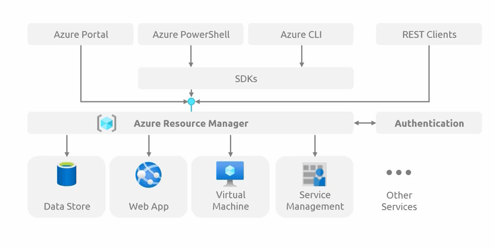

### **Azure Resource Manager (ARM)**  

Azure Resource Manager (ARM) serves as the **central management layer** for all **Azure resources**. Every **service request**, whether initiated via the **Azure Portal, Azure PowerShell, Azure CLI, REST APIs, or SDKs**, is processed through **Azure Resource Manager**.  

**Role of Azure Resource Manager**  
- **Interprets and executes cloud management tasks** such as **creating, updating, and deleting resources**.  
- **Ensures consistency and organization** in resource deployment.  
- **Acts as an intermediary**, translating user commands into backend actions.  

### Interaction with Azure Services 
Whenever a resource is deployed or managed, the request flows through **Azure Resource Manager**, which provisions the necessary infrastructure in the **Azure backend**.  
- **Deployment Requests:** Submitted configurations (e.g., VM, database, web app) are processed by ARM.  
- **Deletion Requests:** Sent via API to ARM, which ensures the removal of resources.  

**Key Features of Azure Resource Manager**  
- **Access Control:** Utilizes **Azure Role-Based Access Control (RBAC)** to enforce security policies.  
- **Resource Groups:** Provides **logical grouping** of resources for better management.  
- **Tags:** Enables **resource classification** for cost management and governance.  
- **Templates:** Supports **Infrastructure as Code (IaC)** with **ARM templates** for repeatable deployments.  

**Evolution from Azure Service Manager (ASM)**  

Previously, **Azure Service Manager (ASM)** lacked **Resource Groups, RBAC, locks, and tags**. ARM introduces an **advanced management framework** compared to the earlier **Windows Azure model**, making **resource management more structured and scalable**.  

