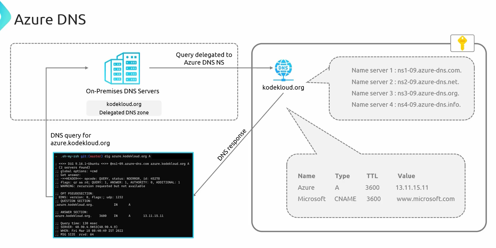

# **Azure DNS Overview and Configuration**  

Azure DNS is a **domain name system (DNS) hosting solution** provided by **Microsoft Azure**. It enables users to host **reliable and secure DNS zones** for domain name resolution.  


## **Key Features of Azure DNS**  

- **DNS Hosting**: Provides a **managed DNS service** for hosting domain zones.  
- **High Availability**: Uses **global Azure infrastructure** for **fast** and **resilient** DNS resolution.  
- **Custom DNS Zones**: Allows users to **create and manage DNS records**.  
- **Delegation Support**: Enables **domain delegation** from external domain registrars like **GoDaddy or Cloudflare**.  
- **Azure Integrated**: Supports **role-based access control (RBAC)** and **Azure Resource Manager (ARM) integration**.  
- **DNS Security**: Ensures **reliable** and **protected** name resolution.  


## **Azure DNS Zone and Naming Conventions**  

- A **DNS zone** must have a **unique name** within a **resource group**.  
- **Multiple DNS zones with the same name** can exist in different **resource groups**, but they will have **different name servers**.  
- Example of a DNS zone:  
  ```
  example.com
  ```


## **DNS Delegation Process**  

### **3.1 Why Delegation is Required?**  
- When a domain is purchased from a **registrar** (e.g., **GoDaddy, Cloudflare, Namecheap**), it comes with **default name servers** provided by the registrar.  
- To use **Azure DNS**, the **name servers** must be updated in the **domain registrar’s portal**.  

### **3.2 Steps for DNS Delegation**  
1. **Create a DNS Zone in Azure DNS**  
   - Example: `kodekloud.org`  
   - Azure provides **four name servers** for the zone.  

2. **Copy the Azure DNS Name Servers**  
   - The **name servers** are visible in the Azure Portal.  

3. **Update Name Servers in the Domain Registrar’s Portal**  
   - Go to **GoDaddy, Cloudflare, etc.**  
   - Replace the default **name servers** with **Azure name servers**.  
   - Save the configuration.  

4. **DNS Resolution Now Happens via Azure**  
   - Once the delegation is complete, **all DNS queries** will be handled by **Azure DNS**.  



## **DNS Record Sets in Azure DNS**  

### **4.1 What are Record Sets?**  
- **Record sets** group **DNS records** with the **same name and type** together.  
- Maximum **20 records** per record set.  
- Each record must be **unique**.  

### **4.2 Common DNS Record Types in Azure DNS**  

| **Record Type** | **Purpose** | **Example** |
|---------------|-----------|-------------|
| **A Record** | Maps a domain name to an **IPv4 address** | `www.example.com → 192.168.1.1` |
| **AAAA Record** | Maps a domain name to an **IPv6 address** | `www.example.com → 2001:db8::1` |
| **CNAME Record** | Creates an **alias** for another domain name | `alias.example.com → www.example.com` |
| **MX Record** | Defines **mail servers** for email delivery | `example.com → mail.google.com` |
| **TXT Record** | Stores **text-based data** (used for SPF, DKIM, etc.) | `SPF: v=spf1 include:_spf.google.com ~all` |
| **NS Record** | Specifies **name servers** for a domain | `ns1-azure.example.com` |
| **SRV Record** | Defines **service-specific locations** | `_sip._tcp.example.com 10 60 5060 sip.example.com` |  


## **How Azure DNS Resolves Queries**  

### **Example Setup:**  
- A **DNS zone** named `kodekloud.org` is created in Azure.  
- The **Azure name servers** are assigned to the zone.  
- **DNS records** are added to the zone:  
  - `A Record` for `azure.kodekloud.org → 52.187.45.32`  
  - `CNAME` for `portal.kodekloud.org → portal.microsoft.com`  

### **Query Flow for DNS Resolution**  

1. A client requests `azure.kodekloud.org`.  
2. The query first goes to the **on-premises DNS server** (if applicable).  
3. The **on-premises DNS** checks for local records and forwards the request to the **Azure DNS name servers**.  
4. **Azure DNS resolves the query** and sends the response back to the client.  
5. The client receives the **correct IP address or alias** based on the configured record.  


## **Using Azure Service Domains**  

- **Azure allows domain registration directly from the Azure portal**.  
- If a domain is purchased via **Azure Service Domains**, it is **automatically integrated** with **Azure DNS**.  
- No **manual DNS delegation** is required when purchasing domains through Azure.  


## **Alternative DNS Resolution Methods**  

- If a domain is **not delegated** to Azure DNS, queries can still be resolved using **manual name server lookups**:  
  ```
  dig @<Azure_DNS_NameServer> <domain>
  ```
  Example:  
  ```
  dig @ns1-08.azure-dns.com azure.kodekloud.org
  ```


## **Summary: Key Takeaways on Azure DNS**  

| **Feature** | **Details** |
|------------|------------|
| **DNS Hosting** | Azure DNS provides **global, reliable, and scalable** DNS hosting. |
| **Delegation** | Domains from registrars like GoDaddy must **update name servers** to use Azure DNS. |
| **Record Management** | Supports **A, AAAA, CNAME, MX, TXT, NS, SRV records**. |
| **Record Sets** | Groups records of the **same name and type** (max **20 records per set**). |
| **DNS Query Process** | Queries resolve through **on-prem DNS → Azure DNS → Client**. |
| **Manual Lookup** | Use **dig/nslookup** to query Azure DNS manually if delegation is not set up. |
| **Azure Service Domains** | Directly purchase and integrate domains within **Azure DNS**. |

Azure DNS ensures **fast and secure** domain name resolution while seamlessly integrating with other Azure services.

---

# **Creating and Managing DNS Zones in Azure**  

This guide provides a step-by-step process for creating **DNS zones** in **Azure DNS**, managing **DNS records**, and resolving queries using **nslookup**.


## **1. Creating a DNS Zone in Azure**  

### **1.1 Steps to Create a DNS Zone**  

1. **Open the Azure Portal**  
   - Navigate to **https://portal.azure.com**.  

2. **Search for "DNS Zones"**  
   - In the **search bar**, type **"DNS Zones"** and select the service.  

3. **Create a New DNS Zone**  
   - Click **Create**.  
   - Select an **existing resource group** or create a new one.  
   - Enter the **DNS Zone name** (e.g., `corecloud.org`).  

4. **Global Nature of Azure DNS Zones**  
   - **DNS zones are global resources** in Azure.  
   - While metadata is stored in the **resource group's region**, the DNS records are **distributed globally** across Azure’s name servers.  

5. **Review & Create**  
   - Click **Review + Create** → **Create**.  
   - Once deployed, go to **Resources** to manage the DNS zone.  


## **2. Managing DNS Records in Azure DNS**  

### **2.1 Viewing Default Records**  
After creating the DNS zone, the following **default records** are automatically generated:  

- **SOA (Start of Authority) Record**: Defines the primary name server for the domain.  
- **NS (Name Server) Records**: Lists the **Azure name servers** that handle queries for the zone.  

### **2.2 Adding a New DNS Record**  

1. **Open the DNS Zone in Azure Portal**.  
2. Click **+ Record Set** to add a new record.  
3. Enter the required details:  
   - **Name**: `www` (for `www.corecloud.org`).  
   - **Type**: `A Record`.  
   - **IP Address**: `1.1.1.1`.  
4. Click **OK** to create the record.  

### **2.3 Creating Different Record Types**  
Azure DNS supports multiple record types:  

| **Record Type** | **Description** | **Example** |
|---------------|----------------|-------------|
| **A Record** | Maps a domain to an **IPv4 address** | `www.corecloud.org → 1.1.1.1` |
| **CNAME (Alias)** | Maps a domain to another **canonical domain** | `google.cloud.org → www.google.com` |
| **CAA Record** | Specifies which certificate authorities can issue SSL certificates | `CAA example.com 0 issue "letsencrypt.org"` |
| **MX Record** | Defines **mail servers** for email delivery | `example.com → mail.google.com` |


## **3. Creating a Subzone (Child DNS Zone)**  

### **3.1 What is a Subzone?**  
- A **subzone** is a child DNS zone under the main DNS zone.  
- Example:  
  - **Parent Zone**: `corecloud.org`  
  - **Subzone**: `azure.corecloud.org`  

### **3.2 Steps to Create a Subzone**  
1. Open the **DNS Zones** service in Azure.  
2. Click **+ Create DNS Zone**.  
3. Enter the **subzone name** (e.g., `azure.corecloud.org`).  
4. Associate it with the **parent DNS zone** (`corecloud.org`).  
5. Click **Create**.  


## **4. Resolving DNS Queries Using nslookup**  

### **4.1 Checking DNS Resolution Locally**  
1. Open a **PowerShell or Command Prompt**.  
2. Run the `nslookup` command:  
   ```sh
   nslookup www.corecloud.org
   ```
   - If the name is not **publicly accessible**, it may fail.  

### **4.2 Querying Azure Name Servers Directly**  
1. First, change the **DNS server** to Azure’s name server:  
   ```sh
   nslookup
   ```
   - This opens an interactive mode.  

2. Set the **Azure Name Server**:  
   ```sh
   server ns1-xx.azure-dns.com
   ```

3. Query the record:  
   ```sh
   www.corecloud.org
   ```
   - Expected output:  
     ```
     Name: www.corecloud.org
     Address: 1.1.1.1
     ```

4. Checking **CNAME Resolution**:  
   ```sh
   set type=CNAME
   google.cloud.org
   ```
   - Expected output:  
     ```
     google.cloud.org
     canonical name = www.google.com
     ```


## **5. Private DNS Zones in Azure**  

### **5.1 Why Use Private DNS Zones?**  
- Public DNS zones expose records to the **internet**.  
- **Private DNS zones** are used for **internal name resolution** (e.g., resolving a VM’s private IP).  
- Example scenario:  
  - **VM1** has a **private IP (10.0.0.4)**.  
  - A **private DNS zone** allows resolution as `vm1.internal.local → 10.0.0.4`.  

### **5.2 Use Case: Private DNS Resolution for VMs**  
- A **private DNS zone** ensures internal services can **resolve private IPs** without exposing them publicly.  
- Example: Resolving a VM’s hostname to its **private IP** using **Azure Private DNS**.  


## **6. Summary: Key Takeaways on Azure DNS**  

| **Feature** | **Details** |
|------------|------------|
| **Global Resource** | Azure DNS zones are **global** (not tied to a specific region). |
| **Default Records** | Every DNS zone has **NS** and **SOA** records by default. |
| **Supported Records** | Azure DNS supports **A, CNAME, CAA, MX, TXT, NS, SRV** records. |
| **Subzones (Child Zones)** | Allows the creation of **subdomains** within a DNS zone (e.g., `azure.corecloud.org`). |
| **DNS Resolution** | Uses `nslookup` or `dig` to verify DNS queries. |
| **Public vs Private DNS** | - **Public DNS**: Exposed on the internet.  |
| | - **Private DNS**: Used for internal **VM name resolution**. |

Azure DNS provides a **fully managed, global, and scalable** DNS hosting solution, making it an ideal choice for both **public and private** name resolution.