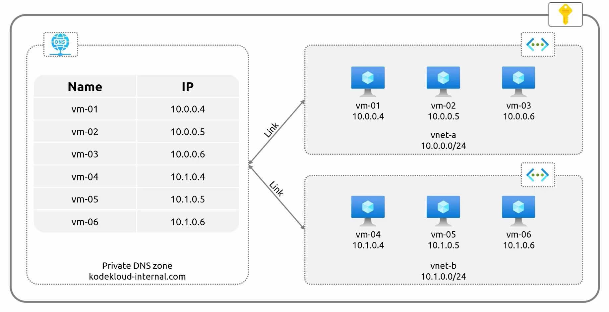

# *Azure Private DNS Zones**  

**Private DNS Zones** allow name resolution for **private IP addresses** within Azure **virtual networks (VNets)**. Unlike **public DNS zones**, which resolve domain names to **public IPs**, **private DNS zones** provide internal DNS resolution without exposing resources to the internet.  


### **When to Use Private DNS Zones?**  

- **Public DNS Zones**: Used for **external-facing** resources (e.g., websites, SharePoint, etc.).  
- **Private DNS Zones**: Used for **internal resources** (e.g., resolving VM names within Azure).  
- #### **Example Scenario**  
    - A subscription contains **two virtual networks (VNets)**:  
        - **VNet A (10.0.0.0/16)**  
        - **VNet B (10.1.0.0/16)**  
        - Both VNets have **virtual machines (VMs)** that need to communicate.  
        - **Problem:**  
            - By default, **VMs within the same VNet** can resolve each other’s names (e.g., `VM01` can resolve `VM02`).  
            - However, **VMs across different VNets cannot resolve each other** (e.g., `VM01` in **VNet A** cannot resolve `VM04` in **VNet B**).  
            - A **Private DNS Zone** is required to enable name resolution across VNets.  

### **How Private DNS Zones Work?**  
- #### **1. Creating a Private DNS Zone**  
    - A **Private DNS Zone** (e.g., `kodekloudinternal.com`) is created to provide name resolution within **one or more VNets**.  
- #### **2 Linking VNets to the Private DNS Zone**  
    - **A Virtual Network Link** must be created to associate each VNet with the Private DNS Zone.  
    - Without this **VNet Link**, VMs in the VNet will **not** recognize the Private DNS Zone.  
- #### **3 Enabling Auto-Registration**  
    - If **Auto-Registration** is enabled, any **new VMs** added to the linked VNet will be **automatically registered** in the Private DNS Zone.  




## **Private DNS Name Resolution Process**  
- #### **Before Private DNS Zone is Configured**  
    - **VMs within the same VNet** can resolve each other’s names using Azure’s **default internal DNS**.  
    - **VMs in different VNets cannot resolve each other’s names**.  
- #### **After Configuring Private DNS Zone & VNet Links**  
    - **VM01 (VNet A) requests the IP of VM06 (VNet B)**.  
    - **Azure Private DNS Zone** responds with `10.1.0.6` (VM06's IP).  
    - **VM01 now knows the private IP of VM06**, but it **cannot communicate** with VM06 unless **Virtual Network Peering** is established.  

### **Important:**  
- **Private DNS Zone only resolves names**; ```it does not allow direct communication between VMs```.  
- To enable communication between VMs across VNets, **VNet Peering** must be configured.  


### **Key Takeaways**  

| **Feature** | **Details** |
|------------|------------|
| **Public vs Private DNS** | Public DNS zones resolve to **public IPs**, while Private DNS zones resolve to **private IPs**. |
| **VNet Name Resolution** | VMs in the **same VNet** resolve names automatically. |
| **Private DNS Zone** | Required for **cross-VNet** name resolution. |
| **VNet Link** | Must be created to associate a VNet with a Private DNS Zone. |
| **Auto-Registration** | Automatically registers **new VMs** in the Private DNS Zone. |
| **DNS vs Connectivity** | Private DNS **only resolves names**; VNet Peering is required for **VM-to-VM communication**. |


# **Configuring Private DNS Zones in Azure**  

**Private DNS Zones** enable name resolution for **private IP addresses** within **Azure Virtual Networks (VNets)**. This eliminates the need for custom DNS servers and simplifies **internal network communication**.  


### **1. Creating a Private DNS Zone**  

1. Navigate to **Azure Portal**.  
2. Search for **Private DNS Zones** and create a new zone (e.g., `kodecloudint.com`).  
3. Since **Private DNS Zones are global**, there is **no need to select a region**, but metadata is stored in the **Resource Group's** region.  
4. Click **Create** and wait for deployment.  

#### **2. Verifying Default Name Resolution**  
- **Checking Internal Name Resolution in a VNet**  
    - Existing **Virtual Machines (VMs)** (e.g., `workload-C VM`) are used for testing.  
    - Connect to `workload-C VM` via SSH.  
    - Check the DNS configuration:  
        ```sh
        cat /etc/resolv.conf
        ```
        - This file contains the **Azure-provided internal DNS server**.  
        - Microsoft Azure automatically adds a **search domain** for internal name resolution.  
    - Perform an **NSLookup** for another VM within the same VNet:  
        ```sh
        nslookup workload-A
        ```
        - The query succeeds, resolving to the **private IP** of `workload-A`.  
        - Similarly, `workload-B` can be resolved since all VMs are in the **same VNet**.  
- **Issue with Cross-VNet Resolution**  
    - A new VM (`dns-demo-vm`) is deployed in a **different VNet**.  
    - From `workload-C VM`, running:  
        ```sh
        nslookup dns-demo-vm
        ```
        - **Fails** because `dns-demo-vm` is in a **separate VNet**, and there is **no shared DNS resolution** between VNets.  
        - Azure's **default internal DNS** only works **within** a single VNet.  

#### **3. Enabling Cross-VNet Name Resolution with Private DNS Zones**  
- **1. Linking Virtual Networks to the Private DNS Zone**  
    - Navigate to **Private DNS Zones** (`kodecloudint.com`).  
    - Create **two Virtual Network Links**:  
        1. **Link to VNet 1** (containing `workload-A`, `workload-B`, `workload-C`).  
        2. **Link to VNet 2** (containing `dns-demo-vm`).  
    - **Enable Auto-Registration** when creating the links:  
        - **Auto-Registration** allows **new and existing** VMs to **automatically** register their names in the Private DNS Zone.  
        - **Without auto-registration**, VM records must be manually created.  
        - - Wait for the **links to reach completed state** before using them.  
- **2. Validating Cross-VNet DNS Resolution**  : Once the Private DNS Zone is linked to both VNets:  
    - From `workload-C VM`, run:  
        ```sh
        nslookup dns-demo-vm.kodecloudint.com
        ```
        - This time, the query succeeds, resolving to the **private IP** of `dns-demo-vm`.  
    - From `dns-demo-vm`, run:  
        ```sh
        nslookup workload-A.kodecloudint.com
        ```
        - The VM can now resolve the **workload VMs in the first VNet**.  

**Why does this work?**  
- Both VNets are **aware of the Private DNS Zone**.  
- Each VM **registers itself in the zone** and can resolve names from the other VNet.  


## **Private DNS Zones in Private Link Scenarios**  

**Private DNS Zones** play a **crucial role** in **Private Link configurations** where:  
- Services like **Azure SQL, Storage Accounts, and App Services** need **private endpoints**.  
- A **Private DNS Zone** is required to **resolve the private IP of the service** instead of its public IP.  


## **Key Takeaways**  

| **Feature** | **Details** |
|------------|------------|
| **Default VNet Resolution** | VMs in the **same VNet** can resolve each other’s names automatically. |
| **Need for Private DNS Zones** | Required when **resolving VM names across different VNets**. |
| **VNet Link Requirement** | VNets **must be linked** to a Private DNS Zone for name resolution. |
| **Auto-Registration** | Automatically registers **existing and new VMs** in the DNS zone. |
| **DNS vs Connectivity** | DNS resolution **does not establish communication**; **VNet Peering or VPN** is required. |
| **Role in Private Links** | Essential for **Private Endpoints** to ensure internal name resolution. |


## **Next Steps: Hybrid Connectivity**  

- **VNet Peering**: To enable **direct communication** between VNets.  
- **VPN & ExpressRoute**: To connect **on-premises** networks with Azure.  
- **Private Endpoints**: To securely access Azure services via **private IPs**.
