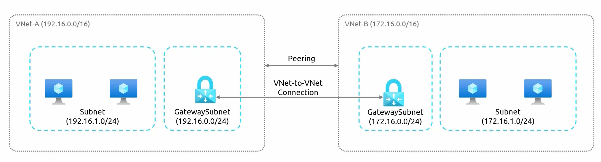
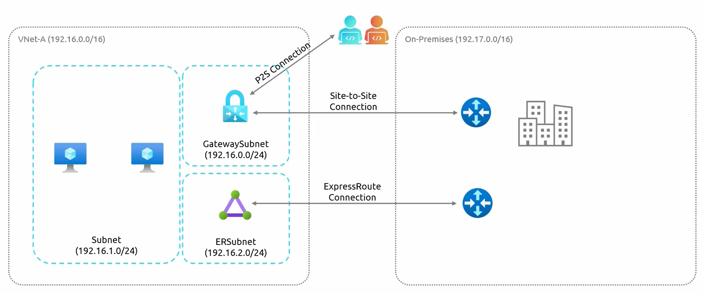

# **Inter-Site Connectivity in Azure**  

Azure offers multiple methods for connecting **Azure-to-Azure** and **Azure-to-on-premises** environments. These methods ensure **secure communication** across different networks, enabling **resource sharing and hybrid cloud deployments**.  

---
## **Azure-to-Azure Connectivity (When resources are inside azure )**  

By default, **Virtual Networks (VNets)** in Azure **cannot communicate** with each other. To establish connectivity between VNets, the following methods can be used:  

- ### **1. VPN Gateway (VNet-to-VNet Connection)**  

    - Requires a **Gateway Subnet**, which is a special subnet within a VNet.  
    - A **VPN Gateway** is deployed within the **Gateway Subnet**.  
    - The VPN Gateway enables **encrypted traffic** between VNets over the **public internet**.  
    - #### **How it works:**  
        - Create a **Gateway Subnet** in each VNet.  
        - Deploy a **VPN Gateway** in both VNets.  
        - Establish a **VNet-to-VNet VPN connection** between them.  
    - **Use Case:** Suitable for scenarios requiring **secure encrypted communication** but can introduce **higher latency** due to routing over the public internet.  

- ### **2. VNet Peering (Direct Connection Between VNets)**  

    - VNet Peering allows **direct network traffic flow** between VNets **without a VPN Gateway**.  
    - Provides **low latency** and **high bandwidth** since traffic stays within Microsoft's backbone network.  
    - Works for VNets in the **same or different regions** (Global VNet Peering).  
    - #### **How it works:**  
        - Create a **VNet Peering** connection between the two VNets.  
        - Configure **name resolution and route propagation** if necessary.  
        - The two VNets can now communicate as if they are part of the same network.  
    - **Use Case:**  
        - Best for **fast and seamless** communication between VNets.  
        - Ideal for **microservices architectures, distributed applications, and cross-region replication**.  

---
## **Azure-to-On-Premises Connectivity**  

When integrating an **on-premises network** with Azure, the following options are available:  

- ### **1. Site-to-Site VPN (VPN Gateway)**  
    - Establishes a **secure, encrypted tunnel** between an **on-premises network and Azure**.  
    - Uses a **VPN Gateway** at both ends to transmit data over the **public internet** securely.  
    - Requires a **compatible VPN device** on-premises (or an Azure VPN Client).  
    - #### **How it works:**  
        - Configure a **Gateway Subnet** in Azure.  
        - Deploy a **VPN Gateway** in Azure.  
        - Configure an **IPsec VPN Tunnel** between the **on-premises VPN device** and Azure.  
    - **Use Case:**  
        - Suitable for **hybrid cloud setups** where an organization wants a **secure connection over the internet**.  
        - Ideal for **moderate traffic loads** where **occasional latency** is acceptable.  

- ### **2 ExpressRoute (Private Dedicated Connection)**  
    - Provides a **private, dedicated connection** between Azure and on-premises.  
    - Does **not** use the public internet, offering **better security, reliability, and lower latency**.  
    - Requires a **telecom provider** (ExpressRoute Partner) to establish the connection.  
    - #### **How it works:**  
        - The organization partners with an **ExpressRoute provider**.  
        - A **private circuit** is established between the **on-premises data center and Azure**.  
        - The circuit can be extended to multiple VNets.  
    - **Use Case:**  
        - Best for enterprises requiring **high-speed, low-latency, and reliable connectivity**.  
        - Ideal for **business-critical applications, database replication, and large-scale hybrid environments**.  

- ### **3 Point-to-Site VPN (For Remote Users)**  
    - Used when **individual remote users** need to connect securely to Azure.  
    - Allows users to establish a VPN connection **from their laptops/desktops** using VPN clients.  
    - Uses the **VPN Gateway** for **secure access**.  
    - #### **How it works:**  
        - Configure a **Point-to-Site VPN** in Azure.  
        - Distribute **VPN client configurations** to remote users.  
        - Users connect to **Azure resources securely** over an encrypted tunnel.  
    - **Use Case:**  
        - Useful for **developers, remote workers, and IT administrators** needing **secure access** to Azure resources.  
        - Ideal when **full site-to-site connectivity is not required**.  

---

## **Comparison of Connectivity Methods**  

| **Connectivity Type** | **Method** | **Traffic Type** | **Latency** | **Use Case** |
|----------------------|------------|----------------|------------|-------------|
| **Azure-to-Azure** | **VPN Gateway (VNet-to-VNet)** | Encrypted over **public internet** | **High latency** | Secure but slower VNet communication |
| **Azure-to-Azure** | **VNet Peering** | Direct over **Azure backbone** | **Low latency** | Fast, seamless, and cost-effective communication between VNets |
| **Azure-to-On-Premises** | **Site-to-Site VPN** | Encrypted over **public internet** | **Higher latency** | Secure hybrid connection over VPN |
| **Azure-to-On-Premises** | **ExpressRoute** | Private **dedicated connection** | **Very low latency** | Mission-critical, high-performance workloads |
| **Remote User Access** | **Point-to-Site VPN** | Encrypted over **public internet** | **Moderate latency** | Individual remote access to Azure resources |

## **Summary of Inter-Site Connectivity Options**  

| **Connection Type** | **Methods** |
|--------------------|-------------|
| **Azure-to-Azure Connectivity** | ✅ **VPN Gateway (VNet-to-VNet VPN)**   ✅ **VNet Peering** |
| **Azure-to-On-Premises Connectivity** | ✅ **VPN Gateway (Site-to-Site VPN)**   ✅ **ExpressRoute (Dedicated Private Connection)** |
| **Remote Access to Azure** | ✅ **Point-to-Site VPN (For Remote Users)** |

Each method is chosen based on **latency, cost, security, and use case requirements**.