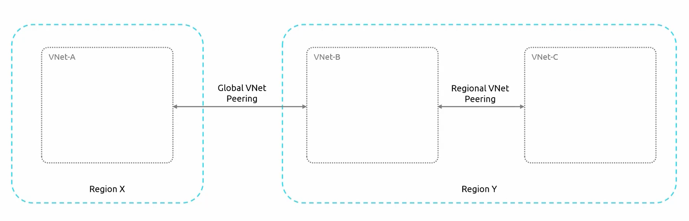

# **Virtual Network Peering in Azure**  
Virtual Network (VNet) Peering in Azure enables **direct connectivity** between diffrenet virtual networks as if they were a single network. It eliminates the need for:  
- VPN Gateways  
- Hubs  
- Public internet routing  

Peering allows resources in different VNets to **communicate securely and efficiently**, leveraging **Microsoft’s backbone network** for **low-latency and high-bandwidth** connectivity.  

### **Types of VNet Peering**  
Azure provides **two types** of Virtual Network Peering:  
- **Regional VNet Peering** : 
    - Connects VNets **within the same Azure region**.
    - **Regional VNet Peering** is used **within the same region**, offering ultra-low latency communication between VNets
- **Global VNet Peering** : 
    - Connects VNets **across different Azure regions**.
    - **Global VNet Peering** enables **cross-region connectivity** without requiring an internet connection, VPN, or ExpressRoute.  

### **Key Benefits of VNet Peering**  

- ### **1. High-Speed Data Transfer & Low Latency**  
    - VNet Peering **reduces network latency** compared to traditional VPN-based solutions.  
    - Communication between VNets happens **at high bandwidth speeds** without the need for an intermediate gateway.  

- ### **2. Secure Private Connection (Microsoft Backbone)**  
    - Traffic between peered VNets is **not exposed to the public internet**.  
    - Data transfer happens over **Microsoft’s private backbone network**, ensuring security and reliability.  
- ### **3. Simple Configuration**  
    - Setting up VNet Peering requires **just a few clicks** in the Azure Portal or simple configurations via **PowerShell, CLI, or Terraform**.  
    - There is **no need to manage complex routing or gateway configurations**.  
- ### **4 Cross-Subscription & Cross-Tenant Connectivity**  
    - VNet Peering supports peering across:  
        - **Different subscriptions** within the same Azure Active Directory (AAD) tenant.  
        - **Different Azure AD tenants**, allowing organizations to securely interconnect resources.  
- ### **5. Scalability & Flexibility**  
    - Works seamlessly across **different VNets, regions, and workloads**.  
    - Supports **disaster recovery, high availability, and global distribution** of applications.  

## **How VNet Peering Works**  
- ### **1. Establishing a Peering Connection**  
    - **Identify the two VNets** that need to be connected.  
    - **Enable peering** between them from the Azure Portal, CLI, or Terraform.  
    - **Configure permissions** if the VNets are in different subscriptions or tenants.  
    - **Enable network traffic forwarding**, if required.  

- ### **2. Communication Flow in VNet Peering**  
    - Once peering is enabled, Azure routes **all traffic between peered VNets** through the private backbone.  
    - **No additional routing or internet exposure** is required.  
    - If configured, peered VNets can also route traffic to **on-premises networks**.  

## **Comparison: VNet Peering vs. Other Connectivity Methods**  

| **Feature**           | **VNet Peering** | **VPN Gateway** | **ExpressRoute** |
|----------------------|----------------|----------------|----------------|
| **Latency** | **Low (private backbone)** | High (public internet) | Very Low (private circuit) |
| **Bandwidth** | **High (Microsoft backbone)** | Limited by VPN Gateway | Very High |
| **Security** | **Private & Encrypted** | Encrypted | Private & Secure |
| **Configuration Complexity** | **Simple** | Moderate | High |
| **Cross-Region Support** | **Yes (Global VNet Peering)** | Yes | Yes |
| **Cross-Subscription/Tenant** | **Yes** | Yes | Yes |
| **Internet Dependency** | **No** | Yes | No |

## **Summary of Virtual Network Peering**  

| **Feature** | **VNet Peering** |
|------------|----------------|
| ✅ **Enables direct communication** between VNets | Yes |
| ✅ **Bypasses internet for security** | Yes (Uses Microsoft's backbone) |
| ✅ **High bandwidth, low latency** | Yes |
| ✅ **Supports cross-region connectivity** | Yes (Global VNet Peering) |
| ✅ **Works across subscriptions and tenants** | Yes |
| ✅ **No additional gateway required** | Yes |

# **Demonstration of Virtual Network Peering in Azure**  

This demonstration sets up **two virtual machines (VMs) in separate Virtual Networks (VNets)** across different Azure regions and establishes **Virtual Network Peering** to enable communication between them.  

- **VNet 1**: Located in **East US**, containing a VM with **IP 192.168.0.4**  
- **VNet 2**: Located in **West US**, containing a VM with **IP 192.168.1.4**  
- **Objective**: Establish connectivity between these two VNets using **VNet Peering**.  
    - Run the script `peering-prep-infra.ps1` to prepare the above infra

### **Initial Network Isolation**  
- Initially, **there is no connectivity** between the two VMs because they belong to different VNets.  
- Running a **ping test** from the East US VM (`192.168.0.4`) to the West US VM (`192.168.1.4`) **fails**, confirming that the networks are isolated.  

🔹 **Important Consideration**: VNets should have **non-overlapping IP address ranges** to avoid conflicts during peering.  

### **Setting Up Virtual Network Peering**  

To establish peering, the following steps are performed:  

- #### **Step 1: Initiate Peering from One VNet**  
    - Navigate to **one of the Virtual Networks** (East US or West US) in the **Azure Portal**.  
    - Go to the **Peering** section.  
    - Click **Add Peering**.  
    - Provide a **Peering Link Name** (e.g., `USWS-link`).  

- #### **Step 2: Configure Peering Options**  
    - When configuring peering, several options are available:  
        | **Option** | **Description** | **Selected?** |
        |------------|----------------|-------------|
        | **Allow Virtual Network Access** | Enables traffic between the peered VNets. | ✅ Yes |
        | **Allow Forwarded Traffic** | Allows traffic forwarded from one VNet to another. | ✅ Yes |
        | **Allow Gateway Transit** | Enables gateway traffic forwarding for on-premises connectivity. | ❌ No (not using a gateway) |
    - **Select the remote virtual network** (West US).  
    - Click **Add** to initiate the peering.  

- #### **Step 3: Verify the Peering Connection**  
    - Azure automatically **establishes the peering connection** on **both VNets**.  
    - Checking the **Peering section** in either VNet will display the **active peering link**.  

### **Testing Network Connectivity After Peering**  

- **Step 1: Re-run the Ping Test**  : Once peering is established, the **ping test from East US to West US succeeds**, indicating successful network connectivity.  
- **Step 2: SSH Connection Test**  : A direct **SSH connection** from `192.168.0.4` (East US VM) to `192.168.1.4` (West US VM) now works.  

### **Understanding Network Security Group (NSG) Behavior**  
- Azure **Network Security Groups (NSGs)** contain a default rule:  
  - **"Allow VNET Inbound"** rule permits traffic **within a VNet** and also from **peered VNets**.  
- This means that no additional **NSG rule modifications** are required to allow traffic between the VMs.  
- However, **to restrict or control access**, custom NSG rules with a **higher priority** must be created.  

### **Summary of Virtual Network Peering Setup & Testing**  

| **Step** | **Action Taken** | **Result** |
|---------|----------------|-----------|
| **1** | Created two VMs in separate VNets (East US & West US). | ✅ VMs isolated (no connectivity). |
| **2** | Attempted a ping test. | ❌ Ping failed (no peering). |
| **3** | Configured Virtual Network Peering. | ✅ Peering successfully established. |
| **4** | Re-attempted the ping test. | ✅ Ping successful. |
| **5** | Verified SSH connectivity between VMs. | ✅ SSH connection established. |
| **6** | Checked NSG rules. | ✅ Default "Allow VNET Inbound" rule allows traffic. |

By using **Virtual Network Peering**, seamless and secure **cross-region** communication is established **without additional gateways** or complex configurations.