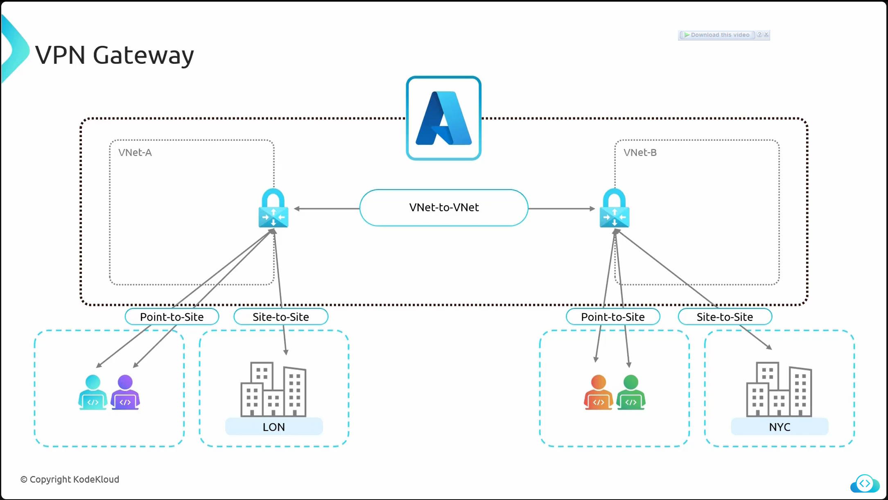
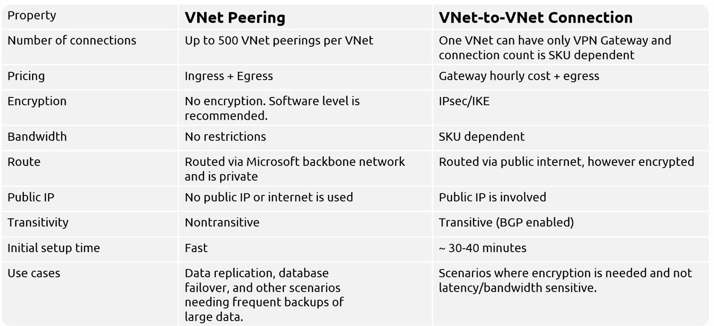

# **VPN Gateway in Azure**  
A **VPN Gateway** in Azure is a **networking service** that enables secure communication between:  

- **Virtual Networks (VNets) using VNet-to-VNet connections.**  
- **On-premises networks and Azure VNets using Site-to-Site VPN.**  
- **Individual devices and Azure VNets using Point-to-Site VPN.**  

Unlike **VNet Peering**, a VPN Gateway requires a **gateway on both VNets** for connectivity.  

### **VPN Gateway Architecture**  

- **Example Scenario:**  
  - **VNet A** has a **VPN Gateway** and is connected to **VNet B** via a **VNet-to-VNet connection**.  
  - **VNet B** also has a **VPN Gateway** and is connected to a **New York office** via a **Site-to-Site VPN connection**.  
  - The New York office can communicate with **VNet B** and, through it, access resources in **VNet A**.  
  - This setup ensures **secure encrypted connectivity** between Azure VNets and on-premises networks.

  

🔹 **Key Difference from VNet Peering:**  
Unlike VNet Peering, which establishes **direct private connectivity**, a VPN Gateway requires **VPN tunnels and encryption** and may introduce additional **latency**.  

### **VPN Gateway SKUs and Resizing**  

Azure offers different **SKU (Stock Keeping Unit) sizes** for VPN Gateways, categorized into **Gen 1 and Gen 2** SKUs.  

| **Generation** | **Key Features** | **Resizing Constraints** |
|---------------|-----------------|------------------------|
| **Gen 1 (GW1, GW2, GW3)** | Legacy SKU, lower performance. | Can resize **within Gen 1** (e.g., GW1 → GW2). |
| **Gen 2 (VpnGw1, VpnGw2, etc.)** | Supports **higher throughput** and **zone redundancy**. | Can resize **within Gen 2** but not from Gen 1 to Gen 2. |
| **Basic SKU** | **Legacy SKU**, not recommended for production. | No resizing options. |

🔹 **Important Considerations:**  
- If upgrading from **Gen 1 to Gen 2**, a **new VPN Gateway deployment** is required.  
- **Basic SKU** should **not be used** in production due to **limited features** and **lower reliability**.  

### **Setting Up a VNet-to-VNet VPN Connection**  

To establish **VNet-to-VNet connectivity** using VPN Gateways, the following **three-step process** must be followed:  

- ### **Step 1: Create a Gateway Subnet**  
    - Each **VNet must have a Gateway Subnet** (mandatory).  
    - This subnet is dedicated for **VPN Gateway deployment**.  

- ### **Step 2: Deploy VPN Gateways**  
    - A **VPN Gateway** must be created in **each VNet** that needs to connect.  
    - The appropriate **SKU** should be selected based on required **throughput** and **connections**.  

- ### **Step 3: Establish a VPN Connection**  
    - Configure a **VNet-to-VNet** connection between the two VPN Gateways.  
    - The connection is **encrypted**, making it suitable for **secure cross-region** or **hybrid network setups**.  

### **Why Use VPN Gateway Instead of VNet Peering?**  

Despite the availability of **VNet Peering**, some customers **still prefer VPN Gateways** due to:  

| **Reason** | **Explanation** |
|------------|---------------|
| **Encryption** | VPN connections provide **end-to-end encryption**, whereas VNet Peering does not. |
| **On-Premises Connectivity** | Required when connecting **Azure VNets to on-premises** using Site-to-Site VPN. |
| **Cross-Subscription Connectivity** | Enables connecting **VNets across different Azure subscriptions** securely. |
| **Multi-Cloud and Hybrid Setups** | Used when integrating Azure VNets with **AWS, GCP, or private data centers**. |

🔹 **However, VPN Gateways have higher latency and lower throughput compared to VNet Peering, making Peering the preferred option when encryption is not required.**  

# **VNet Peering vs. VNet-to-VNet VPN Connection in Azure**  

Both **VNet Peering** and **VNet-to-VNet VPN Connection** serve the same purpose—**enabling communication between Azure Virtual Networks (VNets)**. However, they differ in performance, cost, security, and setup time.  

## **Comparison Table: VNet Peering vs. VNet-to-VNet VPN Connection**  

| **Feature**             | **VNet Peering** | **VNet-to-VNet VPN Connection** |
|-------------------------|-----------------|--------------------------------|
| **Maximum Connections** | ✅ Supports **up to 500 peerings per VNet**. | ❌ Only **one VPN Gateway per VNet**, but supports multiple connections (dependent on SKU). |
| **Pricing** | ✅ **Only ingress/egress (data transfer) charges**. No additional costs. | ❌ **Hourly cost for VPN Gateway + egress charges** (costly even if not in use). |
| **Encryption** | ❌ **No built-in encryption** (software-level encryption required). | ✅ **IPsec encryption** (Internet Key Exchange). |
| **Bandwidth** | ✅ **No bandwidth restrictions**, suitable for high data transfer. | ❌ **SKU-dependent** (maximum **10 Gbps** for higher-end SKUs). |
| **Routing Path** | ✅ Uses **Microsoft backbone network** (fast, private, low latency). | ❌ Routes **over the public internet** (encrypted VPN tunnel). |
| **Public IP Requirement** | ❌ **No public IP required** (private network). | ✅ **Requires a public IP address** (VPN Gateway cannot be deployed without it). |
| **Transitivity** | ❌ **Non-transitive** (A → B and B → C does **not** mean A → C). | ✅ **Transitive with BGP enabled** (A → B and B → C allows A → C). |
| **Setup Time** | ✅ **Quick setup** (few minutes). | ❌ **Takes ~45–50 minutes** to deploy VPN Gateways. |
| **Latency** | ✅ **Lower latency** (uses Azure backbone). | ❌ **Higher latency** (internet-based VPN tunnel). |
| **Best Use Cases** | **High-speed, low-latency communication** between VNets (e.g., **data replication, failover, large data transfer**). | **Secure encrypted communication** (e.g., **hybrid connectivity, compliance-based security**). |

## **Key Differences Explained**  

### **1. Connection Limit**  
- **VNet Peering**: Supports **up to 500** VNet peerings per virtual network.  
- **VNet-to-VNet VPN**: Limited by **SKU-based connection limits** (some SKUs support only a few connections, others support up to **300**).  

### **2. Cost Considerations**  
- **VNet Peering**: Only **pays for data transfer** (ingress and egress).  
- **VNet-to-VNet VPN**: Charged **per hour** for the **VPN Gateway** **(even if no data is transferred)** + **egress charges**.  

### **3. Security (Encryption)**  
- **VNet Peering**: No built-in encryption. If security is needed, **data must be encrypted before transmission**.  
- **VNet-to-VNet VPN**: **Uses IPsec encryption**, making it more secure for sensitive workloads.  

### **4. Performance and Bandwidth**  
- **VNet Peering**: **No bandwidth limitations**, operates at **line speed** within the Azure backbone.  
- **VNet-to-VNet VPN**: **Bandwidth depends on SKU** (maximum **10 Gbps** for premium SKUs).  

### **5. Public IP Requirement**  
- **VNet Peering**: No public IP needed; all traffic stays inside Azure.  
- **VNet-to-VNet VPN**: Requires **public IPs** to establish a VPN tunnel.  

### **6. Transitivity (Multi-VNet Communication)**  
- **VNet Peering**: **Non-transitive** (A → B and B → C does **not** imply A → C).  
- **VNet-to-VNet VPN**: **Transitive** with **BGP enabled** (A → B and B → C allows A → C).  

### **7. Deployment Time**  
- **VNet Peering**: **Takes only a few minutes** to set up.  
- **VNet-to-VNet VPN**: **Takes 45–50 minutes** due to VPN Gateway deployment.  

## **When to Use VNet Peering vs. VNet-to-VNet VPN?**  

| **Scenario** | **Recommended Solution** |
|-------------|-------------------------|
| **Fast, high-bandwidth, low-latency communication between VNets.** | ✅ **VNet Peering** (uses Azure backbone). |
| **Large data transfer, backups, failover between VNets.** | ✅ **VNet Peering** (no bandwidth limits). |
| **On-premises to Azure connectivity.** | ✅ **VNet-to-VNet VPN** (secure hybrid connection). |
| **Compliance or encryption requirements.** | ✅ **VNet-to-VNet VPN** (IPsec encryption). |
| **Cross-subscription or multi-cloud integration.** | ✅ **VNet-to-VNet VPN** (public IP-based). |

## **Final Recommendation**  

- **Use VNet Peering whenever possible** for Azure-to-Azure connectivity due to its **low cost, low latency, and high performance**.  
- **Use VNet-to-VNet VPN** only when **encryption, hybrid cloud, or compliance-based security** is required.
