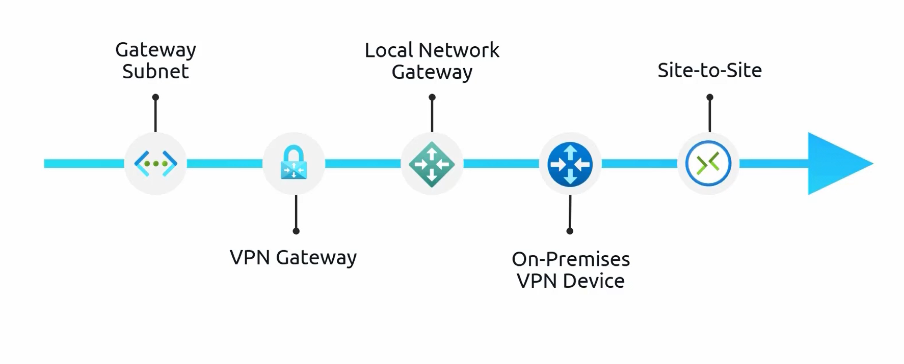
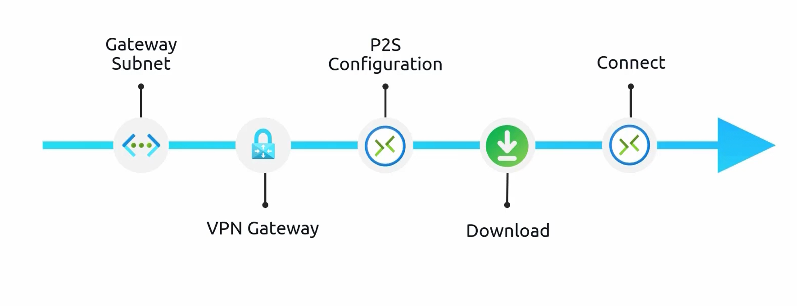

# **Azure Site-to-Site VPN Connection**  

A **Site-to-Site (S2S) VPN** is a secure, **IPsec-based VPN tunnel** that connects an **on-premises network** to an **Azure Virtual Network (VNet)** through an **Azure VPN Gateway**. This setup allows the on-premises network to **communicate with Azure as if they were part of the same local network**.  

## **Components of a Site-to-Site VPN**  

| **Component** | **Description** |
|--------------|---------------|
| **Gateway Subnet** | A **dedicated subnet** within the VNet reserved for hosting the **Azure VPN Gateway**. Required for VPN Gateway deployment. |
| **Virtual Network Gateway (VPN Gateway)** | The **Azure-side** VPN endpoint responsible for **encryption, decryption, and managing the secure tunnel**. |
| **Local Network Gateway (LNG)** | Represents the **on-premises VPN device** in Azure. Stores the **on-premises public IP** and address range. |
| **On-Premises VPN Device** | A **physical or virtual appliance** that establishes the VPN connection from the **on-premises network** to **Azure**. Must be configured to match Azure VPN Gateway settings. |

## **Steps to Set Up a Site-to-Site VPN Connection**  

### **Step 1: Create a Gateway Subnet**  
- A **gateway subnet** must be created within the **VNet**.  
- This subnet is used exclusively by **Azure VPN Gateway** and should not contain other resources.  

### **Step 2: Deploy an Azure Virtual Network Gateway**  
- The **Virtual Network Gateway** is created in the **gateway subnet**.  
- This gateway will handle **VPN encryption, decryption, and tunnel management**.  

### **Step 3: Configure a Local Network Gateway (LNG)**  
- The **Local Network Gateway** is an Azure resource that stores **on-premises VPN device details**.  
- Required details include:  
  - **Public IP address of the on-premises VPN device** (e.g., `13.12.11.11`).  
  - **Address space of the on-premises network** (IP range to be routed through the VPN).  

### **Step 4: Configure the On-Premises VPN Device**  
- The **on-premises firewall/router** must be configured with **matching VPN settings**.  
- The device should support **IPsec/IKE protocols** to establish a secure connection with Azure.  
- **Local Network Gateway in Azure serves as a reference** to the **actual on-premises VPN device**.  

### **Step 5: Establish a Site-to-Site Connection**  
- A **VPN connection** is created between the **Azure Virtual Network Gateway** and **Local Network Gateway**.  
- The connection settings include:  
  - **VPN type**: Route-based or policy-based.  
  - **BGP (optional)**: If required for dynamic routing.  
  - **IKE/IPsec policies**: Security settings must match on-premises configuration.  
  - **Connection mode**: Defines how the VPN operates.  

### **Step 6: Verify the Connection**  
- Once the connection is established, on-premises and Azure resources can communicate as if they were on the same network.  

## **Additional Considerations**  

### **1. Local Network Gateway (LNG) as a Reference**  
- The **Local Network Gateway does not store VPN configurations**. It **only references the on-premises VPN device**.  
- Example: If the **on-premises VPN device IP is `13.12.11.11`**, the **Local Network Gateway must reference this IP**.  

### **2. VPN Gateway SKUs**  
- VPN performance and number of connections depend on the **selected SKU**.  
- Higher SKUs support **better bandwidth and more connections**.  

### **3. BGP Support**  
- **Border Gateway Protocol (BGP)** can be enabled to support **dynamic routing** between Azure and on-premises.  
- Allows automatic route updates **without manual configuration**.  

### **4. Connection Cost**  
- **Site-to-Site VPN incurs costs** for:  
  - **VPN Gateway uptime** (hourly pricing).  
  - **Outbound data transfer** (egress charges).  

## **Summary**  

| **Feature** | **Description** |
|------------|----------------|
| **Connection Type** | Secure **IPsec-based VPN tunnel** between on-premises and Azure. |
| **Required Azure Resources** | **Gateway Subnet, Virtual Network Gateway, Local Network Gateway**. |
| **On-Premises Configuration** | A **VPN device** must be configured with matching settings. |
| **Security** | **Data encryption with IPsec/IKE protocols**. |
| **Performance Considerations** | Dependent on **VPN Gateway SKU** and **on-premises device capabilities**. |
| **Latency** | Higher than VNet Peering (since it uses **public internet**). |
| **Best Use Cases** | **Hybrid network extension**, secure on-prem to Azure communication. |

A **Site-to-Site VPN** is ideal for **hybrid network setups**, allowing on-premises resources to communicate with Azure **securely and seamlessly**.

---

# **Azure Point-to-Site (P2S) VPN Connection**  

A **Point-to-Site (P2S) VPN** allows individual devices (such as laptops and desktops) to securely connect to an **Azure Virtual Network (VNet)** as if they were physically present in the Azure data center. This is commonly used by remote workers, developers, and IT professionals who require **on-demand, secure access to Azure resources**.  

## **Components of a Point-to-Site VPN**  

| **Component** | **Description** |
|--------------|---------------|
| **Gateway Subnet** | A **dedicated subnet** within the VNet that hosts the **Azure VPN Gateway**. |
| **Virtual Network Gateway (VPN Gateway)** | The Azure-side VPN endpoint responsible for managing the P2S connection. |
| **Point-to-Site Configuration** | Defines **address pool, authentication method, and VPN protocols** for client connections. |
| **VPN Client Software** | Installed on the client machine to establish the VPN connection. |

## **Steps to Set Up a Point-to-Site VPN Connection**  

### **Step 1: Deploy a Virtual Network Gateway**  
- A **Virtual Network Gateway** is required and must be deployed within a **gateway subnet**.  
- This gateway handles **VPN encryption and decryption**.  

### **Step 2: Configure Point-to-Site (P2S) Settings**  
- Navigate to **Virtual Network Gateway** → **Point-to-Site Configuration** → **Configure Now**.  
- Provide the **VPN address pool** (range of private IPs assigned to VPN clients).  
- Select the **VPN tunneling protocol**:  
  - **IKEv2** – Secure and fast, supported on Windows, macOS, iOS, and Android.  
  - **OpenVPN** – Cross-platform support for various OS.  
  - **SSTP (Secure Socket Tunneling Protocol)** – Only supported on Windows.  

### **Step 3: Configure Authentication Method**  
- Choose an authentication method:  
  - **Azure Certificate Authentication** – Requires generating and installing certificates.  
  - **RADIUS Authentication** – Integrates with on-premises RADIUS servers.  
  - **Azure Active Directory (Azure AD) Authentication** – Allows **Single Sign-On (SSO)** using Azure AD credentials.  
  - If **Azure AD is selected**, additional details such as **tenant ID, audience, and issuer** must be provided.  

### **Step 4: Download and Install the VPN Client**  
- Once the P2S configuration is complete, **download the VPN client package** from the Azure portal.  
- If using Windows, install the **Azure VPN Client** from the **Microsoft Store**.  
- Upload the **VPN configuration file** into the client.  

### **Step 5: Connect to the Azure VNet**  
- Launch the **VPN client** and establish the connection.  
- Once connected, the client machine **receives an IP from the VPN address pool**.  
- The machine can now **access resources inside the Azure VNet** securely.  

## **Key Features of Point-to-Site VPN**  

| **Feature** | **Description** |
|------------|----------------|
| **Remote Access** | Allows **individual users** to securely connect to an Azure VNet from anywhere. |
| **No On-Prem VPN Device Required** | Unlike **Site-to-Site VPN**, a **dedicated VPN device** is **not needed**. |
| **Supports Multiple Protocols** | **IKEv2, OpenVPN, and SSTP** provide flexibility based on OS requirements. |
| **Flexible Authentication** | Supports **certificate-based, RADIUS, and Azure AD authentication**. |
| **Secure Data Transfer** | All traffic is **encrypted** over the VPN tunnel. |
| **Can Coexist with Site-to-Site VPN** | P2S can be used **alongside a Site-to-Site VPN** in a hybrid network. |

## **Use Cases**  

| **Use Case** | **Why Use P2S VPN?** |
|-------------|--------------------|
| **Remote Work** | Employees can securely access Azure resources from home or any location. |
| **Developers & IT Teams** | Provides on-demand access for development, testing, and administration. |
| **No On-Premises VPN Gateway** | Ideal when no **on-premises VPN hardware** is available. |
| **Temporary or Ad-Hoc Access** | Quick and easy setup for **short-term remote access**. |

## **Summary**  

- **Point-to-Site VPN** provides **secure, on-demand access** to Azure resources for **individual users**.  
- It supports **multiple VPN protocols** (**IKEv2, OpenVPN, SSTP**) and **various authentication methods**.  
- Unlike **Site-to-Site VPN**, it does **not require an on-prem VPN device**.  
- Ideal for **remote workers, developers, and IT professionals** who need **secure Azure access from any location**.

---
# **Comparison: Point-to-Site vs. Site-to-Site VPN**  

| **Feature** | **Point-to-Site (P2S)** | **Site-to-Site (S2S)** |
|------------|----------------|----------------|
| **Connection Type** | Individual devices to Azure | Entire on-prem network to Azure |
| **VPN Gateway Required?** | Yes | Yes |
| **On-Prem VPN Device Needed?** | No | Yes |
| **Scalability** | Best for small-scale access (individual users) | Best for **enterprise-level connectivity** |
| **Authentication Methods** | Certificate-based, RADIUS, Azure AD | IPsec/IKE-based authentication |
| **Traffic Routing** | Private tunnel via public internet | Private tunnel via public internet |
| **Use Case** | Remote work, developers, temporary access | Permanent hybrid network setup |

