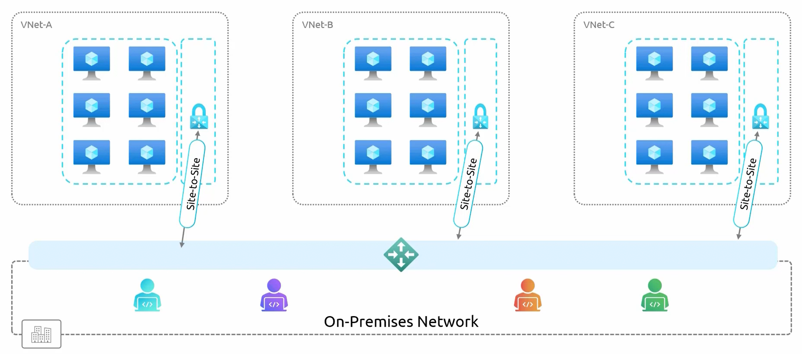
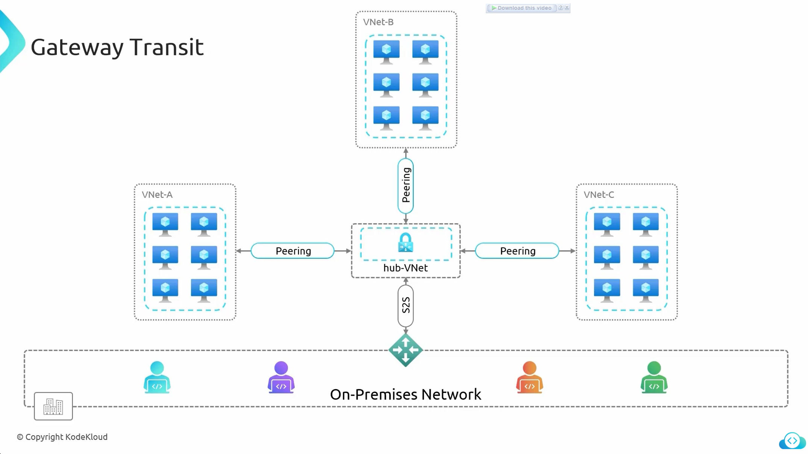

# **Azure Gateway Transit & Hub-Spoke Architecture**  

**Gateway Transit** is a feature in Azure that allows multiple **peered Virtual Networks (VNets)** to share a **single Virtual Network Gateway** instead of deploying separate gateways in each VNet. This is commonly used in the **Hub-Spoke Architecture**, where a **centralized hub VNet** handles connectivity to **on-premises networks** and other VNets.  

## **Traditional Approach vs. Gateway Transit**  

- ### **Traditional Approach (Without Gateway Transit)**  
    - Each VNet (**A, B, C**) requires its **own Virtual Network Gateway**.  
    - A **Site-to-Site VPN connection** is configured for each gateway.  
    - **Challenges:**  
        - **Redundant gateways** → Unnecessary duplication.  
        - **High cost** → Each gateway incurs separate operational expenses.  
        - **Complex management** → Requires configuring and maintaining multiple gateways.  

- ### **Optimized Approach (With Gateway Transit & Hub-Spoke Model)**  
    - **Only one Virtual Network Gateway** is deployed in a **hub VNet**.  
    - All spoke VNets (**A, B, C**) use **VNet Peering** to communicate via the hub.  
    - The **hub gateway** establishes the **Site-to-Site VPN** connection with **on-premises networks**.  

## **Components of Gateway Transit & Hub-Spoke Architecture**  

| **Component** | **Description** |
|--------------|---------------|
| **Hub VNet** | A central VNet containing the **Virtual Network Gateway** and other shared resources. |
| **Spoke VNets (A, B, C)** | VNets that connect to the hub via **VNet Peering** but do not require their own gateways. |
| **Virtual Network Gateway** | A VPN gateway deployed **only in the hub**, responsible for managing site-to-site connections. |
| **VNet Peering** | Enables **low-latency, high-speed** connectivity between the hub and spoke VNets. |
| **On-Premises Network** | The organization's **data center** that connects to Azure via **Site-to-Site VPN** or **ExpressRoute**. |

## **Benefits of Using Gateway Transit**  

| **Advantage** | **Description** |
|--------------|---------------|
| **Centralized Management** | All network traffic is routed through a **single hub**, simplifying operations. |
| **Reduced Complexity** | Eliminates the need to configure and maintain multiple VPN gateways across VNets. |
| **Cost Efficiency** | Reduces costs by using **one gateway** instead of separate gateways per VNet. |
| **Improved Security** | The hub can host a **firewall** to inspect and control all inbound/outbound traffic. |
| **Better Resource Utilization** | Since only one gateway is needed, more resources in spoke VNets can be allocated for workloads. |
| **Streamlined Connectivity** | Spoke VNets communicate efficiently via the hub, reducing latency. |

## **Steps to Configure Gateway Transit in Azure**  

### **Step 1: Create a Hub VNet**  
- Deploy a **Virtual Network (Hub VNet)** in Azure.  
- Add a **Gateway Subnet** to this VNet.  

### **Step 2: Deploy a Virtual Network Gateway in the Hub**  
- Navigate to **Azure Portal → Virtual Network Gateway → Create New**.  
- Deploy a **VPN Gateway** or **ExpressRoute Gateway** inside the **Hub VNet**.  
- Establish a **Site-to-Site VPN** connection to the **on-premises network**.  

### **Step 3: Create Spoke VNets (A, B, C)**  
- Deploy separate **spoke VNets** for application workloads.  

### **Step 4: Establish VNet Peering with Gateway Transit**  
- In **Spoke VNet A**, go to **Settings → Peerings → Add Peering**.  
- Select **Hub VNet** as the peer.  
- Enable **"Use remote gateways"** to allow the spoke VNet to route traffic through the **hub gateway**.  
- Repeat the **peering process** for VNet B and VNet C.  

### **Step 5: Configure Network Security & Firewall**  
- Deploy an **Azure Firewall or Network Virtual Appliance (NVA)** in the **hub**.  
- Configure **route tables** to ensure traffic flows securely between **on-premises, hub, and spokes**.  

## **Hub-Spoke Architecture in Azure Landing Zones**  

**The Hub-Spoke model is widely used in Azure Landing Zones** to create a scalable, secure, and cost-effective cloud networking architecture.  

| **Feature** | **Hub-Spoke Architecture** |
|------------|-----------------------------|
| **Centralized Network Control** | All **security policies, routing, and monitoring** are managed from the **hub**. |
| **Segregated Workloads** | Spoke VNets can be dedicated to different **applications, teams, or environments** (e.g., **dev, test, prod**). |
| **Hybrid Connectivity** | Allows **secure connectivity between on-premises** and multiple VNets. |
| **Scalability** | New VNets can be **added easily** without additional gateway costs. |

# **Demo: Point-to-Site Connection with Gateway Transit**  (needs review)

This demonstration showcases how a **Point-to-Site (P2S) VPN connection** can be used instead of a **Site-to-Site VPN connection** to securely access **Azure Virtual Machines (VMs) over a private connection** from a local laptop.  

#### **Azure Configuration**  
1. **Point-to-Site Connection Setup**  
   - A **Point-to-Site VPN connection** has been configured in Azure.  
   - **Authentication Method:** Azure Active Directory (AAD) is being used for authentication.  

2. **Virtual Network Peering Configuration**  
   - A **new VNet peering** has been created to enable connectivity between the virtual network containing the **VPN Gateway** and another virtual network.  
   - If the peering settings are examined, it is observed that:  
     - **Traffic forwarding from the VPN Gateway is enabled.**  
     - **Gateway transit is enabled**, allowing traffic to flow between virtual networks and on-premises environments.  

3. **VPN Client Connection**  
   - The **Azure VPN Client** has been installed and connected to Azure.  
   - The client **displays the route for the virtual network (192.168.0.0/24)**, confirming that the local machine has learned the route to Azure VMs through the VPN.  

#### **Testing the Connection**  
- The **local machine** is used to establish an SSH connection to an Azure Virtual Machine using its **private IP address (192.168.0.4)**.  
- A **ping test** is performed, verifying that traffic is successfully reaching the Azure VM.  

#### **Summary**  
- A **Point-to-Site VPN connection** was established from the local machine to Azure.  
- **Gateway transit** was used to allow traffic to pass through a peered virtual network.  
- The setup enables **seamless and secure connectivity to Azure resources over private IPs** without requiring a Site-to-Site VPN.  
- **Gateway Transit** allows **peered VNets to share a single Virtual Network Gateway**, avoiding redundant deployments.  
- **Hub-Spoke Architecture** centralizes networking, reduces costs, and improves security and performance.  
- **Virtual Network Peering** enables **low-latency communication** between VNets without additional gateways.  
- **Best practice for Azure Landing Zones**, enabling scalable, enterprise-grade cloud networking.