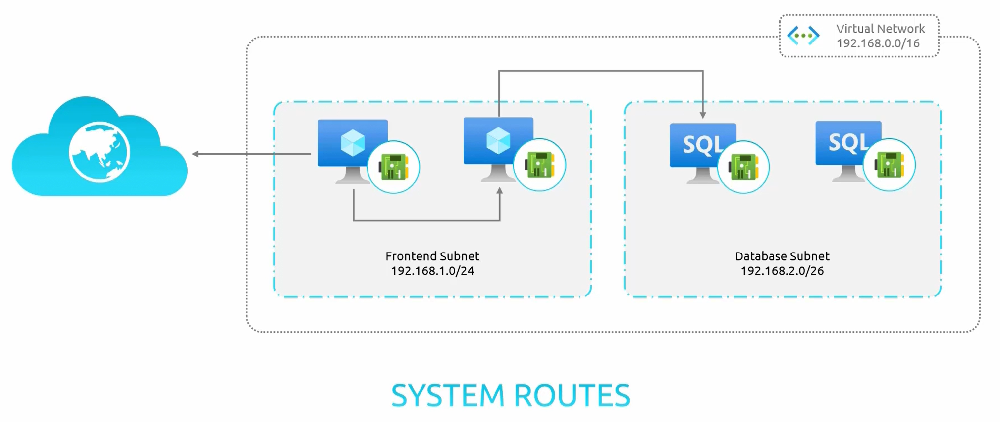
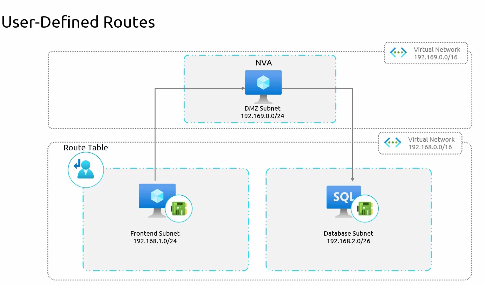

### **User-Defined Routes (UDRs) in Azure**  

In managing inter-site connectivity, **User-Defined Routes (UDRs)** and **System Routes** play a crucial role in controlling network traffic within **Azure Virtual Networks (VNets)**.  

#### **System Routes in Azure**  
Azure automatically provides a set of **default system routes** to facilitate basic network connectivity:  
1. **Intra-Subnet Communication:** Virtual Machines (VMs) within the same subnet can communicate with each other.  
2. **Inter-VNet Communication:** Resources within the same **Virtual Network (VNet)** can communicate seamlessly.  
3. **Outbound Internet Access:** VMs and other resources can access the internet for operations such as software updates.  
4. **Inbound Internet Restrictions:** By default, inbound connections from the internet are **blocked by NSGs** unless explicitly allowed.  

These default system routes **enable basic networking** but do not provide fine-grained control over traffic flow.  

#### **When Are User-Defined Routes (UDRs) Needed?**  
In certain scenarios, network traffic must be **redirected** through a specific path rather than following the default system routes.  

**Example Scenario:**  
- A **frontend subnet** needs to communicate with a **database subnet** in the same virtual network.  
- By default, system routes allow direct communication between these two subnets.  
- However, for security reasons, **all traffic should pass through a Network Virtual Appliance (NVA)** (such as a firewall).  

#### **Implementing a User-Defined Route (UDR)**  
1. **Create a Route Table**  
   - A **User-Defined Route (UDR)** is created in Azure to **override system routes**.  

2. **Define a Custom Route**  
   - A rule is added specifying that **traffic from the frontend subnet to the database subnet** must be sent to the **NVA's private IP address** instead of taking the direct system route.  

3. **Associate the Route Table with the Frontend Subnet**  
   - This ensures that all outgoing traffic from the frontend subnet follows the **custom-defined route** instead of the default system route.  

4. **Enable Virtual Network Peering**  
   - If the **NVA is located in a different VNet**, a **VNet peering** must be established between the application VNet (containing the frontend and database subnets) and the NVA VNet.  
   - Without peering, even though the route points to the NVA, **the traffic will not be able to reach the NVA**.  

#### **Key Benefits of Using UDRs**  
- **Traffic Control:** Ensures that specific security or routing policies are enforced.  
- **Network Security:** Routes traffic through **firewalls or NVAs** for **inspection and filtering**.  
- **Improved Compliance:** Helps meet regulatory or organizational security requirements.  

By utilizing **User-Defined Routes (UDRs)**, organizations gain better control over network traffic, ensuring **security, compliance, and optimal network performance**.