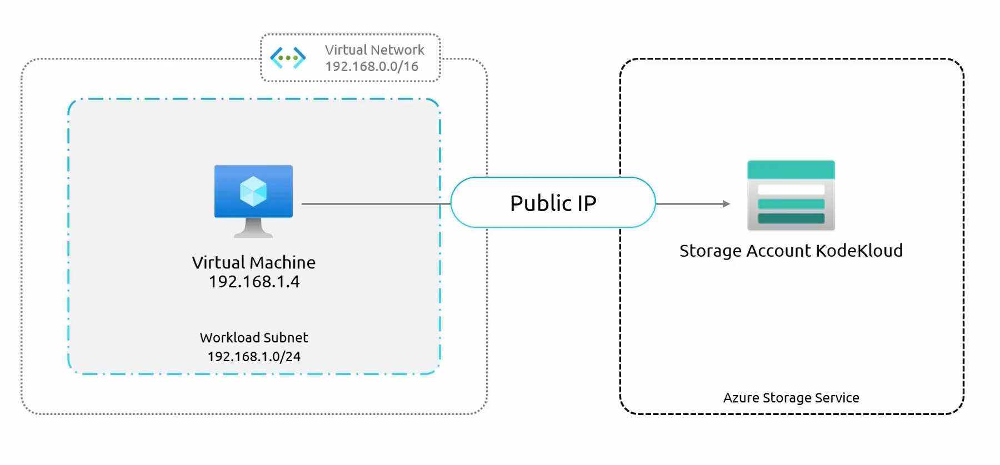
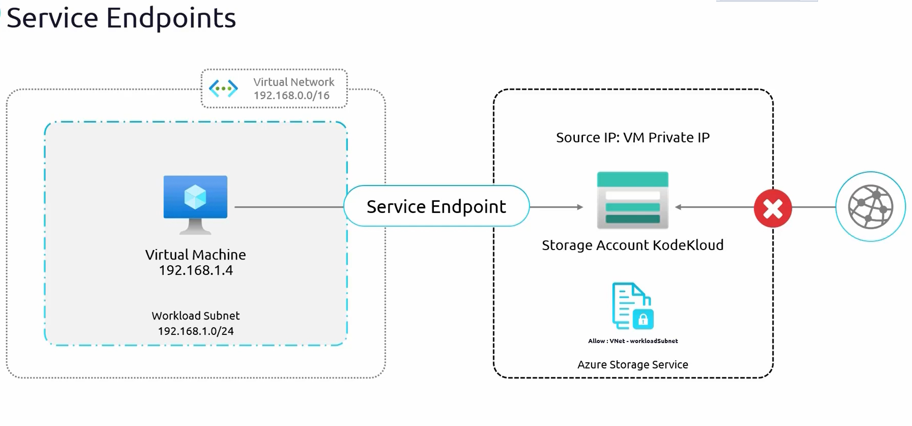

# **Azure Service Endpoints**  

Azure **Service Endpoints** improve security and connectivity by allowing virtual network (**VNet**) resources to access specific **Azure services** using their **private IP addresses** instead of the **public internet**. This ensures that communication remains within **Microsoft’s secure backbone network**, reducing exposure to external threats.  

Let’s take an example to understand how Service Endpoints work.  

- ### **Initial Network Setup**  
    - A **Virtual Network (VNet)** contains a **subnet** with a **Virtual Machine (VM)**.  
    - The **VM has a private IP** (e.g., `192.168.1.4`).  
    - A **Storage Account** (e.g., "KodeKloud Storage") is set up with **public internet access enabled**.  
    - The VM accesses this **storage account** over the **public internet** using a URL like:  
        ```
        mystorageaccount.blob.core.windows.net
        ```
        - This URL **resolves to a public IP address**.  
        - The **storage account is accessible from anywhere on the internet**.  
        

- ### **Security Concern**  
    - The **Storage Account** is publicly accessible, which **increases security risks**.  
    - **Goal:** Restrict access so that **only the VM can connect** to the storage account.  
    - **Solution:**  
        - Block all **public access** by applying **firewall rules** to the storage account.  
        - However, this will **also block the VM’s access**, since it was using a public IP to connect.  

- ### **Applying Service Endpoints**  
    - **Service Endpoints help solve this problem** by allowing the **VM to access the storage account using its private IP**.  
    - **Steps to implement Service Endpoints:**  
        - Enable **Service Endpoints** for the **Storage Account service** on the **subnet** where the VM is hosted.  
        - Update the **storage account’s network settings** to **only allow connections** from the selected subnet.  
        - This allows **direct access from the VM** using its **private IP**, without exposing the storage account to the public internet.  

- ### **How Service Endpoints Work**  
    - The **VM’s traffic still reaches a public IP** (because Azure services have public endpoints), but:  
        - The **source IP** is recognized as the **VM’s private IP**.  
    - Microsoft’s **backbone network** is used for traffic routing, avoiding the public internet.  
    - The storage account now **only accepts requests from the specified subnet**.  
    


## **Benefits of Service Endpoints**  

### **1. Better Security**  
- Access to Azure services like **Storage Accounts, SQL Databases, and other PaaS services** is now **restricted to specific VNets and subnets**.  
- The storage account **is no longer exposed to the public internet**, reducing the risk of attacks.  
- All data traffic remains within **Microsoft’s secure network**, preventing unauthorized access.  
### **2. Uses Microsoft Backbone Network for Faster, Reliable Connections**  
- Traffic between your **VM and Azure service** stays **inside the Microsoft Azure network**.  
- This **bypasses the public internet**, reducing latency and improving connection reliability.  
### **3. Easy to Set Up and Manage**  
- **Service Endpoints are simple to configure** within the **Azure Portal** or using **Terraform/CLI**.  
- No need for **complex VPN or ExpressRoute setups**.  
- Reduces **management overhead** while maintaining **better security controls**.  
### **4. Supported Azure Services**  
Azure Service Endpoints work with several **Azure PaaS (Platform-as-a-Service) offerings**, including:  
- **Azure Storage** (Blob, File, Queue, Table)  
- **Azure SQL Database**  
- **Azure Synapse Analytics**  
- **Azure PostgreSQL & MySQL**  
- **Azure Container Registry**  
- **Azure Cognitive Services**  
- **Azure App Services**  


## **Key Considerations When Using Service Endpoints**  
- **Service Endpoints do not make services fully private**  
  - Azure services **still have public IP addresses**. However, access is **restricted to allowed VNets**.  
- **Traffic still flows to public IPs, but from a private source IP**  
  - The storage account will still have a **public IP**, but it will only allow traffic from specified **subnets inside the VNet**.  
- **Service Endpoints do not work across VNets**  
  - If you need **cross-VNet connectivity**, use **VNet Peering** along with **Service Endpoints**.  
- **Cannot restrict access to specific VMs within a subnet**  
  - Service Endpoints apply at the **subnet level**, so **all VMs in the subnet** can access the Azure service.  

# **Implementing Azure Service Endpoints – Step-by-Step Guide**  

This guide demonstrates how to **implement and test Azure Service Endpoints** by securing a **storage account** while allowing access only from a **specific Virtual Network (VNet) and subnet**.  


## **Setting Up the Required Resources**  
Before enabling **Service Endpoints**, the following resources must be created:  
1. **Virtual Machine (VM)** – Represents the application that needs access to Azure services.  
2. **Storage Account** – Stores files and data that the VM will access.  
- The **PowerShell script** (`service_endpoints_prep_infra.ps1`) is used to create both the VM and the storage account.  


## **Testing Public Access to the Storage Account**  

- ### **Uploading Files to Azure Blob Storage**  
    - **Navigate to the Storage Account in Azure Portal**.  
    - Inside the **Containers** section, create a new container named **"demo-container"**.  
    - **Enable public access** for this container.  
    - Upload sample files:  
        - `city1.png`  
        - `city2.png`  

- ### **Verifying Public Access**  
    - Each uploaded file has a **URL** similar to:  
    ```
    https://<storage-account-name>.blob.core.windows.net/demo-container/city1.png
    ```
    - Copy the URL and paste it into a web browser. The image loads successfully, confirming **public access** is enabled.  

- ### **Verifying Access from the Virtual Machine**  
    - **SSH into the Virtual Machine** using:  
        ```
        ssh <vm-user>@<vm-public-ip>
        ```
    - Run the following command to download the image:  
        ```
        wget https://<storage-account-name>.blob.core.windows.net/demo-container/city1.png
        ```
    - The file is **successfully downloaded**, confirming the VM can access it over the **public internet**.  

## **Restricting Public Access to the Storage Account Using `Service Endpoints`**  

- ### **Modifying Network Access Settings**  
    To **disable public access** and restrict the storage account to the VNet:  
    - **Go to the Storage Account → Networking settings**.  
    - Under **Public network access**, change the option from:  
        - ✅ **Enabled from all networks** (default)  
        - ❌ **Enabled from selected virtual networks and IP addresses**  
    - **Add the existing Virtual Network** where the **VM is hosted**.  
    - Select the specific **subnet** where the VM is located.  
    - Save the changes – this **enables the Service Endpoint**.  

- ### **Testing Access After Restriction**  
    - **Trying to Access from the Browser**  
        - **Copy the file URL** and paste it into the web browser.  
        - Now, the request **fails with an "Authorization Failure" error**.  
        - This confirms that the storage account is **no longer accessible over the public internet**.  
    -  **Testing from the Virtual Machine**  
        - **SSH into the VM** again and try downloading the file:  
            ```
            wget https://<storage-account-name>.blob.core.windows.net/demo-container/city1.png
            ```
        - The file **still downloads successfully**.  
        - This confirms that the **VM can still access the storage account using its private IP** through the **Service Endpoint**.  


## **How Service Endpoints Work in This Scenario**  

- **The VM now connects to the storage account using its private IP**.  
- Even though the storage account **still has a public endpoint**, the traffic:  
  - **Does not pass through the public internet**.  
  - **Uses Microsoft’s secure backbone network** instead.  
- This ensures **better security, lower latency, and a more reliable connection**.  


## **Conclusion**  
By enabling **Service Endpoints**, the **storage account is no longer exposed to the public internet** while still allowing access from a **specific Virtual Network and subnet**. This implementation:  
- **Enhances security** by preventing unauthorized access.  
- **Keeps traffic within Microsoft’s backbone network**, ensuring reliability.  
- **Still allows VM access** using its **private IP address**.  


