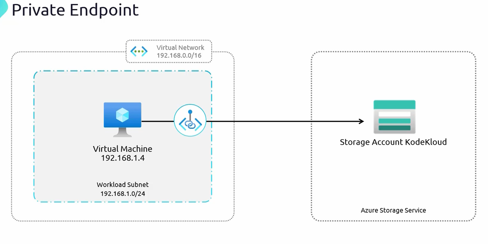

# **Understanding Azure Private Endpoints**  

Previously, **Azure Service Endpoints** were discussed, which allow virtual machines (VMs) to access Azure services via Microsoft's **backbone network** while still using the service’s **public endpoint**. However, in scenarios requiring **strictly private communication**, **Azure Private Endpoints** offer a better alternative.  

This guide explains **Azure Private Endpoints**, how they differ from **Service Endpoints**, and why they are the **preferred choice** for enhanced security and private network integration.  

## **Why Use Azure Private Endpoints?**  

### **Limitations of Service Endpoints**  
1. **Storage Accounts Still Use Public Endpoints**  
   - Even though Service Endpoints keep traffic within the **Microsoft backbone network**, the **public endpoint** of the storage account is still in use.  
   - The **VM's private IP is used as the source**, but the destination remains the **public IP of the storage account**.  

2. **Not Suitable for On-Premises Networks**  
   - **Service Endpoints only work within Azure Virtual Networks (VNets)**.  
   - On-premises networks **cannot use Service Endpoints** to directly connect to Azure services.  
   - The alternative is **adding on-premises IPs to the storage firewall**, which forces traffic **over the public internet**, creating a security risk.  

3. **Security Teams May Require Fully Private Communication**  
   - Many security teams prefer a **fully private communication channel**, where **Azure resources are never exposed via a public endpoint**.  

## **Azure Private Endpoints**  
A **Private Endpoint** creates a **private IP address** within an **Azure Virtual Network (VNet)** that is linked to an **Azure service (e.g., a storage account, database, or App Service)**.  
- This **removes public access** entirely.  
- Azure services appear as if they are part of the **local private network**.  
- Traffic **never leaves the private network**, preventing exposure to the public internet.  

## **How Azure Private Endpoints Work**  

1. **A Private Endpoint Assigns a Private IP to Azure Services**  
   - A **network interface (NIC)** is created inside the **VNet’s subnet**.  
   - This NIC is assigned an **IP address from the VNet’s private address space**.  

2. **The Storage Account Becomes Accessible via Private IP**  
   - Instead of resolving to a **public endpoint**, the storage account is now accessed **via the assigned private IP**.  
   - The VM (or any other resource in the VNet) connects **entirely within the private network**.  

3. **Supports On-Premises Connectivity**  
   - Private Endpoints **work with on-premises networks** through **VPN or ExpressRoute**.  
   - The **PaaS resource (e.g., storage account, SQL database, etc.) is resolved via a private IP**, just like any other local server.  

## **Key Benefits of Azure Private Endpoints**  

### **1. Fully Private Connectivity to Azure Services**  
- Azure **PaaS services** (like Storage, SQL, or Cosmos DB) get a **private IP address** within a VNet.  
- Resources **never use a public IP**, ensuring complete privacy.  

### **2. Seamless Integration with On-Premises Networks**  
- On-premises networks can **resolve Azure services to private IPs**.  
- Private Endpoints work over **VPN or ExpressRoute**, eliminating the need for public internet access.  

### **3. Eliminates the Risk of Data Exfiltration**  
- Since all communication occurs **within private networks**, the risk of **data leaks over the public internet** is eliminated.  
- Unauthorized access attempts from public networks **are not possible**.  

### **4. Simplified Networking & Direct Availability in VNets**  
- Private Endpoints **do not require complex networking components** (e.g., NAT rules, firewalls, or additional gateways).  
- Services are **directly available in the VNet**, making **deployment and management easier**.  

## **Conclusion**  

**Azure Private Endpoints** are the preferred solution for organizations needing **strict security and private access** to Azure services. Unlike **Service Endpoints**, which still use a **public endpoint**, Private Endpoints provide:  
✅ **A fully private IP address** for Azure services  
✅ **Seamless integration with on-premises networks**  
✅ **Elimination of public internet exposure**  
✅ **Stronger security and simplified networking**  

For **highly secure applications**, **Private Endpoints** are the best approach to ensure **safe and controlled access** to Azure resources.