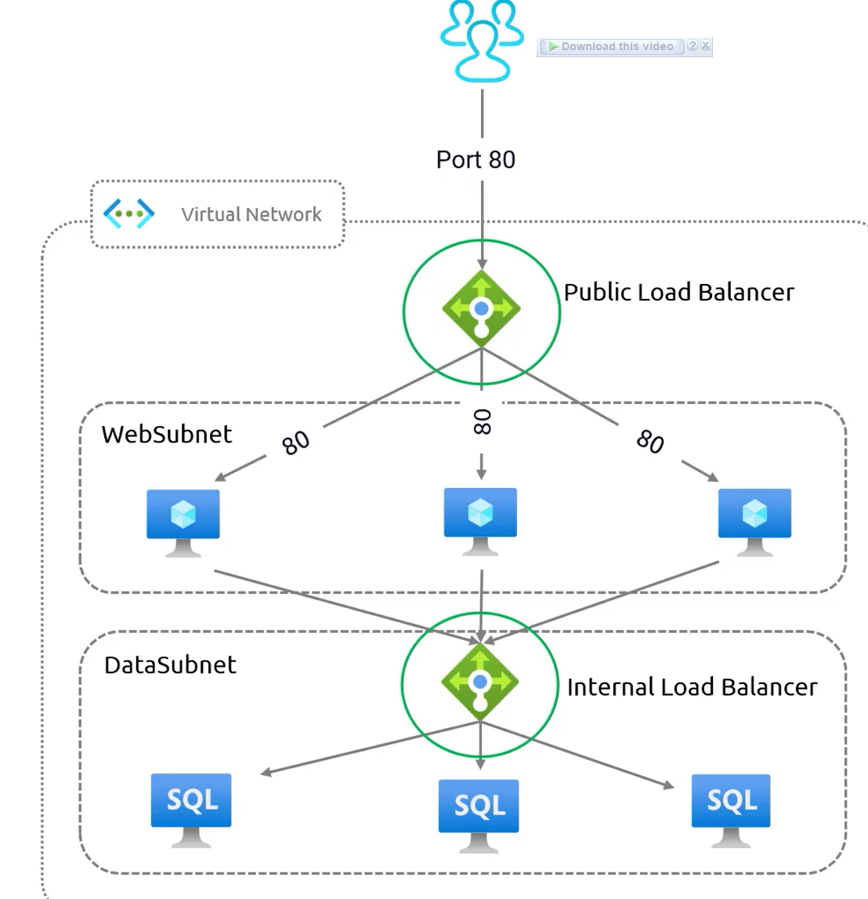

# **Azure Load Balancer**  

Azure Load Balancer efficiently distributes incoming network traffic across backend servers based on predefined rules and health probes. This ensures load distribution, preventing performance degradation and downtime.

### **1. How Azure Load Balancer Works**  
- Operates at **Layer 4 (Transport Layer)** of the **OSI model**.  
- Handles **TCP and UDP traffic**.  
- Supports **Azure Virtual Machines (VMs) and Virtual Machine Scale Sets (VMSS)** as backend resources.  
- Uses **network security groups (NSGs)** to filter and control incoming traffic.  
- Helps achieve **high availability** and **secure application architecture**.

### **2. Types of Azure Load Balancer SKUs**  

| Feature | **Basic Load Balancer** | **Standard Load Balancer** |
||-||
| **Backend Pool Size** | Supports **up to 300** instances | Supports **up to 1000** instances |
| **Health Probes** | Supports **TCP and HTTP** | Supports **TCP, HTTP, and HTTPS** |
| **Redundancy** | **Not available** | **Available** (supports zone redundancy) |
| **Deployment Scope** | Specific **single zone** (e.g., Zone 1, 2, or 3) | Can **span multiple zones** |
| **Frontends** | Supports **inbound only** | Supports **both inbound and outbound** |
| **Security** | **Open by default**, NSG optional | **Closed by default**, NSG required |
| **SLA (Service Level Agreement)** | **No SLA**, not recommended for production | **99.99% SLA**, suitable for production |

### **3. Health Probes and Monitoring**  
- Health probes check backend server availability.  
- **Basic Load Balancer**: Supports **TCP and HTTP** probes.  
- **Standard Load Balancer**: Supports **TCP, HTTP, and HTTPS** probes.  
  - HTTPS probes send **actual HTTP requests** and check response codes.

### **4. Redundancy and Zone Deployment**  
- **Basic Load Balancer**: Limited to a single **Availability Zone**.  
- **Standard Load Balancer**: Can be deployed in **specific zones** (Zone 1, 2, or 3) or **span multiple zones** for improved reliability.

### **5. Security and Access Control**  
- **Basic Load Balancer**: Open by default; NSG is optional.  
- **Standard Load Balancer**: Closed by default; **NSG rules must be defined** to allow traffic.  

### **6. Use Cases**  
| **Scenario** | **Recommended Load Balancer** |
|-||
| **Development and small workloads** | Basic Load Balancer |
| **Production workloads requiring high availability** | Standard Load Balancer |
| **Multi-zone deployment for redundancy** | Standard Load Balancer |
| **Advanced security and NSG enforcement** | Standard Load Balancer |

### **Conclusion**  
Azure Load Balancer is a powerful tool for **managing network traffic** and **ensuring high availability** in Azure environments. While the **Basic SKU** is suitable for development and non-critical workloads, the **Standard SKU** is recommended for **production**, providing **better security, redundancy, and a 99.99% SLA**.

### **Public and Internal Load Balancers in Azure**  

Azure Load Balancer has two main implementations:  
1. **Public Load Balancer** – Handles inbound traffic from the internet.  
2. **Internal (Private) Load Balancer** – Manages traffic within an Azure Virtual Network (VNet).  

Each type serves different scenarios and ensures **efficient traffic distribution, high availability, and fault tolerance**.

## **1. Public Load Balancer**  

### **Definition and Use Case**  
- A **Public Load Balancer** is used for applications that require **inbound connectivity from the internet**.  
- It ensures **high availability** by distributing traffic across multiple backend servers.  
- Ideal for **web applications, APIs, or any service that needs to be accessed over the internet**.  

### **How It Works**  
- A Public Load Balancer is positioned at the **front end** of the network and listens on public-facing ports (e.g., **port 80 for HTTP traffic**).  
- When a user sends a request from the internet, the **Public Azure Load Balancer receives the request** and forwards it to the available backend servers in the **web subnet**.  
- These backend servers are configured to handle web traffic and are **evenly distributed** to prevent overloading any single server.  

### **Benefits**  
- **Ensures even traffic distribution**, reducing the chances of overloading a single server.  
- **Reduces downtime** by redirecting traffic to healthy servers in case of a failure.  
- **Improves application scalability**, allowing more servers to be added without impacting availability.  
- **Provides a single public IP address**, abstracting backend infrastructure from direct exposure to the internet.  

### **Key Considerations**  
- Every **Public Load Balancer must have a Public IP address** assigned to it.  
- If a backend server fails **health checks**, the load balancer removes it from the pool and stops sending traffic to it.  
- Commonly used for **front-end web servers, APIs, and public services**.  

## **2. Internal (Private) Load Balancer**  

### **Definition and Use Case**  
- An **Internal Load Balancer (ILB)** is designed to **distribute traffic within an Azure Virtual Network**.  
- It does **not have a public IP** and cannot be accessed from the internet.  
- Used for **internal workloads** such as database clusters, application tiers, and microservices.  

### **How It Works**  
- The Internal Load Balancer operates **within the virtual network** and is used to distribute traffic from **one internal service to another**.  
- A common use case is in **multi-tier architectures**, where a web server needs to communicate with a **database tier**.  
- The Internal Load Balancer distributes incoming requests from web servers across **multiple database servers in the data subnet**.  
- It ensures that requests are **properly mapped to availability groups** configured inside the database.  

### **Benefits**  
- **Enhances security** by keeping internal workloads private and isolated from the public internet.  
- **Improves performance** by optimizing internal traffic distribution within the Azure Virtual Network.  
- **Enables scaling** for internal application components like databases and APIs.  
- **Supports high availability** for critical backend services.  

### **Key Considerations**  
- If a **Load Balancer does not have a Public IP**, it is classified as an **Internal Load Balancer**.  
- Best suited for **internal applications, databases, and microservices** that should not be directly exposed to the internet.  
- Works seamlessly with **Azure Virtual Network and subnets** to manage internal traffic efficiently.  

## **Comparison: Public vs. Internal Load Balancer**  

| Feature | **Public Load Balancer** | **Internal Load Balancer** |
|---------|----------------|------------------|
| **Purpose** | Handles **internet-facing** traffic | Handles **internal traffic** within the Virtual Network |
| **IP Address** | Requires a **Public IP** | Does **not** require a Public IP |
| **Traffic Direction** | Accepts **incoming connections from the internet** | Distributes traffic **only within Azure Virtual Network** |
| **Common Use Cases** | Web applications, APIs, internet-facing services | Database clusters, internal APIs, application tiers |
| **Security** | Publicly accessible | Private and **not exposed to the internet** |
| **Load Balancing Scope** | Across internet-facing servers | Across internal services in a Virtual Network |

## **Components of a Azure Standard Load Balancer**:  

- **1. Frontend IP Configuration**  
  - Defines the IP address exposed to clients.  
  - Can be **Public** (uses a Public IP) or **Private** (within a Virtual Network).  
  - Supports multiple frontend IPs.  
- **2. Backend Pool**  
  - Contains **Virtual Machines (VMs)** or **Virtual Machine Scale Sets (VMSS)** that receive traffic.  
  - Can be in different **availability zones** for redundancy.  
- **3. Load Balancing Rules**  
  - Defines how **incoming traffic** is distributed across the backend pool.  
  - Specifies **frontend IP, backend pool, protocol (TCP/UDP), and port numbers**.  
- **4. Health Probes**  
  - Monitors the **health of backend instances** to determine if traffic should be sent to them.  
  - Uses **HTTP, TCP, or HTTPS** probes with a configurable interval and failure threshold.  
- **5. Outbound Rules** (for internet connectivity)  
  - Controls how backend instances send outbound traffic when using a **Public Standard Load Balancer**.  
  - Ensures backend VMs share a single outbound IP or define multiple IPs for egress.  
- **6. Inbound NAT Rules**  
  - Allows external users to access specific backend VMs directly via unique **port mappings**.  
  - Typically used for **SSH (port 22) or RDP (port 3389) access**.  
- **7. IP Configurations**  
  - **Public IP Configuration:**  
    - Uses an **Azure Public IP Address** (Static or Dynamic).  
    - Used for external-facing applications.  
  - **Private IP Configuration:**  
    - Uses a **VNet Private IP** for internal traffic routing.  
    - Requires a Virtual Network (VNet) and subnet.  
- **8. Virtual Network (VNet) and Subnets**  
  - A **VNet is required** for an **internal load balancer** (Private IP).  
  - The **backend VMs must be in the same VNet** or peered VNets.  
- **9. Network Security Group (NSG)**  
  - Controls **inbound and outbound traffic** to the backend VMs.  
  - Needs to allow traffic from the Load Balancer’s **health probe and frontend IP**.  
- **10. Availability Zones (Optional)**  
  - Ensures high availability by distributing the **Load Balancer and Backend VMs** across multiple **Azure Availability Zones**.  

## **Conclusion**  
Both Public and Internal Load Balancers play a crucial role in **Azure networking**.  

- A **Public Load Balancer** is used when applications **must be accessible from the internet**, ensuring **scalability and reliability** for public-facing services.  
- An **Internal Load Balancer** is used to manage **private traffic** between internal application components, providing **enhanced security and optimized traffic routing**.  

Selecting the right type depends on whether the application needs to be exposed to the **internet (Public)** or restricted to **internal traffic (Internal Load Balancer)**.

