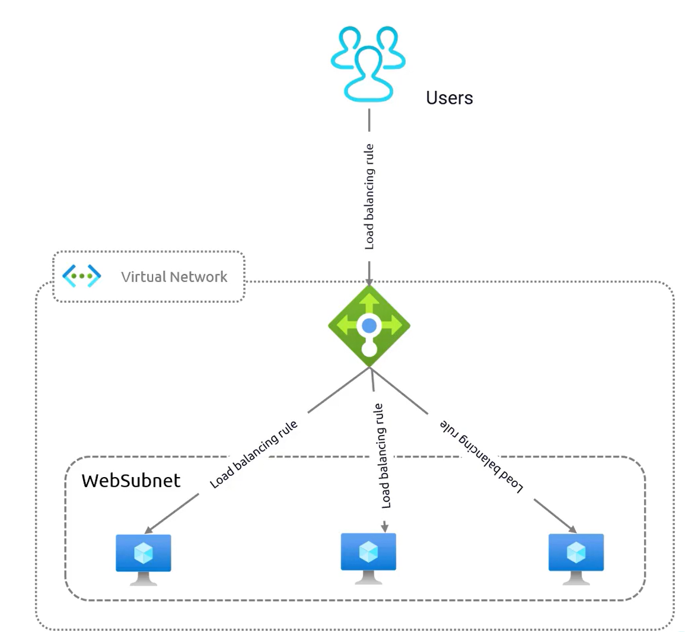

# **Azure Load Balancer Rules**  

Azure Load Balancer rules define how network traffic is distributed to backend resources. These rules ensure that traffic flows **efficiently and securely**, maintaining **high availability and optimal performance**.  

There are **three main types of rules** that govern Azure Load Balancer behavior:  
1. **Load Balancing Rules** – Distribute incoming traffic among backend servers.  
2. **Inbound NAT Rules** – Direct traffic to a specific port on a Virtual Machine (VM).  
3. **Outbound Rules** – Manage traffic leaving the Virtual Network.  

## **1. Load Balancing Rules**  

### **Definition and Purpose**  
- Load Balancing Rules define **how incoming traffic is distributed** across multiple backend instances.  
- These rules **prevent a single server from being overloaded**, ensuring **even distribution of traffic** for better **performance and availability**.  

### **How It Works**  
- In an **Azure Virtual Network**, multiple servers in a **web subnet** act as backend instances.  
- When users send requests, the **Load Balancer directs these requests to the backend pool** using Load Balancing Rules.  
- The rule ensures that no **single backend instance** handles excessive traffic, reducing **congestion and potential failures**.  

### **Key Benefits**  
- **Ensures even traffic distribution** to prevent server overload.  
- **Maximizes performance and efficiency** for backend applications.  
- **Automatically removes unhealthy servers** from the backend pool based on health probes.  
- **Supports TCP and UDP traffic**, making it suitable for various applications.  

## **2. Inbound NAT Rules**  

### **Definition and Purpose**  
- **Inbound Network Address Translation (NAT) Rules** are used to **redirect specific inbound traffic** to a designated port on a **specific Virtual Machine (VM)**.  
- These rules **enable direct access to individual VMs**, commonly used for **administrative or remote management** tasks.  

### **How It Works**  
- In an **Azure Load Balancer setup**, inbound NAT rules **map external ports to internal ports** on VMs.  
- Example:  
  - A user connects to **port 30008** on the **public front end** of the Load Balancer.  
  - The rule **forwards traffic** to **port 3389 on a specific VM**, allowing **Remote Desktop Protocol (RDP) access**.  
  - Each VM in the backend pool can have **unique NAT rules** to allow specific access on different ports.  

### **Key Benefits**  
- **Allows direct access to VMs** for administration, debugging, or management.  
- **Provides controlled access** by exposing only required ports, reducing attack surface.  
- **Simplifies external connectivity** by enabling port mapping without exposing internal IPs.  

## **3. Outbound Rules**  

### **Definition and Purpose**  
- **Outbound Rules** define how traffic **leaves** the **Azure Virtual Network** to reach external networks or the internet.  
- These rules **govern response traffic** from backend servers and **control VM access to external resources**.  
- Outbound rules help in **maintaining a secure and predictable network flow**.  

### **How It Works**  
- Outbound rules specify **which backend instances can send traffic out** and how responses are routed.  
- Example scenarios:  
  - A VM in **Azure Virtual Network** accesses an **external API** or **database** over the internet.  
  - The outbound rule **ensures proper network routing** and **controls egress traffic**.  

### **Key Benefits**  
- **Controls outbound internet access** for Azure resources.  
- **Enhances security** by defining explicit outbound pathways.  
- **Ensures reliable network connectivity** for backend services that need to communicate externally.  

## **Conclusion**  

Azure Load Balancer rules provide a **comprehensive traffic management framework**:  
- **Load Balancing Rules** ensure **efficient distribution** of traffic across backend servers.  
- **Inbound NAT Rules** allow **direct port-specific access** to **Virtual Machines** for administrative tasks.  
- **Outbound Rules** **govern and secure** outgoing traffic, ensuring **proper network control**.  

By implementing these rules strategically, organizations can achieve **high availability, security, and optimal traffic management** within their Azure infrastructure.