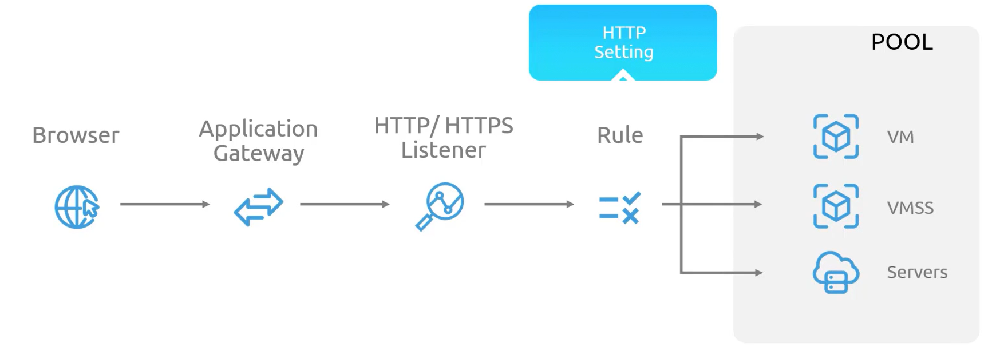

### **Azure Application Gateway - Layer 7 Load Balancer**  

Azure Application Gateway is a **Layer 7 load balancing** solution designed to manage **HTTP, HTTPS, HTTP/2, and WebSocket requests**. Unlike Azure Load Balancer, which operates at **Layer 4 (transport layer)**, Application Gateway provides **advanced traffic management features**, including **path-based routing, URL rewriting, SSL termination, and Web Application Firewall (WAF) integration**.  

## **1. Key Features of Azure Application Gateway**  

### **Traffic Routing & Load Balancing**
- **Path-Based Routing**: Requests can be forwarded to different backend pools based on the **URL path** (e.g., `/images` to one backend, `/api` to another).  
- **Multiple Website Hosting**: A single Application Gateway can manage **multiple domains** with different routing rules.  
- **Load Balancing Algorithms**: Supports **round-robin, least connections**, and custom rules to efficiently distribute traffic.  

### **Security & Optimization**
- **Web Application Firewall (WAF) Integration**: Protects against common web threats like SQL injection and cross-site scripting (XSS).  
- **SSL Termination**: Offloads SSL/TLS processing, reducing backend workload.  
- **Custom Error Pages**: Allows **customizing error responses** instead of default error messages.  

### **Backend Pool Support**  
Unlike Azure Load Balancer, which only supports **VMs and VM Scale Sets**, **Application Gateway** supports:  
- **Virtual Machines (VMs) and VM Scale Sets**  
- **Azure App Services** (Web Apps)  
- **Deployment Slots**  
- **On-Premises Servers**  
- **Servers in Other Cloud Providers**  

## **2. How Azure Application Gateway Works**  

### **Step 1: User Request Reaches the Application Gateway**  
- A **user initiates a request** (e.g., a webpage, image, or API call) from a browser.  
- The request first **arrives at the Azure Application Gateway**, which acts as the **entry point** for web traffic.  

### **Step 2: Listener Intercepts the Request**  
- The **HTTP/HTTPS listener** inside the **Application Gateway** captures incoming traffic.  
- Listeners filter requests based on **URL, path, host headers, or other HTTP attributes**.  

### **Step 3: Routing Rules Determine Backend Destination**  
- **Predefined routing rules** are applied to decide **which backend pool** should handle the request.  
- Requests can be **routed based on URL paths, host headers, or specific domain names**.  

### **Step 4: HTTP Settings Applied**  
- Before forwarding to the backend pool, **HTTP settings** are applied:  
  - **Timeout configurations**  
  - **Cookie-based affinity** (ensuring the same user request is directed to the same backend instance)  
  - **Request and response header modifications**  

### **Step 5: Request is Sent to the Backend Pool**  
- The **Application Gateway forwards the request** to the designated backend pool.  
- The backend pool can consist of **VMs, App Services, on-premises servers, or third-party cloud servers**.  

### **Step 6: Load Balancing Across Backend Servers**  
- Requests are **evenly distributed** using **round-robin** or **least-connections** algorithms.  
- This ensures **no single backend server is overloaded**, improving application performance.  

### **Step 7: Response Sent to User**  
- The backend server processes the request and returns a response.  
- The **Application Gateway forwards the response back** to the user's browser.  

## **3. Key Components of Azure Application Gateway**  

| **Component**      | **Function**  |
|--------------------|--------------|
| **Listener**       | Captures incoming HTTP/HTTPS requests. |
| **Routing Rules**  | Determines how traffic is forwarded to the backend pool (e.g., **URL path-based routing**). |
| **HTTP Settings**  | Defines backend communication settings (timeouts, cookie affinity, rewrite rules). |
| **Backend Pool**   | Group of servers (VMs, App Services, on-prem, cloud servers) handling requests. |
| **Load Balancing Algorithm** | Distributes requests based on round-robin or least connections. |
| **Web Application Firewall (WAF)** | Protects against cyber threats and OWASP vulnerabilities. |

## **4. Difference Between Azure Application Gateway and Azure Load Balancer**  

| **Feature**  | **Azure Application Gateway (Layer 7)** | **Azure Load Balancer (Layer 4)** |
|-------------|-----------------------------------|--------------------------------|
| **Protocol** | HTTP, HTTPS, HTTP/2, WebSocket  | TCP, UDP                        |
| **Routing**  | URL-based (Path-based, Host headers) | IP-based (Load balancing at transport layer) |
| **Session Persistence** | Cookie-based affinity | 5-tuple hash (IP, Port, Protocol) |
| **SSL Termination** | Yes | No |
| **Web Application Firewall (WAF)** | Yes (Optional) | No |
| **Backend Pool Support** | VMs, VMSS, App Services, On-Prem, Multi-Cloud | VMs, VMSS |
| **Custom Error Pages** | Yes | No |
| **Health Probes** | Application-aware health probes | Basic TCP/HTTP health probes |

## **5. Use Cases for Azure Application Gateway**  

- **Hosting multiple applications** behind a single entry point (e.g., `app1.contoso.com`, `app2.contoso.com`).  
- **Path-based routing** (e.g., API requests to `/api` handled separately from web traffic to `/static`).  
- **SSL offloading** to reduce backend workload.  
- **Protecting applications with Web Application Firewall (WAF)**.  
- **Load balancing across hybrid cloud environments** (Azure, on-prem, or multi-cloud).  

## **Conclusion**  

Azure Application Gateway provides **intelligent, Layer 7 routing** with advanced traffic management and security features. It is **more feature-rich** than Azure Load Balancer, supporting **path-based routing, SSL termination, URL rewriting, and WAF integration**. This makes it the **ideal choice for HTTP/HTTPS traffic**, especially for applications requiring **custom traffic routing, security, and scalability**.