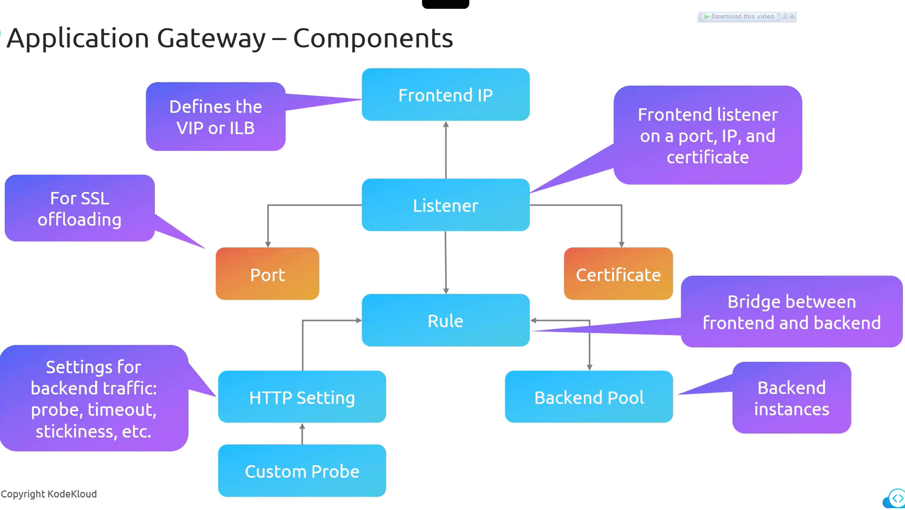

### **Azure Application Gateway Components**  

Azure Application Gateway is a **web traffic management solution** that provides **advanced routing, load balancing, and security**. It consists of several key **components** that work together to efficiently route and manage traffic.  

## **1. Components of Azure Application Gateway**  

### **1. Front-End IP** (Virtual IP - VIP)  
- The **entry point** for incoming traffic.  
- Can be **public** (for internet-facing applications) or **private** (for internal applications).  
- **Private front-end IP** is also called an **Internal Load Balancer (ILB)**.  

### **2. Listener**  
- **Monitors incoming requests** on a specified IP and port.  
- Configured with:  
  - **Port number** (e.g., `80` for HTTP, `443` for HTTPS).  
  - **IP Address** (public or private).  
  - **SSL Certificate** (for secure HTTPS communication).  
- **SSL Termination** happens at the listener, offloading SSL decryption from backend servers.  
- Although traffic **flows from Front-End IP to Listener**, the listener **actively queries** the Front-End IP for new traffic.  

### **3. SSL Certificate**  
- Required for **HTTPS communication**.  
- The **Application Gateway manages SSL certificates** associated with the listener.  
- Used for **encryption and decryption** of traffic.  

### **4. Routing Rules**  
- **Defines how traffic is forwarded** from the **front end** (listener) to the **back end** (backend pool).  
- Can route traffic based on:  
  - **URL paths** (path-based routing).  
  - **Host headers** (host-based routing).  
  - **Custom rules** based on HTTP attributes.  

### **5. HTTP Settings**  
- **Controls how the Application Gateway communicates with backend servers**.  
- Includes:  
  - **Timeout settings** – Defines how long to wait for a response.  
  - **Cookie-based session affinity** – Ensures the same user session is routed to the same backend instance.  
  - **Health probes** – Periodically checks the health of backend servers.  
  - **Custom probes** – Can be configured to collect additional backend health metrics.  

### **6. Backend Pool**  
- The **final destination** for processed requests.  
- Can include:  
  - **Virtual Machines (VMs)**  
  - **Virtual Machine Scale Sets (VMSS)**  
  - **Azure App Services (Web Apps)**  
  - **On-premises servers**  
  - **Other cloud provider servers**  
- The **Application Gateway distributes traffic** among backend instances based on **load balancing algorithms**.  

## **2. How These Components Work Together**  

1. **A user sends a request**, which first reaches the **Front-End IP**.  
2. The **Listener intercepts the request**, determines if it matches any configured rules, and decrypts SSL traffic if HTTPS is used.  
3. **Routing Rules** are applied to determine where the request should be forwarded.  
4. **HTTP Settings** are enforced, applying **timeout, session stickiness, and health checks**.  
5. The request is sent to the **Backend Pool**, where a **healthy server** processes it.  
6. The **response is sent back** to the Application Gateway and forwarded to the user.  

## **Summary of Azure Application Gateway Components**  

| **Component**        | **Function**  |
|----------------------|--------------|
| **Front-End IP**     | Entry point for traffic (public or private). |
| **Listener**         | Monitors requests, applies SSL termination. |
| **SSL Certificate**  | Manages HTTPS encryption/decryption. |
| **Routing Rules**    | Determines traffic flow to backend based on URL paths or host headers. |
| **HTTP Settings**    | Defines timeout, session stickiness, and health probes. |
| **Backend Pool**     | Group of backend servers (VMs, VMSS, App Services, on-premises, multi-cloud). |

By integrating these **components**, Azure Application Gateway ensures **efficient, secure, and scalable** traffic management for applications.