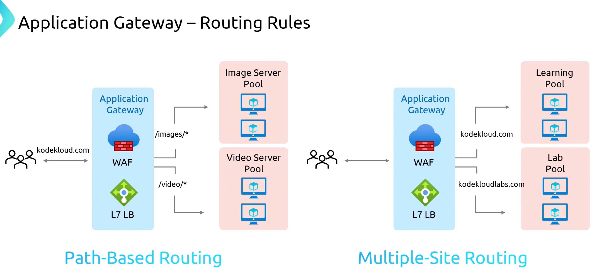

# **Azure Application Gateway Routing Rules**  

Azure Application Gateway provides **advanced routing capabilities**, allowing precise control over traffic flow to backend services. Two key routing strategies are:  

1. **Path-Based Routing**  
2. **Multiple Site Routing**  

These methods leverage **Layer 7 load balancing**, enabling **granular traffic management** to optimize performance and user experience.  

### **1. Path-Based Routing**  

- Routes requests to **different backend pools** based on the **URL path** in the request.  
- Useful for applications that require traffic to be directed to **specific services** within the infrastructure.  
- **Example:**  
  - Requests containing `/images` → **Sent to an image server pool** (optimized for images).  
  - Requests containing `/video` → **Sent to a video server pool** (optimized for videos).  
- **Use Case:**  
  - Efficient content delivery by **segregating requests** based on file type or service category.  

### **2. Multiple Site Routing**  

- Enables a **single Application Gateway** instance to handle **multiple websites** with different domain names.  
- Requests are directed to **different backend pools** based on the **host header** (domain name).  
- **Example:**  
  - Requests to **KodeKloud.com** → **Routed to the learning backend pool**.  
  - Requests to **KodeKloudLabs.com** → **Routed to the lab backend pool**.  
- **Benefits:**  
  - **Reduces infrastructure complexity** by managing multiple sites from a single gateway.  
  - **Optimizes cost** by consolidating resources instead of deploying separate gateways for each site.  

## **How These Routing Rules Improve Traffic Management**  

- **Utilizes Layer 7 load balancing** for smarter request distribution.  
- **Enhances performance** by sending requests to optimized backend services.  
- **Improves user experience** by ensuring requests are processed efficiently.  

## **Summary of Routing Strategies**  

| **Routing Type**      | **Function**  | **Use Case**  |
|----------------------|--------------|--------------|
| **Path-Based Routing** | Routes requests based on the **URL path**. | Directs specific requests (e.g., images, videos) to optimized backend pools. |
| **Multiple Site Routing** | Routes requests based on the **host header (domain name)**. | Manages multiple websites using a **single Application Gateway**. |

Both **routing methods** allow **efficient and flexible traffic management**, ensuring requests are **handled optimally** based on their **type** or **destination**.

## **Azure Application Gateway Deployment & Configuration**  

This section provides a **step-by-step guide** on deploying and configuring an **Azure Application Gateway** using path-based routing.  

## **Infrastructure Setup**  

- A script named **AppGatewayPrepInfra1** is used to deploy the infrastructure.  
- This script provisions **six virtual machines (VMs)**:  
  - **Red VMs (Default Backend)**  
  - **Blue VMs (Path-based Routing: `/blue` requests)**  
  - **Green VMs (Path-based Routing: `/green` requests)**  

## **Creating Application Gateway Deployment in Azure Portal**  

### **Step 1: Creating the Application Gateway**  
1. **Go to the Azure Portal** and click **Create** to start deployment.  
2. **Specify the required details**:  
   - **Subscription & Resource Group**  
   - **Application Gateway Name**: `APPGW-Colors`  
   - **Application Gateway SKU**:  
     - **Standard**, **Standard V2**, **WAF**, or **WAF V2**  
     - **WAF SKUs** include **Web Application Firewall (WAF)** for security.  
     - **Standard V2** is selected for this demo (supports **auto-scaling** but is not used here).  
3. **Set the instance count**: **1 or 2 instances** (no auto-scaling for demo).  

### **Step 2: Virtual Network and Subnet Configuration**  
1. **Application Gateway requires a dedicated subnet** within the Virtual Network (VNet).  
2. If no subnet exists, click **Manage Subnet Configuration** → **Add a new subnet**.  
   - Example:  
     - **Subnet Name**: `Application Gateway Subnet`  
     - **Subnet Size**: `/24` (can also use `/26` for smaller range).  
3. **Save the subnet** and return to the deployment process.  

### **Step 3: Frontend Configuration**  
- **A Public IP is required** since the Application Gateway is public-facing.  
- Create a **new Public IP Address** (`PIP`).  

### **Step 4: Backend Configuration**  
1. **Create backend pools** for different VM groups:  
   - **Red Pool** (Default Backend)  
   - **Blue Pool** (Handles `/blue` requests)  
   - **Green Pool** (Handles `/green` requests)  
2. Initially, the backend pool **does not include any VMs** (added later).  

### **Step 5: Routing Rule Setup**  
1. **Define a routing rule** (`App GW Colors HTTP Route`).  
2. **Create a listener**:  
   - **Name**: `App Gateway Colors HTTP Listener`  
   - **Frontend IP**: Public  
   - **Protocol**: HTTP  
   - **Port**: 80  
   - **Listener Type**: Basic (Multi-site not used here)  
3. **Set the default backend pool** → **Red Pool**.  
4. **Configure backend settings**:  
   - **Port**: 80  
   - **Protocol**: HTTP  
   - **Session stickiness & connection draining**: Not enabled (default settings used).  

### **Step 6: Configuring Path-Based Routing**  
- Add **multiple targets** for path-based routing:  
  - `/blue/*` → **Blue Target** (Backend: **Blue Pool**)  
  - `/green/*` → **Green Target** (Backend: **Green Pool**)  
- Each rule ensures **requests with specific paths** are forwarded to the correct backend.  

### **Step 7: Finalizing the Deployment**  
- **Review & Create** the Azure Application Gateway.  
- Deployment takes **10–15 minutes**.  

### **Step 8: Mapping Virtual Machines to Backend Pools**  
Once the **Application Gateway is deployed**, the backend pools need to be mapped to the correct VMs:  
1. **Assign VMs to Backend Pools**:  
   - **Red Pool** → `Red1` and `Red2` VMs  
   - **Blue Pool** → `Blue1` and `Blue2` VMs  
   - **Green Pool** → `Green1` and `Green2` VMs  
2. **Save configurations and update the backend pools**.  

## **Testing the Application Gateway**  

1. **Obtain the Public IP of the Application Gateway** from the **Overview** section.  
2. **Verify traffic distribution**:  
   - Access the **default URL** → Should respond from **Red Servers**.  
   - Refreshing the page should show responses from **different Red VMs** (Round-Robin load balancing).  
3. **Test Path-Based Routing**:  
   - **Access `/blue/` path** → Response should come from a **Blue Server**.  
   - **Access `/green/` path** → Response should come from a **Green Server**.  

## **Summary**  

| **Component**         | **Purpose**  |
|----------------------|--------------|
| **Frontend (Public IP)** | Handles incoming traffic. |
| **Listener** | Monitors and processes requests. |
| **Backend Pools** | Groups of VMs serving requests. |
| **Routing Rules** | Directs traffic based on path-based routing. |
| **Path-Based Targets** | Routes requests (`/blue`, `/green`) to correct VMs. |
| **Gembox Script** | Fixes VM setup issues if backend configuration fails. |

This setup ensures **efficient traffic routing**, **high availability**, and **scalability** for applications using **Azure Application Gateway**.