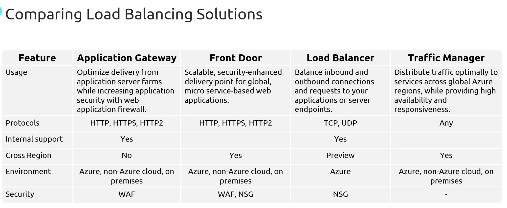

# **Azure Load Balancing Solutions Overview & Comparison**  

This section covers **various load balancing solutions in Azure**, including **Azure Load Balancer, Azure Application Gateway, Azure Front Door, and Azure Traffic Manager**. A comparison is also provided to understand their differences in **use cases, supported protocols, security, and global availability**.  

## **Overview of Azure Load Balancing Solutions**  

Azure provides multiple **load balancing solutions**, each designed for specific scenarios:  

### **1.1 Azure Load Balancer**  
- A **Layer 4 (Transport Layer) load balancer** that distributes **TCP and UDP traffic**.  
- Primarily used for **internal and external load balancing** within **Azure resources**.  
- Provides **low latency and high throughput**.  
- Works **only with Azure-based resources** (not external or on-premises).  
- Security: Uses **Network Security Groups (NSGs)** for traffic filtering.  

### **1.2 Azure Application Gateway**  
- A **Layer 7 (Application Layer) load balancer** optimized for **web applications**.  
- Supports **HTTP, HTTPS, and HTTP/2**.  
- Provides **path-based routing**, **multi-site routing**, and **SSL termination**.  
- Includes **Web Application Firewall (WAF)** for **application security**.  
- Can be used for **internal (private) and external (public) traffic**.  

### **1.3 Azure Front Door**  
- A **global load balancing solution** built on the **Microsoft Global Edge Network**.  
- Acts as a **CDN** (Content Delivery Network) with **built-in caching** and **acceleration**.  
- Supports **path-based routing**, **multiple site routing**, and **SSL offloading**.  
- Includes **WAF for security**.  
- **Optimized for microservices-based web applications** with high availability.  
- **Cross-region support** is available.  

### **1.4 Azure Traffic Manager (ATM)**  
- A **DNS-based global load balancer** that directs traffic based on **DNS resolution**.  
- Routes requests to the **best available endpoint** based on configured rules.  
- Supports multiple **routing methods**:  
  - **Priority-based routing** (directs traffic to primary endpoint).  
  - **Weighted routing** (traffic split based on assigned weights).  
  - **Geographic routing** (directs users to region-based endpoints).  
  - **Performance-based routing** (routes to lowest-latency endpoint).  
  - **Nested profiles** (combining multiple routing methods).  
- Works with **Azure, non-Azure, and on-premises resources**.  
- **No built-in security features** (as it only provides DNS resolution).  

## **Comparison of Load Balancing Solutions in Azure**  

| **Feature**                | **Azure Load Balancer** | **Azure Application Gateway** | **Azure Front Door** | **Azure Traffic Manager** |
|----------------------------|------------------------|------------------------------|----------------------|--------------------------|
| **Layer**                  | Layer 4 (TCP/UDP)      | Layer 7 (HTTP/HTTPS)        | Layer 7 (HTTP/HTTPS) | DNS-based (Layer 7)     |
| **Primary Use Case**        | Internal & external balancing for VMs and services | Web traffic routing with security features | Global content delivery & web acceleration | Global endpoint routing (DNS-based) |
| **Protocol Support**        | TCP, UDP               | HTTP, HTTPS, HTTP/2         | HTTP, HTTPS, HTTP/2  | Any (protocol-agnostic) |
| **Cross-Region Support**    | Limited (Preview)      | ❌ (Only within a region)    | ✅ (Global solution)  | ✅ (Global solution)    |
| **Internal/External Use**   | ✅ Internal & External | ✅ Internal & External      | ❌ Only External      | ❌ Only External        |
| **Path-Based Routing**      | ❌ No                   | ✅ Yes                      | ✅ Yes               | ❌ No                   |
| **Multi-Site Routing**      | ❌ No                   | ✅ Yes                      | ✅ Yes               | ✅ Yes (via DNS)        |
| **Security**               | **NSG only**           | **WAF, NSG**                | **WAF**              | ❌ No security features |
| **Support for Non-Azure Services** | ❌ No | ✅ Yes | ✅ Yes | ✅ Yes |
| **Performance Optimization** | ❌ No                   | ✅ Yes                      | ✅ Yes               | ✅ Yes (via routing policies) |

## **Key Differences Between Azure Load Balancers**  

1. **Azure Load Balancer vs. Azure Application Gateway**  
   - **Load Balancer** is a **Layer 4 solution** (for network traffic).  
   - **Application Gateway** is a **Layer 7 solution** (for web applications).  
   - **Application Gateway supports WAF, SSL termination, and path-based routing**, whereas **Load Balancer does not**.  

2. **Azure Application Gateway vs. Azure Front Door**  
   - **Application Gateway is region-specific**, whereas **Front Door is a global solution**.  
   - **Front Door leverages Microsoft's Global Edge Network** for better performance and **faster content delivery**.  
   - **Both support WAF, path-based routing, and multi-site routing**, but **Front Door is optimized for microservices**.  

3. **Azure Traffic Manager vs. Azure Front Door**  
   - **Traffic Manager is a DNS-based load balancer**, whereas **Front Door is an application-layer global load balancer**.  
   - **Traffic Manager only provides DNS resolution** (does not handle actual traffic), while **Front Door actively routes traffic through Microsoft's network**.  
   - **Front Door supports caching and acceleration**, while **Traffic Manager does not**.  

## **When to Use Each Load Balancer?**  

| **Scenario** | **Recommended Solution** |
|-------------|--------------------------|
| **Distribute TCP/UDP traffic across VMs** | **Azure Load Balancer** |
| **Load balance HTTP/HTTPS traffic within a region** | **Azure Application Gateway** |
| **Global web traffic distribution with caching** | **Azure Front Door** |
| **Direct traffic based on DNS resolution** | **Azure Traffic Manager** |
| **Protect applications with WAF** | **Application Gateway / Front Door** |
| **Need cross-region load balancing** | **Azure Front Door / Traffic Manager** |

## **Summary**  

Azure provides multiple **load balancing options** for different use cases:  

- **Azure Load Balancer** → For **network-level** (TCP/UDP) balancing **inside Azure**.  
- **Azure Application Gateway** → For **web applications** with **path-based routing, WAF, and SSL termination**.  
- **Azure Front Door** → For **global content delivery** with **built-in caching, security, and acceleration**.  
- **Azure Traffic Manager** → A **DNS-based solution** for **global endpoint routing**.  

Each solution has **specific advantages**, and the right choice depends on **workload requirements, traffic type, security needs, and global availability**.