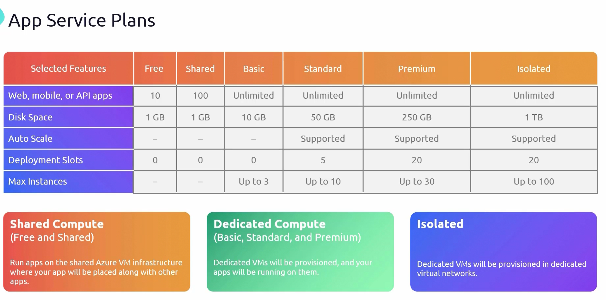
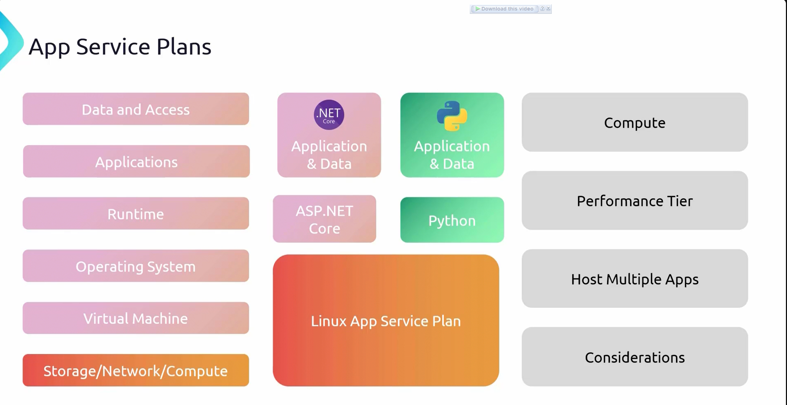

# **Azure App Service Plans - Detailed Notes**  

Azure **App Service Plans** provide the necessary **compute resources** for hosting web applications, APIs, and mobile backends in Azure.  

- When deploying an application on a **Virtual Machine (VM)**:  
    - The **storage, networking, and compute** resources are provided by Microsoft.  
    - The user creates the **VM**, selects an **operating system (OS)**, and installs the required **runtime** (e.g., Python, .NET).  
    - After setting up the runtime, the **application code and data** are deployed.  

With an **`App Service Plan`**, this entire infrastructure (VM, OS, runtime) is **pre-packaged** and managed by Azure.  
- The user **only selects** the required runtime (e.g., ASP.NET Core, Python).  
- Application deployment is simplified by **eliminating the need to manage the OS or runtime installation**.  
- **Key Benefit:** is that it is a **Fully managed environment** where Microsoft handles the underlying VM, OS, and updates, allowing developers to focus on application deployment.  

### **App Service Plan Features and Performance Tiers**  

Like VMs, App Service Plans offer different **tiers** based on performance, features, and pricing.  

- **Key Characteristics of App Service Plans:**  
    - They define the **compute resources** needed to run an application.  
    - Multiple applications **can run on a single App Service Plan** (e.g., an App Service Plan can host both an **ASP.NET Core app and a Python app**).  
    - Different regions require separate plans (e.g., an App Service Plan in **North Europe** cannot be used to deploy an app in **West Europe**).  
    - A plan’s OS (Linux/Windows) is fixed at creation (e.g., a **Linux-based App Service Plan** cannot host **Windows-based apps**).  
    - Scaling an application **might require moving to a higher-tier App Service Plan** to prevent resource bottlenecks.  
- **Important Consideration:**  
    - **Cost is incurred** regardless of whether applications are running.  
    - Unlike a VM, an App Service Plan **cannot be stopped** to save costs once deployed.  
    - Selecting the right tier is crucial to avoid unnecessary expenses.  

### **App Service Plan Tiers**  

Azure offers **multiple App Service Plans** catering to different application needs.  

- ### **Free Tier (F1)**
    - Best for **experimentation** and **small-scale projects**.  
    - **Limitations:**  
        - **1 GB disk space**  
        - **Supports up to 10 web apps or APIs**  
        - **No autoscaling, deployment slots, or scaling out**  
        - **Can run only for 60 minutes per day**  

- ### **Shared Tier (D1)**
    - Similar to the **Free Tier** but runs on a **shared Azure VM infrastructure**.  
    - Suitable for **small websites with low traffic**.  
    - **Limitations:**  
        - **Shared resources** (other apps run on the same VM).  
        - **Can run only for 240 minutes per day**.  

- ### **Basic Tier (B1, B2, B3)**
    - **Step-up from Shared Tier**, providing **dedicated compute resources**.  
    - **Features:**  
        - **10 GB disk space**  
        - Supports **up to 3 instances**  
        - **No auto-scaling**  
    - Best for **low-traffic applications** needing a dedicated environment.  

- ### **Standard Tier (S1, S2, S3)**
    - Designed for **business-grade applications**.  
    - **Features:**  
        - **50 GB disk space**  
        - **Autoscaling support**  
        - **5 deployment slots**  
        - **Up to 10 instances with autoscaling**  
    - Ideal for applications needing **scalability and higher performance**.  

- ### **Premium Tier (P1V2, P2V2, P3V2)**
    - Intended for **high-performance applications**.  
    - **Features:**  
        - **250 GB disk space**  
        - **20 deployment slots**  
        - **Autoscaling support**  
        - **Up to 30 instances**  
    - Suitable for **enterprise applications** with high traffic and performance needs.  

- ### **Isolated Tier (I1, I2, I3)**
    - **Highest level of isolation** with **dedicated networking**.  
    - **Features:**  
        - **1 TB disk space**  
        - **20 deployment slots**  
        - **Autoscaling support**  
        - **Up to 100 instances**  
        - **Runs in a dedicated Virtual Network (VNet)** for **enhanced security**  
    - Best for applications requiring **strict isolation and private network access**.  

### **Compute Types in App Service Plans**  

Azure App Service Plans use different compute models depending on the selected tier:  

- ### **1. Shared Compute (Multi-Tenant)**
    - Used in **Free and Shared Tiers**.  
    - The application **shares compute resources** with other customers.  
    - **Limitations:** Cannot **scale or guarantee** dedicated resources.  

- ### **2. Dedicated Compute**
    - Used in **Basic, Standard, and Premium Tiers**.  
    - Provides **dedicated VMs** for applications, ensuring **consistent performance**.  
    - No resource sharing with other customers.  

- ### **3. Isolated Compute**
    - Used in the **Isolated Tier**.  
    - Applications run on **dedicated VMs within a private VNet**.  
    - Offers **maximum security, performance, and compliance**.  

**Choosing the Right Compute Type:**  
- **Shared Compute** → For testing or small-scale apps.  
- **Dedicated Compute** → For **production applications** requiring reliable performance.  
- **Isolated Compute** → For **security-sensitive applications** needing complete isolation.  

### **Scaling Options in Azure App Service Plans**  

Scaling is essential for handling increased traffic and application load.  
Azure offers **two types of scaling**:  

- ### **1. Scale Up (Vertical Scaling)**
    - Involves **upgrading to a higher-tier App Service Plan**.  
    - Increases **CPU, RAM, and disk space**.  
    - Suitable for applications that need **more powerful hardware** but **not multiple instances**.  
    - **Example:** Upgrading from **Standard Tier (S1) to Premium Tier (P1V2)**.  

- ### **2. Scale Out (Horizontal Scaling)**
    - Involves **adding more instances** of the application.  
    - The load is distributed across multiple servers.  
    - Azure provides **auto-scaling based on CPU, memory, and request load**.  
    - Helps manage **traffic spikes dynamically** without downtime.  
    - **Example:** Increasing the number of instances from **2 to 5**.  

### **Scaling Availability by Tier**
| Tier | Manual Scaling | Auto Scaling |
|------|--------------|--------------|
| Free | No | No |
| Shared | No | No |
| Basic | Yes | No |
| Standard | Yes | Yes |
| Premium | Yes | Yes |
| Isolated | Yes | Yes |

**Key Takeaways:**  
- **Scale Up** → Upgrade to a more powerful service plan (better CPU, RAM, disk).  
- **Scale Out** → Increase instances to handle traffic load.  
- **Auto-scaling is available from Standard Tier onwards**.  

## **Choosing the Right App Service Plan**  
1. **Application Requirements** → Choose a plan based on performance, disk space, and instance count.  
2. **Traffic Expectations** → Higher tiers handle **higher traffic and scale automatically**.  
3. **Budget** → Higher tiers cost more; balance cost with performance needs.  
4. **Scalability** → Choose **Standard, Premium, or Isolated tiers** if scaling is required.  
5. **Security and Isolation** → Use **Isolated Tier** for **secure networking**.  

## **Conclusion**  
Azure **App Service Plans** provide a **managed hosting environment** with different **compute, scaling, and pricing options**.  
- They eliminate the need to manage **VMs, OS, and runtime installations**.  
- Different **tiers** allow applications to **scale based on performance and budget needs**.  
- Scaling can be **vertical (scale up)** or **horizontal (scale out)**.  
- **Choosing the right plan** is crucial to balancing **cost, performance, and scalability**.  

## **Deploying an App Service Plan in Azure Portal**

1. **Navigating to App Service Plans:**  
   - In the Azure portal, search for "App Service Plans" and select it.  
   - Click on "Create" to set up a new App Service Plan.

2. **Selecting Subscription and Resource Group:**  
   - Choose a subscription under which the App Service Plan will be created.  
   - Create a new resource group, named `RG-apps-01`, to organize resources.

3. **Naming and OS Selection:**  
   - Assign a name to the App Service Plan, such as `ASP-01` (App Service Plan 01).  
   - Choose the operating system (Windows in this case).

4. **Choosing the Pricing Plan:**  
   - Click on "Explore Pricing Plans" to review the available options.  
   - There are two views available:
     - **Hardware View:** Displays the underlying compute resources.
     - **Feature View:** Lists capabilities such as custom domains, autoscaling, backup, staging slots, zone redundancy, and integrations.
   - Select a plan based on requirements; for this example, the **Free Tier** is chosen.

5. **Deploying the App Service Plan:**  
   - After selecting the pricing tier, click **"Create"** to deploy the App Service Plan.  
   - Once the deployment is complete, click **"Go to Resource"** to manage it.

### **Managing the App Service Plan**
1. **Viewing the App Service Plan Details:**  
   - The newly created App Service Plan does not yet have any apps or deployment slots.  
   - Deployment slots allow different versions of an application to be deployed and swapped.

2. **Scaling Up the App Service Plan:**  
   - The **Scale-Up** option allows upgrading to a higher-tier plan, such as Basic, Standard, or Premium.  
   - The **Isolated Tier** is not available for direct selection because it requires a different deployment method, known as **App Service Environment (ASE)**.

### **App Service Environment (ASE)**
1. **Why ASE is Different?**  
   - Unlike regular App Service Plans, ASE requires manual selection of a **Virtual Network (VNet)**.
   - By default, Microsoft manages the network for standard App Service Plans, but ASE allows users to integrate their App Service with a custom VNet.

2. **When to Use ASE?**  
   - ASE is ideal for applications that require **better network isolation and security**.
   - Since it is deployed inside a VNet, users can control network policies and security settings.

### **Limitations of the Free Tier**
1. **No Auto-Scaling in Free Tier:**  
   - The **Scale-Out** option is unavailable because the **Free Tier does not support auto-scaling**.  
   - To enable auto-scaling, an upgrade to at least the **Standard Tier** is necessary.

2. **Upgrading to Unlock Features:**  
   - If scaling out is needed, the plan must be upgraded to a higher tier (Standard or Premium).  
   - Azure provides a "Recommended Pricing Plan" option to suggest the best plan based on requirements.

### **Conclusion**
- Deploying an App Service Plan in Azure involves selecting a **subscription, resource group, OS, and pricing plan**.  
- **Scaling up** (vertical scaling) allows for more resources but requires an upgrade.  
- **Scaling out** (horizontal scaling) is not available in the Free Tier and requires at least a **Standard Plan**.  
- **App Service Environments (ASEs)** provide **better network isolation** and require **VNet integration**.  
- Choosing the **right plan** is essential to ensure cost-efficiency and optimal performance based on application needs.