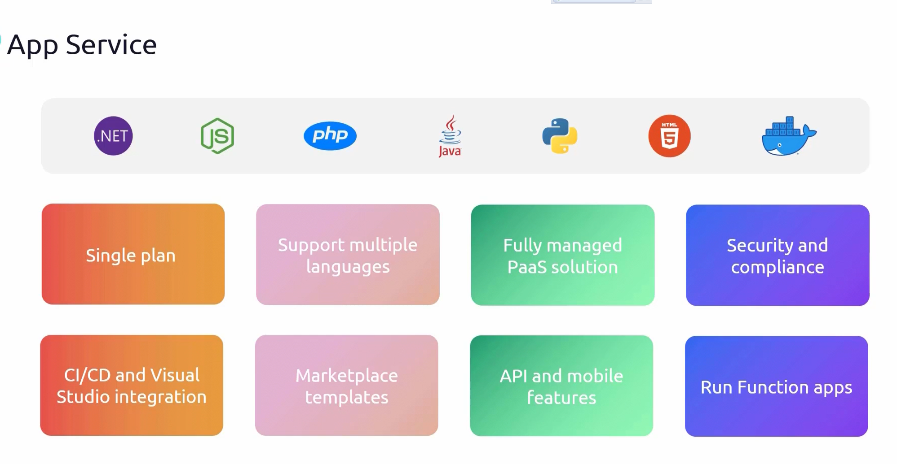

# **Azure App Service**
- Azure **App Service** is a fully managed **Platform-as-a-Service (PaaS)** offering that allows developers to deploy and run:
  - **Web applications**
  - **API applications**
  - **Mobile applications**
  - **Containerized applications**
- It eliminates the need to manage underlying **virtual machines, networking, and infrastructure**, allowing developers to focus solely on **writing and deploying code**.

*Note:  `App Service != App Service Plans`*

- **Supported Technologies** : Azure App Service supports multiple programming languages and runtimes, including:
    - **.NET** and **.NET Core**
    - **Node.js**
    - **PHP**
    - **Java**
    - **Python**
    - **Containerized Applications** (Docker)
    

Since App Service is a **managed solution**, the underlying **operating system, updates, security patches, and scaling** are handled by **Microsoft**.
- **Security and Compliance**
    - **Azure App Service** follows **enterprise-grade compliance standards**, including:
        - **ISO** (International Organization for Standardization)
        - **SOC** (Service Organization Control)
        - **PCI DSS** (Payment Card Industry Data Security Standard)
    - These certifications make App Service suitable for **enterprise applications that require security compliance**.
- **Authentication and Authorization**
    - **Microsoft Entra ID (formerly Azure Active Directory)** can be integrated for authentication.
    - Social logins (such as Google, Facebook, and Twitter) can be configured for **user authentication**.
- **CI/CD and Integration with Visual Studio**
    - **Continuous Integration and Continuous Deployment (CI/CD)** is supported with:
        - **Azure DevOps**
        - **GitHub Actions**
        - **Bitbucket**
        - **Local Git Repositories**
    - Developers can also deploy applications **directly from Visual Studio**, enabling a **seamless development-to-deployment workflow**.
- **Marketplace Templates for Faster Deployment**
    - App Service supports **pre-built templates** from the **Azure Marketplace**, including:
        - **WordPress**
        - **Drupal**
        - Other CMS platforms
    - This simplifies the deployment of **content management systems and web applications**.
- **Advanced Features for Mobile Applications**
    - App Service is an excellent choice for **hosting mobile applications** due to features like:
        - **Offline Data Sync**: Synchronize data even when the device is offline.
        - **Push Notifications**: Send notifications to mobile devices using **Azure Notification Hubs**.

- **Running Azure Functions on App Service**
    - **Azure Functions**, which allow **serverless computing**, can be deployed **on an existing App Service Plan**.
    - This eliminates the need for **additional infrastructure provisioning**, making it cost-effective.

### **Key Takeaways**
- **Azure App Service** is a **PaaS solution** designed for **web, API, mobile, and containerized applications**.
- **Fully managed** by Microsoft, handling **infrastructure, OS updates, scaling, and security**.
- **Supports multiple programming languages** and **containerized applications**.
- **Enterprise-grade compliance** ensures **security and regulatory adherence**.
- **Built-in authentication** with **Microsoft Entra ID** and **social logins**.
- **Supports CI/CD** with Azure DevOps, GitHub, and Visual Studio.
- **Pre-built templates** in **Azure Marketplace** allow quick deployment of **CMS platforms**.
- **Advanced mobile features** like **push notifications** and **offline sync**.
- **Azure Functions** can run on an **existing App Service Plan** without extra infrastructure.

### **Conclusion**
- **App Service = `Web App + App Service Plan`**
- An **App Service Plan** provides the **compute resources**, while the **App Service** hosts the **application itself**.
- Previously, **App Service** was referred to as **Web App**, but now it includes **APIs, mobile apps, and serverless functions**.

# **Creating an Azure App Service**

Azure App Service can be created directly from the Azure Portal without requiring a pre-existing **App Service Plan**. Similar to **Resource Groups**, the App Service Plan can be created dynamically during the App Service creation process.

To create an **App Service**, search for **App Service** in the **Azure Portal** and select **Create Web App**. The following configurations are required:

- **Resource Group**: Select an existing resource group or create a new one.
- **App Name**: Provide a unique name for the App Service, as it will be registered under **azurewebsites.net** (e.g., `KodeKloudDemo.azurewebsites.net`).
- **Publish Mode**:
  - **Code**: Deploy applications written in **.NET, Java, Node.js, PHP, or Python**.
  - **Docker Container**: Deploy a **custom container** with a prebuilt image.
  - **Static Web App**: Deploy a simple static website.
- **Runtime Stack**: If **Code** is selected, choose a runtime (e.g., **ASP.NET, Java, Node.js**).
- **App Service Plan**: An existing plan can be used, or a new one can be created during setup.
- **Database**: A database is optional and can be configured separately.
- **Deployment**: Configure **Continuous Integration/Continuous Deployment (CI/CD)**, which will be covered in the next lesson.
- **Networking & Monitoring**: Additional configurations can be set up before deployment.

Once the configurations are complete, click on **Create**. The deployment process will begin, and once completed, the **App Service** will be accessible via the generated URL.

### **Accessing the Web App**
After the App Service is created:
1. Click on **Go to Resource**.
2. Copy the **App Service URL** and open it in a browser to verify the deployment.
3. The default landing page will be displayed.

Since the App Service is running on the **App Service Plan**, it inherits the infrastructure and resources provisioned by the plan.

### **Scaling the App Service**
By default, the App Service runs on the selected **pricing tier**. Scaling options depend on the plan type.

1. **Scale Out (Horizontal Scaling)**:
   - To enable scaling, upgrade to **Standard (S1)** or higher.
   - Go to **Scale Out Settings** and increase the instance count manually (up to **10 instances** for **Standard S1**).
   - **Auto Scaling** can also be enabled based on **metrics**.

2. **Configuring Auto Scaling Rules**:
   - Select **Custom Auto Scale** and define conditions.
   - Add a rule where **CPU usage > 70%**, increasing instance count by **1**.
   - Add another rule where **CPU usage < 25%**, decreasing instance count by **1**.
   - These rules ensure optimal resource utilization without manual intervention.

### **Conclusion**
- **App Service** can be created independently or along with an **App Service Plan**.
- The **Publish Mode** determines whether the app runs on **Code, Docker, or Static Web**.
- **Scaling options** depend on the selected pricing plan, with **auto-scaling rules** available for efficient resource allocation.
- **CI/CD, monitoring, and networking configurations** enhance deployment flexibility and performance.