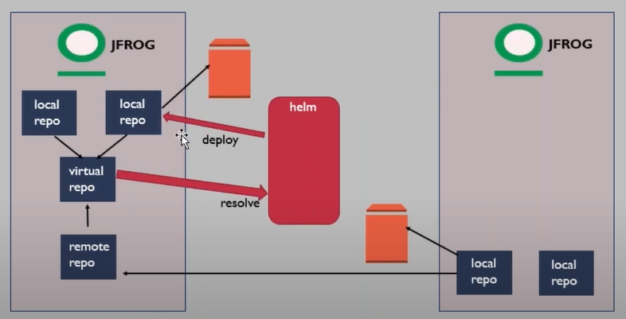
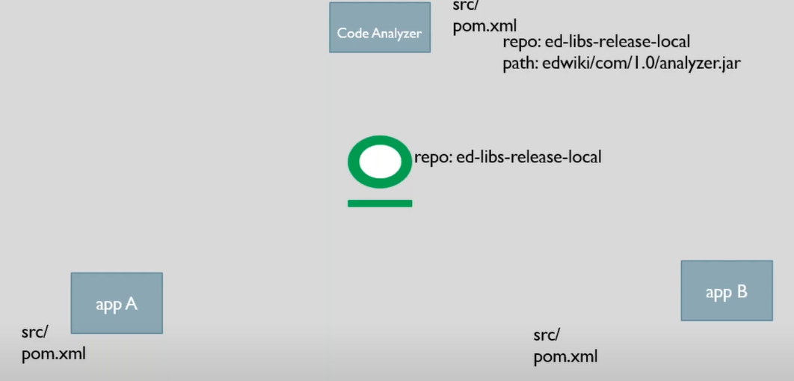
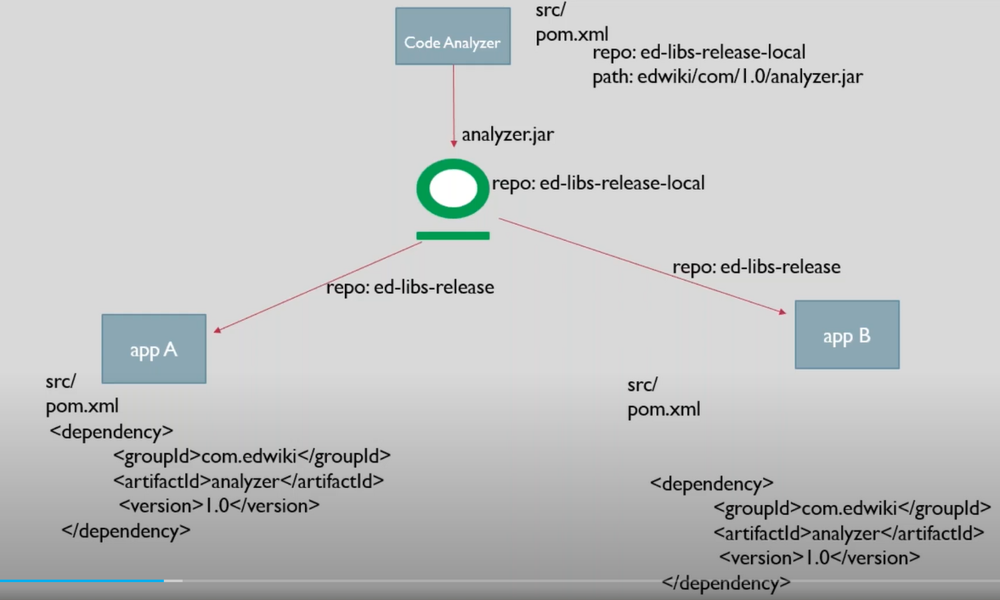
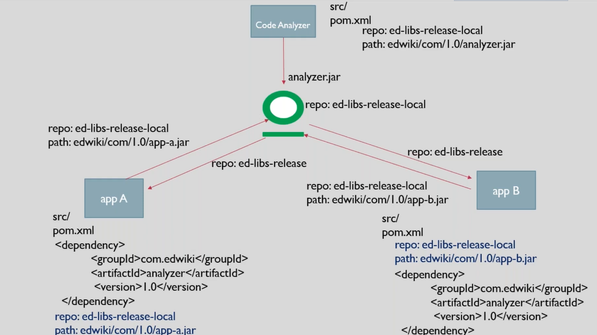
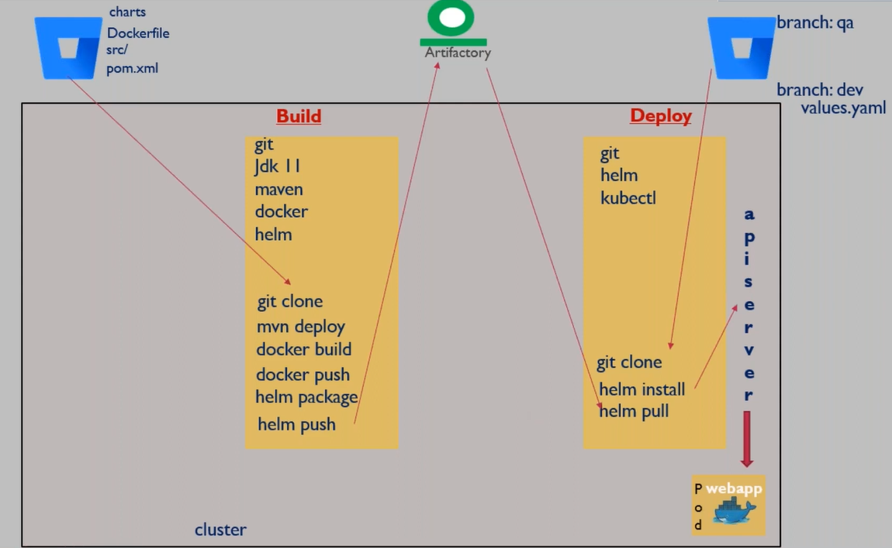
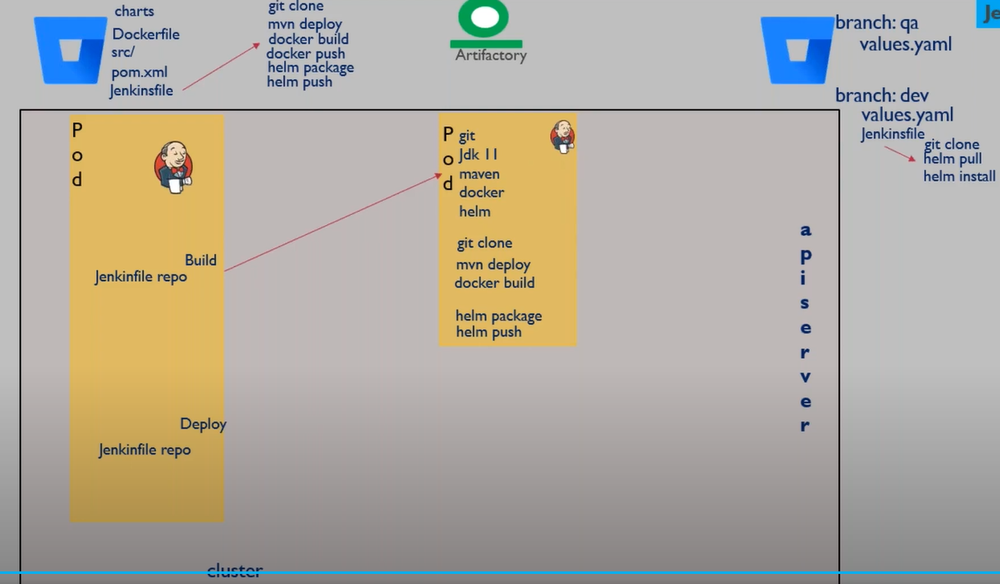
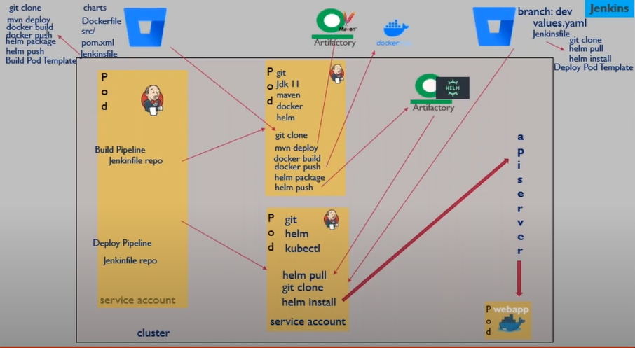

# JFrog Artifactory
- JFrog is a artifact management tool , ie it is the specialized tool to store artifacts. It will resolve the artifacts when you need it
- to store an atrifact in Jfrog , you need to create a repository of type `local Repository` , this is where the artofact will be stored
- The data/artifacts stored in the loacl repo will actually be stored and a volume attached to the Jfrog application
- To resolve an artifact from Jfrog local repo , it is actually resolved from another repo called a as `Virtual Repo`. This repo is conncted to the Local Repo
- Deployment and artifact in Jfrog will always happen on the local repo whereas resolving an artifact will happen from Virtual Repo
- To resolve artifacts from multiple Jfrog Server , it uses the conect of `Remote Repository`. With the help of this , user can resolve artifacts stored in dofferent servers by just connecting to one of the server
- You create a `Remote Repo` in one of the server and connect the local repos of other server. Now you would be able to resolve directly from the remote repo , irrespective of the location of the artifact



## JFrog Setup
- Jfrog is a paid application
- JFrog is available as a SaaS product as well as can be Self Hosted
- We will use the SaaS version for simplicity as it would not require any configurations as well as it provide a 14 day free trail for all features
- There is also an open source version which is totally free but it does not provide pro featues and you cannot use hekm repo in that

### Creating HELM Repository & Storing HELM charts
- Select Repositories under Artifactory
- Create new Repository -> provide repo name (eg dptweb). This will create all 3 types of repositories(local, remote, virtual)
- Once the repo is created , it will provide you the steps on how you configure,deploy & resolve the repo to work with helm
   - example
    ```bash 
    # configure the helm client on our machine with the jfrog artifactory
    helm repo add <repo-name>-helm <jfrog-url>/artifactory/api/helm/<repo-name>-helm  --username <user-name> --password <password> 

    # deploy helm chart to local repo
    curl -u<user-name>:<password> -T <path-to-file> <jfrog-url>/artifactory/<repo-name>-helm/<Target-file-path>

    # resolve artifact from virtual repo
    helm repo update 
    helm install <repo-name>/<chart-name>
    ```
### Dependency Management in Maven Build Processes
The JFrog is also capable of storing Maven artifacts as well. The need for storing the Maven artifact in the JFrog repository is to ensure that only a Helm chart is required for deployment. Deployment directly of the war file or a jar file in Kubernetes is not preferred. Instead, these files should be part of the container image, which in turn is part of the Manifest file. The Manifest files form an integral part of the Helm chart, simplifying the deployment process. Therefore, the utilization of Maven artifacts stored in the JFrog Artifactory is essential for streamlined deployment.

So, in order to understand the JFrog use cases for Maven, let's analyze this slide. Let's say there's a Java developer who has developed an application, which is essentially a code analyzer. This application is responsible for analyzing Java code to check for bugs, adherence to best practices, and the presence of required dependencies or plugins. When the developer completes the code, it is committed to Bitbucket, and the DevOps team is tasked with building it. Once the code is ready, typically found in the SRC folder and pom.xml file in the Bitbucket repository, the project is built to generate a web artifact.

Now, let's consider another application A. The purpose of this application may vary, but the requirement is to analyze its code behavior before deploying it for production. Instead of asking the developer to write a code analyzer from scratch for this application, it makes sense to reuse the existing code analyzer. There's no need for the developer to reinvent the wheel.

The developer can solely focus on developing Application A without the need to worry about code analysis. This is because a code analyzer is already available, allowing for the reuse of existing functionality to analyze Application A. Consequently, Application A becomes dependent on the code analyzer, ensuring that during the build process, the code is thoroughly analyzed before generating the artifact. This dependency on the code analyzer ensures consistency across different applications, reducing the need to rewrite code for analysis in each application. The code analyzer application, developed as a Java or Spring Boot application, serves as a common dependency for various Java projects.

However, it is not intended for end-user purposes but rather as a common dependency for developers. When deploying the code analyzer artifact to a JFrog Artifactory, a specific repository, such as ed-libs-release-local, needs to be created, and the pom.xml file must be updated with the repository details. This ensures that the artifact is uploaded to the correct repository based on the pom.xml instructions. Therefore, ensuring that the pom.xml file is correctly configured to specify the repository details is crucial, either the developer or the administrator's responsibility.
```xml
repo: ed-libs-release-local
path: ashwin/com/1.0/analyser.jar
```



It can be any path, and when you build a code analyzer Maven project, you may get an analyzer.jar file as an artifact. This artifact will now be uploaded to the JFrog repository based on the pom.xml instructions.

So far, we've primarily dealt with WAR artifacts for our Java login application. However, the code analyzer project generates a JAR artifact. Now, what's the difference between WAR and JAR files? JAR, or Java Archive, is also a packaging format for Java applications, but it's not intended for web clients. Instead, JAR artifacts serve as dependencies in other projects. Given that the code analyzer isn't directly used by web clients but rather as a dependency in other projects, it's appropriate to generate it as a JAR file.

When building Application A, which now incorporates the code analyzer, the dependency must be specified in its `pom.xml` file. This is done by adding a dependency block as follows:

```xml
<dependency>
    <groupId>com.ashwin</groupId>
    <artifactId>analyzer</artifactId>
    <version>1.0</version>
</dependency>
```

Here, `groupId` refers to the path in reverse order, and `artifactId` specifies the artifact name, version, and repository path (`ashwin/com/1.0/analyser.jar`). Maven, upon reading this `pom.xml`, resolves the artifact from JFrog using the virtual repository.

Application A's artifact type depends on its purpose. If it's designed for web client use, it generates a WAR file. However, if it's intended as a dependency library for other applications, it produces a JAR file. This distinction is specified in the `pom.xml`, ensuring the appropriate artifact is generated during the build process, relieving developers of this concern.

Similarly, when building Application B, if it also requires code analysis, you simply need to update the dependency block in its pom.xml. Upon initiating the build process for Application B, Maven will automatically download the necessary dependencies from the corresponding virtual repository. Once the build is successful, it will generate the respective artifacts for Application 



As previously mentioned, Application A has dependencies that it downloads from JFrog. Upon a successful build, Application A also generates another artifact, which could be either a WAR or a JAR depending on its purpose as a web client or a dependency for other applications. To ensure that the artifact is uploaded back to JFrog Artifactory after a successful build, you need to update the `pom.xml` of Application A with the relevant details. This includes specifying the repository where the artifact should be uploaded and the path within that repository. For example:

```xml
<repository>ed-libs-release-local</repository>
<path>ashwin/com/1.0/app-a.jar</path>
```

By providing this information in the Maven build configuration, the generated artifact, such as `app-a.jar`, will be uploaded to the specified location in the JFrog Artifactory.

Essentially, When you initiate a Maven build, there are two essential steps that Maven follows. Firstly, it starts by downloading the dependencies required for the project from JFrog Artifactory. After that, Maven proceeds with the build process. Once the artifact is successfully generated, it needs to be uploaded back to JFrog Artifactory, as it might be necessary as a dependency for other applications.

Similarly, in Application B, you also need to update the `pom.xml` with the necessary details to ensure that the artifact is uploaded back to JFrog Artifactory upon a successful build. This includes specifying the repository and path where the artifact should be uploaded. By configuring this in the `pom.xml`, Maven will handle the build process accordingly and upload the artifact to the specified location in the JFrog repositories.
```xml
<repository>ed-libs-release-local</repository>
<path>ashwin/com/1.0/app-b.jar</path>
```



In conclusion, JFrog serves as an artifact management tool that facilitates the storage and retrieval of artifacts. Its primary function is to store artifacts and resolve dependencies across projects seamlessly. The path in JFrog Artifactory serves as a means of organizing files, similar to how you would organize files in folders on your computer. By structuring artifacts into specific paths within repositories, users can effectively organize and manage their artifacts, ensuring clarity and ease of access when needed.

When receiving a project from a developer with a request to build it, you might not always be aware of its dependencies. Developers typically manage these dependencies by adding dependency blocks in the project's pom.xml file. As an administrator or builder, your primary task is to initiate the build process. However, if the build fails, it's crucial to investigate why it failed, particularly in the dependency section.

For instance, if you start building Application A but the Code Analyzer project hasn't been built yet, Application A's build will likely fail because it depends on the Code Analyzer jar file, which is unavailable in the JFrog repository. In such cases, it's essential to understand why the build failed and which dependencies it's looking for. You can then communicate this to the developer, prompting them to provide the missing dependency or build the necessary project to resolve the issue. This collaboration ensures that all required dependencies are available in the repository


## Lab : Build & Pusblish Maven Artifacts to JFrog 

#### EC2 Machine Setup
- Ensure Maven and JDK are installed on the VM.
- Clone the Git repository: `git clone https://bitbucket.org/dptrealtime/java-login-app.git`.
#### JFrog Setup for Maven
- **Pre-requisite**: JFrog hosted on cloud(preferred) or Self Hosted.
- Create a Maven Repo named `edweb`.
- Go to `Repo` > `Set me Up` > Select `Maven` > Select Repo (use local repo i.e., `edweb-libs-release-local`).
- Under `Configure`, select the appropriate repositories for release, snapshots, etc. 
- Generate Settings and copy the settings file that is generated. Save it as `settings.xml` inside the `.m2` directory (usually present in the home directory of the user).
- Update the username and password details inside `<server>` tag.
- Copy the deploy setting and paste it in the `pom.xml` file of the project (just before the `</project>` tag).
  ```xml
  <distributionManagement>
      <repository>
          <id>...</id>
          <name>...</name>
          <url>...</url>
      </repository>
  </distributionManagement>
  ```
- The above configuration specifies which repository the artifact needs to be deployed to.
- Configure the path where the artifacts need to be uploaded/deployed to and the artifact details. This is already configured in the pom.xml. Edit if required. This is present at the top just below the `</parent>` tag.
  ```xml
  <groupId>com.devopsrealtime</groupId>
  <artifactId>dptweb</artifactId>
  <version>1.0</version>
  <packaging>war</packaging>
  <name>dptweb</name>
  ```
- Run `mvn deploy`: Build/package the artifact and deploy it to JFrog.
- Once the Maven build is completed, you can view your artifact uploaded in the JFrog UI.

---
### Jenkins Introduction

The current process that we are following for build and deployment involves followng manual steps
- **Phase : Build**
    - Step 1 : devs commit code to bitbucket
    - Step 2 : Setup build server with the following packages installed : git,jdk,maven , docker, helm
    - Step 3 : Clone git repo in build server
    - Step 4 : Generate artifact and deploy to jfrog > `mvn deploy`
    - Step 5 : Build a docker image using the artifact > `docker build`
    - Step 6 : Push docker image using to container registrt > `docker push`
    - Step 7 : Create helm chart with the k8 manifest files > `helm package`
    - Step 8 : Push the helm chart to Jfrog Repo > `helm push`
- **Phase : Deploy**
    - Step 9 : Setup a deploy server , which will be used to deploy to the K8 cluster with the following packages installed and configured : git , helm, kubectl
    - Step 10 : Store the env speficic values.yaml file in git repo in seperate branches based on envionment and the perform `git clone` 
    - Step 11 : Pull the helm chart from JFrog > `helm pull`
    - Step 12 : Apply the manifest files by providing the values.yaml file : `helm install`


### Jenkins Use Case
- Jenkins is utilized to automate manual processes, such as code deployment and builds.
- Jenkins effectively replaces the need for manual execution of commands by automating tasks.
- Jenkins functions as a DevOps engineer by running commands on behalf of users.
- Setting up Jenkins involves configuring it to execute specific commands and tasks automatically.
- Jenkins can be deployed as a pod within a Kubernetes cluster to ensure scalability and efficiency.
- All necessary dependencies and packages required for Jenkins to execute commands must be installed within the Jenkins pod.
- Automation tasks, including code cloning, building, Docker operations, and Helm deployments, are specified to Jenkins through configuration.
- To alleviate the burden on Jenkins, tasks are offloaded into a Jenkins file, which contains all the necessary steps for builds and deployments.
- Jenkins files serve as instructions for Jenkins to follow, outlining the sequence of tasks required for automation.
- Externalizing tasks into Jenkins files allows for better organization and management of automation processes.
- Jenkins is configured to retrieve Jenkins files from designated repositories, enabling seamless execution of automation tasks.
- Similar to a Dockerfile for Docker, Jenkins files provide a structured approach to defining automation workflows for Jenkins.



### Optimizing Jenkins Workflows with Distributed Execution Using Jenkins Agents
- Jenkins can offload execution of tasks to Jenkins agents to alleviate workload on the Jenkins master.
- Jenkins agents are separate software entities that can be run as pods, allowing for distributed execution of tasks.
- Tasks specified in Jenkins files, such as build or deployment steps, are executed on Jenkins agents rather than the Jenkins master.
- Jenkins masters focus on management activities, while Jenkins agents handle the actual execution of tasks.
- It's recommended to have Jenkins agents perform task execution to keep the Jenkins master free for management tasks.
- Dependencies required for task execution, such as Git, JDK, Maven, Docker, Helm, and kubectl, should be installed on Jenkins agent pods rather than the Jenkins master.
- Jenkins masters simply delegate tasks to Jenkins agents, providing them with necessary instructions and Jenkins files.
- Jenkins agents act as build servers, executing tasks outlined in Jenkins files and completing builds or deployments accordingly.

### Optimizing Resource Usage in Jenkins Environments with Dynamic Jenkins Agent Provisioning

- Continuous 24x7 operation of a build server is unnecessary when code changes infrequently.
- Jenkins agents can be provisioned dynamically to execute build tasks only when needed, reducing resource usage.
- Dynamic provisioning involves creating Jenkins agent pods automatically when a build is initiated and destroying them once the build is completed.
- It's not advisable to keep Jenkins agent pods running continuously if there are long intervals between code changes.
- Instructions for creating Jenkins agent pods, including image selection and deployment manifest, are defined within the Jenkins file.
- Pod templates specify configurations for creating Jenkins agent pods on-the-fly, ensuring they have the necessary software packages pre-loaded.
- Jenkins masters are capable of reading Jenkins files and pod templates to automatically create and manage Jenkins agent pods as needed.
- Service accounts are utilized to manage permissions and access controls for dynamically provisioning Jenkins agent pods.
- Dynamic Jenkins agent provisioning optimizes resource usage by ensuring resources are only allocated when required for build tasks, reducing overall cluster load.
- Jenkins agents are automatically created during build time and destroyed once the build is successful, minimizing resource usage.
- Jenkins Masters must have access to the Kubernetes API server to instruct it to create or destroy Jenkins agent pods.
- Service accounts with appropriate permissions are crucial for Jenkins Masters to interact with the API server for dynamic pod management.
- Pod templates defined in Jenkins files contain configurations for creating Jenkins agent pods with required software packages pre-loaded.
- During deployment, Jenkins Masters use pod templates to create agent pods, which execute deployment processes and are subsequently destroyed.
- Helm install commands executed by agent pods connect to the API server for actual deployment, after which the deployment pods are destroyed.
- Service accounts associated with deployment pods provide necessary permissions for API server interaction during deployment.
- Automated provisioning and destruction of Jenkins agent and deployment pods optimize resource usage by only allocating resources when necessary.


