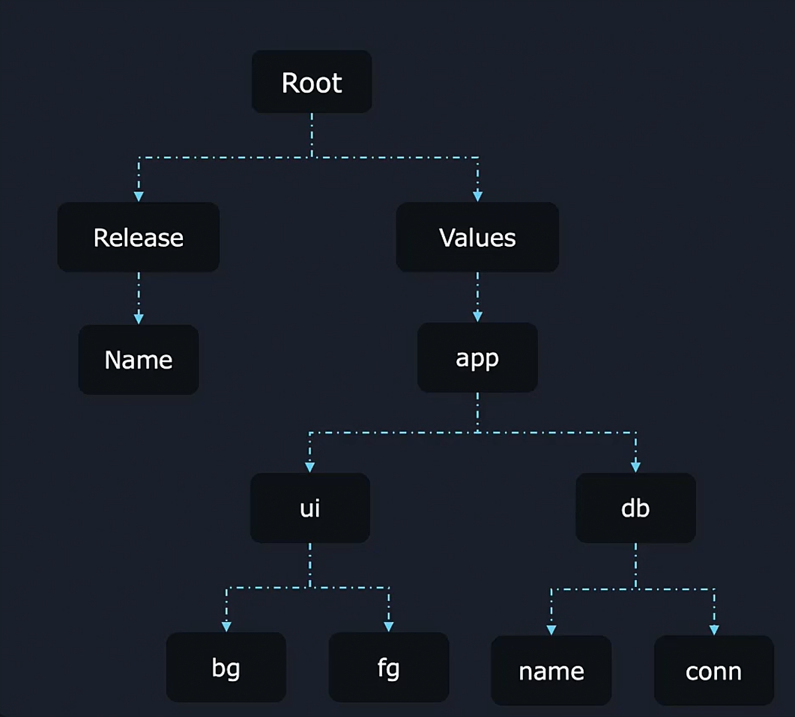

### **Understanding Scope in Helm Templates**  

In Helm, **scope** determines how variables are accessed within a template. The **dot (`.`)** represents the **current scope**, and Helm provides mechanisms like `with` blocks to modify scope for better readability.  


### **Example: Scope in `configmap.yaml`**  
Consider the following Helm template (`configmap.yaml`):  

```yaml
data:
  {{- with .Values.app }}
    {{- with .ui }}
    background: {{ .bg }}
    foreground: {{ .fg }}
    {{- end }}
    {{- with .db }}
    database: {{ .name }}
    connection: {{ .conn }}
    {{- end }}
  release: {{ $.Release.Name }}
  {{- end }}
```  

This template retrieves values from `values.yaml`:  

```yaml
app:
  ui:
    fg: 
    bg: 
  db:
    name: 
    conn: 
```  

### **Scope Hierarchy in Helm**  



1. **Root Scope (`.`)**
   - By default, Helm starts in the **root scope**, where `.Values`, `.Release`, and other global objects are accessible.  

2. **Using `with` Blocks to Set Scope**
   - The `with` block is used to change the **current scope**.  
   - Inside a `with` block, `.` refers to the specified path, eliminating the need for repetitive references.  


### **Breaking Down the Code**  

#### **Step 1: Setting Scope to `.Values.app`**  
```yaml
  {{- with .Values.app }}
```
- Here, the scope is set to `.Values.app`, so `.` now represents `app`.  
- All nested references inside this block are relative to `app`.  

#### **Step 2: Setting Scope to `.Values.app.ui`**  
```yaml
    {{- with .ui }}
    background: {{ .bg }}
    foreground: {{ .fg }}
    {{- end }}
```  
- The scope is now `.Values.app.ui`, so `.` represents `ui`.  
- Instead of writing `.Values.app.ui.bg`, we simply use `.bg`.  

#### **Step 3: Setting Scope to `.Values.app.db`**  
```yaml
    {{- with .db }}
    database: {{ .name }}
    connection: {{ .conn }}
    {{- end }}
```  
- The scope is now `.Values.app.db`, meaning `.` represents `db`.  
- `.name` refers to `app.db.name`, and `.conn` refers to `app.db.conn`.  

#### **Step 4: Accessing the Root Scope with `$`**  
```yaml
  release: {{ $.Release.Name }}
```  
- `$` is used to **return to the root scope** and access `.Release.Name`.  
- Since `Release.Name` is not part of `.Values.app`, using `$` ensures Helm retrieves it from the root.  


### **Key Takeaways**  
- **The `.` (dot) symbol** represents the **current scope** in a Helm template.  
- **By default, templates start at the root scope** (`.Values`, `.Release`, etc.).  
- **Use `with` blocks** to change scope and avoid repetitive references.  
- **Use `$` to access root-level values** inside `with` blocks.  

This approach keeps Helm templates **clean, readable, and maintainable**.