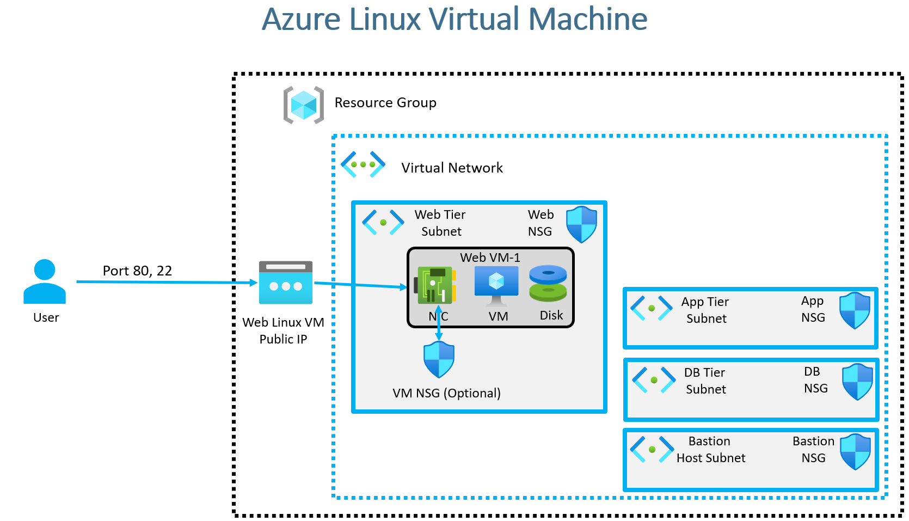
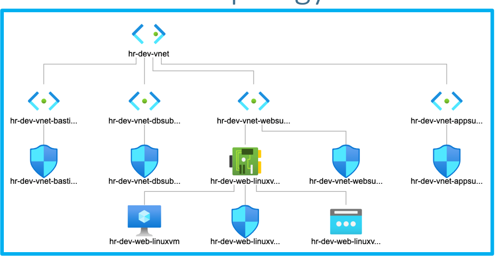

### "Real-World Demo 2"
- Objective 
    - A **four-tier virtual network** will be  created. (Real-World Demo 1)
    - Inside the **web subnet**, a **Linux virtual machine** will be deployed.
    - The VM will be **bootstrapped** with an **Apache web server**.

    

**Extra Resources to be Created**
The following Azure resources will be created using Terraform:
1. **Azure Public IP** : A public IP address will be assigned to the VM.
2. **Network Interface**  : The VM requires a **network interface (NIC)** to communicate within the virtual network.
3. **Linux Virtual Machine**  : A Linux VM will be deployed. During creation, the **underlying OS disk** will be automatically provisioned.
4. **VM Network Security Group (NSG)**   A **Network Security Group** will be created and associated with the network interface. This NSG will define security rules to allow access.
5. **Security Rules**
   - **Port 80**: Allows HTTP access to the web server.
   - **Port 22**: Allows SSH access to the VM.

**Infrastructure Topology**
- A **virtual network** with **four subnets**.
- A **network interface (NIC)** will be created inside the **web subnet**.
- The NIC will be **linked** to:
  - The **Linux VM**.
  - The **Network Security Group**.
  - The **Public IP**.
   

**Terraform Features Used**
The following Terraform functions and configurations will be utilized:

- **file function**: Reads file contents.
- **filebase64 function**: Reads and encodes files in Base64.
- **base64encode function**: Encodes a string to Base64.

---

#### **Terraform Manifest Organization**
- The **terraform-manifests** folder contains infrastructure definitions.
- The **app-scripts** folder contains provisioning scripts:
  - Example: `redhat-webvm-script.sh` for configuring the web server.
- Terraform manifests can either:
  - Use the script file.
  - Embed script contents in a **locals block**.
- **SSH Key Management** : SSH keys for VM access will be stored in the **SSH keys** folder.
