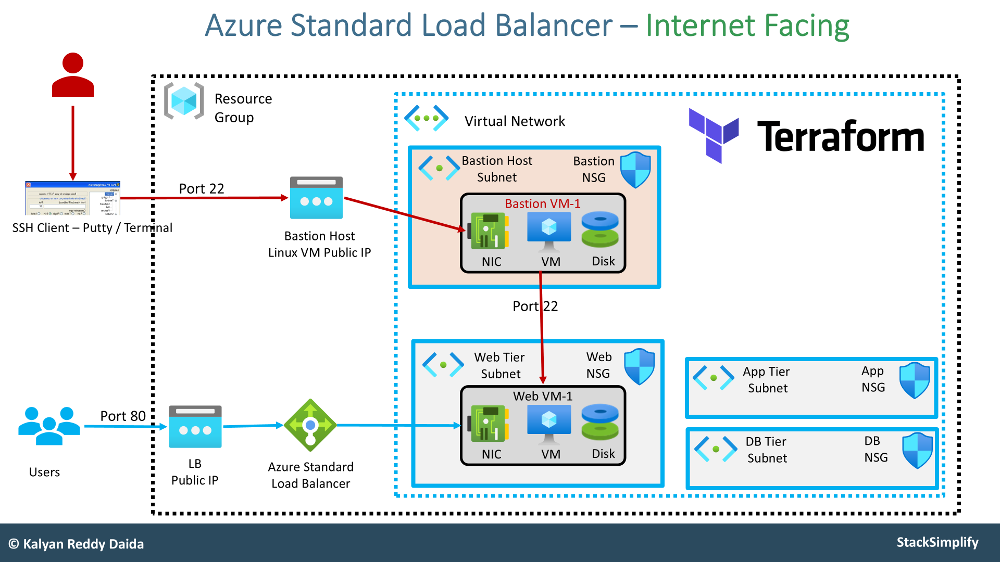

# **Azure Standard Load Balancer using Terraform**

This implementation involves provisioning an **Azure Standard Load Balancer** using Terraform while creating the necessary networking infrastructure, including virtual networks, subnets, network security groups (NSGs), and virtual machines.

### **Infrastructure Overview**
The following resources will be created:
1. **Resource Group**: A logical container for all the resources.
2. **Virtual Network (VNet)**: Contains multiple subnets for different tiers:
   - **Web Tier Subnet**
   - **Database (DB) Subnet**
   - **Application Tier Subnet**
   - **Bastion Host Subnet**
3. **Network Security Groups (NSGs)**: Each subnet will have its own NSG to control inbound and outbound traffic.
4. **Web Linux VM**:
   - Deployed in the **Web Tier Subnet**.
   - Named **Web VM-1**.
   - Configured with **custom startup scripts** to install a web server and create static web pages.
5. **Azure Standard Load Balancer**:
   - Configured with a **Public IP**.
   - Routes incoming traffic to the **Web VM-1**.
   - Uses **health probes** to check the status of backend VMs.
6. **Bastion Host**:
   - Deployed in the **Bastion Host Subnet**.
   - Used to connect securely to the Web VM via SSH.
   - Exposes a **Public IP** for SSH access.

### **Deployment Workflow**
1. **Create a Resource Group** to hold all resources.
2. **Provision a Virtual Network** with multiple subnets for different tiers.
3. **Deploy a Bastion Host**:
   - Assign a **Public IP**.
   - Create a **Network Security Group (NSG)** to allow SSH access.
   - Deploy a **Linux VM** in the **Bastion Host Subnet**.
4. **Deploy a Web Linux VM**:
   - Place it in the **Web Tier Subnet**.
   - Configure it to install a **web server** automatically.
5. **Create an Azure Standard Load Balancer**:
   - Assign a **Public IP**.
   - Define a **Backend Address Pool** to include **Web VM-1**.
   - Set up a **Health Probe** to monitor VM availability.
   - Configure **Load Balancing Rules** to distribute traffic.
   - Associate the **VM’s Network Interface (NIC)** with the **Backend Address Pool**.
6. **Enable SSH Access using the Bastion Host**:
   - The Web VM does not have a **public IP**, so SSH access is through the **Bastion Host**.
   - Connect to the Bastion Host via SSH (`PuTTY` or terminal).
   - From the Bastion Host, connect to **Web VM-1** and verify the web server.

### Azure LB Components
- LoadBlanacer
    - Frontend IP config
        - Public IP
    - Backend Pool
        - VMs
    - Health Probes
    - Load Balancing Rules
    - Inbound NAT Rules

### **Terraform Resources**
- **`azurerm_public_ip`**: Creates public IPs for the **Bastion Host** and **Load Balancer**.
- **`azurerm_lb`**: Deploys the **Azure Standard Load Balancer**.
- **`azurerm_lb_backend_address_pool`**: Defines the backend pool for the load balancer.
- **`azurerm_lb_probe`**: Configures a **health probe** to monitor the web server.
- **`azurerm_lb_rule`**: Sets up a **load balancing rule** for traffic distribution.
- **`azurerm_network_interface_backend_address_pool_association`**: Associates the **Web VM’s Network Interface (NIC)** with the Load Balancer’s backend pool.

### **Network Topology**
- **HR Dev Virtual Network (VNet)**:
  - **DB Subnet**
  - **Web Subnet** (Contains `HR-Dev-Web-Linux-VM`)
  - **App Tier Subnet**
  - **Bastion Subnet** (Contains `HR-Dev-VNet-Bastion-Host`)

- **Load Balancer Configuration**:
  - The **public IP** is assigned to the Load Balancer.
  - Traffic reaches the backend **Web VM** via the **backend address pool**.
  - The **health probe** monitors VM availability.
  - The **load balancing rule** directs traffic.

- **Bastion Host Configuration**:
  - Connected to the **Bastion Subnet**.
  - Has its own **public IP**.
  - Allows secure SSH access to the Web VM.

### **Azure Insights for Load Balancer**
- The **public IP** of the Load Balancer routes traffic.
- The **Load Balancer Rule** manages distribution.
- The **Backend Pool** contains Web VM-1.
- The **Health Probe** ensures Web VM-1 is responsive.

### **Conclusion**
This implementation establishes a highly available, secure, and scalable **Azure Standard Load Balancer** configuration using Terraform. By structuring resources effectively, the setup ensures efficient traffic management and secure access to backend VMs.