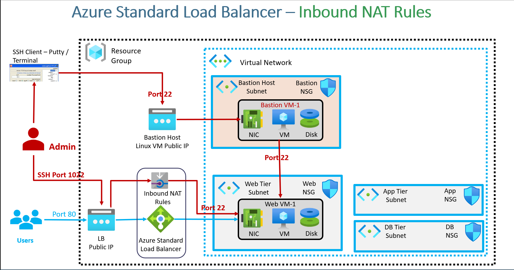

### **Azure Standard Load Balancer Inbound NAT Rules with Terraform**  

This section covers the implementation of **Azure Standard Load Balancer Inbound NAT Rules** using **Terraform**.  

#### **Overview of the Architecture**  

- The **Azure Standard Load Balancer** has a **public IP** assigned.  
- The **Bastion Host (Linux VM)** is accessible via **port 22** using an **SSH client** (e.g., Putty, Terminal).  
- The **Web VM-1** resides in a private subnet and is accessible via the **Bastion Host**.  
- Using **Inbound NAT Rules**, the Web VM-1 can also be accessed directly via the **Load Balancer’s Public IP** by assigning a unique external port (e.g., **1022**) that maps to the VM’s **port 22**.  

#### **Working of Inbound NAT Rules**  

1. The **Load Balancer Public IP** is assigned an **Inbound NAT Rule** that forwards requests from a unique **external port** (e.g., **1022**) to the VM’s internal **SSH port (22)**.  
2. The administrator can **SSH into the VM** directly using:  
   ```
   ssh -i private-key.pem user@<Load-Balancer-Public-IP> -p 1022
   ```
3. If multiple VMs need SSH access via the Load Balancer, separate **Inbound NAT Rules** with different external ports (e.g., **2022, 3022**) are configured.  
4. The **Terraform resources** to be created:  
   - `azurerm_lb_nat_rule`: Defines the NAT rule for port forwarding.  
   - `azurerm_network_interface_nat_rule_association`: Associates the NAT rule with the VM’s **network interface**.  

