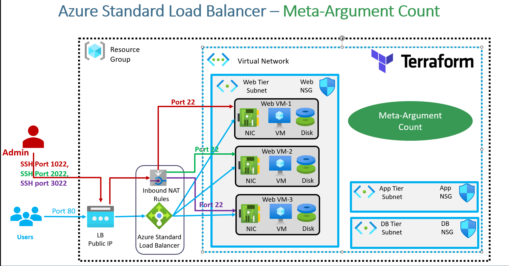

### **Implementing the `count` Meta-Argument in Terraform**  

This section focuses on **practically implementing the `count` meta-argument** by:  
- Creating **multiple VMs**  
- Associating those VMs with an **Azure Load Balancer**  
- Defining **multiple NAT rules** for SSH access  

### **Terraform Meta-Arguments Overview**  

Terraform provides several **meta-arguments** to control resource behavior:  
1. **`depends_on`** – Defines explicit resource dependencies.  
2. **`count`** – Creates multiple instances of a resource based on a specified number.  
3. **`for_each`** – Iterates over a set of values or maps to create multiple resources.  
4. **`provider`** – Specifies the provider for a specific resource.  
5. **`lifecycle`** – Manages resource lifecycle behavior (e.g., prevent deletion).  

This practical implementation focuses on the **`count` meta-argument** to dynamically create multiple resources.  

### **Understanding `count` vs `for_each`**  

Both `count` and `for_each` allow Terraform to create multiple instances of a resource. However, they have key differences:  

| Feature     | `count`  | `for_each`  |
|------------|---------|------------|
| **Data Type**  | List or numeric values | Set of values or maps |
| **Best Used For** | Simple replication | Complex resource creation with unique properties |
| **Indexing** | Access via `count.index` | Access via key-value pairs |

### **Associating Multiple VMs with a Load Balancer Using `count` in Terraform**  

This section focuses on implementing **`count` meta-argument** to:  
- Associate **multiple VMs with a Load Balancer backend pool**  
- Create **inbound NAT rules** for each VM  
- Use **splat expressions and the `element` function**  

### **Key Concepts and Terraform Adjustments**  

1. **Creating Multiple VMs Using `count`**  
   - The number of VMs is controlled using a variable.  
   - Each VM is assigned a **unique network interface**.  

2. **Associating VMs with Load Balancer Backend Pool**  
   - Each VM must be added to the Load Balancer **backend address pool**.  
   - This ensures that traffic is distributed among all VMs.  

3. **Defining NAT Rules for SSH Access**  
   - Each VM is assigned a unique **frontend port** for SSH access.  
   - NAT rules are dynamically created using `count`.  

4. **Using Terraform Expressions**  
   - **Splat expression (`[*]`)** – Used to handle lists efficiently.  
   - **`element` function** – Fetches values dynamically from a list.  

### **Key Takeaways**  

- The **`count` meta-argument** dynamically creates:  
  - **Multiple VMs**  
  - **Network interfaces**  
  - **Load Balancer associations**  
  - **NAT rules for SSH access**  

- **Terraform Expressions Used:**  
  - **Splat Expression (`[*]`)** – Efficiently handles lists.  
  - **`element` function** – Fetches specific values dynamically.  
  - **`count.index`** – Used for iteration and unique resource naming.  

This completes the implementation of **multiple VMs with Load Balancer integration using `count`**.
