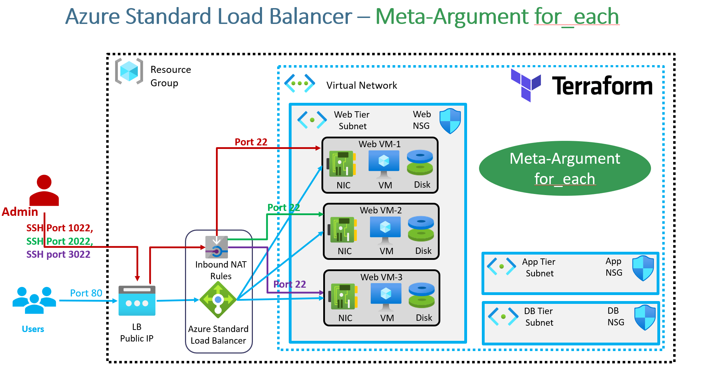

# Implementing Azure LB & Nat Rule with `for_each` and Maps in Terraform  

The same use case of deploying Azure Load Balancer & NAT Rule using the `count` meta-argument can also be implemented using `for_each` with maps. This section explains how `for_each` can be used to achieve the same infrastructure deployment while maintaining flexibility and better organization.

#### **Use Case Overview**  
- The deployment consists of **three to five VMs**.
- The VMs are configured with **inbound NAT rules**.
- A **standard Azure Load Balancer (ALB)** distributes traffic among the VMs.
- The VMs are associated with the **backend pool of the ALB**.
- Traffic on **port 80** is distributed across the web VMs, allowing access to a **static sample page**.
- Inbound NAT rules allow SSH access to specific VMs:
  - **Port 2022 → Web VM-1**
  - **Port 3022 → Web VM-2**
  - **Port 4022 → Web VM-3**

## **Understanding `for_each` Meta-Argument in Terraform**

In Terraform, `for_each` is a **meta-argument** used to create multiple instances of a resource dynamically based on a set or map. It provides more flexibility compared to `count`, especially when dealing with non-sequential resources.


**1. When to Use `for_each`**

Use `for_each` when:
- The number of resources is dynamic.
- You want to use a **map** or **set** to define the resources.
- You need **stable** keys (e.g., names instead of indices).

**2. Basic Syntax**

```hcl
resource "RESOURCE_TYPE" "RESOURCE_NAME" {
  for_each = MAP_OR_SET

  # Use each.key and each.value inside the resource
}
```
 **3. Example: Creating Multiple Virtual Machines in Azure**

- **Using `count` (Less Flexible)**
    ```hcl
    resource "azurerm_virtual_machine" "vm" {
    count = 3
    name  = "vm-${count.index}"
    }
    ```
    - This creates **3 VMs**, but if one is deleted, indices change.

- **Using `for_each` (More Flexible)**
    ```hcl
    variable "vms" {
        type = map(string)
        default = {
            "vm1" = "East US"
            "vm2" = "West US"
            "vm3" = "Central US"
        }
    }

    resource "azurerm_virtual_machine" "vm" {
        for_each = var.vms

        name     = each.key
        location = each.value
    }
    ```
    - If you remove `"vm2"`, Terraform only deletes **that specific VM** instead of reindexing all VMs.

**`for_each` vs `count`**

| Feature            | `count`                          | `for_each`                            |
|--------------------|--------------------------------|----------------------------------|
| Uses list indexing | ✅ Yes (count.index)            | ❌ No (Uses stable keys)         |
| Uses map/set keys  | ❌ No                          | ✅ Yes (each.key, each.value)    |
| Handles deletions  | 🚫 Can cause reindexing issues | ✅ Removes only the specific resource |
| Works with objects | 🚫 No                           | ✅ Yes                            |

**When to Use What?**

- **Use `count`** if working with **simple indexed lists**.
- **Use `for_each`** when working with **maps or sets**, especially if IDs, names, or attributes are important.

Would you like an example for a specific Terraform resource?


### **Comparison: `for_each` vs `count`**
| Feature       | `count` | `for_each` |
|--------------|--------|------------|
| Data Structure | List  | Map        |
| Indexing       | Uses `count.index` | Uses `each.key` and `each.value` |
| Resource Deletion | May cause issues when an item is removed | Handles resource changes more predictably |
| Best Used For | Uniform, indexed resources | Key-value structured data |


### **Conclusion**
By implementing **`for_each` with maps**, the infrastructure becomes:
- **More flexible**: Easily add or remove VMs without disrupting existing deployments.
- **Easier to manage**: Clearly structured data using maps.
- **More predictable**: Avoids issues with resource deletions that occur with `count`.

This approach ensures a **scalable and maintainable** deployment strategy for Azure VMs, inbound NAT rules, and load balancer configurations.