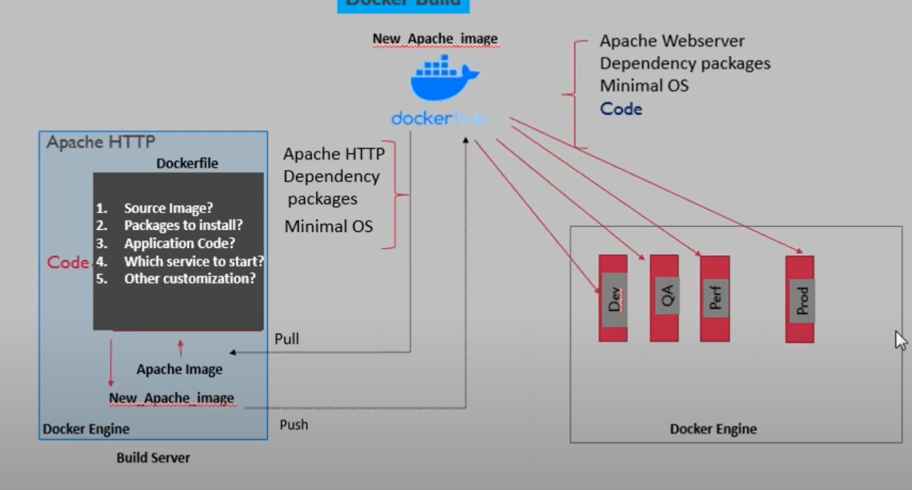

### Configuration to run an Application on Httpd manually

We followed the below steos to setup and run out application on httpd we server manually

- Create the build server using : `amazon linux 2022`
- Change user to root : `su - root`
- Install required packages ie httpd and git: 
    - `yum intsall httpd -y`
    - `yum install git -y`
- Clone the git repo vis http to the server. But private repositories cannot be cloned without a password. Hnec we need to provide the password when promted. Since we are moving towards automation , we cannot rely on prompts that require user intervention. Hence , we will be using the ssh method to clone the repo. To use ssh method for cloning , we need public and private keys to autheticate between the remote repo and git hosted on our server. The public keys goes to bitbucket and the private keys on our build server
    - Generate ssh keys :  `ssh-keygen -t rsa`
        - `ssh-keygen` will create all the required files automatically (ie `<user>/.ssh`, `id_rsa`,`id_rsa.pub`)
    - But for automation inside a container , you would need to create the keys on the build server itself and then move them inside the containers since if we create the keys on the container , we cannot copy them to bitbucket, hence we will have to create the necessary folders and give permissions explicilty on the build server itself
        - update permissions
            - `chmod -R root:root .ssh`
            - `chmod 700 .ssh`
            - `chmod 600 id_rsa`
    - Configure ssh public key in bitbucket
        - bitbucket > repo > repo settings -> access keys -> add public key
    - When we try to autheticate for the first time using public and private keys , we know it will aks for a prompt for the hosts to be added into the knownhosts file. To avoid the prompt we will it it manually before cloning via ssh
        - Add the repo domain to the knownhost files to avoid prompt when runing git clone :  `ssh-keyscan bitbucket.org >> /home/.ssh/known_hosts`
    - Clone repo on using ssh : `git clone <url>`
    - Copy the code to the web server root path
        - `cd <code dir>`
        - `cp -pr ./* /var/www/html`
    - Restart web server : `systemcl restart httpd`

### Building a Docker image using Dockerfile for above setup
Our goal now is to dockerize the entire process  and run the entier setup on a docker container . For that we will forst create adocker image and then use that image to run containers. We will analize the above steps and declare it in a proper format using a Dockerfile to create a docker image


**Dockerfile**
```Dockerfile
FROM amazonlinux

RUN yum install httpd -y
RUN yum install git -y

RUN mkdir /root/.ssh
COPY .id_rsa /root/.ssh (keys will not be created in dockerfile , its created locally and copied to the container )
RUN chown -R root:root /root/.ssh 
RUN chmod 700 /root/.ssh
RUN chmod 600 /root/.ssh/id_rsa
RUN ssh-keyscan bitbucket.org >> /root/.ssh/known_hosts

RUN git clone <url>
RUN cp -pr <code-dir>/* /var/www/html/
RUN systemcl start httpd
```

**Customizations**
```Dockerfile
FROM amazonlinux

RUN yum install httpd -y && \
    yum install git -y

RUN mkdir /root/.ssh
COPY .id_rsa /root/.ssh

RUN chown -R root:root /root/.ssh && \
    chmod 700 /root/.ssh && \
    chmod 600 /root/.ssh/id_rsa && \
    ssh-keyscan bitbucket.org >> /root/.ssh/known_hosts

RUN git clone <url> /var/www/html

CMD ["/usr/sbin/httpd","-D","FOREGROUND"]
```