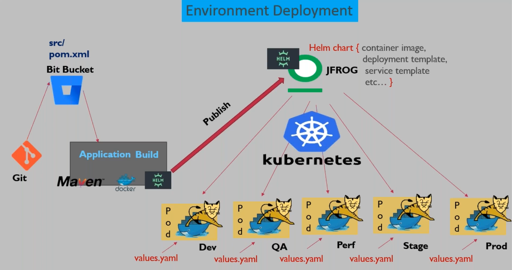

## HELM

- Deployment Challenges until now:
    - Initially, the deployment seemed straightforward compared to the build process, but now, complications have arisen due to the presence of multiple manifest files, essential for maintaining deployment and service configurations alongside additional files for ConfigMaps, namespaces, request limits, and health checks.
    - Environment-specific Deployments: Managing deployments across different environments such as development , test , and production has become challenging, requiring distinct configurations for each environment which caused
        - Struggle in managing deployments across different environments (e.g., development, production).
        - Risk of confusion arising from maintaining multiple manifest files for various environments.

**Helm** is an open-source CNCF graduated project , now known as the package manager for Kubernetes, focused on automating the Kubernetes applications lifecycle in a simple and consistent way. It is a is a third-party open-source solution that is not officially provided by Kubernetes
- **Helm** aims to simplify environment-specific deployments by minimizing manifest file redundancy, eliminating the need for maintaining multiple copies of manifest files for different environments, and empowering the use of a single manifest file template for deployment across various environments, serving as a templating and management tool for Kubernetes manifests.

### Helm Installation
- Note 
    - Helm client needs to be installed on the same machine which has the kubectl client is configured. Helm is a kind of a wrapper software on top of the kubectl client
    - When you are run Helm commands, the Helm will be connect to the kubectl client & will use the kubectl authentication pattern to connect to the API server*

Link [Docs](https://helm.sh/docs/intro/install/)
- Copy the link for the desierd binary from https://github.com/helm/helm/releases. For linis systems , we use `Linux amd 64`
```bash
# change to root
sudo su - root
# download the binar from the link
wget https://get.helm.sh/helm-v3.14.3-linux-amd64.tar.gz

# extract the tar 
tar -zxvf helm-v3.14.3-linux-amd64.tar.gz

# locate the helm binary inside the extracted folder & then
# move the helm binary to /usr/local/bin
mv Linux-amd64/helm /usr/local/bin

# verify helm
helm version
```

### Helm Charts
Helm uses a packaging format called charts. A chart is a collection of files that describe a related set of Kubernetes resources. A single chart might be used to deploy something simple, like a memcached pod, or something complex, like a full web app stack with HTTP servers, databases, caches, and so on.
Charts are created as files laid out in a particular directory tree. They can be packaged into versioned archives to be deployed

- Helm Commands
    ```bash
    # create a simple helm directory structure
    helm create <dir-name>

    # package helm dir to helm chart
    helm package <chart-name>
    ```

Helm mandates a specific directory structure for organizing manifest files. Below is the directory structure that the Helm is expecting. 
```scss
my-chart/
├── charts/
│   └── (dependency charts)
├── templates/
│   └── deployment.yaml
│   └── service.yaml
├── values.yaml
├── Chart.yaml
└── (other files and directories)
```
- **my-chart/**: This is the root directory of your HELM chart. It contains all the files and directories related to your chart.
- **charts/**: This directory is used to store dependencies of your chart. If your chart depends on other charts (specified in your `Chart.yaml` file), they will be downloaded and stored in this directory. Each dependency will have its own subdirectory within `charts/`.
- **templates/**: This directory contains templates for Kubernetes manifest files (YAML) that define the resources needed to run your application on a Kubernetes cluster. Each template typically represents a Kubernetes resource such as a deployment, service, ingress, etc.
    - **deployment.yaml**: This is a template file for a Kubernetes deployment resource. It defines how your application should be deployed, including container specifications, replicas, labels, etc.
    - **service.yaml**: This is a template file for a Kubernetes service resource. It defines how your application should be exposed within the cluster, including the type of service (ClusterIP, NodePort, LoadBalancer), ports, selectors, etc.
- **values.yaml**: This file contains default configuration values for your chart. These values are used to parameterize your templates and can be overridden during installation or upgrade. Users can customize the behavior of your chart by providing their own `values.yaml` file with modified values.
- **Chart.yaml**: This file provides metadata about your chart, including the name, version, description, and maintainers. It's used by HELM to identify and manage your chart. The `Chart.yaml` file also specifies dependencies on other charts, if any.
-  **(other files and directories)**: This may include additional files or directories relevant to your chart, such as script files, documentation, tests, etc.

When you provide the above configuration files to Helm, it creates a "Helm Chart. It is a compressed or packaged format of your manifest files. Helm takes all of these files, compresses them into a single .tgz file, and that file is what we refer to as a "Helm chart". It's also called a Helm artifact.

To create a Helm chart, you start by organizing your deployment manifest files in the above directory structure. Then, you specify the details of your chart in a file called `Chart.yaml`. In this file, you define the name and version of your Helm chart. After setting up your manifest files and chart details, you hand them over to Helm. Helm then packages everything into that single .tgz file

- Advantages 
    - it simplifies environment-specific deployment.
    - it eliminates the need to carry around multiple manifest files for multiple environments or applications.
    - This single file contains all the necessary information for deploying your application, making the process much more streamlined and manageable.

- **Starting a new Helm chart requires one simple command:**
    ```bash
    # create a helm chart template
    helm create <chartname>

    # view the directory structure
    tree <chartname>
    ```

# Sample Helm Chart
Git Repo : https://bitbucket.org/dptrealtime/kubernetes/src/master/helm/dpt-helm-sample/

- `Chart.yaml`: this file contains metadata about your HELM chart.
    - **apiVersion**: Specifies the version of the HELM chart format. In this case, it's `v2`, which is the current version of the HELM chart format being used.
    - **name**: Specifies the name of the chart. In this case, it's `dpt-web-app`.
    - **description**: Provides a brief description of the chart. It describes the purpose or functionality of the Kubernetes application that this chart represents. In this case, it's "A Helm chart for Kubernetes".
    - **version**: Specifies the version of the chart. This is distinct from the `appVersion` and is used to track changes to the chart itself rather than the application it deploys. In this case, it's `1.0`.
    - **appVersion**: Specifies the version of the application being deployed by the chart. This field is optional and may not always be present. It allows you to specify the version of the application code or release that the chart is designed to deploy. In this case, it's `"1.16.0"`.
- `templates/deployment.yaml` & `templates/nodePort.yaml` : These file contains the actual manifest files for our kuberetes resources. Whatever values that we need to parameterise in the maneifest files, we specify them in a specific format. For example in the deployment.yaml , the value in replicas is replaced by a varible defined as `  replicas: {{ .Values.deployment.replicaCount }}`. Simillary in the nodeport.yaml we have added a placeholder for the actual value in the ports section. The actual values are read from `values.yaml` file.
    ```yaml
    ports:
    - nodePort: {{ .Values.service.nodePort }}
        port: {{ .Values.service.port }}
        targetPort: {{ .Values.service.targetPort }}
    ```
- `values.yaml` : The values that you have not supplied in the manifest file, the values that you are expecting to be changing from environment to environment, those values you need to keep in a separate file called `values.yaml`.This file conatins that actual values that the placeholder variables refer to in the anifest files.The values are read from these files and replaced in the ctual file while deployment
- Sytnax for adding a placholder value from the values.yaml file
` {{ .<values.yaml-file-name>.<Key-1>.<key-2><key-n>}}`
    - the `.` represents present working diretory , then we need to provide the name of the values.yaml file , then the key to react the actual value

- `The values.yaml is never a part of the actual helm chart/artifact`. In real world senarios , the helm chart is packaged into a .tgz file and it only contains the templates and placeholder variable but not the actual `values.yaml`. All the files except the values.yaml is packages and moved around to be deployed in differenet environments , hence they do not contains the `values.yaml` file. The environment specific `values.yaml` file is supplied to the chart during the time of deployment


- Package the HELM directory into a chart:
    -  `helm package <directory-name>`
- Deploying the HELM chart
    - To deploy the manifest files into a kuberetes cluster , we first need to make sure that we have the helm chart .tgz file.
    - Once you have the helm chart, run the below command. the -f flag is used to specifi the valuesyaml file that has the actual values for the spcific env 
    ```bash
    helm install <chart-name> <chart.tgz-name> -n <k8-namespace> -f <custom-values.yaml>
    # example
    helm install dev-app dpt-web-app.1.tgz -f dev-values.yaml
    helm install qa-app dpt-web-app.1.tgz -f qa-values.yaml
    ```
    - When you run the above commands , all the manifest files will be applieed to the namespace provided. the placedholder values will be replaced from the actual values.yaml file you provide with the -f flag

## Environment Deployments

Let's discuss how we handle environment-specific deployments. The process keeps evolving. Initially, we deployed the WAR file directly. Later, we transitioned to deploying it as a container image using Docker commands. Subsequently, we moved to deploying it in Kubernetes as a pod. Now, we're utilizing Helm, which marks a different transition. In the final state, when developers have finished coding and committed their changes to Bitbucket repository, we find the Java source code available under the SRC. The pom.xml file maintains dependencies and other Maven build information. At this point, the DevOps engineer steps in to handle the build and deployment process.

As a DevOps engineer, the first step is to fetch the code from the Bitbucket repository and initiate the build process. Maven build generates an artifact, such as a WAR or JAR file. Next, this artifact is used to create a Docker container image following the Docker build process. During this process, ensure that the Maven artifact is injected into the new container image using a Dockerfile. Once the image is ready, proceed with building the Helm chart.

After the image is available in the Docker Hub registry, begin writing Kubernetes manifest files. In these manifest files, specify the container image for deployment along with other deployment-specific instructions. Consolidate these files into a single Helm chart, making sure to externalize environment-specific values as variables. This Helm chart serves as a generic template for deployment across different environments.

Now, the Helm chart needs to be deployed to various environments. This whole thing is the build process. The outcome if this Build process is a HELM Charts

Once the build process is completed , we need to deploy the helm chart in all of the envs/k8 scluster. Regarding the storage of the Helm chart, just as Docker images are stored in a Docker Hub registry, the Helm chart should be deployed to a remote JFrog artifact repository. JFrog acts as a specialized tool for artifact management, allowing easy storage and resolution of artifacts wherever needed. To preoceed with the deployment ,  we first publish the Helm chart to a JFrog artifact repository. Then, start deploying the Helm chart to the Kubernetes cluster, we Begin by downloading the Helm chart from JFrog and deploy it the clusters/namespaces. Repeat this process for QA and other environments as needed, ensuring that environment-specific values are supplied during deployment.


The complete build process involves preparing a Helm chart as the final outcome. This Helm chart should be published to a JFrog repository for easy access during deployment. Once available in JFrog, the Helm chart can be deployed to different environments, with environment-specific values supplied during deployment.
Additionally, JFrog offers benefits such as version control for artifacts, similar to how Bitbucket handles code versioning. Each tool, whether it's Bitbucket, S3, or JFrog, serves a specific purpose, such as versioning code changes or managing artifact versions.
JFrog supports storing various types of artifacts, including Helm charts, Docker images, and Maven artifacts. While I've primarily focused on Helm integration, JFrog's versatility allows it to handle different types of artifacts effectively.

