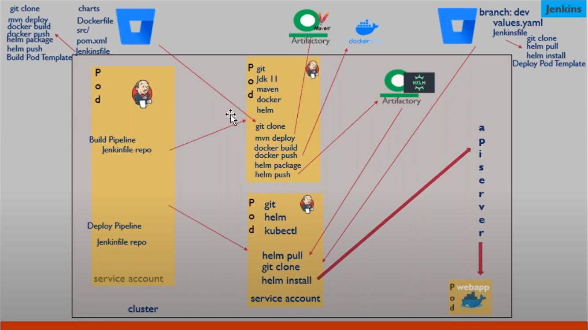

- our Jenkins master is currently running as a pod

## Builiding and Deploying the Java Login App to Kubernetes through Jenkins Setup on Kubernetes
Here is a high level overview of the steps involved

0. Source code ( https://falcon646@bitbucket.org/falcon646/dpt06-login-integration-jenkins.git)
1. Build Process
    - Create a dynamic jenkins agent pod in k8 whenever we need to do a build process
        - Create a Image for the build agent pod (dockerfile is in Session 46)
        - Build image and push to docker registry
    - Install Kubernetes Plugin for Jenkins and configure it (session 46)
    - Build Steps required are:
        - mvn deploy (needs jfrog crenatials , jfrog repo for deployment and another one for resolution)
        - docker build
        - helm chart
        - helm push