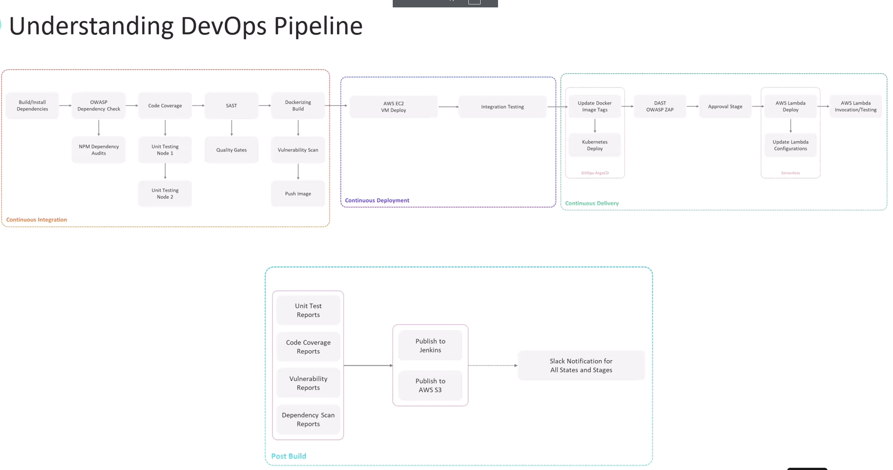

# **Overview of the DevOps Pipeline Implementation**

This section outlines the DevOps pipeline that will be implemented throughout this course. The pipeline covers various stages, including **Continuous Integration (CI), Continuous Deployment (CD), Continuous Delivery (CD), and Post-Build Operations**.

## **DevOps Pipeline Structure**
The pipeline consists of the following major phases:

1. **Continuous Integration (CI)**
2. **Continuous Deployment (CD)**
3. **Continuous Delivery (CD)**
4. **Post-Build Operations**

Each phase is composed of multiple **automated stages**, ensuring that the application is properly built, tested, secured, and deployed.

## **1. Continuous Integration (CI)**
The pipeline follows the **feature branch approach**, meaning:
- Developers create **feature branches** from the **main branch**.
- Changes are made within these feature branches.
- When changes are pushed to the feature branch, **Jenkins triggers the CI pipeline**.

### **Stages**
1. **Installing Dependencies**  : Since the project is a **Node.js application**, dependencies are installed using `npm install`.

2. **Dependency Vulnerability Checks**  : Uses **OWASP Dependency-Check** and **NPM Audit** to detect security vulnerabilities.

3. **Unit Testing & Code Coverage**  : Runs **unit tests** and measures **code coverage**.

4. **Static Code Analysis**  
   - Uses **SonarQube** for **static code analysis**.  
   - A **quality gate** is integrated to enforce code quality standards.  
   - If the quality gate fails, the Jenkins build also fails.

5. **Containerization**  
   - Builds a **Docker image** for the application.  
   - Runs a **security vulnerability scan** using **Trivy**.  
   - If no critical vulnerabilities are found, the image is pushed to a **container registry** (such as AWS ECR).

## **2. Continuous Deployment (CD)**
After the **Docker image** is pushed to the container registry, the application is deployed to AWS.

### **Stages**
1. **Deploying to AWS EC2** : Runs the **Docker container** on an **Amazon EC2 instance**.

2. **Integration Testing** : Validates application accessibility and endpoint functionality.

3. **Pull Request & Review**
   - Developers create a **pull request (PR)** to merge the feature branch into the **main branch**.
   - The PR is reviewed before proceeding to the **continuous delivery stage**.

## **3. Continuous Delivery (CD)**
After the PR is approved and merged into the **main branch**, the **CD pipeline** is triggered.

### **Stages**
1. **Deploying to Kubernetes (K8s)**
   - Uses **Kops** to deploy the application to a Kubernetes cluster.
   - **Argo CD** is integrated to handle continuous delivery.
   - Updates **Docker image tags** in Jenkins, which Argo CD picks up to deploy.

2. **Dynamic Application Security Testing (DAST)** : ses **OWASP ZAP** to perform security testing on the deployed application.

3. **Final PR Merge & Approval**
   - The PR is reviewed by **admins or product leads**.  
   - If approved, it triggers another pipeline stage.

4. **Deploying to AWS Lambda**
   - The application is deployed to **AWS Lambda**.  
   - Updates **Lambda configurations**, such as **environment variables** and **function URL settings**.

5. **Lambda Function Testing**
   - Executes test invocations to ensure endpoints are accessible.

## **4. Post-Build Operations**
After all deployment stages are complete, **post-build tasks** are executed.

### **Post-Build Stages**
1. **Collecting Reports**  
   - Gathers various reports:
     - **Unit test results**
     - **Code coverage**
     - **Dependency scan reports**
     - **Vulnerability reports**
   - These reports are **archived in Jenkins** and **uploaded to Amazon S3**.

2. **Slack Notifications**  
   - Integrates **Jenkins with Slack** to notify about:
     - **Build failures**
     - **Successful deployments**

## **Deployment Targets**
The pipeline showcases  depoying to **three different deployment targets**:
1. **AWS EC2 instance**
2. **Kubernetes cluster**
3. **AWS Lambda**

>  In real-world scenarios, deploying to multiple targets simultaneously is uncommon.  
> The goal here is to **demonstrate different deployment possibilities using Jenkins pipelines**.

