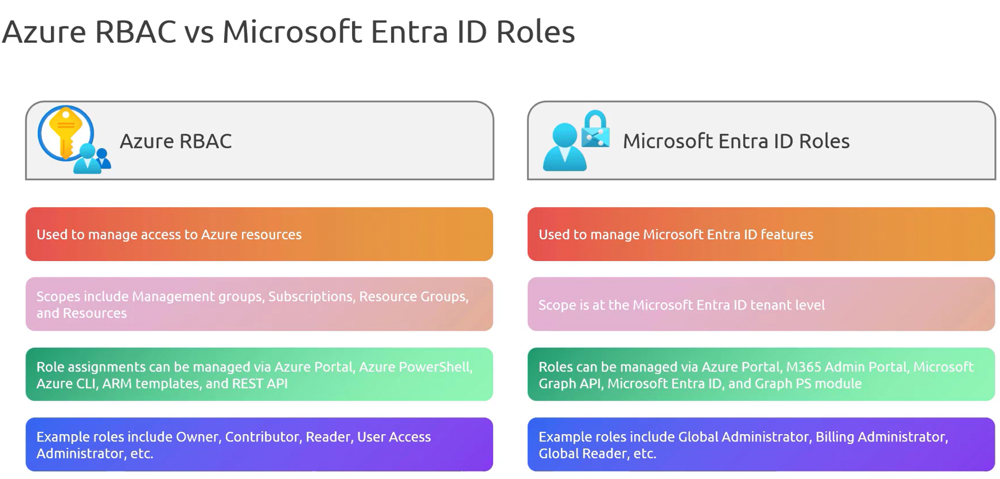
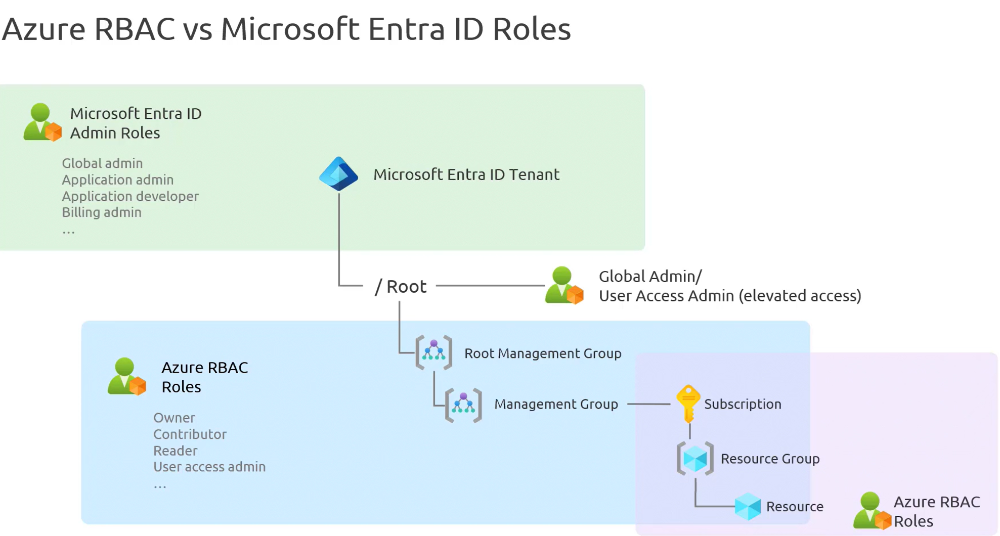

### **Azure RBAC vs. Microsoft Entra ID Roles**  

In Azure management, **access control** is essential. Two primary tools for managing permissions are **Azure RBAC (Role-Based Access Control)** and **Microsoft Entra ID roles**. Each serves a distinct purpose in controlling access across Azure and beyond. A side-by-side comparison helps in understanding their scope and applications.  

**1. Purpose of Azure RBAC and Microsoft Entra ID Roles**  
| Feature                | **Azure RBAC** | **Microsoft Entra ID Roles** |
|------------------------|---------------|-----------------------------|
| **Primary Purpose**    | Manages access to **Azure resources** (e.g., Virtual Machines, Databases, Subscriptions). | Governs access to **Microsoft Entra ID features** (e.g., users, groups, privileged identity management). |
| **Scope of Permissions** | Resource-level access within **Azure ecosystem**. | Tenant-wide access across **Microsoft Entra ID services**. |

**2. Scope of Role Assignments**  
- **Azure RBAC** allows assigning permissions at various levels:  
  - **Management Group**  
  - **Subscription**  
  - **Resource Group**  
  - **Individual Resources (e.g., VM, Storage, Database, etc.)**  
- **Microsoft Entra ID Roles** are applied at the **tenant level** and affect all resources within the tenant.  

This distinction makes **Azure RBAC more granular**, allowing access control at multiple levels, while **Microsoft Entra ID roles** apply broadly to the **entire tenant**.  

**3. Role Management Methods**  
- **Azure RBAC**
    - **Azure Portal**
    -  **PowerShell (Azure CLI, REST API, ARM Templates)** 
    - **Scripting & Automation Supported**
- **Microsoft Entra ID Roles**
    - **Azure Portal**
    -  **M365 Admin Portal, Microsoft Graph API**
    - **Microsoft Graph PowerShell Module Available**

**Examples of Built-in Roles**  
- **Azure RBAC Roles:**  
  - **Owner** – Full access to manage resources and delegate permissions.  
  - **Contributor** – Can manage resources but cannot assign roles.  
  - **Reader** – Read-only access to Azure resources.  
  - **User Access Administrator** – Can assign roles but cannot manage resources.  

- **Microsoft Entra ID Roles:**  
  - **Global Administrator** – Full access to Microsoft Entra services.  
  - **Billing Administrator** – Manages billing and financial operations.  
  - **Global Reader** – Read-only access without permission to modify configurations.  

### **Hierarchy of Microsoft Entra ID Roles and Azure RBAC**  

In Azure, a **standard hierarchy** integrates both **Microsoft Entra ID roles** and **Azure RBAC** to establish a structured access control model. Understanding this hierarchy ensures clarity on how permissions are assigned and inherited across different levels.  

**1. Microsoft Entra ID Tenant (Top Level)**  
- Every **Azure subscription** must be associated with a **Microsoft Entra ID tenant**.  
- At the **root of the tenant**, **Microsoft Entra ID roles** are assigned.  
- These roles include:  
  - **Global Administrator**  
  - **Application Administrator**  
  - **Developer**  
  - **Billing Administrator**  
  - **SharePoint Administrator**  
  - **Teams Administrator**  

📌 **Key Feature:**  
The **Global Administrator** can **elevate access** from the root level using a switch in the **Azure Portal**. This enables access across both **Microsoft Entra ID and Azure subscriptions**, even without an explicit **Azure RBAC role**.  

**2. Root Management Group (Azure RBAC Governance Starts Here)**  
- Directly under the **Microsoft Entra ID tenant**, the **Root Management Group** governs **Azure RBAC permissions**.  
- This level does not use **Microsoft Entra ID roles** but is managed through:  
  - **Owner**  
  - **Contributor**  
  - **Reader**  

**3. Management Groups, Subscriptions, and Resources**  
Within the **Root Management Group**, the **Azure hierarchy** follows:  
1. **Management Groups** (for organizing multiple subscriptions).  
2. **Subscriptions** (billing and access management).  
3. **Resource Groups** (logical grouping of resources).  
4. **Individual Resources** (VMs, databases, networks, etc.).  

Each level strictly follows **Azure RBAC permissions** for access control.  

📌 **Key Concept: RBAC Scope**  
- If a role is assigned at the **Management Group** level, it propagates down to **Subscriptions, Resource Groups, and Resources**.  
- A **Microsoft Entra Billing Administrator** at the **tenant level** cannot automatically access subscription-level billing unless an **RBAC role is assigned at the Subscription scope**.  

### **Summary of Role Application**  
| **Hierarchy Level** | **Governing Role Type** | **Examples of Roles** |
|---------------------|------------------------|------------------------|
| **Microsoft Entra ID Tenant** | **Microsoft Entra ID Roles** | Global Administrator, Application Administrator, Billing Administrator |
| **Root Management Group** | **Azure RBAC** | Owner, Contributor, Reader |
| **Management Groups** | **Azure RBAC** | Owner, Contributor, Reader |
| **Subscriptions** | **Azure RBAC** | Owner, Contributor, Billing Reader |
| **Resource Groups** | **Azure RBAC** | Resource-specific roles (e.g., Virtual Machine Contributor) |
| **Resources** | **Azure RBAC** | Fine-grained resource roles (e.g., Storage Blob Reader) |

### **Key Differences and Summary**  
- **Microsoft Entra ID roles manage identity-related access** at the **tenant level**.  
- **Azure RBAC manages resource-specific access** at **Management Group, Subscription, Resource Group, and Resource levels**.  
- **Global Administrators can elevate access** to control both **Microsoft Entra ID and Azure subscriptions**.  
- **RBAC follows an inheritance model**, where permissions assigned at a higher level propagate downward.  
- **Billing permissions differ** between **Microsoft Entra ID (tenant-level)** and **Azure RBAC (subscription-level)**.  
- **Azure RBAC is resource-focused**, controlling access within the **Azure ecosystem**.  
- **Microsoft Entra ID Roles govern identity and directory-related permissions** at the **tenant level**.  
- **RBAC supports granular role assignments**, whereas **Entra ID roles apply to the entire directory**.  
- **Azure RBAC roles are managed via Azure Portal, CLI, and APIs**, while **Microsoft Entra ID roles use Azure Portal, M365 Admin Portal, and Microsoft Graph API**.  
