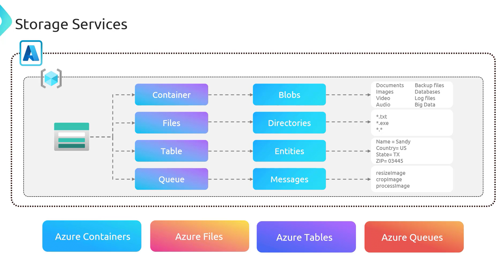
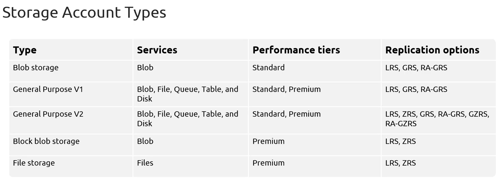

# **Azure Storage Accounts**  

Azure **Storage Accounts** serve as the foundation for **secure, scalable, and resilient** cloud storage within the **Azure ecosystem**. These accounts provide various storage options tailored for **different data types and workloads**.  

- **Key Benefits of Azure Storage Accounts**  
    - **High Availability and Durability**  
        - Storage accounts offer **redundancy options** to ensure data durability.  
        - Data can be **replicated across different data centers** or even **multiple regions** to maintain high availability.  
        - Example: If a company stores customer invoices in Azure, even if one data center fails, the data is still accessible from a backup.
    - **Data Security**  
        - **All stored data** is **encrypted by default** using **Storage Service Encryption (SSE)**.  
        - Multiple **authentication methods** are supported, including:  
            - **Storage account keys**  
            - **Shared Access Signatures (SAS)**  
            - **Microsoft Entra ID**  
        - Example : A healthcare app storing patient records is protected from unauthorized access using Microsoft Entra ID (Azure AD) authentication.
    - **Scalability and Managed Service**  
        - **Azure Storage is fully managed**, automatically scaling based on **capacity and performance** needs.  
        - Example : A startup's mobile app needs to store thousands of images daily—Azure Storage expands as needed.
        - Supports **multiple access methods**:  
            - **HTTP/HTTPS protocols**  
            - **SDKs for multiple programming languages**  
            - **Azure CLI, PowerShell, and REST APIs** for automation and scripting  

**Azure Storage Performance Tiers**  
- Azure provides two primary **performance tiers** for **storage accounts**:  
    - **Standard Tier**  
        - **Backed by HDD-based storage** (magnetic drives)  
        - **Cost-effective** for workloads that do not require high performance  
        - Suitable for **general-purpose applications, backups, and archives**  
    - **Premium Tier**  
        - **Backed by SSD-based storage** (solid-state drives)  
        - **Optimized for low latency and high throughput**  
        - Best suited for **databases, high-performance computing (HPC), and latency-sensitive applications**  
- A blog website stores images in Standard storage, while a stock trading system uses Premium storage for faster performance.

## **Azure Storage Use Cases**  
- **Virtual Machine Storage**  
    - Provides **disk storage** for **Azure Virtual Machines (VMs)**.  
    - Supports **OS disks, data disks, and temporary disks**.  
- **Unstructured Data Storage**  
    - Optimized for storing **large amounts of unstructured data** such as:  
    - **Text and binary files**  
    - **Media files (videos, images, audio)**  
    - **Application installers**  
    - **Azure Blob Storage** is the preferred solution for unstructured data.  
- **Structured Data Storage**  
    - Supports **structured, queryable data** in NoSQL format.  
    - **Azure Table Storage** provides a **key-value store** for storing:  
        - **User profiles**  
        - **Application metadata**  
        - **Device information**  

### **Azure Storage Services**  

Azure Storage provides a variety of services designed to meet different storage needs. Each service is optimized for a specific use case, allowing users to choose the best solution for their requirements.  
To utilize Azure Storage, a **storage account** is created within a **resource group**. This account serves as the foundation for managing different storage services.  

- **1. Blob Storage (Containers in Azure)**  
    - **Blob Storage** is ideal for storing **unstructured data**, including **documents, images, videos, and audio files**.  
    - A **real-world example** is a **media hosting service** that stores user-uploaded videos and photos in Blob Storage.  
    - Files are stored as **blobs** inside **containers**, which function like directories within the storage account.  
    - Example: A cloud-based photo storage app stores user-uploaded images and videos in Azure Blob Storage.

- **2. Azure Files**  
    - **Azure Files** provides a **fully managed file-sharing service** accessible via the **SMB protocol**.  
    - It functions **like a traditional file server**, offering **shared access** to files and directories.  
    -  **Example use case**: A company may use **Azure Files** to store and share **documents, text files, or executable files (EXE)**, allowing employees to collaborate from anywhere.  

- **3. Table Storage (NoSQL Storage)**  
    - **Azure Table Storage** is a **NoSQL storage solution** designed for structured data.  
    - Data is stored in **entities**, which are similar to rows in a database table.  
    - **Example use case**: An application collecting **user information** (such as **name, address, and contact details**) can use **Azure Table Storage** for **scalable and cost-effective storage**.  

- **4. Queue Storage**  
    - **Queue Storage** is used for storing **large numbers of messages**, which can be accessed globally over **authenticated HTTP or HTTPS calls**.  
    - **Example use case**: A **video processing service** can use **Azure Queues** to manage video encoding tasks. When a video is uploaded, a message is sent to the queue, and a background process picks up the message to process the video.  

### **Azure Storage Account Types**  

Azure provides different storage account types to meet various needs, each offering specific **services, performance tiers, and replication options**.  

#### **1. Blob Storage Account**  (→ Supports Only Blob Storage)
- Designed specifically for **storing unstructured data** such as **images, documents, audio, and video files**.  
- Operates under the **Standard performance tier**.  
- Supports replication options:  
  - **Locally Redundant Storage (LRS)**  
  - **Geo-Redundant Storage (GRS)**  
  - **Read Access Geo-Redundant Storage (RA-GRS)**  
  - Services supported
    - Blob Storage (Block Blobs, Append Blobs, Page Blobs).
    - No Tables, Queues, or Files.
    - Best for: Object storage for large files (e.g., backups, media).

#### **2. General Purpose V1 (GPv1) Account**  (→ Supports Everything)
- The **first version** of Azure storage accounts, providing access to **all storage services**, including **Blobs, Files, Queues, Tables, and Disks**.  
- Available in **Standard** and **Premium** performance tiers.  
- Supports replication options:  
  - **LRS (Locally Redundant Storage)**  
  - **GRS (Geo-Redundant Storage)**  
  - **RA-GRS (Read Access Geo-Redundant Storage)**  

#### **3. General Purpose V2 (GPv2) Account**  (→ Supports Everything)
- The **recommended** and most **versatile** storage account type.  
- Supports the same services as GPv1 but offers **additional performance and replication options**.  
- Supports replication options:  
  - **Zone-Redundant Storage (ZRS)**  
  - **Geo-Zone Redundant Storage (GZRS)**  
  - **Read Access Geo-Zone Redundant Storage (RA-GZRS)**  
  - Services that cane be used (Supports all Services)
    - Blob Storage (Object storage for images, videos, backups).
    - Azure Files (SMB/NFS file shares for applications).
    - Tables (NoSQL key-value store for structured data).
    - Queues (Message queue for async processing).
    - Managed Disks (Used for Virtual Machines).
        - Best for: Most common workloads (recommended default choice).

#### **4. Block Blob Storage Account**  (→ Supports Only Block Blobs & Append Blobs)
- Optimized for **Block Blobs** and **Append Blobs**, making it suitable for **text and binary data storage**.  
- Available under the **Premium performance tier**, ensuring **higher throughput and lower latency**.  
- Supports replication options:  
  - **LRS (Locally Redundant Storage)**  
  - **ZRS (Zone-Redundant Storage)**  
  - Suports 
    - Block Blobs (Used for streaming, backups).
    - Append Blobs (For logging, event storage).
    - No Tables, Queues, or Files.
    - Best for: High-performance blob storage for analytics or logging.

#### **5. File Storage Account**  (→ Supports Only Azure Files)
- Specifically designed for **Azure File Shares**, making it ideal for **lift-and-shift scenarios** where applications rely on file sharing.  
- Available in the **Premium tier**, offering **high throughput and low latency**.  
- Supports replication options:  
  - **LRS (Locally Redundant Storage)**  
  - **ZRS (Zone-Redundant Storage)**  

