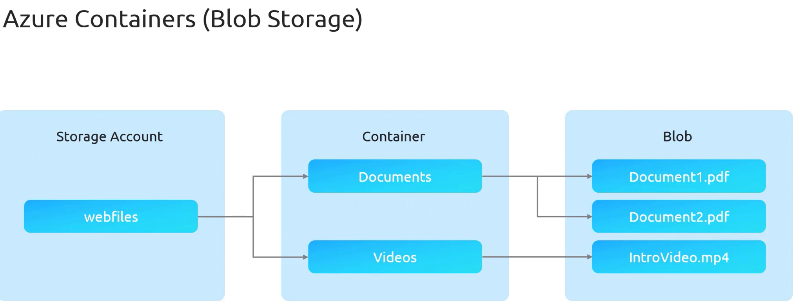

### **Configuring Azure Blob(containers) Storage**  

Azure Blob Storage is a service designed for storing large amounts of unstructured data, such as text or binary data. It enables global access via **HTTP** or **HTTPS** and supports a variety of use cases, including:  
- Hosting images or documents for web applications  
- Storing files for distributed access  
- Streaming video and audio  
- Logging and telemetry storage  
- Backup, restore, disaster recovery, and archiving  

### **Azure Storage Structure**  

Azure Storage is organized hierarchically into three main components:  

- **Storage Account**  
   - The base-level entity where **access keys** and **storage properties** are defined.  
   - Provides a globally unique **namespace** in Azure.  
   - Example: `webfiles` represents a storage account.  

- **Containers**  
   - A logical grouping of **blobs**, similar to a directory in a file system.  
   - All blobs reside within a container, and container policies define blob access.  
   - Example: `documents` and `videos` are containers within the `webfiles` storage account.  

- **Blobs**  
   - The actual data stored within a container. Blobs can be of **any type and size**.  
   - Example: PDF files under `documents`, MP4 files under `videos`.  

### **Types of Blobs in Azure Storage**  

Azure Blob Storage supports three types of blobs:  

1. **Block Blobs**  
   - Used for storing text and binary data.  
   - Can be **up to 4.75 TB** in size.  
   - Composed of individual blocks, which can be managed separately.  
   - Example: `document1.pdf` and `document2.pdf`.  

2. **Append Blobs**  
   - Optimized for **append operations**, making them ideal for logging scenarios.  
   - Designed for **sequential writes** without modifying existing content.  
   - Example: An application writing log entries to an append blob.  

3. **Page Blobs**  
   - Used for scenarios requiring **frequent read/write operations**.  
   - Supports **up to 8 TB** in size.  
   - Primarily used for **virtual hard disk (VHD) files** for Azure Virtual Machines.  

### **Real-World Example**  

Consider a website that stores its assets in Azure Blob Storage:  
- The **storage account** (`webfiles`) contains all site-related data.  
- The **containers** store different content types:  
  - `documents` (PDFs, Word files)  
  - `videos` (MP4, AVI files)  
- Each **blob** represents an individual file within a container.  
- When a user visits the website, the stored blobs are retrieved and served to the browser.  

### **Managing Containers in Azure Blob Storage**  

Containers can be created using:  
- **Azure Portal**  
- **Azure PowerShell**  
- **Azure CLI**  
- **REST APIs**  

Each container has a **access level** setting that determines how its blobs can be accessed:  

#### **1. Private (No Public Access)**  
- No **anonymous access** allowed.  
- Only the **storage account owner** or users with specific permissions can access the data.  
- Ensures secure storage for **sensitive or private data**.  

#### **2. Blob (Public Read Access for Blobs Only)**  
- Allows **anonymous read access** to individual blobs, but **not to the container itself**.  
- Users need a direct link to access a blob, but cannot list all blobs in the container.  
- Suitable for **publicly shared files** where direct links are provided.  

#### **3. Container (Full Public Read Access)**  
- Allows **public read access** to both **blobs and the container**.  
- Anyone can **list all blobs** within the container.  
- Suitable for **publicly accessible content**, such as images or documents for a website.  

### **Best Practices for Container Access Levels**  
- **Private access** should be used for sensitive data to prevent unauthorized exposure.  
- **Blob-level access** is useful for sharing specific files without exposing the full container.  
- **Container-level access** should only be used for publicly available content.  
- **Access levels can be changed** at any time to **increase or restrict** accessibility.  

