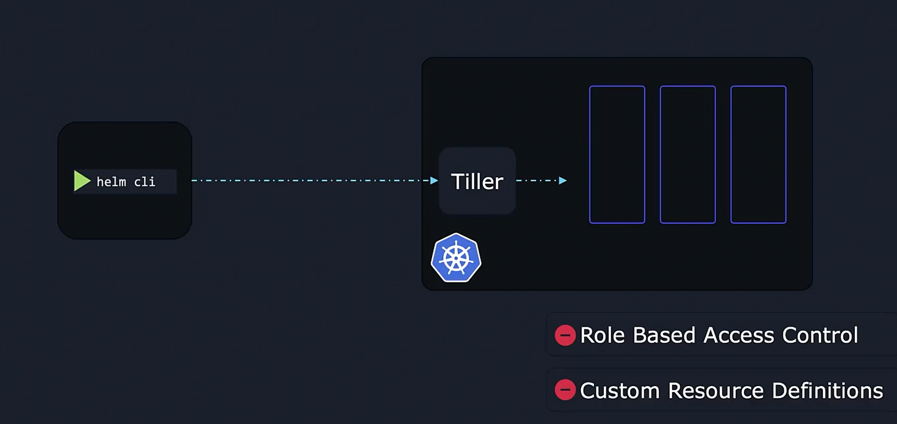
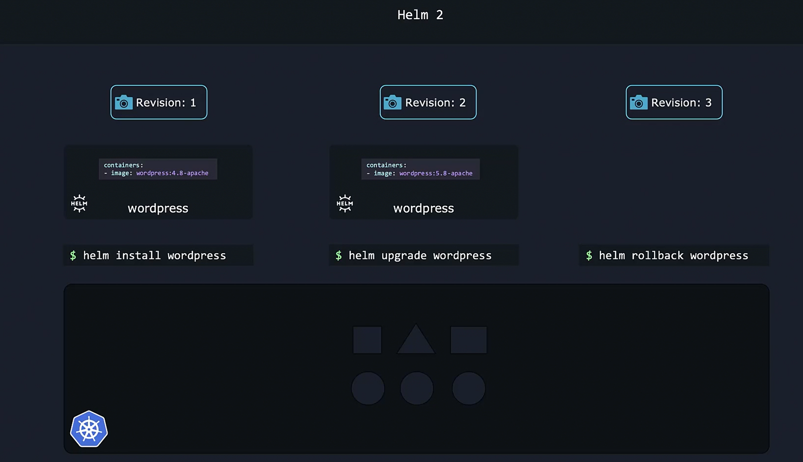
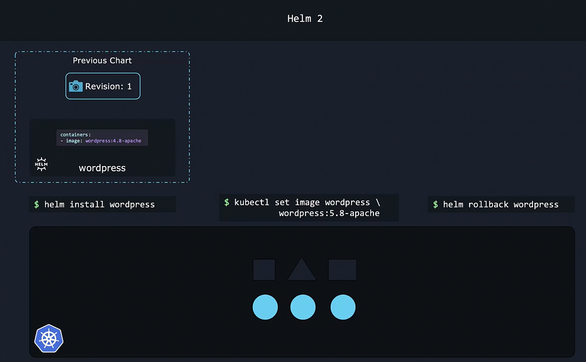
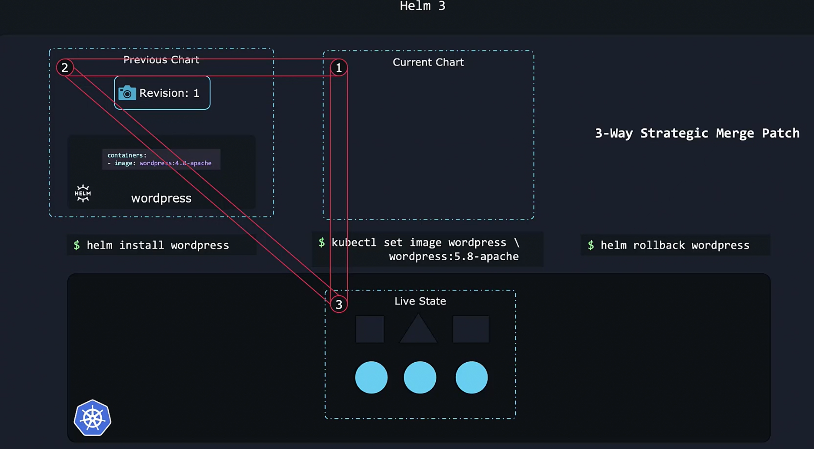

### **Helm 2 and Helm 3**

- History of Helm Versions  
    - **Helm 1.0** → Released in **February 2016** (Initial version).  
    - **Helm 2.0** → Released in **November 2016** (Introduced Tiller).  
    - **Helm 3.0** → Released in **November 2019** (Removed Tiller, improved security).  

Helm has evolved significantly since its initial release in **2016**, with **Helm 3** introducing major improvements over **Helm 2**. Understanding these changes is essential, as many online resources still reference both versions.  

Overall, **Helm 3** offers a **more secure, streamlined, and efficient** way to manage Kubernetes applications 


### **2. Major Differences Between Helm 2 and Helm 3**  

| Feature         | Helm 2 (Old) | Helm 3 (New) |
|---------------|-------------|-------------|
| **Tiller**  | Required **Tiller**, a separate component running inside the cluster. | **No Tiller** – Helm directly interacts with Kubernetes. |
| **Security**  | **Tiller** had too much power (full cluster admin access), leading to security risks. | Uses **Kubernetes RBAC** for fine-grained access control. |
| **CRD Support**  | Handled separately, needed manual steps. | Built-in support for **Custom Resource Definitions (CRDs)**. |
| **Namespaces**  | Helm releases were **global** across namespaces. | Helm releases are **namespace-scoped**, improving isolation. |
| **Release Management**  | Used `helm delete` to remove a release, but it kept historical records. | Uses `helm uninstall`, which **fully removes** a release unless `--keep-history` is used. |
| **Improved Chart Syntax**  | Some Helm charts needed Tiller-specific syntax. | Simplified chart structure, no need for Tiller workarounds. |

---
### Tiller



- **Helm 2 required Tiller**, which acted as a **middleman** between the user and Kubernetes.  
- **Problem with Tiller:**
  - It ran with **full cluster access**, meaning any user with access to Tiller could modify the entire cluster.
  - It added **extra complexity**, requiring additional configurations for security.  
  - Security policies were handled **inside Tiller**, which was difficult to manage. 
- **Helm 3 removed Tiller**, relying instead on **Kubernetes RBAC (Role-Based Access Control)** for security. &  Security is managed using **native Kubernetes RBAC**.  
- Now, **a developer with limited permissions in Kubernetes** cannot override them using Helm.
- **Example: Restricting Helm Access Using RBAC in Kubernetes**
```yaml
apiVersion: rbac.authorization.k8s.io/v1
kind: Role
metadata:
  name: helm-user
  namespace: default
rules:
- apiGroups: ["*"]
  resources: ["pods", "deployments"]
  verbs: ["get", "list", "create"]
```
This ensures the **Helm user can only deploy and view applications**, not delete or modify everything.


### **Helm 3: 3-Way Strategic Merge Patch and Improved Rollbacks**  

Helm 3 introduces a **3-way strategic merge patch**, which significantly improves how rollbacks and upgrades handle live Kubernetes state. Unlike Helm 2, which only compared the **current and previous chart states**, Helm 3 considers an additional dimension: **the live state of Kubernetes objects**.  

#### **Understanding Helm Revisions**  

Whenever a Helm release is installed or updated, a **new revision** is created:  
1. **Installation (Revision 1)** – Deploying a Helm chart creates **Revision 1**.  
2. **Upgrade (Revision 2)** – Upgrading the chart creates **Revision 2**.  
3. **Rollback (Revision 3)** – Rolling back generates **Revision 3**, even though it returns to an earlier configuration.  
- These revisions act as **snapshots** of the Kubernetes application, making it easy to track changes and restore previous states.  
    

**Limitations of Helm 2 (2-Way Merge)**  
- Helm 2 compared only the **previous chart** and the **current chart** during rollbacks or upgrades.  
- If a user manually modified Kubernetes resources using `kubectl`, Helm **ignored** these changes because they were not tracked in Helm’s revisions.  
- Example:  
  - Install WordPress (Revision 1, Image `wordpress:4.8`)  
  - User manually updates image to `wordpress:5.8` using `kubectl set image`  
  - Rollback using Helm → **Helm 2 fails to detect the manual change** and does nothing.  
  

#### **How Helm 3's 3-Way Merge Works**  

Helm 3 improves rollback and upgrade behavior by considering:  
1. **The original chart (previous revision)**  
2. **The new chart (intended update)**  
3. **The live Kubernetes state (current deployed objects)**  

- By checking the **live state**, Helm 3 **detects and preserves manual changes** that were made outside of Helm itself.  
    

#### **Example: Helm 3 Rollback Handling**  

- Install WordPress (Revision 1, Image `wordpress:4.8`)  
- User manually updates image to `wordpress:5.8` using `kubectl set image`  
- Rollback using Helm →  
  - Helm **compares live Kubernetes state (5.8)** with **the previous revision (4.8)**  
  - Helm **detects the difference** and successfully rolls back to `wordpress:4.8`  

#### **Example: Helm 3 Upgrade Handling**  

- Install a chart (Revision 1)  
- User manually modifies Kubernetes objects (e.g., adds extra annotations, labels, or configurations)  
- Helm upgrade →  
  - Helm **detects and preserves manual changes** while applying the upgrade.  

### **Why This Matters**  

- **Rollbacks are more reliable** – Helm correctly detects and reverts manual changes.  
- **Upgrades are safer** – User modifications are preserved instead of being overwritten.  
- **More predictable application management** – Helm behaves like a true **state-aware package manager**, rather than just applying YAML blindly.  

With **3-way merge**, Helm 3 enables **smarter, safer, and more efficient** Kubernetes application management.
