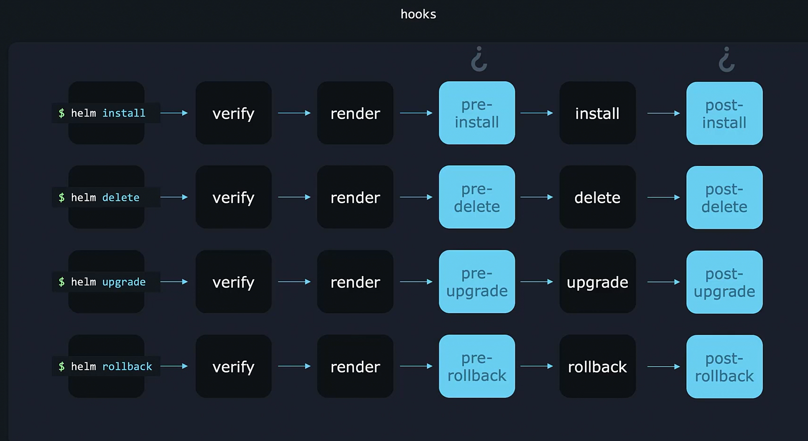

# Introduction to Helm Hooks
- Helm does more than just install Kubernetes objects; it can execute additional actions.
- Hooks allow Helm to perform tasks before or after specific lifecycle events.
- Examples:
  - Automatically backing up a database before an upgrade.
  - Sending an email alert before an upgrade.
  - Displaying and removing a site-wide announcement.

## Helm Workflow
1. **Install or Upgrade Process**:
   - The user runs `helm install` or `helm upgrade`.
   - Helm verifies files and templates in the chart.
   - Manifests are rendered into their final form.
   - Kubernetes objects are deployed in the cluster.

2. **Using Hooks for Pre-Upgrade Tasks**:
   - A **pre-upgrade hook** ensures an action is completed before proceeding with the upgrade.
   - Example: Taking a database backup before upgrading.
   - Helm waits for this hook to complete before applying the upgrade.

3. **Using Hooks for Post-Upgrade Tasks**:
   - A **post-upgrade hook** runs after the upgrade is successful.
   - Example: Sending an email notification after the upgrade.

## Types of Helm Hooks
- **Pre-install & Post-install** → Run before or after installation.
- **Pre-upgrade & Post-upgrade** → Run before or after an upgrade.
- **Pre-delete & Post-delete** → Run before or after deletion.
- **Pre-rollback & Post-rollback** → Run before or after rollback.

## Configuring Hooks in Helm
### Running a Script in Kubernetes
- To run a script (e.g., `backup.sh`), Kubernetes needs to execute it in a pod.
- Since a pod runs indefinitely, use a **Job** instead to run the script only once.

### Creating a Job for Pre-Upgrade Hook
- Helm hooks use Kubernetes objects like Jobs.
- Example Job manifest to back up a database:

```yaml
apiVersion: batch/v1
kind: Job
metadata:
  name: db-backup
  annotations:
    "helm.sh/hook": pre-upgrade
spec:
  template:
    spec:
      containers:
        - name: backup
          image: alpine
          command: ["/bin/sh", "-c", "/scripts/backup.sh"]
      restartPolicy: Never
```

- **Annotations**:
  - `helm.sh/hook: pre-upgrade` → Marks this job as a pre-upgrade hook.
  - Helm does not consider this a regular template file.
  - The job will execute before an upgrade.

## Other Hook Configurations

- To configure for different lifecycle events, modify the annotation:
  - **Pre-install hook**: `helm.sh/hook: pre-install`
  - **Post-install hook**: `helm.sh/hook: post-install`
  - **Pre-delete hook**: `helm.sh/hook: pre-delete`
  - **Post-delete hook**: `helm.sh/hook: post-delete`
  - **Pre-rollback hook**: `helm.sh/hook: pre-rollback`
  - **Post-rollback hook**: `helm.sh/hook: post-rollback`

  

## Summary
- Helm hooks enable pre- and post-execution tasks for lifecycle events.
- Hooks use Kubernetes objects like Jobs to perform tasks before or after Helm operations.
- Annotations define hook types and tell Helm when to execute the job.
- Hooks improve automation, ensuring critical tasks like backups or notifications are handled automatically.

 

## Multiple Hooks in a Step  
- Multiple hooks can be configured for each step, such as multiple **pre-upgrade hooks**.  
- Example use cases:  
  - Making an external API call.  
  - Adding a site-wide banner.  
  - Sending an email announcement.  
  - Performing a database backup.  

## Hook Execution Order with Weights  
- Helm executes hooks in a defined order using **weights**.  
- The execution order can be controlled by assigning **positive or negative numbers** as weights.  
- Helm **sorts hooks in ascending order** and executes them sequentially.  

### Example: Hook Execution Order  
1. **Send email announcement** (lowest weight).  
2. **Display site-wide banner**.  
3. **Start database backup** (highest weight).  

### Configuring Hook Weights  
- The annotation `helm.sh/hook-weight` is used to define the execution order.  
- Helm executes hooks in ascending order of weight.  

Example YAML for hooks with weights:  
```yaml
apiVersion: batch/v1
kind: Job
metadata:
  name: send-email
  annotations:
    "helm.sh/hook": pre-upgrade
    "helm.sh/hook-weight": "-5"
spec:
  template:
    spec:
      containers:
        - name: email
          image: alpine
          command: ["/bin/sh", "-c", "/scripts/send_email.sh"]
      restartPolicy: Never

apiVersion: batch/v1
kind: Job
metadata:
  name: show-banner
  annotations:
    "helm.sh/hook": pre-upgrade
    "helm.sh/hook-weight": "0"
spec:
  template:
    spec:
      containers:
        - name: banner
          image: alpine
          command: ["/bin/sh", "-c", "/scripts/show_banner.sh"]
      restartPolicy: Never

apiVersion: batch/v1
kind: Job
metadata:
  name: db-backup
  annotations:
    "helm.sh/hook": pre-upgrade
    "helm.sh/hook-weight": "10"
spec:
  template:
    spec:
      containers:
        - name: backup
          image: alpine
          command: ["/bin/sh", "-c", "/scripts/backup.sh"]
      restartPolicy: Never
```
- **send-email** runs first (`-5` weight).  
- **show-banner** runs next (`0` weight).  
- **db-backup** runs last (`10` weight).  

### Multiple Hooks with Same Weight  
- If multiple hooks have the **same weight**, Helm sorts them:  
  1. By **resource kind**.  
  2. By **name** (alphabetically).  
- They are then executed in that order.  


## Hook Cleanup with Deletion Policies  
- **By default**, resources created by hooks remain in the cluster.  
- Helm provides **hook deletion policies** to remove them.  

### Hook Deletion Policies  
- **"hook-succeeded"** → Deletes the resource **after** successful execution.  
- **"hook-failed"** → Deletes the resource even if execution **fails**.  
- **"before-hook-creation"** → Deletes the **previous instance** of the hook before creating a new one.  

### Example: Hook Deletion Policy  
```yaml
apiVersion: batch/v1
kind: Job
metadata:
  name: db-backup
  annotations:
    "helm.sh/hook": pre-upgrade
    "helm.sh/hook-delete-policy": "hook-succeeded"
spec:
  template:
    spec:
      containers:
        - name: backup
          image: alpine
          command: ["/bin/sh", "-c", "/scripts/backup.sh"]
      restartPolicy: Never
```
- The **backup job** will be deleted **after successful execution**.  


## Default Hook Deletion Policy  
- **If no policy is specified**, Helm applies **"before-hook-creation"**:  
  - The previous resource is deleted **before a new hook runs**.  
  - This prevents duplicate objects and avoids errors like:  
    ```
    Error: Job already exists
    ```
- The first time the hook runs, there is no previous resource, so nothing is deleted.  
- On subsequent executions, the **old job is deleted before a new one is created**.  


## Summary  
- **Multiple hooks** can be assigned for a single Helm phase.  
- **Weights** determine the **execution order** of hooks.  
- **Deletion policies** manage how resources created by hooks are cleaned up.  
- Default behavior (`before-hook-creation`) prevents duplicate objects and ensures smooth upgrades.


